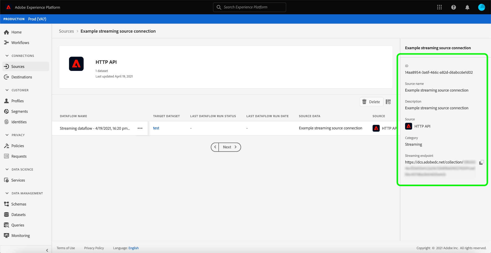

# Erstellen einer [!DNL HTTP API] Streaming-Verbindung über die Benutzeroberfläche

In diesem Tutorial werden Schritte zum Erstellen einer Streaming-Quellverbindung mithilfe des Arbeitsbereichs [!UICONTROL Quellen] beschrieben.

## Erste Schritte

Dieses Tutorial setzt ein Grundverständnis der folgenden Komponenten von Adobe Experience Platform voraus:

- [[!DNL Experience Data Model (XDM)] System](../../../../../xdm/home.md): Das standardisierte Framework, mit dem [!DNL Experience Platform] Kundenerlebnisdaten organisiert.
   - [Grundlagen der Schemakomposition](../../../../../xdm/schema/composition.md): Machen Sie sich mit den grundlegenden Bausteinen von XDM-Schemata vertraut, einschließlich der wichtigsten Prinzipien und Best Practices bei der Schemaerstellung.
   - [Tutorial zum Schema-Editor](../../../../../xdm/tutorials/create-schema-ui.md): Erfahren Sie, wie Sie benutzerdefinierte Schemata mithilfe der Benutzeroberfläche des Schema-Editors erstellen können.
- [[!DNL Real-Time Customer Profile]](../../../../../profile/home.md): Bietet ein einheitliches Echtzeit-Kundenprofil, das auf aggregierten Daten aus verschiedenen Quellen basiert.

## Aufbauen einer Streaming-Verbindung

Wählen Sie in der Experience Platform-Benutzeroberfläche **[!UICONTROL Quellen]** in der linken Navigationsleiste aus, um auf den Arbeitsbereich [!UICONTROL Quellen] zuzugreifen. Der Bildschirm [!UICONTROL Katalog] zeigt eine Vielzahl von Quellen an, mit denen Sie ein Konto erstellen können.

Sie können die gewünschte Kategorie aus dem Katalog auf der linken Bildschirmseite auswählen. Alternativ können Sie die gewünschte Quelle mithilfe der Suchoption finden.

Wählen Sie unter der Kategorie **[!UICONTROL Streaming]** die Option **[!UICONTROL HTTP-]**) und dann **[!UICONTROL Daten hinzufügen]** aus.

Die Seite **[!UICONTROL HTTP-API-Konto verbinden]** wird angezeigt. Auf dieser Seite können Sie entweder neue oder vorhandene Anmeldedaten verwenden.

### Vorhandenes Konto

Um ein vorhandenes Konto zu verwenden, wählen Sie das HTTP-API-Konto, mit dem Sie einen neuen Datenfluss erstellen möchten, und wählen Sie dann **[!UICONTROL Weiter]**, um fortzufahren.

### Neues Konto

Wenn Sie ein neues Konto erstellen, wählen Sie **[!UICONTROL Neues Konto]**. Geben Sie im angezeigten Eingabeformular einen Kontonamen und eine optionale Beschreibung ein. Sie haben außerdem die Möglichkeit, die folgenden Konfigurationseigenschaften anzugeben:

- **[!UICONTROL Authentifizierung]:** Diese Eigenschaft bestimmt, ob die Streaming-Verbindung eine Authentifizierung erfordert oder nicht. Authentifizierung stellt sicher, dass Daten aus vertrauenswürdigen Quellen erfasst werden. Wenn Sie mit personenbezogenen Daten (PII) arbeiten, sollte diese Eigenschaft aktiviert sein. Standardmäßig ist diese Eigenschaft deaktiviert.
- **[!UICONTROL XDM-kompatibel]:** Diese Eigenschaft gibt an, ob diese Streaming-Verbindung Ereignisse sendet, die mit XDM-Schemata kompatibel sind. Standardmäßig ist diese Eigenschaft deaktiviert.

Wenn Sie fertig sind, wählen Sie **[!UICONTROL Mit Quelle verbinden]** und dann **[!UICONTROL Weiter]** aus, um fortzufahren.

## Daten auswählen

Nach Erstellung der HTTP-API-Verbindung wird der Schritt **[!UICONTROL Daten auswählen]** angezeigt, in dem Sie eine Schnittstelle zum Hochladen und Anzeigen Ihrer Daten erhalten.

Wählen **[!UICONTROL Dateien hochladen]**, um Ihre Daten hochzuladen. Alternativ können Sie Ihre Daten per Drag-and[!UICONTROL Drop in den Bereich „Dateien per Drag-and-Drop &#x200B;]&quot; der Benutzeroberfläche ziehen.

Wenn Ihre Daten hochgeladen wurden, können Sie die rechte Seite der Benutzeroberfläche verwenden, um eine Vorschau Ihrer Dateihierarchie anzuzeigen. Klicken Sie auf **[!UICONTROL Weiter]**, um fortzufahren.

## Zuordnen von Datenfeldern zu einem XDM-Schema

Der [!UICONTROL Zuordnungsschritt] wird angezeigt und stellt eine Schnittstelle zum Zuordnen der Quelldaten zu einem Experience Platform-Datensatz bereit.

Die [!DNL HTTP API] unterstützt die Aufnahme von JSON-Dateien. JSON-Dateien müssen nicht manuell konfiguriert werden, wenn sie als XDM-kompatibel gekennzeichnet sind. Andernfalls müssen Sie die Zuordnung explizit konfigurieren.

Wählen Sie einen Datensatz aus, in den eingehende Daten aufgenommen werden sollen. Sie können entweder einen vorhandenen Datensatz verwenden oder einen neuen erstellen.

### Erstellen eines neuen Datensatzes

Um einen neuen Datensatz zu erstellen, wählen Sie **[!UICONTROL Neuer Datensatz]** aus. Geben Sie im angezeigten Formular den Namen, eine optionale Beschreibung und das Zielschema für den Datensatz ein. Wenn Sie ein [!DNL Profile] Schema auswählen, können Sie auswählen, ob der Datensatz auch [!DNL Profile] aktiviert werden soll.

### Verwenden eines vorhandenen Datensatzes

Um einen vorhandenen Datensatz zu verwenden, wählen Sie **[!UICONTROL Vorhandener Datensatz]**. Wählen Sie im angezeigten Formular den Datensatz aus, den Sie verwenden möchten. Nachdem Sie einen Datensatz ausgewählt haben, können Sie auswählen, ob der Datensatz [!DNL Profile] aktiviert werden soll.

### Standardfelder zuordnen

Je nach Bedarf können Sie wahlweise Felder direkt zuordnen oder mithilfe von Datenvorbereitungsfunktionen Quelldaten transformieren, um berechnete oder anderweitig ermittelte Werte abzuleiten. Eine ausführliche Anleitung zur Verwendung der Zuordnungsschnittstelle und berechneter Felder finden Sie im [Handbuch zur Datenvorbereitungs-Benutzeroberfläche](../../../../../data-prep/ui/mapping.md).

Um ein neues Quellfeld hinzuzufügen, wählen Sie **[!UICONTROL Neue Zuordnung hinzufügen]** aus.

Ein neues Paarungssystem aus Quellfeld und Zielfeld wird angezeigt. Um ein neues Quellfeld hinzuzufügen, klicken Sie auf das Pfeilsymbol neben der Eingabeleiste [!UICONTROL Quellfeld auswählen].

Im [!UICONTROL Attribute auswählen] können Sie Ihre Dateihierarchie durchsuchen und ein bestimmtes Quellfeld auswählen, das einem XDM-Zielfeld zugeordnet werden soll. Nachdem Sie das Quellfeld ausgewählt haben, das Sie zuordnen möchten, wählen Sie **[!UICONTROL Auswählen]** aus, um fortzufahren.

Wenn ein Quellfeld ausgewählt ist, können Sie jetzt das entsprechende XDM-Zielfeld identifizieren, dem zugeordnet werden soll. Wählen Sie das Schemasymbol unter dem Abschnitt Zielfeld aus.

Das Fenster [!UICONTROL Quellfeld zu Zielfeld zuordnen] wird angezeigt und bietet Ihnen eine Schnittstelle zum Erkunden des Schemas Ihres Zieldatensatzes. Wählen Sie das Zielfeld aus, das Ihrem Quellfeld entspricht, und wählen Sie dann **[!UICONTROL Auswählen]** aus, um fortzufahren.

Nachdem alle Quellfelder den entsprechenden XDM-Zielfeldern zugeordnet wurden, klicken Sie auf **[!UICONTROL Weiter]**

## Datenflussdetails

Der **[!UICONTROL Datenflussdetails]** wird angezeigt. Auf dieser Seite können Sie Details für den erstellten Datenfluss angeben, indem Sie einen Namen und eine optionale Beschreibung angeben.

Nachdem Sie Details für den Datenfluss angegeben haben, klicken Sie auf **[!UICONTROL Weiter]**.

## Überprüfung

Der Schritt **[!UICONTROL Überprüfen]** wird angezeigt, in dem Sie die Details Ihres Datenflusses überprüfen können, bevor er erstellt wird. Details werden in den folgenden Kategorien gruppiert:

- **[!UICONTROL Verbindung]**: Zeigt den Kontonamen, die Quellplattform und den Quellnamen an.
- **[!UICONTROL Datensatz- und Zuordnungsfelder zuweisen]**: Zeigt den Zieldatensatz und das Schema an, zu dem der Datensatz gehört.

Nachdem Sie bestätigt haben, dass die Details korrekt sind, wählen Sie **[!UICONTROL Beenden]**.

## Streaming-Endpunkt-URL abrufen

Bei der Erstellung der Verbindung wird die Seite mit den Quelldetails angezeigt. Auf dieser Seite werden Details zu Ihrer neu erstellten Verbindung angezeigt, einschließlich zuvor ausgeführter Datenflüsse, ID und Streaming-Endpunkt-URL.

## Nächste Schritte

In diesem Tutorial haben Sie eine Streaming-HTTP-Verbindung erstellt, über die Sie mit dem Streaming-Endpunkt auf eine Vielzahl von [!DNL Data Ingestion]-APIs zugreifen können. Anweisungen zum Erstellen einer Streaming-Verbindung in der API finden Sie in der [Anleitung zum Erstellen einer Streaming-Verbindung](../../../api/create/streaming/http.md).

Um zu erfahren, wie Sie Daten an Experience Platform streamen, lesen Sie entweder das Tutorial [Streaming von Zeitreihendaten](../../../../../ingestion/tutorials/streaming-time-series-data.md) oder das Tutorial [Streaming von Datensatzdaten](../../../../../ingestion/tutorials/streaming-record-data.md).
