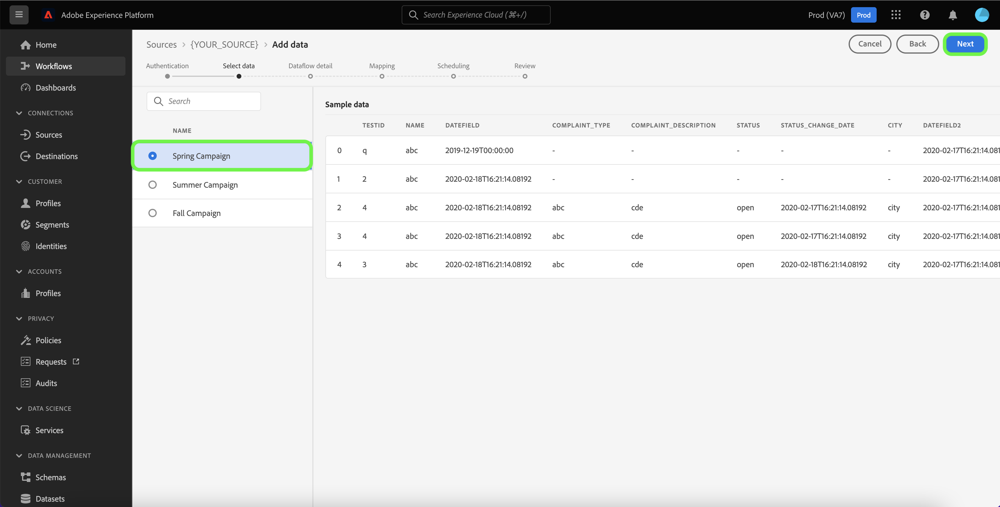
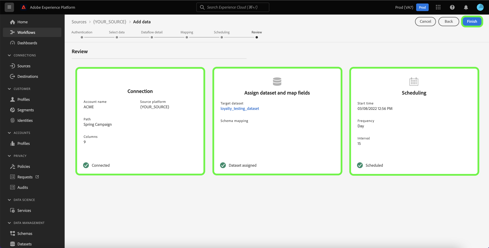

# Erstellen eines Datenflusses mithilfe einer Werbequelle in der Benutzeroberfläche

Ein Datenfluss ist eine geplante Aufgabe, mit der Daten aus einer Quelle abgerufen und in einen Datensatz in Adobe Experience Platform aufgenommen werden. In diesem Tutorial erfahren Sie, wie Sie mithilfe der Platform-Benutzeroberfläche einen Datenfluss für eine Werbequelle erstellen.

>[!NOTE]
>
>* Um einen Datenfluss zu erstellen, müssen Sie bereits über ein authentifiziertes Konto mit einer Werbequelle verfügen. Eine Liste von Tutorials zum Erstellen verschiedener Werbequellenkonten in der Benutzeroberfläche finden Sie in der [Quellenübersicht](../../../home.md#advertising).
>* Damit Experience Platform Daten aufnehmen kann, müssen die Zeitzonen für alle tabellenbasierten Batch-Quellen auf UTC konfiguriert werden.

## Erste Schritte

Dieses Tutorial setzt ein Grundverständnis der folgenden Komponenten von Platform voraus:

* [Quellen](../../../home.md): Platform ermöglicht das Aufnehmen von Daten aus verschiedenen Quellen und bietet Ihnen die Möglichkeit, eingehende Daten mithilfe von [!DNL Platform]-Services zu strukturieren, zu kennzeichnen und anzureichern.
* [[!DNL Experience Data Model (XDM)] System](../../../../xdm/home.md): Das standardisierte Framework, mit dem Experience Platform Kundenerlebnisdaten organisiert.
   * [Grundlagen der Schemakomposition](../../../../xdm/schema/composition.md): Machen Sie sich mit den grundlegenden Bausteinen von XDM-Schemata vertraut, einschließlich der wichtigsten Prinzipien und Best Practices bei der Schemaerstellung.
   * [Tutorial zum Schema-Editor](../../../../xdm/tutorials/create-schema-ui.md): Erfahren Sie, wie Sie benutzerdefinierte Schemata mithilfe der Benutzeroberfläche des Schema-Editors erstellen können.
* [[!DNL Real-Time Customer Profile]](../../../../profile/home.md): Bietet ein einheitliches Echtzeit-Kundenprofil, das auf aggregierten Daten aus verschiedenen Quellen basiert.
* [[!DNL Data Prep]](../../../../data-prep/home.md): Ermöglicht es Dateningenieuren, Daten dem Experience-Datenmodell (XDM) zuzuordnen, umzuformen und zu validieren.

## Daten hinzufügen

Nach der Erstellung Ihres Werbequellenkontos wird der Schritt **[!UICONTROL Daten hinzufügen]** angezeigt, der Ihnen eine Schnittstelle bietet, um die Tabellenhierarchie Ihres Werbequellenkontos zu untersuchen.

* Die linke Hälfte der Benutzeroberfläche ist ein Browser, der eine Liste der in Ihrem Konto enthaltenen Datentabellen anzeigt. Die Benutzeroberfläche umfasst auch eine Suchoption, mit der Sie die zu verwendenden Quelldaten schnell identifizieren können.
* Die rechte Hälfte der Benutzeroberfläche ist ein Vorschaufenster, in dem Sie bis zu 100 Datenzeilen in der Vorschau anzeigen können.

>[!NOTE]
>
>Die Option Quelldaten suchen steht für alle tabellenbasierten Quellen mit Ausnahme von Adobe Analytics, [!DNL Amazon Kinesis] und [!DNL Azure Event Hubs] zur Verfügung.

Nachdem Sie die Quelldaten gefunden haben, wählen Sie die Tabelle aus und klicken Sie auf **[!UICONTROL Weiter]**.

## Angeben von Datenflussdetails

Auf der Seite [!UICONTROL Datenflussdetails] können Sie auswählen, ob Sie einen vorhandenen Datensatz oder einen neuen Datensatz verwenden möchten. Während dieses Vorgangs können Sie auch Einstellungen für [!UICONTROL Profildatensatz], [!UICONTROL Fehlerdiagnose], [!UICONTROL Partielle Aufnahme] und [!UICONTROL Warnhinweise] vornehmen.

### Verwenden eines vorhandenen Datensatzes

Um Daten in einen vorhandenen Datensatz aufzunehmen, wählen Sie **[!UICONTROL Vorhandener Datensatz]**. Sie können einen vorhandenen Datensatz entweder über die Option [!UICONTROL Erweiterte Suche] oder durch Scrollen durch die Liste der vorhandenen Datensätze im Dropdown-Menü abrufen. Nachdem Sie einen Datensatz ausgewählt haben, geben Sie einen Namen und eine Beschreibung für Ihren Datenfluss ein.

### Verwenden eines neuen Datensatzes

Für ein Aufnehmen in einen neuen Datensatz wählen Sie **[!UICONTROL Neuer Datensatz]** aus und geben Sie einen Namen für den Ausgabedatensatz und eine optionale Beschreibung an. Wählen Sie als Nächstes mithilfe der Option [!UICONTROL Erweiterte Suche] oder durch Scrollen durch die Liste der vorhandenen Schemata im Dropdown-Menü ein Schema zum Zuordnen aus. Nachdem Sie ein Schema ausgewählt haben, geben Sie einen Namen und eine Beschreibung für Ihren Datenfluss ein.

### Aktivieren von [!DNL Profile] und Fehlerdiagnose

Wählen Sie als Nächstes den **[!UICONTROL Profildatensatz]**-Umschalter aus, um Ihren Datensatz für [!DNL Profile] zu aktivieren. Auf diese Weise können Sie eine ganzheitliche Ansicht der Attribute und Verhaltensweisen einer Entität erstellen. Daten aus allen [!DNL Profile]-aktivierten Datensätzen werden in [!DNL Profile] eingeschlossen und Änderungen werden wirksam, wenn Sie Ihren Datenfluss speichern.

[!UICONTROL Fehlerdiagnose] ermöglicht eine detaillierte Erstellung von Fehlermeldungen für alle fehlerhaften Datensätze, die in Ihrem Datenfluss auftreten, während [!UICONTROL Partielle Aufnahme] die Aufnahme von fehlerhaften Daten bis zu einem gewissen Schwellenwert, den Sie manuell definieren, ermöglicht. Weitere Informationen finden Sie in der [Übersicht zur partiellen Batch-Aufnahme](../../../../ingestion/batch-ingestion/partial.md).

### Aktivieren von Warnhinweisen

Sie können Warnhinweise aktivieren, um Benachrichtigungen zum Status Ihres Datenflusses zu erhalten. Wählen Sie einen Warnhinweis aus der zu abonnierenden Liste aus, um Benachrichtigungen über den Status Ihres Datenflusses zu erhalten. Weitere Informationen zu Warnhinweisen finden Sie im Handbuch zum [Abonnieren von Warnhinweisen zu Quellen über die Benutzeroberfläche](../alerts.md).

Wenn Sie mit dem Eingeben der Details für Ihren Datenfluss fertig sind, klicken Sie auf **[!UICONTROL Weiter]**.

## Zuordnen von Datenfeldern zu einem XDM-Schema

Es erfolgt der Schritt der [!UICONTROL Zuordnung], in dem Ihnen eine Schnittstelle zum Zuordnen der Quellfelder aus Ihrem Quellschema zu den entsprechenden XDM-Zielfeldern im Zielschema bereitgestellt wird.

Platform bietet intelligente Empfehlungen für automatisch zugeordnete Felder, die auf dem von Ihnen ausgewählten Zielschema oder Datensatz basieren. Sie können die Zuordnungsregeln manuell an Ihre Anwendungsfälle anpassen. Je nach Bedarf können Sie wahlweise Felder direkt zuordnen oder mithilfe von Datenvorbereitungsfunktionen Quelldaten transformieren, um berechnete oder anderweitig ermittelte Werte abzuleiten. Eine ausführliche Anleitung zur Verwendung der Zuordnungsschnittstelle und berechneter Felder finden Sie im [Handbuch zur Datenvorbereitungs-Benutzeroberfläche](../../../../data-prep/ui/mapping.md).

Nachdem Ihre Quelldaten erfolgreich zugeordnet wurden, klicken Sie auf **[!UICONTROL Weiter]**.

## Planen von Aufnahmedurchgängen

Der Schritt [!UICONTROL Planung] wird angezeigt, in dem Sie einen Aufnahmezeitplan konfigurieren können, um die ausgewählten Quelldaten mithilfe der konfigurierten Zuordnungen automatisch aufzunehmen. Standardmäßig ist die Zeitplanung auf `Once` festgelegt. Um Ihre Aufnahmefrequenz anzupassen, wählen Sie **[!UICONTROL Häufigkeit]** und dann eine Option aus dem Dropdown-Menü aus.

>[!TIP]
>
>Intervall und Aufstockung sind während einer einmaligen Aufnahme nicht sichtbar.

Wenn Sie die Aufnahmefrequenz auf `Minute`, `Hour`, `Day` oder `Week` festlegen, müssen Sie ein Intervall festlegen, um zwischen den einzelnen Aufnahmen einen bestimmten Zeitrahmen festzulegen. Wenn beispielsweise die Aufnahmefrequenz auf `Day` und das Intervall auf `15` festgelegt ist, bedeutet dies, dass der Datenfluss alle 15 Tage Daten aufnehmen soll.

In diesem Schritt können Sie auch **Aufstockung“ aktivieren** eine Spalte für die inkrementelle Aufnahme von Daten definieren. Die Aufstockung wird verwendet, um historische Daten aufzunehmen, während die Spalte, die Sie für die inkrementelle Aufnahme definieren, es ermöglicht, neue Daten von vorhandenen Daten zu unterscheiden.

Weitere Informationen zur Planung von Konfigurationen finden Sie in der folgenden Tabelle.

| Konfiguration planen | Beschreibung |
| --- | --- |
| Häufigkeit | Konfigurieren Sie die Häufigkeit , um anzugeben, wie oft der Datenfluss ausgeführt werden soll. Sie können Ihre Häufigkeit auf Folgendes festlegen: <ul><li>**Einmal**: Legen Sie für die Häufigkeit `once` fest, um eine einmalige Aufnahme zu erstellen. Konfigurationen für Intervall und Aufstockung sind beim Erstellen eines einmaligen Aufnahme-Datenflusses nicht verfügbar. Standardmäßig ist die Zeitplanfrequenz auf einmal festgelegt.</li><li>**Minute**: Legen Sie für die Häufigkeit `minute` fest, um Ihren Datenfluss so zu planen, dass Daten pro Minute aufgenommen werden.</li><li>**Stunde**: Legen Sie für die Häufigkeit `hour` fest, um den Datenfluss zu planen und Daten stündlich aufzunehmen.</li><li>**Tag**: Legen Sie für Ihre Häufigkeit `day` fest, um Ihren Datenfluss so zu planen, dass Daten täglich aufgenommen werden.</li><li>**Woche**: Legen Sie für Ihre Häufigkeit `week` fest, um Ihren Datenfluss zu planen und Daten pro Woche aufzunehmen.</li></ul> |
| Intervall | Nachdem Sie eine Häufigkeit ausgewählt haben, können Sie die Intervalleinstellung konfigurieren, um den Zeitrahmen zwischen jeder Aufnahme festzulegen. Wenn Sie beispielsweise Ihre Häufigkeit auf „Tag“ festlegen und das Intervall auf 15 konfigurieren, wird Ihr Datenfluss alle 15 Tage ausgeführt. Das Intervall kann nicht auf null festgelegt werden. Der akzeptierte Mindestintervallwert für jede Häufigkeit ist wie folgt:<ul><li>**Einmal**: nicht zutreffend</li><li>**Minute**: 15</li><li>**Stunde**: 1</li><li>**Tag**: 1</li><li>**Woche**: 1</li></ul> |
| Startzeit | Der Zeitstempel für die projizierte Ausführung, dargestellt in UTC-Zeitzone. |
| Aufstockung | Die Aufstockung bestimmt, welche Daten anfänglich aufgenommen werden. Wenn die Aufstockung aktiviert ist, werden alle aktuellen Dateien im angegebenen Pfad während der ersten geplanten Aufnahme aufgenommen. Wenn die Aufstockung deaktiviert ist, werden nur die Dateien aufgenommen, die zwischen der ersten Aufnahme-Ausführung und der Startzeit geladen werden. Dateien, die vor der Startzeit geladen wurden, werden nicht aufgenommen. |
| Inkrementelle Daten laden nach | Eine Option mit einem gefilterten Satz von Quellschemafeldern vom Typ, Datum oder Uhrzeit. Das Feld, das Sie für **[!UICONTROL Inkrementelle Daten laden nach]** auswählen, muss seine Datums-/Uhrzeitwerte in der UTC-Zeitzone haben, um die inkrementellen Daten korrekt zu laden. Alle tabellenbasierten Batch-Quellen wählen inkrementelle Daten aus, indem sie einen Delta-Spalten-Zeitstempelwert mit der entsprechenden UTC-Zeit des Flussausführungsfensters vergleichen und dann die Daten aus der Quelle kopieren, wenn neue Daten im UTC-Zeitfenster gefunden werden. |

## Überprüfen des Datenflusses

Der Schritt **[!UICONTROL Überprüfung]** wird angezeigt, sodass Sie Ihren neuen Datenfluss überprüfen können, bevor er hergestellt wird. Die Details lassen sich wie folgt kategorisieren:

* **[!UICONTROL Verbindung]**: Zeigt den Quelltyp, den relevanten Pfad der ausgewählten Quelldatei und die Anzahl der Spalten innerhalb dieser Quelldatei an.
* **[!UICONTROL Datensatz- und Zuordnungsfelder zuweisen]**: Zeigt an, in welchen Datensatz die Quelldaten aufgenommen werden, einschließlich des Schemas, dem der Datensatz entspricht.
* **[!UICONTROL Planung]**: Zeigt den aktiven Zeitraum, die Häufigkeit und das Intervall des Aufnahmezeitplans an.

Nachdem Sie Ihren Datenfluss überprüft haben, klicken Sie auf **[!UICONTROL Beenden]** und gewähren Sie etwas Zeit für die Erstellung des Datenflusses.

## Überwachen Ihres Datenflusses

Nachdem Ihr Datenfluss hergestellt worden ist, können Sie Daten, die dadurch aufgenommen werden, überwachen, um Informationen zu Aufnahmegeschwindigkeiten, Erfolg und Fehlern zu erhalten. Weitere Informationen zum Überwachen von Datenflüssen finden Sie im Tutorial [Überwachen von Konten und Datenflüssen in der Benutzeroberfläche](../monitor.md).

## Löschen des Datenflusses

Datenflüsse, die nicht mehr erforderlich sind oder nicht korrekt erstellt wurden, können Sie löschen, indem Sie dazu die Funktion **[!UICONTROL Löschen]** im Arbeitsbereich **[!UICONTROL Datenflüsse]** verwenden. Weitere Informationen zum Löschen von Datenflüssen finden Sie im Tutorial [Löschen von Datenflüssen in der Benutzeroberfläche](../delete.md).

## Nächste Schritte

In diesem Tutorial haben Sie erfolgreich einen Datenfluss erstellt, um Daten aus Ihrer Werbequelle in Platform zu übertragen. Eingehende Daten können jetzt von nachgelagerten [!DNL Platform]-Services verwendet werden, wie [!DNL Real-Time Customer Profile] und [!DNL Data Science Workspace]. Weiterführende Informationen finden Sie in folgenden Dokumenten:

* [[!DNL Real-Time Customer Profile] – Übersicht](../../../../profile/home.md)
* [[!DNL Data Science Workspace] – Übersicht](../../../../data-science-workspace/home.md)

>[!WARNING]
>
> Die im folgenden Video angezeigte Platform-Benutzeroberfläche ist veraltet. Die neuesten Screenshots und Funktionen der Benutzeroberfläche finden Sie in der obigen Dokumentation.
>
>[!VIDEO](https://video.tv.adobe.com/v/29711?quality=12&learn=on)
