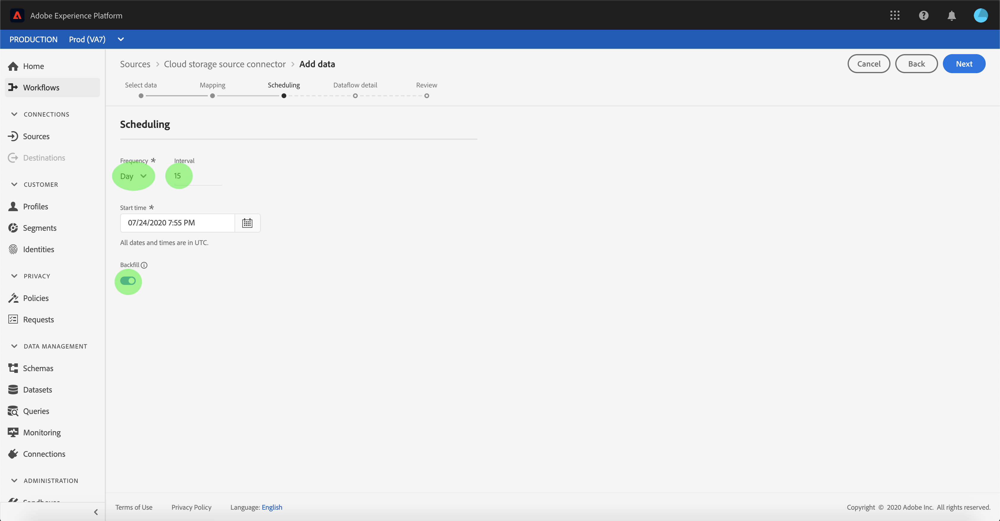
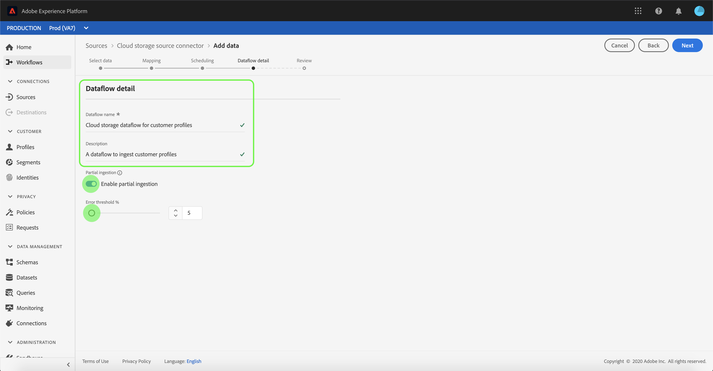

# Konfigurieren eines Datenflusses für eine Cloud-Speicher-Batch-Verbindung in der Benutzeroberfläche

Ein Datenfluss ist eine geplante Aufgabe, die Daten aus einer Quelle abruft und in einen [!DNL Platform] -Datensatz erfasst. In diesem Tutorial werden Schritte zum Konfigurieren eines neuen Datenflusses mithilfe Ihres Cloud-Speicherkontos beschrieben.

## Erste Schritte

Dieses Tutorial setzt ein Grundverständnis der folgenden Komponenten von Adobe Experience Platform voraus:

* [[!DNL Experience Data Model (XDM)] System](../../../../../xdm/home.md): Das standardisierte Framework, mit dem Kundenerlebnisdaten  [!DNL Experience Platform] organisiert werden.
   * [Grundlagen der Schemakomposition](../../../../../xdm/schema/composition.md): Machen Sie sich mit den Grundbausteinen von XDM-Schemas sowie den zentralen Konzepten und Best Practices rund um die Erstellung von Schemas vertraut.
   * [Tutorial](../../../../../xdm/tutorials/create-schema-ui.md) zum Schema Editor: Erfahren Sie, wie Sie benutzerdefinierte Schemas mithilfe der Benutzeroberfläche des Schema-Editors erstellen.
* [[!DNL Real-time Customer Profile]](../../../../../profile/home.md): Bietet ein einheitliches Echtzeit-Kundenprofil, das auf aggregierten Daten aus verschiedenen Quellen basiert.

Darüber hinaus erfordert dieses Tutorial, dass Sie über ein eingerichtetes Cloud-Speicher-Konto verfügen. Eine Liste der Tutorials zum Erstellen verschiedener Cloud-Speicher-Konten in der Benutzeroberfläche finden Sie in der [Übersicht über Quell-Connectoren](../../../../home.md).

### Unterstützte Dateiformate

[!DNL Experience Platform] unterstützt die folgenden Dateiformate, die aus externen Speichern erfasst werden:

* Trennzeichen (DSV): Jeder einzelne Wert kann als Trennzeichen für Datendateien im DSV-Format verwendet werden.
* [!DNL JavaScript Object Notation] (JSON): JSON-formatierte Datendateien müssen XDM-konform sein.
* [!DNL Apache Parquet]: Parquet-formatierte Datendateien müssen XDM-konform sein.
* Komprimierte Dateien: JSON- und durch Trennzeichen getrennte Dateien können wie folgt komprimiert werden: `bzip2`, `gzip`, `deflate`, `zipDeflate`, `tarGzip` und `tar`.

## Daten auswählen

Nachdem Sie Ihr Cloud-Speicherkonto erstellt haben, wird der Schritt **[!UICONTROL Daten auswählen]** angezeigt und bietet eine Oberfläche, über die Sie Ihre Cloud-Speicher-Dateihierarchie untersuchen können.

* Der linke Teil der Benutzeroberfläche ist ein Verzeichnisbrowser, in dem Ihre Cloud-Speicherdateien und -Verzeichnisse angezeigt werden.
* Im rechten Bereich der Benutzeroberfläche können Sie eine Vorschau von bis zu 100 Datenzeilen aus einer kompatiblen Datei anzeigen.

Wenn Sie einen aufgelisteten Ordner auswählen, können Sie die Ordnerhierarchie in tiefere Ordner durchlaufen. Sie können einen einzelnen Ordner auswählen, um alle Dateien rekursiv im Ordner aufzunehmen. Beim Erfassen eines ganzen Ordners müssen Sie sicherstellen, dass alle Dateien im Ordner dasselbe Schema nutzen.

Nachdem Sie eine kompatible Datei oder einen kompatiblen Ordner ausgewählt haben, wählen Sie im Dropdown-Menü [!UICONTROL Datenformat auswählen] das entsprechende Datenformat aus.

Die folgende Tabelle zeigt das geeignete Datenformat für die unterstützten Dateitypen:

| Dateityp | Datenformat |
| --- | --- |
| CSV | [!UICONTROL Getrennt] |
| JSON | [!UICONTROL JSON] |
| Parquet | [!UICONTROL XDM Parquet] |

Wählen Sie **[!UICONTROL JSON]** aus und warten Sie einige Sekunden, bis die Vorschaufunktion gefüllt wird.

>[!NOTE]
>
>Im Gegensatz zu getrennten und JSON-Dateitypen sind formatierte Parquet-Dateien nicht für die Vorschau verfügbar.

Über die Vorschau-Oberfläche können Sie den Inhalt und die Struktur einer Datei überprüfen. Standardmäßig zeigt die Vorschaufunktion die erste Datei im ausgewählten Ordner an.

Um eine andere Datei in der Vorschau anzuzeigen, wählen Sie das Vorschausymbol neben dem Namen der Datei aus, die Sie überprüfen möchten.

Nachdem Sie den Inhalt und die Struktur der Dateien in Ihrem Ordner überprüft haben, wählen Sie **[!UICONTROL Next]** aus, um alle Dateien rekursiv in den Ordner aufzunehmen.

Wenn Sie lieber eine bestimmte Datei auswählen möchten, wählen Sie die gewünschte Datei aus und klicken Sie dann auf **[!UICONTROL Weiter]**.

### Festlegen eines benutzerdefinierten Trennzeichens für durch Trennzeichen getrennte Dateien

Sie können beim Erfassen von durch Trennzeichen getrennten Dateien ein benutzerdefiniertes Trennzeichen festlegen. Wählen Sie die Option **[!UICONTROL Trennzeichen]** und dann aus dem Dropdown-Menü ein Trennzeichen aus. Im Menü werden die am häufigsten verwendeten Optionen für Trennzeichen angezeigt, darunter ein Komma (`,`), eine Registerkarte (`\t`) und ein senkrechter Strich (`|`). Wenn Sie lieber ein benutzerdefiniertes Trennzeichen verwenden möchten, wählen Sie **[!UICONTROL Benutzerdefiniert]** aus und geben Sie in der Popup-Eingabeleiste ein einzelnes Trennzeichen Ihrer Wahl ein.

Nachdem Sie Ihr Datenformat ausgewählt und Ihr Trennzeichen festgelegt haben, wählen Sie **[!UICONTROL Weiter]** aus.

### Komprimierte Dateien erfassen

Sie können komprimierte JSON- oder durch Trennzeichen getrennte Dateien erfassen, indem Sie deren Komprimierungstyp angeben.

Wählen Sie im Schritt [!UICONTROL Daten] auswählen eine komprimierte Datei für die Aufnahme aus und wählen Sie dann den entsprechenden Dateityp aus und ob die Datei XDM-kompatibel ist oder nicht. Wählen Sie als Nächstes **[!UICONTROL Komprimierungstyp]** und dann den entsprechenden komprimierten Dateityp für die Quelldaten aus.

Wenn ein komprimierter Dateityp identifiziert ist, wählen Sie **[!UICONTROL Weiter]** aus, um fortzufahren.

## Zuordnen von Datenfeldern zu einem XDM-Schema

Der Schritt **[!UICONTROL Mapping]** wird angezeigt und stellt eine interaktive Schnittstelle bereit, über die die Quelldaten einem [!DNL Platform]-Datensatz zugeordnet werden. Quelldateien, die in Parquet formatiert wurden, müssen XDM-konform sein und müssen die Zuordnung nicht manuell konfigurieren. Bei CSV-Dateien ist es erforderlich, die Zuordnung explizit zu konfigurieren. Sie können jedoch festlegen, welche Quelldatenfelder zugeordnet werden sollen. JSON-Dateien, die als XDM-Beschwerde gekennzeichnet sind, müssen nicht manuell konfiguriert werden. Wenn es jedoch nicht als XDM-kompatibel markiert ist, müssen Sie die Zuordnung explizit konfigurieren.

Wählen Sie einen Datensatz für eingehende Daten aus, die in aufgenommen werden sollen. Sie können entweder einen vorhandenen Datensatz verwenden oder einen neuen erstellen.

**Vorhandenen Datensatz verwenden**

Um Daten in einen vorhandenen Datensatz zu erfassen, wählen Sie **[!UICONTROL Vorhandenen Datensatz]** und dann das Datensatzsymbol aus.

Das Dialogfeld **[!UICONTROL Datensatz auswählen]** wird angezeigt. Suchen Sie den Datensatz, den Sie verwenden möchten, wählen Sie ihn aus und klicken Sie dann auf **[!UICONTROL Weiter]**.

**Verwenden eines neuen Datensatzes**

Um Daten in einen neuen Datensatz zu erfassen, wählen Sie **[!UICONTROL Neuer Datensatz]** aus und geben Sie einen Namen und eine Beschreibung für den Datensatz in die bereitgestellten Felder ein. Um ein Schema hinzuzufügen, können Sie einen vorhandenen Schemanamen im Dialogfeld **[!UICONTROL Schema auswählen]** eingeben. Alternativ können Sie **[!UICONTROL Erweiterte Schemasuche]** auswählen, um nach einem geeigneten Schema zu suchen.

In diesem Schritt können Sie Ihren Datensatz für [!DNL Real-time Customer Profile] aktivieren und eine ganzheitliche Ansicht der Attribute und Verhaltensweisen einer Entität erstellen. Daten aus allen aktivierten Datensätzen werden in [!DNL Profile] eingeschlossen und Änderungen werden angewendet, wenn Sie Ihren Datenfluss speichern.

Schalten Sie die Schaltfläche **[!UICONTROL Profildatensatz]** ein, um Ihren Zieldatensatz für [!DNL Profile] zu aktivieren.

Das Dialogfeld **[!UICONTROL Schema auswählen]** wird angezeigt. Wählen Sie das Schema aus, das Sie auf den neuen Datensatz anwenden möchten, und wählen Sie dann **[!UICONTROL Fertig]** aus.

Je nach Bedarf können Sie Felder direkt zuordnen oder mithilfe von Datenvorbereitungsfunktionen Quelldaten transformieren, um berechnete oder berechnete Werte abzuleiten. Weiterführende Informationen zu Zuordnungsfunktionen und berechneten Feldern finden Sie im [Handbuch zu Datenvorbereitung-Funktionen](../../../../../data-prep/functions.md) oder im Handbuch [Berechnete Felder](../../../../../data-prep/calculated-fields.md).

Bei JSON-Dateien können Sie neben der direkten Zuordnung von Feldern zu anderen Feldern Objekte und Arrays anderen Objekten und Arrays direkt zuordnen. Außerdem können Sie komplexe Datentypen wie Arrays in JSON-Dateien mit einem Cloud-Speicher-Quell-Connector in der Vorschau anzeigen und zuordnen.

Beachten Sie, dass Sie keine Zuordnung für verschiedene Typen erstellen können. Sie können beispielsweise kein Objekt einem Array oder einem Feld einem Objekt zuordnen.

>[!TIP]
>
>Platform bietet intelligente Empfehlungen für automatisch zugeordnete Felder, die auf dem von Ihnen ausgewählten Zielschema oder Datensatz basieren. Sie können die Zuordnungsregeln manuell an Ihre Anwendungsfälle anpassen.

Wählen Sie **[!UICONTROL Vorschau der Daten]** aus, um die Zuordnungsergebnisse von bis zu 100 Zeilen mit Beispieldaten aus dem ausgewählten Datensatz anzuzeigen.

Während der Vorschau wird die Identitätsspalte als erstes Feld priorisiert, da dies die wichtigsten Informationen ist, die bei der Validierung der Zuordnungsergebnisse erforderlich sind.

Nachdem die Quelldaten zugeordnet wurden, wählen Sie **[!UICONTROL Close]** aus.

## Erfassungsläufe planen

Der Schritt **[!UICONTROL Planung]** wird angezeigt. Hier können Sie einen Aufnahmeplan konfigurieren, um die ausgewählten Quelldaten automatisch mit den konfigurierten Zuordnungen zu erfassen. In der folgenden Tabelle sind die verschiedenen konfigurierbaren Felder für die Planung aufgeführt:

| Feld | Beschreibung |
| --- | --- |
| Häufigkeit | Zu den auswählbaren Häufigkeiten gehören `Once`, `Minute`, `Hour`, `Day` und `Week`. |
| Intervall | Eine Ganzzahl, die das Intervall für die ausgewählte Häufigkeit festlegt. |
| Startzeit | Ein UTC-Zeitstempel, der angibt, wann die erste Aufnahme erfolgen soll. |
| Aufstockung | Ein boolean -Wert, der bestimmt, welche Daten ursprünglich erfasst werden. Wenn **[!UICONTROL Aufstockung]** aktiviert ist, werden alle aktuellen Dateien im angegebenen Pfad während der ersten geplanten Erfassung erfasst. Wenn **[!UICONTROL Aufstockung]** deaktiviert ist, werden nur die Dateien erfasst, die zwischen der ersten Ausführung der Aufnahme und der Startzeit geladen werden. Dateien, die vor der Startzeit geladen wurden, werden nicht erfasst. |

Datenflüsse dienen dazu, Daten automatisch auf geplanter Basis zu erfassen. Wählen Sie zunächst die Aufnahmefrequenz aus. Legen Sie anschließend das Intervall fest, um den Zeitraum zwischen zwei Durchsatzausführungen festzulegen. Der Wert des Intervalls sollte eine Ganzzahl ungleich null sein und auf größer oder gleich 15 gesetzt werden.

Passen Sie zum Festlegen der Startzeit für die Aufnahme das im Feld Startzeit angezeigte Datum und die Uhrzeit an. Alternativ können Sie das Kalendersymbol auswählen, um den Startzeitwert zu bearbeiten. Die Startzeit muss größer oder gleich der aktuellen Uhrzeit in UTC sein.

Geben Sie Werte für den Zeitplan ein und wählen Sie **[!UICONTROL Weiter]** aus.

### Einrichten eines Datenflusses zur einmaligen Erfassung

Um die einmalige Erfassung einzurichten, wählen Sie den Dropdown-Pfeil für die Häufigkeit aus und klicken Sie auf **[!UICONTROL Einmal]**. Sie können einen Datensatz weiterhin für eine einmalige Frequenzaufnahme bearbeiten, solange die Startzeit in der Zukunft bleibt. Nach Ablauf der Startzeit kann der Wert für die einmalige Häufigkeit nicht mehr bearbeitet werden. **** Intervalle und  **** Aufstockungen sind beim Einrichten eines einmaligen Aufnahme-Datenflusses nicht sichtbar.

>[!IMPORTANT]
>
>Es wird dringend empfohlen, Ihren Datenfluss für die einmalige Erfassung bei Verwendung des [FTP-Connectors](../../../../connectors/cloud-storage/ftp.md) zu planen.

Nachdem Sie die entsprechenden Werte für den Zeitplan angegeben haben, wählen Sie **[!UICONTROL Weiter]** aus.

## Datenflussdetails angeben

Der Schritt **[!UICONTROL Datenfluss-Detail]** wird angezeigt, mit dem Sie einen Namen eingeben und eine kurze Beschreibung zu Ihrem neuen Datenfluss angeben können.

Während dieses Prozesses können Sie auch **[!UICONTROL Partielle Erfassung]** und **[!UICONTROL Fehlerdiagnose]** aktivieren. Durch die Aktivierung von **[!UICONTROL Partielle Erfassung]** können Daten mit Fehlern bis zu einem bestimmten Schwellenwert erfasst werden, den Sie festlegen können. Durch Aktivierung von **[!UICONTROL Fehlerdiagnose]** werden Details zu allen falschen Daten bereitgestellt, die separat stapelt werden. Weitere Informationen finden Sie unter [Übersicht über die partielle Batch-Erfassung](../../../../../ingestion/batch-ingestion/partial.md).

Geben Sie Werte für den Datenfluss ein und wählen Sie **[!UICONTROL Weiter]** aus.

## Überprüfen Sie Ihren Datenfluss.

Der Schritt **[!UICONTROL Überprüfen]** wird angezeigt, mit dem Sie Ihren neuen Datenfluss überprüfen können, bevor er erstellt wird. Details werden in die folgenden Kategorien eingeteilt:

* **[!UICONTROL Verbindung]**: Zeigt den Quelltyp, den relevanten Pfad der ausgewählten Quelldatei und die Anzahl der Spalten in dieser Quelldatei an.
* **[!UICONTROL Zuweisen von Datensatz- und Zuordnungsfeldern]**: Zeigt, in welchen Datensatz die Quelldaten aufgenommen werden, einschließlich des Schemas, dem der Datensatz entspricht.
* **[!UICONTROL Planung]**: Zeigt den aktiven Zeitraum, die Häufigkeit und das Intervall des Aufnahmezeitplans an.

Nachdem Sie Ihren Datenfluss überprüft haben, klicken Sie auf **[!UICONTROL Beenden]** und lassen Sie die Erstellung des Datenflusses etwas Zeit zu.

## Überwachen Ihres Datenflusses

Nachdem Ihr Datenfluss erstellt wurde, können Sie die erfassten Daten überwachen, um Informationen zu Erfassungsraten, Erfolg und Fehlern zu erhalten. Weitere Informationen zum Überwachen des Datenflusses finden Sie im Tutorial zum [Überwachen von Konten und Datenflüssen in der Benutzeroberfläche](../../monitor.md).

## Datenfluss löschen

Sie können Datenflüsse löschen, die nicht mehr erforderlich sind oder falsch erstellt wurden, indem Sie die Funktion **[!UICONTROL Delete]** verwenden, die im Arbeitsbereich **[!UICONTROL Datenflüsse]** verfügbar ist. Weitere Informationen zum Löschen von Datenflüssen finden Sie im Tutorial zum Löschen von Datenflüssen in der Benutzeroberfläche](../../delete.md).[

## Nächste Schritte

In diesem Tutorial haben Sie erfolgreich einen Datenfluss erstellt, um Daten aus einem externen Cloud-Speicher einzubringen und Einblicke in die Überwachung von Datensätzen zu erhalten. Um mehr über die Erstellung von Datenflüssen zu erfahren, ergänzen Sie Ihr Lernen, indem Sie sich das folgende Video ansehen. Darüber hinaus können eingehende Daten jetzt von nachgelagerten [!DNL Platform]-Diensten wie [!DNL Real-time Customer Profile] und [!DNL Data Science Workspace] verwendet werden. Weitere Informationen finden Sie in den folgenden Dokumenten:

* [[!DNL Real-time Customer Profile] Übersicht](../../../../../profile/home.md)
* [[!DNL Data Science Workspace] Übersicht](../../../../../data-science-workspace/home.md)

>[!WARNING]
>
> Die im folgenden Video angezeigte [!DNL Platform]-Benutzeroberfläche ist veraltet. In der obigen Dokumentation finden Sie die neuesten Screenshots und Funktionen der Benutzeroberfläche.

>[!VIDEO](https://video.tv.adobe.com/v/29695?quality=12&learn=on)

## Anhang

Die folgenden Abschnitte enthalten zusätzliche Informationen zum Arbeiten mit Quell-Connectoren.

### Datenfluss deaktivieren

Wenn ein Datenfluss erstellt wird, wird er sofort aktiv und erfasst Daten gemäß dem festgelegten Zeitplan. Sie können einen aktiven Datenfluss jederzeit deaktivieren, indem Sie die unten stehenden Anweisungen befolgen.

Klicken Sie im Arbeitsbereich **[!UICONTROL Quellen]** auf die Registerkarte **[!UICONTROL Durchsuchen]** . Klicken Sie anschließend auf den Namen des Kontos, das dem aktiven Datenfluss zugeordnet ist, den Sie deaktivieren möchten.

Die Seite **[!UICONTROL Quellaktivität]** wird angezeigt. Wählen Sie den aktiven Datenfluss aus der Liste aus, um die zugehörige Spalte **[!UICONTROL Eigenschaften]** auf der rechten Seite des Bildschirms zu öffnen, die die Schaltfläche **[!UICONTROL Aktiviert]** enthält. Klicken Sie auf den Umschalter, um den Datenfluss zu deaktivieren. Derselbe Umschalter kann verwendet werden, um einen Datenfluss erneut zu aktivieren, nachdem er deaktiviert wurde.

### Eingehende Daten für [!DNL Profile] Population aktivieren

Eingehende Daten aus Ihrem Quell-Connector können zur Anreicherung und zum Ausfüllen Ihrer [!DNL Real-time Customer Profile] -Daten verwendet werden. Weitere Informationen zum Ausfüllen Ihrer [!DNL Real-time Customer Profile]-Daten finden Sie im Tutorial zu [Profilpopulation](../../profile.md).
