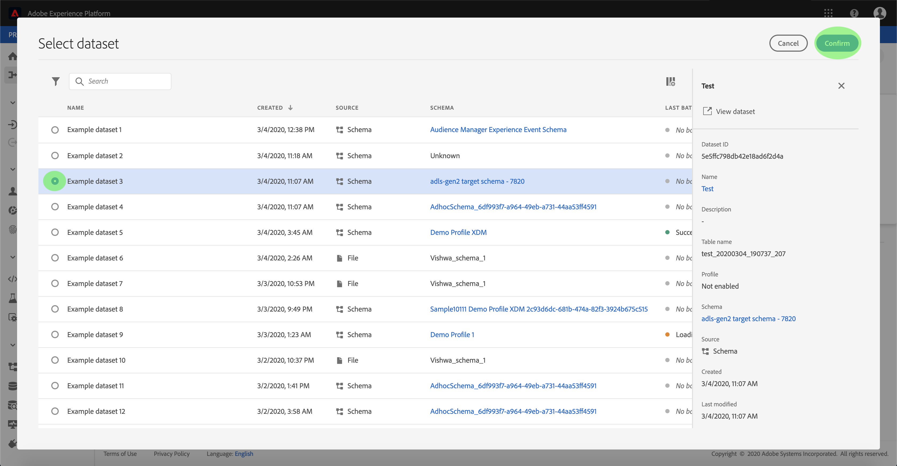

# Konfigurieren eines Datenflusses für einen Batch-Connector für eine Cloud-Datenspeicherung in der Benutzeroberfläche

Ein Datennachweis ist eine geplante Aufgabe, mit der Daten aus einer Quelle abgerufen und in einen [!DNL Platform] Datensatz aufgenommen werden. In diesem Lernprogramm werden die Schritte zum Konfigurieren eines neuen Datenflusses mit Ihrem Cloud-Datenspeicherung-Basisanschluss beschrieben.

## Erste Schritte

Dieses Tutorial setzt ein Grundverständnis der folgenden Komponenten von Adobe Experience Platform voraus:

* [XDM-System (Experience-Datenmodell)](../../../../../xdm/home.md)[!DNL Experience Platform]: Das standardisierte Framework, nach dem Daten zum Kundenerlebnis in organisiert werden.
   * [Grundlagen zum Aufbau von Schemas](../../../../../xdm/schema/composition.md): Machen Sie sich mit den Grundbausteinen von XDM-Schemas sowie den zentralen Konzepten und Best Practices rund um die Erstellung von Schemas vertraut.
   * [Schema-Editor-Lernprogramm](../../../../../xdm/tutorials/create-schema-ui.md): Erfahren Sie, wie Sie mit der Benutzeroberfläche des Schema-Editors benutzerdefinierte Schema erstellen.
* [Echtzeit-Kundenprofil](../../../../../profile/home.md): Ein durch die Zusammenführung von Daten aus verschiedenen Quellen erstelltes Profil, das eine zentrale Echtzeit-Sicht auf Kunden liefert.

Darüber hinaus müssen Sie bei diesem Lernprogramm bereits einen Cloud-Datenspeicherung-Connector erstellt haben. Eine Liste von Übungen zum Erstellen verschiedener Cloud-Datenspeicherung-Connectors in der Benutzeroberfläche finden Sie in der Übersicht über die [Quellschnittstellen](../../../../home.md).

### Unterstützte Dateiformate

[!DNL Experience Platform] unterstützt die folgenden Dateiformate, die von externen Datenspeicherung erfasst werden:

* Trennzeichen-getrennte Werte (DSV): Die Unterstützung für DSV-formatierte Datendateien ist derzeit auf kommagetrennte Werte beschränkt. Der Wert von Feldkopfzeilen in DSV-formatierten Dateien darf nur aus alphanumerischen Zeichen und Unterstrichen bestehen. Die Unterstützung für allgemeine DSV-Dateien wird in Zukunft bereitgestellt.
* [!DNL JavaScript Object Notation] (JSON): JSON-formatierte Datendateien müssen XDM-konform sein.
* [!DNL Apache Parquet]: Parquet-formatierte Datendateien müssen XDM-konform sein.

## Daten auswählen

Nachdem Sie den Cloud-Datenspeicherung-Connector erstellt haben, wird der Schritt Daten ** auswählen angezeigt und bietet eine interaktive Oberfläche, über die Sie die Cloud-Datenspeicherung-Hierarchie untersuchen können.

* Die linke Hälfte der Oberfläche ist ein Ordnerbrowser, der die Dateien und Ordner Ihres Servers anzeigt.
* In der rechten Hälfte der Oberfläche können Sie bis zu 100 Datenzeilen aus einer kompatiblen Datei Vorschau werden.

Durch Klicken auf einen aufgelisteten Ordner können Sie die Ordnerhierarchie in tiefere Ordner durchlaufen. Wenn Sie eine kompatible Datei oder einen kompatiblen Ordner ausgewählt haben, wird das Dropdownmenü Datenformat **[!UICONTROL auswählen]** angezeigt, in dem Sie ein Format auswählen können, in dem die Daten im Fenster Vorschau angezeigt werden.

Wenn das Fenster &quot;Vorschau&quot;ausgefüllt ist, können Sie auf **[!UICONTROL Weiter]** klicken, um alle Dateien im ausgewählten Ordner hochzuladen. Wenn Sie eine Datei in eine bestimmte Datei hochladen möchten, wählen Sie diese Datei in der Liste aus, bevor Sie auf **[!UICONTROL Weiter]** klicken.

>[!NOTE]
>
>Zu den unterstützten Dateiformaten gehören CSV, JSON und Parquet. JSON- und Parquet-Dateien müssen XDM-kompatibel sein.

## Zuordnen von Datenfeldern zu einem XDM-Schema

Der Schritt *[!UICONTROL Zuordnung]* wird angezeigt und bietet eine interaktive Schnittstelle, um die Quelldaten einem [!DNL Platform] Datensatz zuzuordnen. Quelldateien, die in JSON oder Parquet formatiert sind, müssen XDM-konform sein und müssen nicht manuell konfiguriert werden. Bei CSV-Dateien müssen Sie die Zuordnung explizit konfigurieren. Sie können jedoch festlegen, welche Quelldatenfelder zugeordnet werden sollen.

Wählen Sie einen Datensatz, in den eingehende Daten aufgenommen werden sollen. Sie können entweder einen vorhandenen Datensatz verwenden oder einen neuen erstellen.

**Vorhandenen Datensatz verwenden**

Um Daten in einen vorhandenen Datensatz zu erfassen, wählen Sie &quot;Vorhandenen Datensatz **[!UICONTROL verwenden]**&quot;und klicken Sie dann auf das Dataset-Symbol.

The _Select dataset_ dialog appears. Suchen Sie den gewünschten Datensatz, wählen Sie ihn aus und klicken Sie dann auf **[!UICONTROL Weiter]**.

**Verwenden eines neuen Datensatzes**

Um Daten in einen neuen Datensatz zu erfassen, wählen Sie &quot;Neuen Datensatz **[!UICONTROL erstellen]** &quot;und geben Sie einen Namen und eine Beschreibung für den Datensatz in die entsprechenden Felder ein. Klicken Sie anschließend auf das Symbol Schema.

The _Select schema_ dialog appears. Wählen Sie das Schema aus, das Sie auf den neuen Datensatz anwenden möchten, und klicken Sie dann auf **[!UICONTROL Fertig]**.

Je nach Bedarf können Sie Felder direkt zuordnen oder mithilfe der Zuordnungsfunktionen Quelldaten transformieren, um berechnete oder berechnete Werte abzuleiten. Weitere Informationen zu Funktionen für die Datenzuordnung und -zuordnung finden Sie im Lernprogramm zur [Zuordnung von CSV-Daten zu XDM-Schema-Feldern](../../../../../ingestion/tutorials/map-a-csv-file.md).

Nachdem Sie die Quelldaten zugeordnet haben, klicken Sie auf **[!UICONTROL Weiter]**.

## Planen von Erfassungsabläufen

Der Schritt *[!UICONTROL Planung]* wird angezeigt, mit dem Sie einen Erfassungszeitplan konfigurieren können, um die ausgewählten Quelldaten automatisch mit den konfigurierten Zuordnungen zu erfassen. In der folgenden Tabelle sind die verschiedenen konfigurierbaren Felder für die Planung aufgeführt:

| Feld | Beschreibung |
| --- | --- |
| Häufigkeit | Zu den auswählbaren Frequenzen gehören Minute, Stunde, Tag und Woche. |
| Intervall | Eine Ganzzahl, die das Intervall für die ausgewählte Frequenz festlegt. |
| Beginn | Ein UTC-Zeitstempel, bei dem die erste Erfassung erfolgt. |
| Aufstockung | Ein boolescher Wert, der bestimmt, welche Daten ursprünglich erfasst werden. Wenn die *[!UICONTROL Aufstockung]* aktiviert ist, werden alle aktuellen Dateien im angegebenen Pfad während der ersten geplanten Erfassung erfasst. Wenn die *[!UICONTROL Aufstockung]* deaktiviert ist, werden nur die Dateien aufgenommen, die zwischen der ersten Ausführung der Erfassung und der *[!UICONTROL Beginn]* geladen wurden. Dateien, die vor dem *[!UICONTROL Beginn]* geladen wurden, werden nicht erfasst. |

Datenflüsse sind so konzipiert, dass Daten auf planmäßiger Basis automatisch erfasst werden. Wenn Sie nur einmal über diesen Arbeitsablauf erfassen möchten, können Sie dies tun, indem Sie die **[!UICONTROL Häufigkeit]** auf &quot;Tag&quot;konfigurieren und eine sehr große Zahl für das **[!UICONTROL Intervall]**, z. B. 10000 oder Ähnliches, anwenden.

Geben Sie Werte für den Zeitplan ein und klicken Sie auf **Weiter**.

## Benennen des Datenflusses

Der *[!UICONTROL Namensfluss]* -Schritt wird angezeigt, mit dem Sie einen Namen eingeben und eine kurze Beschreibung zu Ihrem neuen Datenpfad geben können.

Geben Sie Werte für den Datenfluss ein und klicken Sie auf **[!UICONTROL Weiter]**.

### Überprüfen Sie Ihren Datenfluss

Der *[!UICONTROL Schritt zum Überprüfen]* wird angezeigt, mit dem Sie Ihren neuen Datenpfad überprüfen können, bevor er erstellt wird. Details werden in den folgenden Kategorien gruppiert:

* *[!UICONTROL Quelldetails]*: Zeigt den Quelltyp, den relevanten Pfad der ausgewählten Quelldatei und die Anzahl der Spalten in dieser Quelldatei an.
* *[!UICONTROL Angaben]* zur Zielgruppe: Zeigt, in welchen Datensatz die Quelldaten aufgenommen werden, einschließlich des Schemas, das der Datensatz einhält.
* *[!UICONTROL Details]* planen: Zeigt den aktiven Zeitraum, die Häufigkeit und das Intervall des Aufnahmeplans an.

Klicken Sie nach Überprüfung des Datenflusses auf **[!UICONTROL Fertig stellen]** und lassen Sie die Erstellung des Datenflusses etwas Zeit.

## Überwachen und Löschen Ihres Datenflusses

Nachdem Sie den DataFlow für die Cloud-Datenspeicherung erstellt haben, können Sie die Daten überwachen, die über den Datenfluss aufgenommen werden. Weitere Informationen zum Überwachen und Löschen von Datenflüssen finden Sie im Lernprogramm zum [Überwachen von Datenflüssen](../../../../../ingestion/quality/monitor-data-flows.md).

## Nächste Schritte

In diesem Lernprogramm haben Sie erfolgreich einen Datenbogen erstellt, um Daten aus einer externen Cloud-Datenspeicherung einzubringen, und Einblicke in die Überwachung von Datensätzen erhalten. Um mehr über das Erstellen von Datenflüssen zu erfahren, können Sie Ihr Lernen durch das Video unten ergänzen. Darüber hinaus können eingehende Daten jetzt auch von nachgelagerten [!DNL Platform] Diensten wie [!DNL Real-time Customer Profile] und [!DNL Data Science Workspace]genutzt werden. Weitere Informationen finden Sie in den folgenden Dokumenten:

* [Übersicht über das Echtzeit-Kundenprofil](../../../../../profile/home.md)
* [Übersicht über den Data Science Workspace](../../../../../data-science-workspace/home.md)

>[!WARNING]
>
> Die im folgenden Video dargestellte [!DNL Platform] Benutzeroberfläche ist veraltet. Die neuesten Screenshots und Funktionen der Benutzeroberfläche finden Sie in der obigen Dokumentation.

>[!VIDEO](https://video.tv.adobe.com/v/29695?quality=12&learn=on)

## Anhang

Die folgenden Abschnitte enthalten zusätzliche Informationen zum Arbeiten mit Quellschnittstellen.

### Datentaflow deaktivieren

Beim Erstellen eines Datenflusses wird dieser sofort aktiv und erfasst Daten gemäß dem festgelegten Zeitplan. Sie können einen aktiven Datenfeed jederzeit deaktivieren, indem Sie die unten stehenden Anweisungen befolgen.

Klicken Sie im Arbeitsbereich &quot; *[!UICONTROL Quellen]* &quot;auf die Registerkarte &quot; **[!UICONTROL Durchsuchen]** &quot;. Klicken Sie anschließend auf den Namen des Kontos, das dem aktiven Datenpfad zugeordnet ist, den Sie deaktivieren möchten.

Die Seite &quot; *[!UICONTROL Quellseite]* &quot;wird angezeigt. Wählen Sie den aktiven Datenfluss aus der Liste aus, um die Spalte &quot; *[!UICONTROL Eigenschaften]* &quot;auf der rechten Seite des Bildschirms mit der Schaltfläche &quot; **[!UICONTROL Aktiviert]** &quot;zu öffnen. Klicken Sie auf den Umschalter, um den Datenflug zu deaktivieren. Derselbe Umschalter kann verwendet werden, um einen Datenflug nach dessen Deaktivierung erneut zu aktivieren.

### Aktivieren von Eingangsdaten für die [!DNL Profile] Bevölkerung

Eingehende Daten aus Ihrem Quellanschluss können zur Anreicherung und zum Ausfüllen Ihrer [!DNL Real-time Customer Profile] Daten verwendet werden. Weitere Informationen zum Ausfüllen von [!DNL Profile] Kundendaten finden Sie im Tutorial zur [Profil-Population](../../profile.md).
