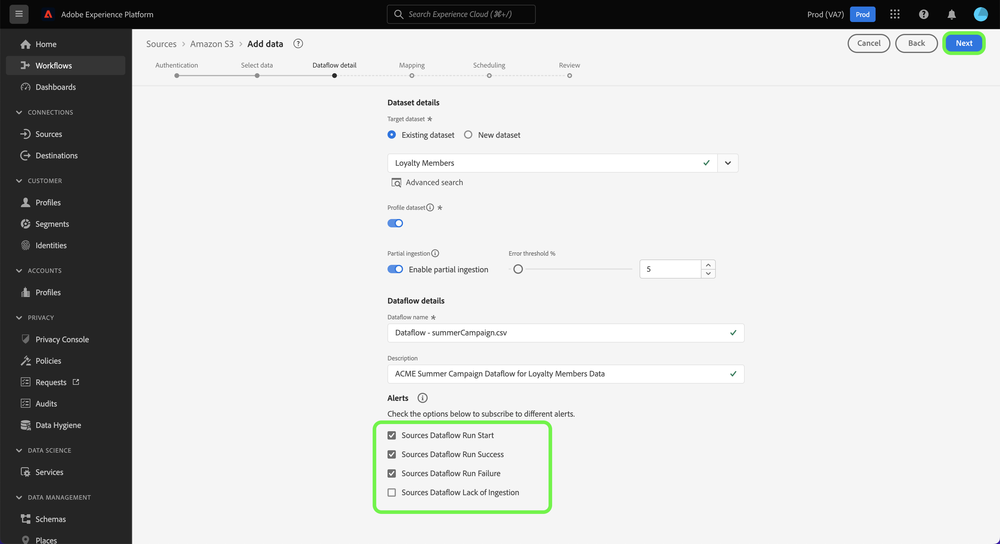

# Konfigurieren eines Datenflusses, um Batch-Daten aus einer Cloud-Speicherquelle in der Benutzeroberfläche aufzunehmen

In diesem Tutorial erfahren Sie, wie Sie einen Datenfluss konfigurieren, um Batch-Daten aus Ihrer Cloud-Speicherquelle in Adobe Experience Platform zu übertragen.

## Erste Schritte

>[!NOTE]
>
>Um einen Datenfluss zum Übertragen von Batch-Daten aus einem Cloud-Speicher zu erstellen, müssen Sie bereits Zugriff auf eine authentifizierte Cloud-Speicherquelle haben. Wenn Sie keinen Zugriff haben, navigieren Sie zur [Quellen - Übersicht](../../../../home.md#cloud-storage), um eine Liste der Cloud-Speicherquellen zu erhalten, mit denen Sie ein Konto erstellen können.

Dieses Tutorial setzt ein Grundverständnis der folgenden Komponenten von Experience Platform voraus:

* [[!DNL Experience Data Model (XDM)] System](../../../../../xdm/home.md): Das standardisierte Framework, mit dem Experience Platform Kundenerlebnisdaten organisiert.
   * [Grundlagen der Schemakomposition](../../../../../xdm/schema/composition.md): Machen Sie sich mit den grundlegenden Bausteinen von XDM-Schemata vertraut, einschließlich der wichtigsten Prinzipien und Best Practices bei der Schemaerstellung.
   * [Tutorial zum Schema-Editor](../../../../../xdm/tutorials/create-schema-ui.md): Erfahren Sie, wie Sie benutzerdefinierte Schemata mithilfe der Benutzeroberfläche des Schema-Editors erstellen können.
* [[!DNL Real-Time Customer Profile]](../../../../../profile/home.md): Bietet ein einheitliches Echtzeit-Kundenprofil, das auf aggregierten Daten aus verschiedenen Quellen basiert.

### Unterstützte Dateiformate

Cloud-Speicherquellen für Batch-Daten unterstützen die folgenden Dateiformate für die Aufnahme:

* Durch Trennzeichen getrennte Werte (DSV): Jeder einzelne Zeichenwert kann als Trennzeichen für DSV-formatierte Datendateien verwendet werden.
* [!DNL JavaScript Object Notation] (JSON): Datendateien im JSON-Format müssen XDM-kompatibel sein.
* [!DNL Apache Parquet]: Datendateien im Parquet-Format müssen XDM-kompatibel sein.
* Komprimierte Dateien: JSON- und durch Trennzeichen getrennte Dateien können wie folgt komprimiert werden: `bzip2`, `gzip`, `deflate`, `zipDeflate`, `tarGzip` und `tar`.

## Daten hinzufügen

Nachdem Sie Ihr Cloud-Speicherkonto erstellt haben, wird der Schritt **[!UICONTROL Daten hinzufügen]** angezeigt, der Ihnen eine Schnittstelle bietet, um Ihre Cloud-Speicherdateihierarchie zu untersuchen und den Ordner oder die spezifische Datei auszuwählen, die Sie in Platform importieren möchten.

* Der linke Teil der Benutzeroberfläche ist ein Verzeichnis-Browser, der die Hierarchie Ihrer Cloud-Speicherdatei anzeigt.
* Im rechten Bereich der Benutzeroberfläche können Sie bis zu 100 Datenzeilen aus einem kompatiblen Ordner oder einer kompatiblen Datei in der Vorschau anzeigen.

Wählen Sie den Stammordner aus, um auf Ihre Ordnerhierarchie zuzugreifen. Von hier aus können Sie einen einzelnen Ordner auswählen, um alle Dateien im Ordner rekursiv aufzunehmen. Beim Aufnehmen eines ganzen Ordners müssen Sie sicherstellen, dass alle Dateien in diesem Ordner dasselbe Datenformat und Schema haben.

Nachdem Sie einen Ordner ausgewählt haben, wird die rechte Benutzeroberfläche aktualisiert, um eine Vorschau des Inhalts und der Struktur der ersten Datei im ausgewählten Ordner anzuzeigen.

In diesem Schritt können Sie mehrere Konfigurationen an Ihren Daten vornehmen, bevor Sie fortfahren. Wählen Sie zunächst **[!UICONTROL Datenformat]** und wählen Sie dann im angezeigten Dropdown-Menü das entsprechende Datenformat für Ihre Datei aus.

In der folgenden Tabelle werden die entsprechenden Datenformate für die unterstützten Dateitypen angezeigt:

| Dateityp | Datenformat |
| --- | --- |
| CSV | [!UICONTROL Getrennt] |
| JSON | [!UICONTROL JSON] |
| Parquet | [!UICONTROL XDM Parquet] |

### Spaltentrennzeichen auswählen

Nachdem Sie Ihr Datenformat konfiguriert haben, können Sie bei der Aufnahme von durch Trennzeichen getrennten Dateien ein Spaltentrennzeichen festlegen. Wählen Sie die Option **[!UICONTROL Trennzeichen]** und wählen Sie dann ein Trennzeichen aus dem Dropdown-Menü aus. Das Menü zeigt die am häufigsten verwendeten Optionen für Trennzeichen an, einschließlich eines Kommas (`,`), eines Tabs (`\t`) und eines senkrechten Strichs (`|`).

Wenn Sie ein benutzerdefiniertes Trennzeichen bevorzugen, wählen Sie **[!UICONTROL Benutzerdefiniert]** und geben Sie ein einzelnes Trennzeichen Ihrer Wahl in die Popup-Eingabeleiste ein.

### Komprimierte Dateien aufnehmen

Sie können auch komprimierte JSON- oder durch Trennzeichen getrennte Dateien erfassen, indem Sie ihren Komprimierungstyp angeben.

Wählen [!UICONTROL  im Schritt ]Daten auswählen“ eine komprimierte Datei für die Aufnahme und dann den entsprechenden Dateityp aus und geben Sie an, ob er XDM-kompatibel ist oder nicht. Wählen Sie anschließend **[!UICONTROL Komprimierungstyp]** und wählen Sie dann den entsprechenden komprimierten Dateityp für Ihre Quelldaten aus.

Um eine bestimmte Datei in Platform aufzunehmen, wählen Sie einen Ordner und dann die Datei aus, die Sie aufnehmen möchten. In diesem Schritt können Sie auch eine Vorschau des Dateiinhalts anderer Dateien in einem bestimmten Ordner anzeigen, indem Sie das Vorschausymbol neben einem Dateinamen verwenden.

Wenn Sie fertig sind, klicken Sie auf die Schaltfläche **[!UICONTROL Weiter]**.

## Angeben von Datenflussdetails

Auf der Seite [!UICONTROL Datenflussdetails] können Sie auswählen, ob Sie einen vorhandenen Datensatz oder einen neuen Datensatz verwenden möchten. Während dieses Vorgangs können Sie auch Ihre Daten für die Aufnahme in Profile konfigurieren und Einstellungen wie [!UICONTROL Fehlerdiagnose], [!UICONTROL Partielle Aufnahme] und [!UICONTROL Warnhinweise] aktivieren.

### Verwenden eines vorhandenen Datensatzes

Um Daten in einen vorhandenen Datensatz aufzunehmen, wählen Sie **[!UICONTROL Vorhandener Datensatz]**. Sie können einen vorhandenen Datensatz entweder über die Option [!UICONTROL Erweiterte Suche] oder durch Scrollen durch die Liste der vorhandenen Datensätze im Dropdown-Menü abrufen. Nachdem Sie einen Datensatz ausgewählt haben, geben Sie einen Namen und eine Beschreibung für Ihren Datenfluss ein.

### Verwenden eines neuen Datensatzes

Für ein Aufnehmen in einen neuen Datensatz wählen Sie **[!UICONTROL Neuer Datensatz]** aus und geben Sie einen Namen für den Ausgabedatensatz und eine optionale Beschreibung an. Wählen Sie als Nächstes mithilfe der Option [!UICONTROL Erweiterte Suche] oder durch Scrollen durch die Liste der vorhandenen Schemata im Dropdown-Menü ein Schema zum Zuordnen aus. Nachdem Sie ein Schema ausgewählt haben, geben Sie einen Namen und eine Beschreibung für Ihren Datenfluss ein.

### Profil- und Fehlerdiagnose aktivieren

Wählen Sie als Nächstes den **[!UICONTROL Profildatensatz]** aus, um Ihren Datensatz für das Profil zu aktivieren. Auf diese Weise können Sie eine ganzheitliche Ansicht der Attribute und Verhaltensweisen einer Entität erstellen. Daten aus allen profilaktivierten Datensätzen werden in das Profil eingeschlossen und Änderungen werden angewendet, wenn Sie Ihren Datenfluss speichern.

[!UICONTROL Fehlerdiagnose] ermöglicht eine detaillierte Erstellung von Fehlermeldungen für alle fehlerhaften Datensätze, die in Ihrem Datenfluss auftreten, während [!UICONTROL Partielle Aufnahme] die Aufnahme von fehlerhaften Daten bis zu einem gewissen Schwellenwert, den Sie manuell definieren, ermöglicht. Weitere Informationen finden Sie in der [Übersicht zur partiellen Batch-Aufnahme](../../../../../ingestion/batch-ingestion/partial.md).

### Aktivieren von Warnhinweisen

Sie können Warnhinweise aktivieren, um Benachrichtigungen zum Status Ihres Datenflusses zu erhalten. Wählen Sie einen Warnhinweis aus der zu abonnierenden Liste aus, um Benachrichtigungen über den Status Ihres Datenflusses zu erhalten. Weitere Informationen zu Warnhinweisen finden Sie im Handbuch zum [Abonnieren von Warnhinweisen zu Quellen über die Benutzeroberfläche](../../alerts.md).

Wenn Sie mit dem Eingeben der Details für Ihren Datenfluss fertig sind, klicken Sie auf **[!UICONTROL Weiter]**.

## Zuordnen von Datenfeldern zu einem XDM-Schema

Es erfolgt der Schritt der [!UICONTROL Zuordnung], in dem Ihnen eine Schnittstelle zum Zuordnen der Quellfelder aus Ihrem Quellschema zu den entsprechenden XDM-Zielfeldern im Zielschema bereitgestellt wird.

Platform bietet intelligente Empfehlungen für automatisch zugeordnete Felder, die auf dem von Ihnen ausgewählten Zielschema oder Datensatz basieren. Sie können die Zuordnungsregeln manuell an Ihre Anwendungsfälle anpassen. Je nach Bedarf können Sie wahlweise Felder direkt zuordnen oder mithilfe von Datenvorbereitungsfunktionen Quelldaten transformieren, um berechnete oder anderweitig ermittelte Werte abzuleiten. Eine ausführliche Anleitung zur Verwendung der Zuordnungsschnittstelle und berechneter Felder finden Sie im [Handbuch zur Datenvorbereitungs-Benutzeroberfläche](../../../../../data-prep/ui/mapping.md).

Nachdem Ihre Quelldaten erfolgreich zugeordnet wurden, klicken Sie auf **[!UICONTROL Weiter]**.

## Planen von Aufnahmedurchgängen

>[!IMPORTANT]
>
>Es wird dringend empfohlen, Ihren Datenfluss für eine einmalige Aufnahme zu planen, wenn Sie die [FTP-Quelle](../../../../connectors/cloud-storage/ftp.md) verwenden.

Der Schritt [!UICONTROL Planung] wird angezeigt, in dem Sie einen Aufnahmezeitplan konfigurieren können, um die ausgewählten Quelldaten mithilfe der konfigurierten Zuordnungen automatisch aufzunehmen. Standardmäßig ist die Zeitplanung auf `Once` festgelegt. Um Ihre Aufnahmefrequenz anzupassen, wählen Sie **[!UICONTROL Häufigkeit]** und dann eine Option aus dem Dropdown-Menü aus.

>[!TIP]
>
>Intervall und Aufstockung sind während einer einmaligen Aufnahme nicht sichtbar.

Wenn Sie die Aufnahmefrequenz auf `Minute`, `Hour`, `Day` oder `Week` festlegen, müssen Sie ein Intervall festlegen, um zwischen den einzelnen Aufnahmen einen bestimmten Zeitrahmen festzulegen. Wenn beispielsweise die Aufnahmefrequenz auf `Day` und das Intervall auf `15` festgelegt ist, bedeutet dies, dass der Datenfluss alle 15 Tage Daten aufnehmen soll.

In diesem Schritt können Sie auch **Aufstockung“ aktivieren** eine Spalte für die inkrementelle Aufnahme von Daten definieren. Die Aufstockung wird verwendet, um historische Daten aufzunehmen, während die Spalte, die Sie für die inkrementelle Aufnahme definieren, es ermöglicht, neue Daten von vorhandenen Daten zu unterscheiden.

Weitere Informationen zur Planung von Konfigurationen finden Sie in der folgenden Tabelle.

| Konfiguration planen | Beschreibung |
| --- | --- |
| Häufigkeit | Konfigurieren Sie die Häufigkeit , um anzugeben, wie oft der Datenfluss ausgeführt werden soll. Sie können Ihre Häufigkeit auf Folgendes festlegen: <ul><li>**Einmal**: Legen Sie für die Häufigkeit `once` fest, um eine einmalige Aufnahme zu erstellen. Konfigurationen für Intervall und Aufstockung sind beim Erstellen eines einmaligen Aufnahme-Datenflusses nicht verfügbar. Standardmäßig ist die Zeitplanfrequenz auf einmal festgelegt.</li><li>**Minute**: Legen Sie für die Häufigkeit `minute` fest, um Ihren Datenfluss so zu planen, dass Daten pro Minute aufgenommen werden.</li><li>**Stunde**: Legen Sie für die Häufigkeit `hour` fest, um den Datenfluss zu planen und Daten stündlich aufzunehmen.</li><li>**Tag**: Legen Sie für Ihre Häufigkeit `day` fest, um Ihren Datenfluss so zu planen, dass Daten täglich aufgenommen werden.</li><li>**Woche**: Legen Sie für Ihre Häufigkeit `week` fest, um Ihren Datenfluss zu planen und Daten pro Woche aufzunehmen.</li></ul> |
| Intervall | Nachdem Sie eine Häufigkeit ausgewählt haben, können Sie die Intervalleinstellung konfigurieren, um den Zeitrahmen zwischen jeder Aufnahme festzulegen. Wenn Sie beispielsweise Ihre Häufigkeit auf „Tag“ festlegen und das Intervall auf 15 konfigurieren, wird Ihr Datenfluss alle 15 Tage ausgeführt. Das Intervall kann nicht auf null festgelegt werden. Der akzeptierte Mindestintervallwert für jede Häufigkeit ist wie folgt:<ul><li>**Einmal**: nicht zutreffend</li><li>**Minute**: 15</li><li>**Stunde**: 1</li><li>**Tag**: 1</li><li>**Woche**: 1</li></ul> |
| Startzeit | Der Zeitstempel für die projizierte Ausführung, dargestellt in UTC-Zeitzone. |
| Aufstockung | Die Aufstockung bestimmt, welche Daten anfänglich aufgenommen werden. Wenn die Aufstockung aktiviert ist, werden alle aktuellen Dateien im angegebenen Pfad während der ersten geplanten Aufnahme aufgenommen. Wenn die Aufstockung deaktiviert ist, werden nur die Dateien aufgenommen, die zwischen der ersten Aufnahme-Ausführung und der Startzeit geladen werden. Dateien, die vor der Startzeit geladen wurden, werden nicht aufgenommen. |

>[!NOTE]
>
>Bei der Batch-Aufnahme wählt jeder nachfolgende Datenfluss die aufzunehmenden Dateien aus Ihrer Quelle anhand ihres **zuletzt geänderten** Zeitstempels aus. Das bedeutet, dass Batch-Datenflüsse Dateien aus der Quelle auswählen, die neu sind oder seit der letzten Ausführung des Flusses geändert wurden. Darüber hinaus müssen Sie sicherstellen, dass zwischen dem Hochladen einer Datei und der Ausführung eines geplanten Flusses eine ausreichende Zeitspanne liegt, da Dateien, die nicht vollständig in Ihr Cloud-Speicherkonto hochgeladen wurden, bevor die geplante Laufzeit des Flusses zur Aufnahme möglicherweise nicht abgerufen wird.

Wenn Sie mit der Konfiguration Ihres Aufnahmezeitplans fertig sind, klicken Sie auf **[!UICONTROL Weiter]**.

## Überprüfen des Datenflusses

Der Schritt **[!UICONTROL Überprüfung]** wird angezeigt, sodass Sie Ihren neuen Datenfluss überprüfen können, bevor er hergestellt wird. Die Details lassen sich wie folgt kategorisieren:

* **[!UICONTROL Verbindung]**: Zeigt den Quelltyp, den relevanten Pfad der ausgewählten Quelldatei und die Anzahl der Spalten innerhalb dieser Quelldatei an.
* **[!UICONTROL Datensatz- und Zuordnungsfelder zuweisen]**: Zeigt an, in welchen Datensatz die Quelldaten aufgenommen werden, einschließlich des Schemas, dem der Datensatz entspricht.
* **[!UICONTROL Planung]**: Zeigt den aktiven Zeitraum, die Häufigkeit und das Intervall des Aufnahmezeitplans an.

Nachdem Sie Ihren Datenfluss überprüft haben, klicken Sie auf **[!UICONTROL Beenden]** und gewähren Sie etwas Zeit für die Erstellung des Datenflusses.

## Nächste Schritte

In diesem Tutorial haben Sie erfolgreich einen Datenfluss erstellt, um Daten aus einem externen Cloud-Speicher einzubringen, und Erkenntnisse zur Überwachung von Datensätzen gewonnen. Um mehr über das Erstellen von Datenflüssen zu erfahren, können Sie Ihr Wissen ergänzen, indem Sie sich das folgende Video ansehen. Darüber hinaus können eingehende Daten jetzt von nachgelagerten [!DNL Platform] wie [!DNL Real-Time Customer Profile] und [!DNL Data Science Workspace] verwendet werden. Weiterführende Informationen finden Sie in folgenden Dokumenten:

* [[!DNL Real-Time Customer Profile] – Übersicht](../../../../../profile/home.md)
* [[!DNL Data Science Workspace] – Übersicht](../../../../../data-science-workspace/home.md)

>[!WARNING]
>
> Die im folgenden Video angezeigte [!DNL Platform]-Benutzeroberfläche ist veraltet. Die neuesten Screenshots und Funktionen der Benutzeroberfläche finden Sie in der obigen Dokumentation.

>[!VIDEO](https://video.tv.adobe.com/v/29695?quality=12&learn=on)

## Anhang

Die folgenden Abschnitte enthalten zusätzliche Informationen zum Arbeiten mit Quell-Connectoren.

## Überwachen Ihres Datenflusses

Nachdem Ihr Datenfluss erstellt wurde, können Sie die Daten überwachen, die über ihn aufgenommen werden, um Informationen zu Aufnahmegeschwindigkeiten, Erfolg und Fehlern anzuzeigen. Weitere Informationen zum Überwachen von Datenflüssen finden Sie im Tutorial [Überwachen von Konten und Datenflüssen in der Benutzeroberfläche](../../monitor.md).

## Aktualisieren des Datenflusses

Um Konfigurationen für die Planung, Zuordnung und allgemeine Informationen Ihrer Datenflüsse zu aktualisieren, besuchen Sie das Tutorial [Aktualisieren von Quelldatenflüssen in der Benutzeroberfläche](../../update-dataflows.md)

## Löschen des Datenflusses

Datenflüsse, die nicht mehr erforderlich sind oder nicht korrekt erstellt wurden, können Sie löschen, indem Sie dazu die Funktion **[!UICONTROL Löschen]** im Arbeitsbereich **[!UICONTROL Datenflüsse]** verwenden. Weitere Informationen zum Löschen von Datenflüssen finden Sie im Tutorial [Löschen von Datenflüssen in der Benutzeroberfläche](../../delete.md).