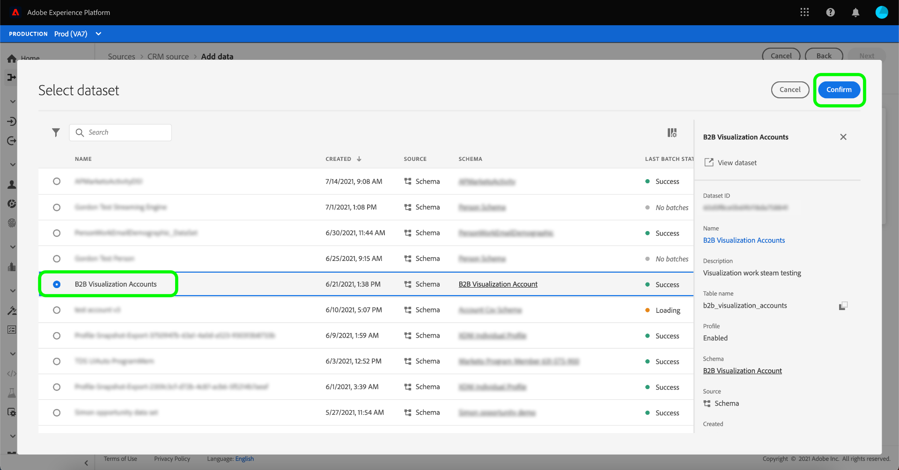
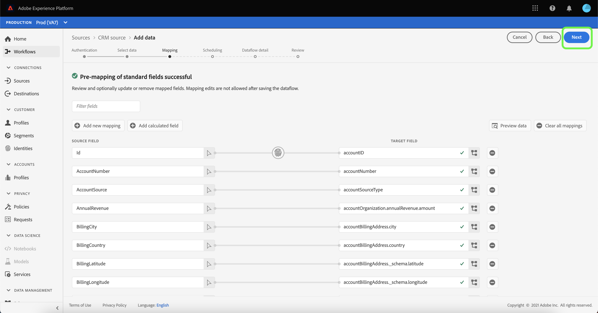

# Konfigurieren eines Datenflusses für eine CRM-Verbindung in der Benutzeroberfläche

Ein Datenfluss ist eine geplante Aufgabe, die Daten aus einer Quelle abruft und in einen Platform-Datensatz aufnimmt. In diesem Tutorial erfahren Sie, wie Sie mithilfe Ihres CRM-Kontos einen neuen Datenfluss konfigurieren.

## Erste Schritte

Dieses Tutorial setzt ein Grundverständnis der folgenden Komponenten von Adobe Experience Platform voraus:

* [[!DNL Experience Data Model (XDM)] System](../../../../xdm/home.md): Der standardisierte Rahmen, durch den [!DNL Experience Platform] organisiert Kundenerlebnisdaten.
   * [Grundlagen der Schemakomposition](../../../../xdm/schema/composition.md): Machen Sie sich mit den Grundbausteinen von XDM-Schemas sowie den zentralen Konzepten und Best Practices rund um die Erstellung von Schemas vertraut.
   * [Tutorial zum Schema Editor](../../../../xdm/tutorials/create-schema-ui.md): Erfahren Sie, wie Sie benutzerdefinierte Schemas mithilfe der Benutzeroberfläche des Schema-Editors erstellen.
* [[!DNL Real-time Customer Profile]](../../../../profile/home.md): Bietet ein einheitliches Echtzeit-Kundenprofil, das auf aggregierten Daten aus verschiedenen Quellen basiert.

Außerdem müssen Sie für dieses Tutorial bereits ein CRM-Konto erstellt haben. Eine Liste der Tutorials zum Erstellen verschiedener CRM-Connectoren in der Benutzeroberfläche finden Sie im [Übersicht über Quell-Connectoren](../../../home.md).

## Daten auswählen

Nach der Erstellung Ihres CRM-Kontos wird die [!UICONTROL Daten auswählen] angezeigt, wo eine Oberfläche angezeigt wird, über die Sie Ihre Dateihierarchie untersuchen können.

* In der linken Hälfte der Benutzeroberfläche befindet sich ein Verzeichnisbrowser, in dem die Dateien und Verzeichnisse Ihres CRM-Systems angezeigt werden.
* In der rechten Hälfte der Benutzeroberfläche können Sie eine Vorschau von bis zu 100 Datenzeilen aus einer kompatiblen Datei anzeigen.

Sie können die **[!UICONTROL Suche]** -Option oben auf der Seite, um die Quelldaten, die Sie verwenden möchten, schnell zu identifizieren.

>[!NOTE]
>
>Die Option Suchquellendaten ist für alle tabellarischen Quell-Connectoren mit Ausnahme der Connectoren für Analytics, Classifications, Event Hubs und Kinesis verfügbar.

Nachdem Sie die Quelldaten gefunden haben, wählen Sie das Verzeichnis aus und klicken Sie auf **[!UICONTROL Nächste]**.

## Zuordnen von Datenfeldern zu einem XDM-Schema

Die **[!UICONTROL Zuordnung]** -Schritt angezeigt und stellt eine Schnittstelle zum Zuordnen der Quelldaten zu einem Platform-Datensatz bereit.

Wählen Sie einen Datensatz für eingehende Daten aus, die in aufgenommen werden sollen. Sie können entweder einen vorhandenen Datensatz verwenden oder einen neuen Datensatz erstellen.

### Vorhandenen Datensatz verwenden

Um Daten in einen vorhandenen Datensatz zu erfassen, wählen Sie **[!UICONTROL Vorhandener Datensatz]** und wählen Sie dann das Datensymbol aus  neben der Eingabebar.

Die **[!UICONTROL Datensatz auswählen]** angezeigt. Suchen Sie den Datensatz, den Sie verwenden möchten, wählen Sie ihn aus und klicken Sie auf **[!UICONTROL Weiter]**.

### Verwenden eines neuen Datensatzes

Um Daten in einen neuen Datensatz zu erfassen, wählen Sie **[!UICONTROL Neuer Datensatz]** und geben Sie einen Namen und eine Beschreibung für den Datensatz in die entsprechenden Felder ein.

Sie können ein Schemafeld anhängen, indem Sie einen Schemanamen in die **[!UICONTROL Schema auswählen]** Suchleiste. Sie können auch das Dropdown-Symbol auswählen, um eine Liste der vorhandenen Schemas anzuzeigen. Alternativ können Sie **[!UICONTROL Erweiterte Suche]** , um auf den Bildschirm vorhandener Schemata mit ihren jeweiligen Details zuzugreifen.

Während dieses Schritts können Sie Ihren Datensatz für [!DNL Real-time Customer Profile] und erstellen Sie eine ganzheitliche Ansicht der Attribute und Verhaltensweisen einer Entität. Daten aus allen aktivierten Datensätzen werden in [!DNL Profile] und Änderungen werden angewendet, wenn Sie Ihren Datenfluss speichern.

Umschalten zwischen **[!UICONTROL Profildatensatz]** Schaltfläche zum Aktivieren Ihres Zieldatensatzes für [!DNL Profile].

Die **[!UICONTROL Schema auswählen]** angezeigt. Wählen Sie das Schema aus, das Sie auf den neuen Datensatz anwenden möchten, und klicken Sie dann auf **[!UICONTROL Fertig]**.

Je nach Bedarf können Sie Felder direkt zuordnen oder mithilfe von Datenvorbereitungsfunktionen Quelldaten transformieren, um berechnete oder berechnete Werte abzuleiten. Umfassende Schritte zur Verwendung der Mapper-Oberfläche und der berechneten Felder finden Sie im Abschnitt [Handbuch zur Datenvorbereitung-Benutzeroberfläche](../../../../data-prep/ui/mapping.md)

>[!TIP]
>
>Wenn Sie die [!DNL Salesforce] Quelle im Rahmen der B2B CDP, siehe [[!DNL Salesforce] Feldzuordnungstabellen](../../../connectors/adobe-applications/mapping/salesforce.md) für eine Anleitung zu den entsprechenden Zuordnungssätzen zwischen [!DNL Salesforce] Quellfelder und XDM-Zielfelder.

Platform bietet intelligente Empfehlungen für automatisch zugeordnete Felder, die auf dem von Ihnen ausgewählten Zielschema oder Datensatz basieren. Sie können die Zuordnungsregeln manuell an Ihre Anwendungsfälle anpassen.

Auswählen **[!UICONTROL Datenvorschau]** , um die Zuordnungsergebnisse von bis zu 100 Zeilen mit Beispieldaten aus dem ausgewählten Datensatz anzuzeigen.

Während der Vorschau wird die Identitätsspalte als erstes Feld priorisiert, da dies die wichtigsten Informationen ist, die bei der Validierung der Zuordnungsergebnisse erforderlich sind.

Nachdem die Quelldaten zugeordnet wurden, wählen Sie **[!UICONTROL Schließen]**.

Als Nächstes wählen Sie aus dem [!UICONTROL Zuordnung] Bildschirm, wählen Sie **[!UICONTROL Nächste]** um fortzufahren.

## Erfassungsläufe planen

Die **[!UICONTROL Planung]** angezeigt, sodass Sie einen Aufnahmezeitplan konfigurieren können, um die ausgewählten Quelldaten mithilfe der konfigurierten Zuordnungen automatisch zu erfassen. In der folgenden Tabelle sind die verschiedenen konfigurierbaren Felder für die Planung aufgeführt:

| Feld | Beschreibung |
| --- | --- |
| Häufigkeit | Selektive Häufigkeiten beinhalten `Once`, `Minute`, `Hour`, `Day`und `Week`. |
| Intervall | Eine Ganzzahl, die das Intervall für die ausgewählte Häufigkeit festlegt. |
| Startzeit | Ein UTC-Zeitstempel, der angibt, wann die erste Aufnahme erfolgen soll. |
| Aufstockung | Ein boolean -Wert, der bestimmt, welche Daten ursprünglich erfasst werden. Wenn **[!UICONTROL Aufstockung]** aktiviert ist, werden alle aktuellen Dateien im angegebenen Pfad während der ersten geplanten Erfassung erfasst. Wenn **[!UICONTROL Aufstockung]** deaktiviert ist, werden nur die Dateien zwischen der ersten Ausführung der Aufnahme und der **[!UICONTROL Startzeit]** wird erfasst. Dateien, die vor **[!UICONTROL Startzeit]** wird nicht erfasst. |
| Delta-Spalte | Eine Option mit einem gefilterten Satz von Quellschemafeldern vom Typ, Datum oder Uhrzeit. Dieses Feld wird verwendet, um zwischen neuen und vorhandenen Daten zu unterscheiden. Inkrementelle Daten werden basierend auf dem Zeitstempel der ausgewählten Spalte erfasst. |

Datenflüsse dienen dazu, Daten automatisch auf geplanter Basis zu erfassen. Wählen Sie zunächst die Aufnahmefrequenz aus. Legen Sie anschließend das Intervall fest, um den Zeitraum zwischen zwei Durchsatzausführungen festzulegen. Der Wert des Intervalls sollte eine Ganzzahl ungleich null sein und auf größer oder gleich 15 gesetzt werden.

Passen Sie zum Festlegen der Startzeit für die Aufnahme das im Feld Startzeit angezeigte Datum und die Uhrzeit an. Alternativ können Sie das Kalendersymbol auswählen, um den Startzeitwert zu bearbeiten. Die Startzeit muss größer oder gleich der aktuellen UTC-Zeit sein.

Auswählen **[!UICONTROL Inkrementelle Daten laden nach]** , um die Delta-Spalte zuzuweisen. In diesem Feld wird zwischen neuen und vorhandenen Daten unterschieden.

### Einrichten eines Datenflusses zur einmaligen Erfassung

Um die einmalige Erfassung einzurichten, wählen Sie den Dropdown-Pfeil &quot;Häufigkeit&quot;aus und klicken Sie auf **[!UICONTROL Einmal]**.

>[!TIP]
>
>**[!UICONTROL Intervall]** und **[!UICONTROL Aufstockung]** während einer einmaligen Erfassung nicht sichtbar sind.

Nachdem Sie die entsprechenden Werte für den Zeitplan angegeben haben, wählen Sie **[!UICONTROL Nächste]**.

## Datenflussdetails angeben

Die **[!UICONTROL Datenflussdetails]** angezeigt, sodass Sie einen Namen eingeben und eine kurze Beschreibung zu Ihrem neuen Datenfluss eingeben können.

Während dieses Vorgangs können Sie auch **[!UICONTROL Partielle Erfassung]** und **[!UICONTROL Fehlerdiagnose]**. Aktivieren **[!UICONTROL Partielle Erfassung]** bietet die Möglichkeit, Daten mit Fehlern bis zu einem bestimmten Schwellenwert zu erfassen. Einmal **[!UICONTROL Partielle Erfassung]** aktiviert ist, ziehen Sie die **[!UICONTROL Fehlerschwellenwert %]** wählen, um den Fehlerschwellenwert des Batches anzupassen. Alternativ können Sie die Schwelle manuell anpassen, indem Sie das Eingabefeld auswählen. Weitere Informationen finden Sie unter [partielle Batch-Erfassung - Übersicht](../../../../ingestion/batch-ingestion/partial.md).

Geben Sie Werte für den Datenfluss an und wählen Sie **[!UICONTROL Nächste]**.

## Überprüfen Sie Ihren Datenfluss.

Die *Überprüfen* angezeigt, sodass Sie Ihren neuen Datenfluss überprüfen können, bevor er erstellt wird. Details werden in die folgenden Kategorien eingeteilt:

* **[!UICONTROL Verbindung]**: Zeigt den Namen des Quellkontos, die Quellplattform, den relevanten Pfad der ausgewählten Quelldatei und die Anzahl der Spalten in dieser Quelldatei an.
* **[!UICONTROL Datensatz- und Zuordnungsfelder zuweisen]**: Zeigt den Zieldatensatz an, in den die Quelldaten aufgenommen werden, einschließlich des Schemas, dem der Datensatz entspricht.
* **[!UICONTROL Planung]**: Zeigt die Startzeit und Häufigkeit des Datenflusses an.

Nachdem Sie Ihren Datenfluss überprüft haben, klicken Sie auf **[!UICONTROL Beenden]** und lassen Sie etwas Zeit für die Erstellung des Datenflusses zu.

## Überwachen Ihres Datenflusses

Nachdem Ihr Datenfluss erstellt wurde, können Sie die erfassten Daten überwachen, um Informationen zu Erfassungsraten, Erfolg und Fehlern zu erhalten. Weitere Informationen zum Überwachen des Datenflusses finden Sie im Tutorial zu [Überwachen von Konten und Datenflüssen in der Benutzeroberfläche](../monitor.md).

## Datenfluss löschen

Sie können Datenflüsse löschen, die nicht mehr erforderlich sind oder falsch erstellt wurden, indem Sie die Variable **[!UICONTROL Löschen]** -Funktion im **[!UICONTROL Datenflüsse]** Arbeitsbereich. Weitere Informationen zum Löschen von Datenflüssen finden Sie im Tutorial zu [Löschen von Datenflüssen in der Benutzeroberfläche](../delete.md).

## Nächste Schritte

In diesem Tutorial haben Sie erfolgreich einen Datenfluss erstellt, um Daten aus einem CRM-System einzubringen und Einblicke in die Überwachung von Datensätzen zu erhalten. Um mehr über die Erstellung von Datenflüssen zu erfahren, ergänzen Sie Ihr Lernen, indem Sie sich das folgende Video ansehen. Darüber hinaus können eingehende Daten jetzt von nachgelagerten Platform-Diensten wie [!DNL Real-time Customer Profile] und [!DNL Data Science Workspace]. Weitere Informationen finden Sie in den folgenden Dokumenten:

* [Übersicht über das Echtzeit-Kundenprofil](../../../../profile/home.md)
* [Data Science Workspace – Übersicht](../../../../data-science-workspace/home.md)

>[!WARNING]
>
> Die im folgenden Video dargestellte Platform-Benutzeroberfläche ist veraltet. In der obigen Dokumentation finden Sie die neuesten Screenshots und Funktionen der Benutzeroberfläche.
>
>[!VIDEO](https://video.tv.adobe.com/v/29711?quality=12&learn=on)
