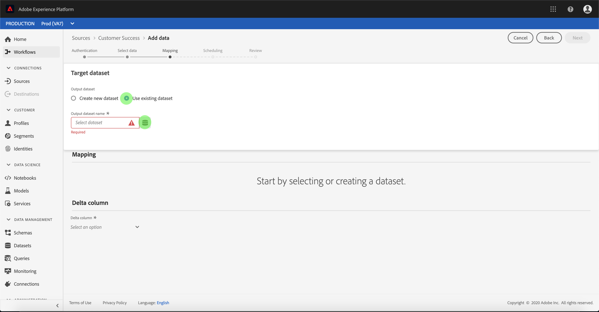

# Konfigurieren eines Datenflusses für einen Kunden-Erfolgsstecker in der Benutzeroberfläche

Ein Datennachweis ist eine geplante Aufgabe, mit der Daten aus einer Quelle abgerufen und in einen Platform-Datensatz aufgenommen werden. Dieses Lernprogramm enthält Schritte zum Konfigurieren eines neuen Datenflusses mit Ihrem Kundenkonto.

## Erste Schritte

Dieses Lernprogramm erfordert ein Verständnis der folgenden Komponenten der Adobe Experience Platform:

- [Erlebnis-Datenmodell (XDM)-System](../../../../xdm/home.md): Das standardisierte Framework, mit dem Experience Platform Kundenerlebnisdaten organisiert.
   - [Grundlagen der Zusammensetzung](../../../../xdm/schema/composition.md)des Schemas: Erfahren Sie mehr über die grundlegenden Bausteine von XDM-Schemas, einschließlich der wichtigsten Grundsätze und Best Practices bei der Schema-Komposition.
   - [Schema-Editor-Lernprogramm](../../../../xdm/tutorials/create-schema-ui.md): Erfahren Sie, wie Sie mit der Benutzeroberfläche des Schema-Editors benutzerdefinierte Schema erstellen.
- [Echtzeit-Profil](../../../../profile/home.md): Bietet ein einheitliches, Echtzeit-Profil für Kunden, das auf aggregierten Daten aus mehreren Quellen basiert.

Darüber hinaus erfordert dieses Lernprogramm, dass Sie bereits ein Kundenkonto erstellt haben. Eine Liste von Übungen zum Erstellen verschiedener Kundenerfolgsschnittstellen in der Benutzeroberfläche finden Sie in der Übersicht über die [Quellschnittstellen](../../../home.md).

## Daten auswählen

Nach dem Erstellen des KundenerfolgConnectors wird der Schritt &quot;Daten ** auswählen&quot;angezeigt und bietet eine interaktive Oberfläche, über die Sie Ihre Dateihierarchie untersuchen können.

- Die linke Hälfte der Oberfläche ist ein Ordnerbrowser, der die Dateien und Ordner Ihres Servers anzeigt.
- In der rechten Hälfte der Oberfläche können Sie bis zu 100 Datenzeilen aus einer kompatiblen Datei Vorschau werden.

Wählen Sie den Ordner aus, den Sie verwenden möchten, und klicken Sie dann auf **Weiter**.

## Zuordnen von Datenfeldern zu einem XDM-Schema

Der Schritt *Zuordnung* wird angezeigt und bietet eine interaktive Schnittstelle, um die Quelldaten einem Plattformdatensatz zuzuordnen.

Wählen Sie einen Datensatz, in den eingehende Daten aufgenommen werden sollen. Sie können entweder einen vorhandenen Datensatz verwenden oder einen neuen Datensatz erstellen.

### Vorhandenen Datensatz verwenden

Um Daten in einen vorhandenen Datensatz zu erfassen, wählen Sie &quot;Vorhandenen Datensatz **verwenden**&quot;und klicken Sie dann auf das Dataset-Symbol.

Das Dialogfeld &quot;Datensatz *auswählen* &quot;wird angezeigt. Suchen Sie den gewünschten Datensatz, wählen Sie ihn aus und klicken Sie dann auf **Weiter**.

### Verwenden eines neuen Datensatzes

Um Daten in einen neuen Datensatz zu erfassen, wählen Sie &quot;Neuen Datensatz **erstellen** &quot;und geben Sie einen Namen und eine Beschreibung für den Datensatz in die entsprechenden Felder ein.

Während dieses Prozesses können Sie auch die *teilweise Erfassung* und *Fehlerdiagnose* aktivieren. Durch Aktivierung der *partiellen Erfassung* können Daten mit Fehlern bis zu einem bestimmten Schwellenwert erfasst werden, den Sie festlegen können. Wenn Sie die *Fehlerdiagnose* aktivieren, werden Details zu fehlerhaften Daten bereitgestellt, die separat gestapelt werden. Weitere Informationen finden Sie in der Übersicht über die [teilweise Stapelverarbeitung](../../../../ingestion/batch-ingestion/partial.md).

Klicken Sie anschließend auf das Symbol Schema.

Das Dialogfeld &quot;Schema *auswählen* &quot;wird angezeigt. Wählen Sie das Schema aus, das Sie auf den neuen Datensatz anwenden möchten, und klicken Sie dann auf **Fertig**.

Je nach Bedarf können Sie Felder direkt zuordnen oder mithilfe der Zuordnungsfunktionen Quelldaten transformieren, um berechnete oder berechnete Werte abzuleiten. Weitere Informationen zu Funktionen für die Datenzuordnung und -zuordnung finden Sie im Lernprogramm zur [Zuordnung von CSV-Daten zu XDM-Schema-Feldern](../../../../ingestion/tutorials/map-a-csv-file.md).

Nachdem Sie die Quelldaten zugeordnet haben, klicken Sie auf **Weiter**.

## Planen von Erfassungsabläufen

Der Schritt *Planung* wird angezeigt, mit dem Sie einen Erfassungszeitplan konfigurieren können, um die ausgewählten Quelldaten automatisch mit den konfigurierten Zuordnungen zu erfassen. In der folgenden Tabelle sind die verschiedenen konfigurierbaren Felder für die Planung aufgeführt:

| Feld | Beschreibung |
| --- | --- |
| Häufigkeit | Zu den auswählbaren Frequenzen gehören Minute, Stunde, Tag und Woche. |
| Intervall | Eine Ganzzahl, die das Intervall für die ausgewählte Frequenz festlegt. |
| Beginn | Ein UTC-Zeitstempel, bei dem die erste Erfassung erfolgt. |
| Aufstockung | Ein boolescher Wert, der bestimmt, welche Daten ursprünglich erfasst werden. Wenn die *Aufstockung* aktiviert ist, werden alle aktuellen Dateien im angegebenen Pfad während der ersten geplanten Erfassung erfasst. Wenn die *Aufstockung* deaktiviert ist, werden nur die Dateien aufgenommen, die zwischen der ersten Ausführung der Erfassung und der *Beginn* geladen wurden. Dateien, die vor dem *Beginn* geladen wurden, werden nicht erfasst. |

Datenflüsse sind so konzipiert, dass Daten auf planmäßiger Basis automatisch erfasst werden. Wenn Sie nur einmal über diesen Arbeitsablauf erfassen möchten, können Sie dies tun, indem Sie die **Häufigkeit** auf &quot;Tag&quot;konfigurieren und eine sehr große Zahl für das **Intervall**, z. B. 10000 oder Ähnliches, anwenden.

Geben Sie Werte für den Zeitplan ein und klicken Sie auf **Weiter**.

## Überprüfen Sie Ihren Datenfluss

Der *Schritt zum Überprüfen* wird angezeigt, mit dem Sie Ihren neuen Datenpfad überprüfen können, bevor er erstellt wird. Details werden in den folgenden Kategorien gruppiert:

- *Verbindungsdetails*: Zeigt den Quelltyp, den relevanten Pfad der ausgewählten Quelldatei und die Anzahl der Spalten in dieser Quelldatei an.
- *Zuordnungsdetails*: Zeigt, in welchen Datensatz die Quelldaten aufgenommen werden, einschließlich des Schemas, das der Datensatz einhält.
- *Details* planen: Zeigt den aktiven Zeitraum, die Häufigkeit und das Intervall des Aufnahmeplans an.

Klicken Sie nach Überprüfung des Datenflusses auf **Fertig stellen** und lassen Sie die Erstellung des Datenflusses etwas Zeit.

## Überwachen des Datenflusses

Nachdem der Datenfluss erstellt wurde, können Sie die Daten überwachen, die über ihn aufgenommen werden. Gehen Sie wie folgt vor, um auf den DataSet-Monitor eines Datenflusses zuzugreifen.

Wählen Sie im Arbeitsbereich &quot; *Quellen* &quot;unter der Kategorie &quot; *Kundenerfolg* &quot;die zu Ansicht Kundenquelle aus. Wählen Sie *Quelle* verbinden, um die Authentifizierungsoberfläche zu starten. Um einen vorhandenen Datenpfad Ansicht, wählen Sie &quot; *Vorhandenes Konto* &quot;und wählen Sie das Konto aus, auf das Sie zugreifen möchten.

Der Bildschirm &quot; *Quell-Aktivität* &quot;wird angezeigt. Klicken Sie von hier auf den Namen des Datensatzes, dessen Aktivität Sie überwachen möchten.

Der Bildschirm &quot; *Aktivität* des Datensatzes&quot;wird angezeigt. Diese Seite zeigt die Rate der Nachrichten an, die in Form eines Diagramms konsumiert werden.

Weitere Informationen zur Überwachung von Datensätzen und zur Erfassung finden Sie im Lernprogramm zur [Überwachung von Streaming-Datenflüssen](../../../../ingestion/quality/monitor-data-flows.md).

## Nächste Schritte

In diesem Tutorial haben Sie erfolgreich einen Datenbogen erstellt, um Daten aus einer Kundenerfolgsquelle einzubringen und Einblicke in die Überwachung von Datensätzen zu erhalten. Eingehende Daten können jetzt von nachgeschalteten Plattformdiensten wie Real-time Customer Profil und Data Science Workspace verwendet werden. Weitere Informationen finden Sie in den folgenden Dokumenten:

- [Übersicht über das Echtzeit-Kundenprofil](../../../../profile/home.md)
- [Übersicht über den Data Science Workspace](../../../../data-science-workspace/home.md)

## Anhang

Die folgenden Abschnitte enthalten zusätzliche Informationen zum Arbeiten mit Quellschnittstellen.

### Datentaflow deaktivieren

Beim Erstellen eines Datenflusses wird dieser sofort aktiv und erfasst Daten gemäß dem festgelegten Zeitplan. Sie können einen aktiven Datenfeed jederzeit deaktivieren, indem Sie die unten stehenden Anweisungen befolgen.

Wählen Sie im Bildschirm &quot; *Authentifizierung* &quot;den Namen des Kontos aus, das mit dem Datendurchlauf verknüpft ist, den Sie deaktivieren möchten.

Die Seite &quot; _Quellseite_ &quot;wird angezeigt. Wählen Sie den aktiven Datenfluss aus der Liste aus, um die Spalte &quot; *Eigenschaften* &quot;auf der rechten Seite des Bildschirms mit der Schaltfläche &quot; **Aktiviert** &quot;zu öffnen. Klicken Sie auf den Umschalter, um den Datenflug zu deaktivieren. Derselbe Umschalter kann verwendet werden, um einen Datenflug nach dessen Deaktivierung erneut zu aktivieren.

### Aktivieren von Eingangsdaten für die Profil-Population

Eingehende Daten aus Ihrem Quell-Connector können zur Bereicherung und zum Ausfüllen Ihrer Echtzeit-Kundendaten verwendet werden. Weitere Informationen zum Ausfüllen von Daten zum Real-Customer-Profil finden Sie im Lernprogramm zur [Profil-Population](../profile.md).