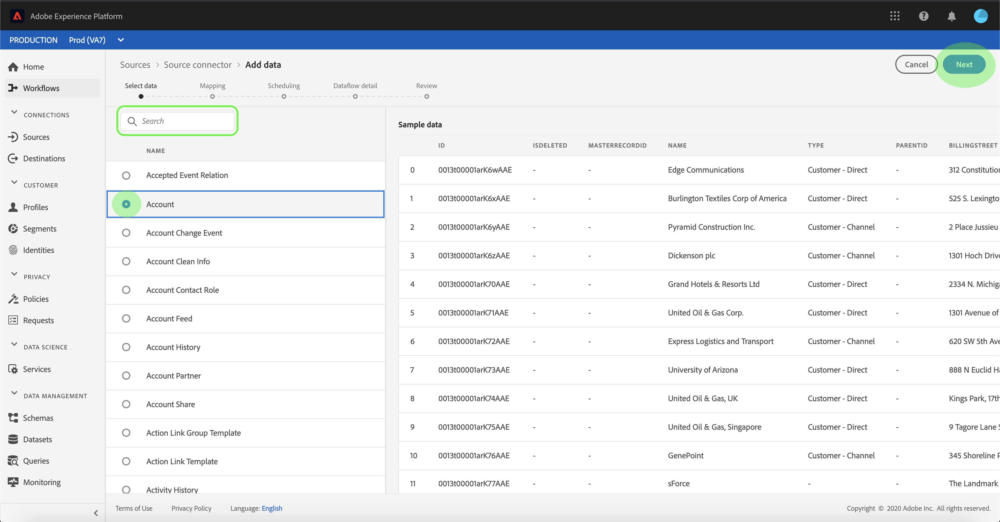
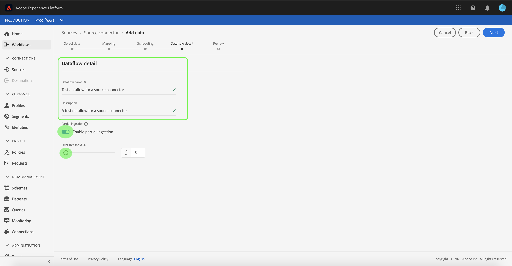
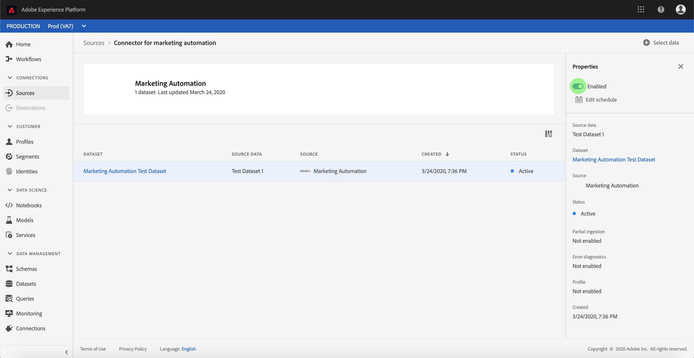

# Konfigurieren eines Datenflusses für eine Verbindung zur Marketing-Automatisierung in der Benutzeroberfläche

Ein Datenfluss ist eine geplante Aufgabe, die Daten aus einer Quelle abruft und in eine [!DNL Platform] Datensatz. In diesem Tutorial werden Schritte zum Konfigurieren eines neuen Datenflusses mit Ihrem Marketing-Automatisierungskonto beschrieben.

## Erste Schritte

Dieses Tutorial setzt ein Grundverständnis der folgenden Komponenten von Adobe Experience Platform voraus:

- [[!DNL Experience Data Model (XDM)] System](../../../../xdm/home.md): Der standardisierte Rahmen, durch den [!DNL Experience Platform] organisiert Kundenerlebnisdaten.
   - [Grundlagen der Schemakomposition](../../../../xdm/schema/composition.md): Machen Sie sich mit den Grundbausteinen von XDM-Schemas sowie den zentralen Konzepten und Best Practices rund um die Erstellung von Schemas vertraut.
   - [Tutorial zum Schema Editor](../../../../xdm/tutorials/create-schema-ui.md): Erfahren Sie, wie Sie benutzerdefinierte Schemas mithilfe der Benutzeroberfläche des Schema-Editors erstellen.
- [[!DNL Real-time Customer Profile]](../../../../profile/home.md): Bietet ein einheitliches Echtzeit-Kundenprofil, das auf aggregierten Daten aus verschiedenen Quellen basiert.

Außerdem müssen Sie für dieses Tutorial bereits ein Konto für die Marketing-Automatisierung erstellt haben. Eine Liste der Tutorials zum Erstellen verschiedener Connectoren für die Marketing-Automatisierung in der Benutzeroberfläche finden Sie im [Übersicht über Quell-Connectoren](../../../home.md).

## Daten auswählen

Nach der Erstellung Ihres Kontos für die Marketing-Automatisierung sollte die *Daten auswählen* angezeigt. Dies bietet eine interaktive Oberfläche, über die Sie Ihre Dateihierarchie untersuchen können.

- Die linke Hälfte der Oberfläche ist ein Verzeichnisbrowser, der die Dateien und Verzeichnisse Ihres Servers anzeigt.
- In der rechten Hälfte der Benutzeroberfläche können Sie eine Vorschau von bis zu 100 Datenzeilen aus einer kompatiblen Datei anzeigen.

Sie können die **[!UICONTROL Suche]** -Option oben auf der Seite, um die Quelldaten, die Sie verwenden möchten, schnell zu identifizieren.

>[!NOTE]
>
>Die Option Suchquellendaten ist für alle tabellarischen Quell-Connectoren mit Ausnahme der Connectoren für Analytics, Classifications, Event Hubs und Kinesis verfügbar.

Nachdem Sie die Quelldaten gefunden haben, wählen Sie den Ordner aus und klicken Sie auf **[!UICONTROL Nächste]**.

## Zuordnen von Datenfeldern zu einem XDM-Schema

Die **[!UICONTROL Zuordnung]** wird ein Schritt angezeigt, der eine interaktive Oberfläche bereitstellt, über die die Quelldaten einem [!DNL Platform] Datensatz.

Wählen Sie einen Datensatz für eingehende Daten aus, die in aufgenommen werden sollen. Sie können entweder einen vorhandenen Datensatz verwenden oder einen neuen Datensatz erstellen.

### Vorhandenen Datensatz verwenden

Um Daten in einen vorhandenen Datensatz zu erfassen, wählen Sie **[!UICONTROL Vorhandenen Datensatz verwenden]** und klicken Sie dann auf das Datensatzsymbol.

Die **[!UICONTROL Datensatz auswählen]** angezeigt. Suchen Sie den gewünschten Datensatz, wählen Sie ihn aus und klicken Sie auf **[!UICONTROL Weiter]**.

### Verwenden eines neuen Datensatzes

Um Daten in einen neuen Datensatz zu erfassen, wählen Sie **[!UICONTROL Neuen Datensatz erstellen]** und geben Sie einen Namen und eine Beschreibung für den Datensatz in die entsprechenden Felder ein.

Sie können ein Schemafeld anhängen, indem Sie einen Schemanamen in die **[!UICONTROL Schema auswählen]** Suchleiste. Sie können auch das Dropdown-Symbol auswählen, um eine Liste der vorhandenen Schemas anzuzeigen. Alternativ können Sie **[!UICONTROL Erweiterte Suche]** , um auf den Bildschirm vorhandener Schemata mit ihren jeweiligen Details zuzugreifen.

Während dieses Schritts können Sie Ihren Datensatz für [!DNL Real-time Customer Profile] und erstellen Sie eine ganzheitliche Ansicht der Attribute und Verhaltensweisen einer Entität. Daten aus allen aktivierten Datensätzen werden in [!DNL Profile] und Änderungen werden angewendet, wenn Sie Ihren Datenfluss speichern.

Umschalten zwischen **[!UICONTROL Profildatensatz]** Schaltfläche zum Aktivieren Ihres Zieldatensatzes für [!DNL Profile].

Die **[!UICONTROL Schema auswählen]** angezeigt. Wählen Sie das Schema aus, das Sie auf den neuen Datensatz anwenden möchten, und klicken Sie dann auf **[!UICONTROL Fertig]**.

Je nach Bedarf können Sie Felder direkt zuordnen oder mithilfe von Datenvorbereitungsfunktionen Quelldaten transformieren, um berechnete oder berechnete Werte abzuleiten. Umfassende Schritte zur Verwendung der Mapper-Oberfläche und der berechneten Felder finden Sie im Abschnitt [Handbuch zur Datenvorbereitung-Benutzeroberfläche](../../../../data-prep/ui/mapping.md).

>[!TIP]
>
>Platform bietet intelligente Empfehlungen für automatisch zugeordnete Felder, die auf dem von Ihnen ausgewählten Zielschema oder Datensatz basieren. Sie können die Zuordnungsregeln manuell an Ihre Anwendungsfälle anpassen.

Auswählen **[!UICONTROL Datenvorschau]** , um die Zuordnungsergebnisse von bis zu 100 Zeilen mit Beispieldaten aus dem ausgewählten Datensatz anzuzeigen.

Während der Vorschau wird die Identitätsspalte als erstes Feld priorisiert, da dies die wichtigsten Informationen ist, die bei der Validierung der Zuordnungsergebnisse erforderlich sind.

Nachdem die Quelldaten zugeordnet wurden, wählen Sie **[!UICONTROL Schließen]**.

## Erfassungsläufe planen

Die **[!UICONTROL Planung]** angezeigt, sodass Sie einen Aufnahmezeitplan konfigurieren können, um die ausgewählten Quelldaten mithilfe der konfigurierten Zuordnungen automatisch zu erfassen. In der folgenden Tabelle sind die verschiedenen konfigurierbaren Felder für die Planung aufgeführt:

| Feld | Beschreibung |
| --- | --- |
| Häufigkeit | Selektive Häufigkeiten beinhalten `Once`, `Minute`, `Hour`, `Day`und `Week`. |
| Intervall | Eine Ganzzahl, die das Intervall für die ausgewählte Häufigkeit festlegt. |
| Startzeit | Ein UTC-Zeitstempel, der angibt, wann die erste Aufnahme erfolgen soll. |
| Aufstockung | Ein boolean -Wert, der bestimmt, welche Daten ursprünglich erfasst werden. Wenn **[!UICONTROL Aufstockung]** aktiviert ist, werden alle aktuellen Dateien im angegebenen Pfad während der ersten geplanten Erfassung erfasst. Wenn **[!UICONTROL Aufstockung]** deaktiviert ist, werden nur die Dateien erfasst, die zwischen der ersten Ausführung der Aufnahme und der Startzeit geladen werden. Dateien, die vor der Startzeit geladen wurden, werden nicht erfasst. |
| Delta-Spalte | Eine Option mit einem gefilterten Satz von Quellschemafeldern vom Typ, Datum oder Uhrzeit. Dieses Feld wird verwendet, um zwischen neuen und vorhandenen Daten zu unterscheiden. Inkrementelle Daten werden basierend auf dem Zeitstempel der ausgewählten Spalte erfasst. |

Datenflüsse dienen dazu, Daten automatisch auf geplanter Basis zu erfassen. Wählen Sie zunächst die Aufnahmefrequenz aus. Legen Sie anschließend das Intervall fest, um den Zeitraum zwischen zwei Durchsatzausführungen festzulegen. Der Wert des Intervalls sollte eine Ganzzahl ungleich null sein und auf größer oder gleich 15 gesetzt werden.

Passen Sie zum Festlegen der Startzeit für die Aufnahme das im Feld Startzeit angezeigte Datum und die Uhrzeit an. Alternativ können Sie das Kalendersymbol auswählen, um den Startzeitwert zu bearbeiten. Die Startzeit muss größer oder gleich der aktuellen UTC-Zeit sein.

Auswählen **[!UICONTROL Inkrementelle Daten laden nach]** , um die Delta-Spalte zuzuweisen. In diesem Feld wird zwischen neuen und vorhandenen Daten unterschieden.

### Einrichten eines Datenflusses zur einmaligen Erfassung

Um die einmalige Erfassung einzurichten, wählen Sie den Dropdown-Pfeil &quot;Häufigkeit&quot;aus und klicken Sie auf **[!UICONTROL Einmal]**.

>[!TIP]
>
>**[!UICONTROL Intervall]** und **[!UICONTROL Aufstockung]** während einer einmaligen Erfassung nicht sichtbar sind.

Nachdem Sie die entsprechenden Werte für den Zeitplan angegeben haben, wählen Sie **[!UICONTROL Nächste]**.

## Datenflussdetails angeben

Die **[!UICONTROL Datenflussdetails]** angezeigt, sodass Sie einen Namen eingeben und eine kurze Beschreibung zu Ihrem neuen Datenfluss eingeben können.

Während dieses Vorgangs können Sie auch **[!UICONTROL Partielle Erfassung]** und **[!UICONTROL Fehlerdiagnose]**. Aktivieren **[!UICONTROL Partielle Erfassung]** bietet die Möglichkeit, Daten mit Fehlern bis zu einem bestimmten Schwellenwert zu erfassen. Einmal **[!UICONTROL Partielle Erfassung]** aktiviert ist, ziehen Sie die **[!UICONTROL Fehlerschwellenwert %]** wählen, um den Fehlerschwellenwert des Batches anzupassen. Alternativ können Sie die Schwelle manuell anpassen, indem Sie das Eingabefeld auswählen. Weitere Informationen finden Sie unter [partielle Batch-Erfassung - Übersicht](../../../../ingestion/batch-ingestion/partial.md).

Geben Sie Werte für den Datenfluss an und wählen Sie **[!UICONTROL Nächste]**.

## Überprüfen Sie Ihren Datenfluss.

Die **[!UICONTROL Überprüfen]** angezeigt, sodass Sie Ihren neuen Datenfluss überprüfen können, bevor er erstellt wird. Details werden in die folgenden Kategorien eingeteilt:

- **[!UICONTROL Verbindung]**: Zeigt den Quelltyp, den relevanten Pfad der ausgewählten Quelldatei und die Anzahl der Spalten in dieser Quelldatei an.
- **[!UICONTROL Datensatz- und Zuordnungsfelder zuweisen]**: Zeigt, in welchen Datensatz die Quelldaten aufgenommen werden, einschließlich des Schemas, dem der Datensatz entspricht.
- **[!UICONTROL Planung]**: Zeigt den aktiven Zeitraum, die Häufigkeit und das Intervall des Aufnahmezeitplans an.

Nachdem Sie Ihren Datenfluss überprüft haben, klicken Sie auf **[!UICONTROL Beenden]** und lassen Sie etwas Zeit für die Erstellung des Datenflusses zu.

## Überwachen Ihres Datenflusses

Nachdem Ihr Datenfluss erstellt wurde, können Sie die erfassten Daten überwachen, um Informationen zu Erfassungsraten, Erfolg und Fehlern zu erhalten. Weitere Informationen zum Überwachen des Datenflusses finden Sie im Tutorial zu [Überwachen von Konten und Datenflüssen in der Benutzeroberfläche](../monitor.md).

## Datenfluss löschen

Sie können Datenflüsse löschen, die nicht mehr erforderlich sind oder falsch erstellt wurden, indem Sie die Variable **[!UICONTROL Löschen]** -Funktion im **[!UICONTROL Datenflüsse]** Arbeitsbereich. Weitere Informationen zum Löschen von Datenflüssen finden Sie im Tutorial zu [Löschen von Datenflüssen in der Benutzeroberfläche](../delete.md).

## Nächste Schritte

In diesem Tutorial haben Sie erfolgreich einen Datenfluss erstellt, um Daten aus einem Marketing-Automatisierungssystem einzubringen und Einblicke in die Überwachung von Datensätzen zu erhalten. Eingehende Daten können jetzt von nachgelagerten Systemen verwendet werden [!DNL Platform] Dienste wie [!DNL Real-time Customer Profile] und [!DNL Data Science Workspace]. Weitere Informationen finden Sie in den folgenden Dokumenten:

- [[!DNL Real-time Customer Profile] – Übersicht](../../../../profile/home.md)
- [[!DNL Data Science Workspace] – Übersicht](../../../../data-science-workspace/home.md)

## Anhang

Die folgenden Abschnitte enthalten zusätzliche Informationen zum Arbeiten mit Quell-Connectoren.

### Datenfluss deaktivieren

Wenn ein Datenfluss erstellt wird, wird er sofort aktiv und erfasst Daten gemäß dem festgelegten Zeitplan. Sie können einen aktiven Datenfluss jederzeit deaktivieren, indem Sie die unten stehenden Anweisungen befolgen.

Innerhalb der **[!UICONTROL Authentifizierung]** den Namen der Verbindung auswählen, die mit dem Datenfluss verknüpft ist, den Sie deaktivieren möchten.

Die **[!UICONTROL Quellaktivität]** angezeigt. Wählen Sie den aktiven Datenfluss aus der Liste aus, um ihn zu öffnen **[!UICONTROL Eigenschaften]** auf der rechten Bildschirmseite, die eine **[!UICONTROL Aktiviert]** Schaltfläche ein/aus. Klicken Sie auf den Umschalter, um den Datenfluss zu deaktivieren. Derselbe Umschalter kann verwendet werden, um einen Datenfluss erneut zu aktivieren, nachdem er deaktiviert wurde.

### Eingehende Daten aktivieren für [!DNL Profile] population

Eingehende Daten aus Ihrem Quell-Connector können zur Anreicherung und zum Ausfüllen Ihrer [!DNL Real-time Customer Profile] Daten. Weitere Informationen zum Ausfüllen der [!DNL Real-time Customer Profile] -Daten, siehe Tutorial zu [Profilpopulation](../profile.md).
