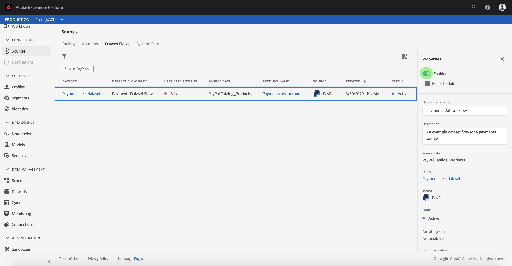

# Configure a dataflow for a payment connector in the UI

A dataflow is a scheduled task that retrieves and ingests data from a source to an Adobe Experience Platform dataset. Dieses Lernprogramm enthält Schritte zum Konfigurieren eines neuen Datenflusses mit Ihrem Zahlungskonto.

## Erste Schritte

Dieses Tutorial setzt ein Grundverständnis der folgenden Komponenten von Adobe Experience Platform voraus:

- [Experience-Datenmodell (XDM)-System](../../../../xdm/home.md)[!DNL Experience Platform]: Das standardisierte Framework, mit dem Kundenerlebnisdaten organisiert.
   - [Grundlagen der Schemakomposition](../../../../xdm/schema/composition.md): Machen Sie sich mit den Grundbausteinen von XDM-Schemas sowie den zentralen Konzepten und Best Practices rund um die Erstellung von Schemas vertraut.
   - [Schema-Editor-Lernprogramm](../../../../xdm/tutorials/create-schema-ui.md): Erfahren Sie, wie Sie mit der Benutzeroberfläche des Schema-Editors benutzerdefinierte Schema erstellen.
- [Echtzeit-Kundenprofil](../../../../profile/home.md): Bietet ein einheitliches Echtzeit-Kundenprofil, das auf aggregierten Daten aus verschiedenen Quellen basiert.

Darüber hinaus erfordert dieses Lernprogramm, dass Sie bereits ein Zahlungskonto erstellt haben. Eine Liste von Übungen zum Erstellen verschiedener Zahlungsschnittstellen in der Benutzeroberfläche finden Sie in der Übersicht über die [Quell-Connectors](../../../home.md).

## Daten auswählen

Nach dem Erstellen Ihres Zahlungskontos wird der Schritt Daten ** auswählen angezeigt und bietet eine interaktive Oberfläche, über die Sie Ihre Dateihierarchie untersuchen können.

- Die linke Hälfte der Oberfläche ist ein Ordnerbrowser, der die Dateien und Ordner Ihres Servers anzeigt.
- The right half of the interface lets you preview up to 100 rows of data from a compatible file.

Select the directory you wish to use, then select **[!UICONTROL Next]**.

## Map data fields to an XDM schema

The *[!UICONTROL Mapping]* step appears, providing an interactive interface to map the source data to a [!DNL Platform] dataset.

Wählen Sie einen Datensatz, in den eingehende Daten aufgenommen werden sollen. Sie können entweder einen vorhandenen Datensatz verwenden oder einen neuen Datensatz erstellen.

### Vorhandenen Datensatz verwenden

Um Daten in einen vorhandenen Datensatz zu erfassen, wählen Sie &quot;Vorhandenen Datensatz **[!UICONTROL verwenden]**&quot;und klicken Sie dann auf das Dataset-Symbol.

The *[!UICONTROL Select dataset]* dialog appears. Suchen Sie den gewünschten Datensatz, wählen Sie ihn aus und klicken Sie dann auf **[!UICONTROL Weiter]**.

### Use a new dataset

To ingest data into a new dataset, select **[!UICONTROL Create new dataset]** and enter a name and description for the dataset in the fields provided.

You can attach a schema field by entering a schema name in the **[!UICONTROL Select schema]** search bar. You can also select the drop down icon to see a list of existing schemas. Alternatively, you can select **[!UICONTROL Advanced search]** to access screen of existing schemas including their respective details.

The *[!UICONTROL Select schema]* dialog appears. Select the schema you wish to apply to the new dataset, then click **[!UICONTROL Done]**.

Based on your needs, you can choose to map fields directly, or use mapper functions to transform source data to derive computed or calculated values. Weitere Informationen zu Funktionen für die Datenzuordnung und -zuordnung finden Sie im Lernprogramm zur [Zuordnung von CSV-Daten zu XDM-Schema-Feldern](../../../../ingestion/tutorials/map-a-csv-file.md).

Nachdem Sie die Quelldaten zugeordnet haben, klicken Sie auf **[!UICONTROL Weiter]**.

## Planen von Erfassungsabläufen

Der Schritt *[!UICONTROL Planung]* wird angezeigt, mit dem Sie einen Erfassungszeitplan konfigurieren können, um die ausgewählten Quelldaten automatisch mit den konfigurierten Zuordnungen zu erfassen. In der folgenden Tabelle sind die verschiedenen konfigurierbaren Felder für die Planung aufgeführt:

| Feld | Beschreibung |
| --- | --- |
| Häufigkeit | Zu den auswählbaren Frequenzen gehören `Once`, `Minute`, `Hour`, `Day`und `Week`. |
| Intervall | Eine Ganzzahl, die das Intervall für die ausgewählte Frequenz festlegt. |
| Beginn | Ein UTC-Zeitstempel, der angibt, wann die erste Erfassung erfolgen soll. |
| Aufstockung | Ein boolescher Wert, der bestimmt, welche Daten ursprünglich erfasst werden. Wenn die *[!UICONTROL Aufstockung]* aktiviert ist, werden alle aktuellen Dateien im angegebenen Pfad während der ersten geplanten Erfassung erfasst. Wenn die *Aufstockung* deaktiviert ist, werden nur die Dateien aufgenommen, die zwischen der ersten Ausführung der Erfassung und der *[!UICONTROL Beginn]* geladen wurden. Dateien, die vor dem *[!UICONTROL Beginn]* geladen wurden, werden nicht erfasst. |
| Delta-Spalte | Eine Option mit gefilterten Quelldatumsfeldern vom Typ, Schema oder Uhrzeit. Dieses Feld wird verwendet, um zwischen neuen und vorhandenen Daten zu unterscheiden. Inkrementelle Daten werden basierend auf dem Zeitstempel der ausgewählten Spalte erfasst. |

Dataflows are designed to automatically ingest data on a scheduled basis. Start by selecting the ingestion frequency. Next, set the interval to designate the period between two flow runs. Der Wert des Intervalls sollte eine Ganzzahl ungleich null sein und auf größer oder gleich 15 gesetzt werden.

Um die Erfassungszeit des Beginns festzulegen, passen Sie das Datum und die Uhrzeit an, die im Feld &quot;Beginn&quot;angezeigt werden. Alternativ können Sie das Kalendersymbol auswählen, um den Zeitwert des Beginns zu bearbeiten. Die Beginn-Zeit muss größer oder gleich der aktuellen UTC-Zeit sein.

Select **[!UICONTROL Load incremental data by]** to assign the delta column. This field provides a distinction between new and existing data.

### Set up a one-time ingestion dataflow

To set up one-time ingestion, select the frequency drop down arrow and select **[!UICONTROL Once]**.

>[!TIP]
>
>**[!UICONTROL Interval]** and **[!UICONTROL Backfill]** are not visible during a one-time ingestion.

Nachdem Sie die entsprechenden Werte für den Zeitplan angegeben haben, wählen Sie **[!UICONTROL Weiter]**.

## Provide dataflow details

Der Schritt *[!UICONTROL Datennachweis]* wird angezeigt, mit dem Sie einen Namen eingeben und eine kurze Beschreibung zu Ihrem neuen Datennachweis geben können.

Während dieses Prozesses können Sie auch die *[!UICONTROL teilweise Erfassung]* und *[!UICONTROL Fehlerdiagnose]* aktivieren. Enabling *[!UICONTROL Partial ingestion]* provides the ability to ingest data containing errors up to a certain threshold. Once *[!UICONTROL Partial ingestion]* is enabled, drag the *[!UICONTROL Error threshold %]* dial to adjust the error threshold of the batch. Alternatively, you can manually adjust the threshold by selecting the input box. For more information, see the [partial batch ingestion overview](../../../../ingestion/batch-ingestion/partial.md).

Geben Sie Werte für den Datenflug ein und wählen Sie **[!UICONTROL Weiter]**.

## Überprüfen Sie Ihren Datenfluss

The *[!UICONTROL Review]* step appears, allowing you to review your new dataflow before it is created. Details are grouped within the following categories:

- *[!UICONTROL Verbindung]*: Zeigt den Quelltyp, den relevanten Pfad der ausgewählten Quelldatei und die Anzahl der Spalten in dieser Quelldatei an.
- *[!UICONTROL Zuweisen von Dataset- und Zuordnungsfeldern]*: Zeigt, in welchen Datensatz die Quelldaten aufgenommen werden, einschließlich des Schemas, das der Datensatz einhält.
- *[!UICONTROL Planung]*: Zeigt den aktiven Zeitraum, die Häufigkeit und das Intervall des Aufnahmeplans an.

Klicken Sie nach Überprüfung des Datenflusses auf **[!UICONTROL Fertig stellen]** und lassen Sie die Erstellung des Datenflusses etwas Zeit.

## Überwachen des Datenflusses

Nachdem Sie Ihren Datenbogen erstellt haben, können Sie die Daten überwachen, die über ihn erfasst werden, um Informationen zu Erfassungsraten, Erfolgen und Fehlern anzuzeigen. Weitere Informationen zur Überwachung des Datenflusses finden Sie im Lernprogramm zu [Überwachungskonten und Datenflüssen in der Benutzeroberfläche](../monitor.md).

## Datenflug löschen

Sie können Datenflüsse löschen, die nicht mehr benötigt werden oder mit der Funktion &quot; *[!UICONTROL Löschen]* &quot;im Arbeitsbereich &quot; *[!UICONTROL Datenflüsse]* &quot;falsch erstellt wurden. Weitere Informationen zum Löschen von Datenflüssen finden Sie im Lernprogramm zum [Löschen von Datenflüssen in der Benutzeroberfläche](../delete.md).

## Nächste Schritte

In diesem Lernprogramm haben Sie erfolgreich einen Datenbogen erstellt, um Daten aus einem Marketingautomatisierungssystem einzubringen und Einblicke in die Überwachung von Datensätzen zu erhalten. Eingehende Daten können nun von nachgelagerten [!DNL Platform] Diensten wie [!DNL Real-time Customer Profile] und [!DNL Data Science Workspace]genutzt werden. Weitere Informationen finden Sie in den folgenden Dokumenten:

- [Übersicht über das Echtzeit-Kundenprofil](../../../../profile/home.md)
- [Data Science Workspace overview](../../../../data-science-workspace/home.md)

## Anhang

Die folgenden Abschnitte enthalten zusätzliche Informationen zum Arbeiten mit Quellschnittstellen.

### Datentaflow deaktivieren

Beim Erstellen eines Datenflusses wird dieser sofort aktiv und erfasst Daten gemäß dem festgelegten Zeitplan. You can disable an active dataflow at any time by following the instructions below.

Within the *[!UICONTROL Dataflows]* screen, select the name of the dataflow you wish to disable.

Die Spalte &quot; *[!UICONTROL Eigenschaften]* &quot;wird auf der rechten Seite des Bildschirms angezeigt. This panel contains an **[!UICONTROL Enabled]** toggle button. Klicken Sie auf den Umschalter, um den Datenflug zu deaktivieren. Derselbe Umschalter kann verwendet werden, um einen Datenflug nach dessen Deaktivierung erneut zu aktivieren.

### Aktivieren von Eingangsdaten für die [!DNL Profile] Bevölkerung

Inbound data from your source connector can be used towards enriching and populating your [!DNL Real-time Customer Profile] data. For more information on populating your [!DNL Real-time Customer Profile] data, see the tutorial on [Profile population](../profile.md).
