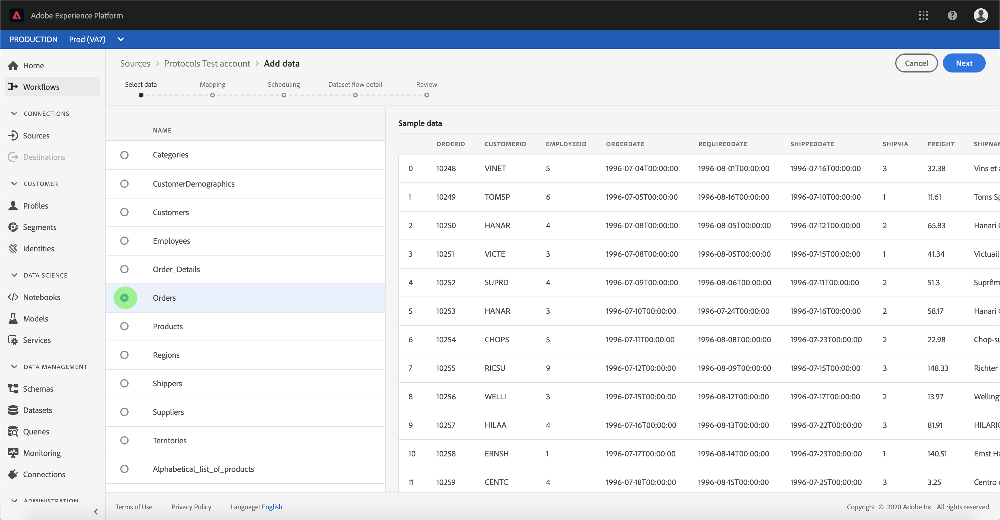
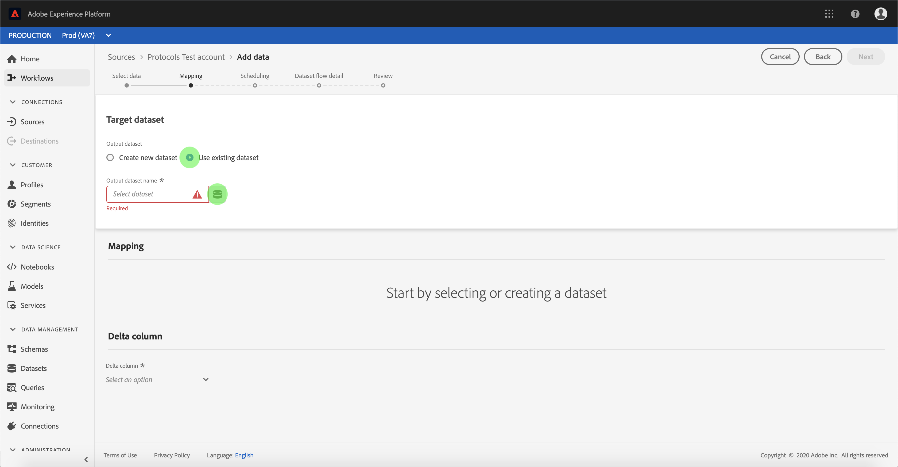

# Konfigurieren eines Datenflusses für einen Protokollanschluss in der Benutzeroberfläche

Ein Datennachweis ist eine geplante Aufgabe, mit der Daten aus einer Quelle abgerufen und in einen Adobe Experience Platform-Datensatz aufgenommen werden. Dieses Lernprogramm enthält Schritte zum Konfigurieren eines neuen Datenflusses mit Ihrem Protokollkonto.

## Erste Schritte

Dieses Tutorial setzt ein Grundverständnis der folgenden Komponenten von Adobe Experience Platform voraus:

- [Experience-Datenmodell (XDM)-System](../../../../xdm/home.md)[!DNL Experience Platform]: Das standardisierte Framework, mit dem Kundenerlebnisdaten organisiert.
   - [Grundlagen der Schemakomposition](../../../../xdm/schema/composition.md): Machen Sie sich mit den Grundbausteinen von XDM-Schemas sowie den zentralen Konzepten und Best Practices rund um die Erstellung von Schemas vertraut.
   - [Schema-Editor-Lernprogramm](../../../../xdm/tutorials/create-schema-ui.md): Erfahren Sie, wie Sie mit der Benutzeroberfläche des Schema-Editors benutzerdefinierte Schema erstellen.
- [Echtzeit-Kundenprofil](../../../../profile/home.md): Bietet ein einheitliches Echtzeit-Kundenprofil, das auf aggregierten Daten aus verschiedenen Quellen basiert.

Darüber hinaus erfordert dieses Lernprogramm, dass Sie bereits ein Protokollkonto erstellt haben. A list of tutorials for creating different protocol connectors in the UI can be found in the [source connectors overview](../../../home.md).

## Daten auswählen

Nachdem Sie Ihr Protokollkonto erstellt haben, wird der Schritt Daten ** auswählen angezeigt und bietet eine interaktive Oberfläche, über die Sie Ihre Dateihierarchie untersuchen können.

- Die linke Hälfte der Oberfläche ist ein Ordnerbrowser, der die Dateien und Ordner Ihres Servers anzeigt.
- In der rechten Hälfte der Oberfläche können Sie bis zu 100 Datenzeilen aus einer kompatiblen Datei Vorschau werden.

Wählen Sie den Ordner aus, den Sie verwenden möchten, und klicken Sie dann auf **[!UICONTROL Weiter]**.

## Zuordnen von Datenfeldern zu einem XDM-Schema

Der Schritt *[!UICONTROL Zuordnung]* wird angezeigt und bietet eine interaktive Schnittstelle, um die Quelldaten einem [!UICONTROL Platform] -Datensatz zuzuordnen.

Wählen Sie einen Datensatz, in den eingehende Daten aufgenommen werden sollen. Sie können entweder einen vorhandenen Datensatz verwenden oder einen neuen Datensatz erstellen.

### Vorhandenen Datensatz verwenden

Um Daten in einen vorhandenen Datensatz zu erfassen, wählen Sie &quot;Vorhandenen Datensatz **[!UICONTROL verwenden]**&quot;und klicken Sie dann auf das Dataset-Symbol.

The *[!UICONTROL Select dataset]* dialog appears. Suchen Sie den gewünschten Datensatz, wählen Sie ihn aus und klicken Sie dann auf **[!UICONTROL Weiter]**.

### Verwenden eines neuen Datensatzes

Um Daten in einen neuen Datensatz zu erfassen, wählen Sie &quot;Neuen Datensatz **[!UICONTROL erstellen]** &quot;und geben Sie einen Namen und eine Beschreibung für den Datensatz in die entsprechenden Felder ein.

You can attach a schema field by entering a schema name in the **[!UICONTROL Select schema]** search bar. You can also select the drop down icon to see a list of existing schemas. Alternatively, you can select **[!UICONTROL Advanced search]** to access screen of existing schemas including their respective details.

The *[!UICONTROL Select schema]* dialog appears. Select the schema you wish to apply to the new dataset, then click **[!UICONTROL Done]**.

Based on your needs, you can choose to map fields directly, or use mapper functions to transform source data to derive computed or calculated values. Weitere Informationen zu Funktionen für die Datenzuordnung und -zuordnung finden Sie im Lernprogramm zur [Zuordnung von CSV-Daten zu XDM-Schema-Feldern](../../../../ingestion/tutorials/map-a-csv-file.md).

Once your source data is mapped, click **[!UICONTROL Next]**.

## Schedule ingestion runs

The *[!UICONTROL Scheduling]* step appears, allowing you to configure an ingestion schedule to automatically ingest the selected source data using the configured mappings. In der folgenden Tabelle sind die verschiedenen konfigurierbaren Felder für die Planung aufgeführt:

| Feld | Beschreibung |
| --- | --- |
| Häufigkeit | Selectable frequencies include `Once`, `Minute`, `Hour`, `Day`, and `Week`. |
| Interval | An integer that sets the interval for the selected frequency. |
| Beginn | A UTC timestamp indicating when the very first ingestion is set to occur. |
| Aufstockung | Ein boolescher Wert, der bestimmt, welche Daten ursprünglich erfasst werden. Wenn die *[!UICONTROL Aufstockung]* aktiviert ist, werden alle aktuellen Dateien im angegebenen Pfad während der ersten geplanten Erfassung erfasst. Wenn die *Aufstockung* deaktiviert ist, werden nur die Dateien aufgenommen, die zwischen der ersten Ausführung der Erfassung und der *[!UICONTROL Beginn]* geladen wurden. Dateien, die vor dem *[!UICONTROL Beginn]* geladen wurden, werden nicht erfasst. |
| Delta-Spalte | Eine Option mit gefilterten Quelldatumsfeldern vom Typ, Schema oder Uhrzeit. Dieses Feld wird verwendet, um zwischen neuen und vorhandenen Daten zu unterscheiden. Inkrementelle Daten werden basierend auf dem Zeitstempel der ausgewählten Spalte erfasst. |

Datenflüsse sind so konzipiert, dass Daten auf planmäßiger Basis automatisch erfasst werden. Beginn durch Auswahl der Aufnahmefrequenz. Legen Sie als Nächstes das Intervall fest, um den Zeitraum zwischen zwei Flussläufen festzulegen. Der Wert des Intervalls sollte eine Ganzzahl ungleich null sein und auf größer oder gleich 15 gesetzt werden.

Um die Erfassungszeit des Beginns festzulegen, passen Sie das Datum und die Uhrzeit an, die im Feld &quot;Beginn&quot;angezeigt werden. Alternativ können Sie das Kalendersymbol auswählen, um den Zeitwert des Beginns zu bearbeiten. Die Beginn-Zeit muss größer oder gleich der aktuellen UTC-Zeit sein.

Wählen Sie Inkrementelle Daten **[!UICONTROL laden, indem]** Sie die Delta-Spalte zuweisen. In diesem Feld wird zwischen neuen und vorhandenen Daten unterschieden.

### Einrichten eines einmaligen Erfassungsdataflow

Um eine einmalige Erfassung einzurichten, wählen Sie den Dropdown-Pfeil für die Häufigkeit aus und klicken Sie auf **[!UICONTROL Einmal]**.

>[!TIP]
>
>**[!UICONTROL Intervall]** und **[!UICONTROL Aufstockung]** sind während einer einmaligen Erfassung nicht sichtbar.

Nachdem Sie die entsprechenden Werte für den Zeitplan angegeben haben, wählen Sie **[!UICONTROL Weiter]**.

## Provide dataflow details

Der Schritt *[!UICONTROL Datennachweis]* wird angezeigt, mit dem Sie einen Namen eingeben und eine kurze Beschreibung zu Ihrem neuen Datennachweis bereitstellen können.

Während dieses Prozesses können Sie auch die *[!UICONTROL teilweise Erfassung]* und *[!UICONTROL Fehlerdiagnose]* aktivieren. Enabling *[!UICONTROL Partial ingestion]* provides the ability to ingest data containing errors up to a certain threshold. Sobald die *[!UICONTROL teilweise Erfassung]* aktiviert ist, ziehen Sie den *[!UICONTROL Fehlerschwellenwert %]* , um den Fehlerschwellenwert des Stapels anzupassen. Alternativ können Sie den Schwellenwert manuell anpassen, indem Sie das Eingabefeld auswählen. Weitere Informationen finden Sie in der Übersicht über die [teilweise Stapelverarbeitung](../../../../ingestion/batch-ingestion/partial.md).

Geben Sie Werte für den Datenflug ein und wählen Sie **[!UICONTROL Weiter]**.

## Überprüfen Sie Ihren Datenfluss

Der *[!UICONTROL Schritt zum Überprüfen]* wird angezeigt, mit dem Sie Ihren neuen Datenpfad überprüfen können, bevor er erstellt wird. Details werden in den folgenden Kategorien gruppiert:

- *[!UICONTROL Verbindung]*: Zeigt den Quelltyp, den relevanten Pfad der ausgewählten Quelldatei und die Anzahl der Spalten in dieser Quelldatei an.
- *[!UICONTROL Zuweisen von Dataset- und Zuordnungsfeldern]*: Zeigt, in welchen Datensatz die Quelldaten aufgenommen werden, einschließlich des Schemas, das der Datensatz einhält.
- *[!UICONTROL Planung]*: Zeigt den aktiven Zeitraum, die Häufigkeit und das Intervall des Aufnahmeplans an.

Klicken Sie nach Überprüfung des Datenflusses auf **[!UICONTROL Fertig stellen]** und lassen Sie die Erstellung des Datenflusses etwas Zeit.

## Monitor your dataflow

Once your dataflow has been created, you can monitor the data that is being ingested through it to see information on ingestion rates, success, and errors. For more information on how to monitor dataflow, see the tutorial on [monitoring accounts and dataflows in the UI](../monitor.md).

## Delete your dataflow

You can delete dataflows that are no longer necessary or were incorrectly created using the *[!UICONTROL Delete]* function available in the *[!UICONTROL Dataflows]* workspace. For more information on how to delete dataflows, see the tutorial on [deleting dataflows in the UI](../delete.md).

## Nächste Schritte

By following this tutorial, you have successfully created a dataflow to bring in data from a marketing automation system and gained insight on monitoring datasets. Eingehende Daten können nun von nachgelagerten [!DNL Platform] Diensten wie [!DNL Real-time Customer Profile] und [!DNL Data Science Workspace]genutzt werden. Weitere Informationen finden Sie in den folgenden Dokumenten:

- [Übersicht über das Echtzeit-Kundenprofil](../../../../profile/home.md)
- [Übersicht über den Data Science Workspace](../../../../data-science-workspace/home.md)

## Anhang

The following sections provide additional information for working with source connectors.

### Disable a dataflow

When a dataflow is created, it immediately becomes active and ingests data according to the schedule it was given. You can disable an active dataflow at any time by following the instructions below.

Within the *[!UICONTROL Dataflows]* screen, select the name of the dataflow you wish to disable.

The *[!UICONTROL Properties]* column appears on the right-hand side of the screen. Dieses Bedienfeld enthält eine **[!UICONTROL Aktivierungsschaltfläche]** . Klicken Sie auf den Umschalter, um den Datenflug zu deaktivieren. The same toggle can be used to re-enable a dataflow after it has been disabled.

### Aktivieren von Eingangsdaten für die [!DNL Profile] Bevölkerung

Eingehende Daten aus Ihrem Quellanschluss können zur Anreicherung und zum Ausfüllen Ihrer [!DNL Real-time Customer Profile] Daten verwendet werden. Weitere Informationen zum Ausfüllen Ihrer [!DNL Real-time Customer Profile] Daten finden Sie im Tutorial zur [Profil-Population](../profile.md).