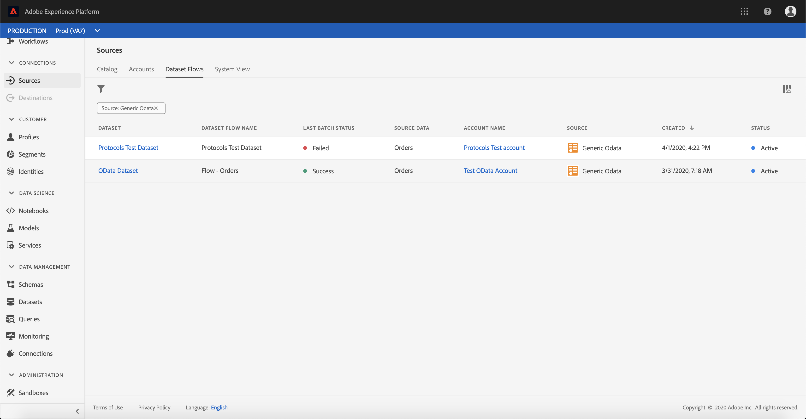

# Konfigurieren eines Datenflusses für einen Protokollanschluss in der Benutzeroberfläche

Ein Datennachweis ist eine geplante Aufgabe, mit der Daten aus einer Adobe Experience Platform abgerufen und in einen Dataset aufgenommen werden. Dieses Lernprogramm enthält Schritte zum Konfigurieren eines neuen Datenflusses mit Ihrem Protokollkonto.

## Erste Schritte

Dieses Tutorial setzt ein Grundverständnis der folgenden Komponenten von Adobe Experience Platform voraus:

- [XDM-System (Experience-Datenmodell)](../../../../xdm/home.md)[!DNL Experience Platform]: Das standardisierte Framework, nach dem Daten zum Kundenerlebnis in organisiert werden.
   - [Grundlagen zum Aufbau von Schemas](../../../../xdm/schema/composition.md): Machen Sie sich mit den Grundbausteinen von XDM-Schemas sowie den zentralen Konzepten und Best Practices rund um die Erstellung von Schemas vertraut.
   - [Schema-Editor-Lernprogramm](../../../../xdm/tutorials/create-schema-ui.md): Erfahren Sie, wie Sie mit der Benutzeroberfläche des Schema-Editors benutzerdefinierte Schema erstellen.
- [Echtzeit-Kundenprofil](../../../../profile/home.md): Ein durch die Zusammenführung von Daten aus verschiedenen Quellen erstelltes Profil, das eine zentrale Echtzeit-Sicht auf Kunden liefert.

Darüber hinaus erfordert dieses Lernprogramm, dass Sie bereits ein Protokollkonto erstellt haben. Eine Liste von Übungen zum Erstellen verschiedener Protokollschnittstellen in der Benutzeroberfläche finden Sie in der Übersicht über die [Quellschnittstellen](../../../home.md).

## Daten auswählen

Nachdem Sie Ihr Protokollkonto erstellt haben, wird der Schritt Daten ** auswählen angezeigt und bietet eine interaktive Oberfläche, über die Sie Ihre Dateihierarchie untersuchen können.

- Die linke Hälfte der Oberfläche ist ein Ordnerbrowser, der die Dateien und Ordner Ihres Servers anzeigt.
- In der rechten Hälfte der Oberfläche können Sie bis zu 100 Datenzeilen aus einer kompatiblen Datei Vorschau werden.

Wählen Sie den Ordner aus, den Sie verwenden möchten, und klicken Sie dann auf **[!UICONTROL Weiter]**.

## Zuordnen von Datenfeldern zu einem XDM-Schema

Der Schritt *[!UICONTROL Zuordnung]* wird angezeigt und bietet eine interaktive Schnittstelle, um die Quelldaten einem [!UICONTROL Platform] -Datensatz zuzuordnen.

Wählen Sie einen Datensatz, in den eingehende Daten aufgenommen werden sollen. Sie können entweder einen vorhandenen Datensatz verwenden oder einen neuen Datensatz erstellen.

### Vorhandenen Datensatz verwenden

Um Daten in einen vorhandenen Datensatz zu erfassen, wählen Sie &quot;Vorhandenen Datensatz **[!UICONTROL verwenden]**&quot;und klicken Sie dann auf das Dataset-Symbol.

The *[!UICONTROL Select dataset]* dialog appears. Suchen Sie den gewünschten Datensatz, wählen Sie ihn aus und klicken Sie dann auf **[!UICONTROL Weiter]**.

### Verwenden eines neuen Datensatzes

Um Daten in einen neuen Datensatz zu erfassen, wählen Sie &quot;Neuen Datensatz **[!UICONTROL erstellen]** &quot;und geben Sie einen Namen und eine Beschreibung für den Datensatz in die entsprechenden Felder ein.

Während dieses Prozesses können Sie auch die *[!UICONTROL teilweise Erfassung]* und *[!UICONTROL Fehlerdiagnose]* aktivieren. Durch Aktivierung der *[!UICONTROL partiellen Erfassung]* können Daten mit Fehlern bis zu einem bestimmten Schwellenwert erfasst werden, den Sie festlegen können. Wenn Sie die Fehlerdiagnose aktivieren, erhalten Sie Details zu allen falschen Daten, die separat in Batches aufgenommen werden. Weitere Informationen finden Sie in der Übersicht über die [teilweise Stapelverarbeitung](../../../../ingestion/batch-ingestion/partial.md).

Klicken Sie abschließend auf das Symbol Schema.

The *[!UICONTROL Select schema]* dialog appears. Wählen Sie das Schema aus, das Sie auf den neuen Datensatz anwenden möchten, und klicken Sie dann auf **[!UICONTROL Fertig]**.

Je nach Bedarf können Sie Felder direkt zuordnen oder mithilfe der Zuordnungsfunktionen Quelldaten transformieren, um berechnete oder berechnete Werte abzuleiten. Weitere Informationen zu Funktionen für die Datenzuordnung und -zuordnung finden Sie im Lernprogramm zur [Zuordnung von CSV-Daten zu XDM-Schema-Feldern](../../../../ingestion/tutorials/map-a-csv-file.md).

Im *[!UICONTROL Anzeigebereich &quot;Zuordnung]* &quot;können Sie auch eine *[!UICONTROL Delta-Spalte]* festlegen. Beim Erstellen des Datenflusses können Sie jedes beliebige Zeitstempelfeld als Grundlage für die Entscheidung festlegen, welche Datensätze in geplanten inkrementellen Aufrufen erfasst werden sollen.

Nachdem Sie die Quelldaten zugeordnet haben, klicken Sie auf **[!UICONTROL Weiter]**.

## Planen von Erfassungsabläufen

Der Schritt *[!UICONTROL Planung]* wird angezeigt, mit dem Sie einen Erfassungszeitplan konfigurieren können, um die ausgewählten Quelldaten automatisch mit den konfigurierten Zuordnungen zu erfassen. In der folgenden Tabelle sind die verschiedenen konfigurierbaren Felder für die Planung aufgeführt:

| Feld | Beschreibung |
| --- | --- |
| Häufigkeit | Zu den auswählbaren Frequenzen gehören Einmal, Minute, Stunde, Tag und Woche. |
| Intervall | Eine Ganzzahl, die das Intervall für die ausgewählte Frequenz festlegt. |
| Beginn | Ein UTC-Zeitstempel, der angibt, wann die erste Erfassung erfolgen soll |
| Aufstockung | Ein boolescher Wert, der bestimmt, welche Daten ursprünglich erfasst werden. Wenn die *Aufstockung* aktiviert ist, werden alle aktuellen Dateien im angegebenen Pfad während der ersten geplanten Erfassung erfasst. Wenn die *Aufstockung* deaktiviert ist, werden nur die Dateien aufgenommen, die zwischen der ersten Ausführung der Erfassung und der *Beginn* geladen wurden. Dateien, die vor dem *Beginn* geladen wurden, werden nicht erfasst. |
| Delta-Spalte | Eine Option mit gefilterten Quelldatumsfeldern vom Typ, Schema oder Uhrzeit. Dieses Feld wird verwendet, um zwischen neuen und vorhandenen Daten zu unterscheiden. Inkrementelle Daten werden basierend auf dem Zeitstempel der ausgewählten Spalte erfasst. |

Datenflüsse sind so konzipiert, dass Daten auf planmäßiger Basis automatisch erfasst werden. Beginn durch Auswahl der Aufnahmefrequenz. Legen Sie als Nächstes das Intervall fest, um den Zeitraum zwischen zwei Flussläufen festzulegen. Der Wert des Intervalls sollte eine Ganzzahl ungleich null sein und auf größer oder gleich 15 gesetzt werden.

Um die Erfassungszeit des Beginns festzulegen, passen Sie das Datum und die Uhrzeit an, die im Feld &quot;Beginn&quot;angezeigt werden. Alternativ können Sie das Kalendersymbol auswählen, um den Zeitwert des Beginns zu bearbeiten. Die Beginn-Zeit muss größer oder gleich der aktuellen UTC-Zeit sein.

Wählen Sie Inkrementelle Daten **[!UICONTROL laden, indem]** Sie die Delta-Spalte zuweisen. In diesem Feld wird zwischen neuen und vorhandenen Daten unterschieden.

### Einrichten eines einmaligen Erfassungsdataflow

Um eine einmalige Erfassung einzurichten, wählen Sie den Dropdown-Pfeil für die Häufigkeit aus und klicken Sie auf **[!UICONTROL Einmal]**.

>[!TIP] **[!UICONTROL Intervall]** und **[!UICONTROL Aufstockung]** sind während einer einmaligen Erfassung nicht sichtbar.

Nachdem Sie die entsprechenden Werte für den Zeitplan angegeben haben, wählen Sie **[!UICONTROL Weiter]**.

## Benennen des Datenflusses

Der Schritt *[!UICONTROL Datennachweis]* wird angezeigt, in dem Sie einen Namen und eine optionale Beschreibung für den Datennachweis angeben müssen. Klicken Sie auf **[!UICONTROL Weiter]**, wenn Sie fertig sind.

## Überprüfen Sie Ihren Datenfluss

Der *[!UICONTROL Schritt zum Überprüfen]* wird angezeigt, mit dem Sie Ihren neuen Datenpfad überprüfen können, bevor er erstellt wird. Details werden in den folgenden Kategorien gruppiert:

- *[!UICONTROL Verbindung]*: Zeigt den Quelltyp, den relevanten Pfad der ausgewählten Quelldatei und die Anzahl der Spalten in dieser Quelldatei an.
- *[!UICONTROL Zuweisen von Dataset- und Zuordnungsfeldern]*: Zeigt, in welchen Datensatz die Quelldaten aufgenommen werden, einschließlich des Schemas, das der Datensatz einhält.
- *[!UICONTROL Planung]*: Zeigt den aktiven Zeitraum, die Häufigkeit und das Intervall des Aufnahmeplans an.

Klicken Sie nach Überprüfung des Datenflusses auf **[!UICONTROL Fertig stellen]** und lassen Sie die Erstellung des Datenflusses etwas Zeit.

## Überwachen und Löschen Ihres Datenflusses

Nachdem der Datenfluss erstellt wurde, können Sie die Daten überwachen, die über ihn aufgenommen werden. Weitere Informationen zum Überwachen und Löschen Ihres Datenflusses finden Sie im Lernprogramm zum [Überwachen und Löschen von Datenflüssen](../monitor.md).

## Nächste Schritte

In diesem Lernprogramm haben Sie erfolgreich einen Datenbogen erstellt, um Daten aus einem Marketingautomatisierungssystem einzubringen und Einblicke in die Überwachung von Datensätzen zu erhalten. Eingehende Daten können nun von nachgelagerten [!DNL Platform] Diensten wie [!DNL Real-time Customer Profile] und [!DNL Data Science Workspace]genutzt werden. Weitere Informationen finden Sie in den folgenden Dokumenten:

- [Übersicht über das Echtzeit-Kundenprofil](../../../../profile/home.md)
- [Übersicht über den Data Science Workspace](../../../../data-science-workspace/home.md)

## Anhang

Die folgenden Abschnitte enthalten zusätzliche Informationen zum Arbeiten mit Quellschnittstellen.

### Datentaflow deaktivieren

Beim Erstellen eines Datenflusses wird dieser sofort aktiv und erfasst Daten gemäß dem festgelegten Zeitplan. Sie können einen aktiven Datenfeed jederzeit deaktivieren, indem Sie die unten stehenden Anweisungen befolgen.

Wählen Sie im Bildschirm &quot; *[!UICONTROL Datenflüsse]* &quot;den Namen des Datenflusses aus, den Sie deaktivieren möchten.

Die Spalte &quot; *[!UICONTROL Eigenschaften]* &quot;wird auf der rechten Seite des Bildschirms angezeigt. Dieses Bedienfeld enthält eine **[!UICONTROL Aktivierungsschaltfläche]** . Klicken Sie auf den Umschalter, um den Datenflug zu deaktivieren. Derselbe Umschalter kann verwendet werden, um einen Datenflug nach dessen Deaktivierung erneut zu aktivieren.

### Aktivieren von Eingangsdaten für die [!DNL Profile] Bevölkerung

Eingehende Daten aus Ihrem Quellanschluss können zur Anreicherung und zum Ausfüllen Ihrer [!DNL Real-time Customer Profile] Daten verwendet werden. Weitere Informationen zum Ausfüllen Ihrer [!DNL Real-time Customer Profile] Daten finden Sie im Tutorial zur [Profil-Population](../profile.md).