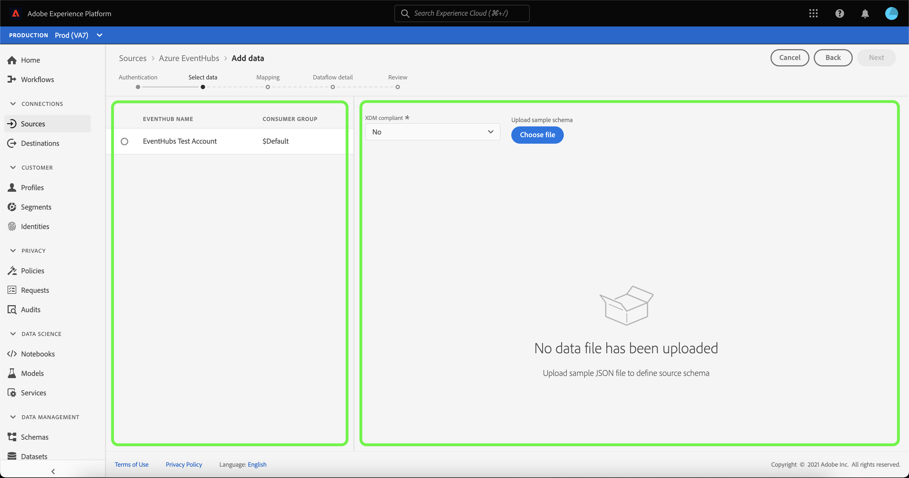
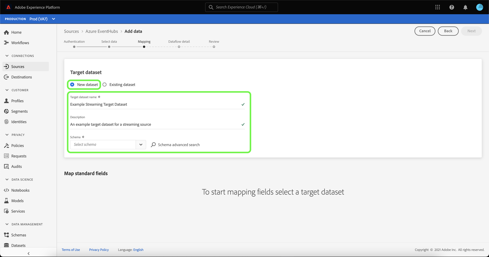

# Erstellen eines Streaming-Datenflusses für eine Cloud-Speicherquelle in der Benutzeroberfläche

Ein Datenfluss ist eine geplante Aufgabe, die Daten aus einer Quelle abruft und in einen Adobe Experience Platform-Datensatz aufnimmt. In diesem Tutorial werden Schritte zum Erstellen eines Streaming-Datenflusses für eine Cloud-Speicherquelle in der Benutzeroberfläche beschrieben.

Bevor Sie dieses Tutorial durchführen, müssen Sie zunächst eine gültige und authentifizierte Verbindung zwischen Ihrem Cloud-Speicher-Konto und Platform herstellen. Wenn Sie noch keine authentifizierte Verbindung haben, finden Sie in einem der folgenden Tutorials Informationen zum Authentifizieren Ihrer Streaming-Cloud-Speicher-Konten:

- [[!DNL Amazon Kinesis]](../../../ui/create/cloud-storage/kinesis.md)
- [[!DNL Azure Event Hubs]](../../../ui/create/cloud-storage/eventhub.md)
- [[!DNL Google PubSub]](../../../ui/create/cloud-storage/google-pubsub.md)

## Erste Schritte

Dieses Tutorial setzt ein Grundverständnis der folgenden Komponenten von Adobe Experience Platform voraus:

- [Datenflüsse](../../../../../dataflows/home.md): Datenflüsse sind eine Darstellung von Datenvorgängen, die Daten über Platform verschieben. Datenflüsse werden für verschiedene Dienste konfiguriert, von Quellen bis [!DNL Identity Service], um [!DNL Profile]und [!DNL Destinations].
- [Datenvorbereitung](../../../../../data-prep/home.md): Die Datenvorbereitung ermöglicht es Dateningenieuren, Daten dem Experience-Datenmodell (XDM) zuzuordnen, zu verwandeln und zu validieren. Die Datenvorbereitung wird als „Map“-Schritt in den Datenaufnahmemechanismen, einschließlich des Workflows der CSV-Aufnahme, angezeigt.
- [[!DNL Experience Data Model (XDM)] System](../../../../../xdm/home.md): Das standardisierte Framework, mit dem [!DNL Experience Platform] Kundenerlebnisdaten organisiert.
   - [Grundlagen der Schemakomposition](../../../../../xdm/schema/composition.md): Machen Sie sich mit den grundlegenden Bausteinen von XDM-Schemas vertraut, einschließlich der wichtigsten Prinzipien und Best Practices bei der Schemaerstellung.
   - [Tutorial zum Schema-Editor](../../../../../xdm/tutorials/create-schema-ui.md): Erfahren Sie, wie Sie benutzerdefinierte Schemas mithilfe der Benutzeroberfläche des Schema-Editors erstellen können.
- [[!DNL Real-time Customer Profile]](../../../../../profile/home.md): Bietet ein einheitliches Echtzeit-Kundenprofil, das auf aggregierten Daten aus verschiedenen Quellen basiert.

## Hinzufügen von Daten

Nach der Erstellung Ihres Authentifizierungskontos für Ihren Streaming-Cloud-Speicher muss die **[!UICONTROL Daten auswählen]** angezeigt. Dort können Sie über eine Benutzeroberfläche auswählen, welchen Datenstrom Sie in Platform bringen.

- Der linke Teil der Benutzeroberfläche ist ein Browser, mit dem Sie die verfügbaren Datenströme in Ihrem Konto anzeigen können.
- Im rechten Bereich der Benutzeroberfläche können Sie eine Vorschau von bis zu 100 Zeilen mit Daten aus einer JSON-Datei anzeigen.

Wählen Sie den gewünschten Datenstrom aus und klicken Sie auf **[!UICONTROL Datei auswählen]** , um ein Beispielschema hochzuladen.

>[!TIP]
>
>Wenn Ihre Daten XDM-konform sind, können Sie das Hochladen eines Beispielschemas überspringen und **[!UICONTROL Nächste]** um fortzufahren.

Nach dem Hochladen des Schemas wird die Vorschau-Oberfläche aktualisiert, um eine Vorschau des hochgeladenen Schemas anzuzeigen. Über die Vorschau-Oberfläche können Sie den Inhalt und die Struktur einer Datei überprüfen. Sie können auch die [!UICONTROL Suchfeld] -Dienstprogramm zum Zugreifen auf bestimmte Elemente aus Ihrem Schema.

Wenn Sie fertig sind, klicken Sie auf die Schaltfläche **[!UICONTROL Weiter]**.

## Zuordnung

Die **[!UICONTROL Zuordnung]** -Schritt angezeigt und stellt eine Schnittstelle zum Zuordnen der Quelldaten zu einem Platform-Datensatz bereit.

Wählen Sie einen Datensatz für eingehende Daten aus, die in aufgenommen werden sollen. Sie können entweder einen vorhandenen Datensatz verwenden oder einen neuen erstellen.

### Neuer Datensatz

Um Daten in einen neuen Datensatz zu erfassen, wählen Sie **[!UICONTROL Neuer Datensatz]** und geben Sie einen Namen und eine Beschreibung für den Datensatz in die entsprechenden Felder ein. Um ein Schema hinzuzufügen, können Sie einen vorhandenen Schemanamen in die **[!UICONTROL Schema auswählen]** Dialogfeld. Alternativ können Sie **[!UICONTROL Erweiterte Schemasuche]** , um nach einem geeigneten Schema zu suchen.

Die [!UICONTROL Schema auswählen] -Fenster angezeigt, sodass Sie eine Liste der verfügbaren Schemas zur Auswahl haben. Wählen Sie ein Schema aus der Liste aus, um die rechte Leiste zu aktualisieren und Details für das ausgewählte Schema anzuzeigen, einschließlich Informationen darüber, ob das Schema aktiviert ist [!DNL Profile].

Nachdem Sie das Schema identifiziert und ausgewählt haben, das Sie verwenden möchten, wählen Sie **[!UICONTROL Fertig]**.

Die [!UICONTROL Target-Datensatz] -Seite aktualisiert, wobei Ihr ausgewähltes Schema als Teil des Datensatzes angezeigt wird. Während dieses Schritts können Sie Ihren Datensatz für [!DNL Profile] und erstellen Sie eine ganzheitliche Ansicht der Attribute und Verhaltensweisen einer Entität. Daten aus allen aktivierten Datensätzen werden in [!DNL Profile] und Änderungen werden angewendet, wenn Sie Ihren Datenfluss speichern.

Umschalten zwischen **[!UICONTROL Profildatensatz]** Schaltfläche zum Aktivieren Ihres Zieldatensatzes für [!DNL Profile].

### Vorhandener Datensatz

Um Daten in einen vorhandenen Datensatz zu erfassen, wählen Sie **[!UICONTROL Vorhandener Datensatz]** und wählen Sie dann das Datensatzsymbol aus.

Die **[!UICONTROL Datensatz auswählen]** angezeigt. Sie erhalten eine Liste der verfügbaren Datensätze, aus denen Sie auswählen können. Wählen Sie einen Datensatz aus der Liste aus, um die rechte Leiste zu aktualisieren und Details anzuzeigen, die für den ausgewählten Datensatz spezifisch sind, einschließlich Informationen darüber, ob der Datensatz für [!DNL Profile].

Nachdem Sie den zu verwendenden Datensatz identifiziert und ausgewählt haben, wählen Sie **[!UICONTROL Fertig]**.

Nachdem Sie den Datensatz ausgewählt haben, wählen Sie die [!DNL Profile] Umschalten auf die Aktivierung Ihres Datensatzes für [!DNL Profile].

### Standardfelder zuordnen

Wenn Ihr Datensatz und Ihr Schema erstellt sind, wird die Variable **[!UICONTROL Standardfelder zuordnen]** -Benutzeroberfläche angezeigt, über die Sie die Zuordnungsfelder für Ihre Daten manuell konfigurieren können.

>[!TIP]
>
>Platform bietet intelligente Empfehlungen für automatisch zugeordnete Felder, die auf dem von Ihnen ausgewählten Zielschema oder Datensatz basieren. Sie können die Zuordnungsregeln manuell an Ihre Anwendungsfälle anpassen.

Je nach Bedarf können Sie wahlweise Felder direkt zuordnen oder mithilfe von Datenvorbereitungsfunktionen Quelldaten transformieren, um berechnete oder anderweitig ermittelte Werte abzuleiten. Umfassende Schritte zur Verwendung der Mapper-Oberfläche und der berechneten Felder finden Sie im Abschnitt [Handbuch zur Datenvorbereitung-Benutzeroberfläche](../../../../../data-prep/ui/mapping.md).

Nachdem die Quelldaten zugeordnet wurden, wählen Sie **[!UICONTROL Nächste]**.

## Datenflussdetails

Die **[!UICONTROL Datenflussdetails]** angezeigt, sodass Sie einen Namen eingeben und eine kurze Beschreibung zu Ihrem neuen Datenfluss eingeben können.

Geben Sie Werte für den Datenfluss an und wählen Sie **[!UICONTROL Nächste]**.

### Überprüfung

Der Schritt **[!UICONTROL Überprüfung]** wird angezeigt, sodass Sie Ihren neuen Datenfluss überprüfen können, bevor er hergestellt wird. Die Details lassen sich wie folgt kategorisieren:

- **[!UICONTROL Verbindung]**: Zeigt Ihren Kontonamen, den Quelltyp und andere spezifische Informationen zur verwendeten Streaming-Cloud-Speicherquelle an.
- **[!UICONTROL Datensatz- und Zuordnungsfelder zuweisen]**: Zeigt den Zieldatensatz und das Schema an, die Sie für Ihren Datenfluss verwenden.

Nachdem Sie Ihren Datenfluss überprüft haben, wählen Sie **[!UICONTROL Beenden]** und lassen Sie etwas Zeit für die Erstellung des Datenflusses zu.

## Überwachen und Löschen Ihres Datenflusses

Nachdem Ihr Streaming-Cloud-Speicher-Datenfluss erstellt wurde, können Sie die Daten überwachen, die über ihn erfasst werden. Weitere Informationen zum Überwachen und Löschen von Streaming-Datenflüssen finden Sie im Tutorial zu [Überwachen von Streaming-Datenflüssen](../../monitor-streaming.md).

## Nächste Schritte

In diesem Tutorial haben Sie erfolgreich einen Datenfluss erstellt, um Daten von einer Cloud-Speicherquelle zu streamen. Eingehende Daten können jetzt von nachgelagerten Platform-Services wie [!DNL Real-time Customer Profile] und [!DNL Data Science Workspace] verwendet werden. Weiterführende Informationen finden Sie in folgenden Dokumenten:

- [[!DNL Real-time Customer Profile] – Übersicht](../../../../../profile/home.md)
- [[!DNL Data Science Workspace] – Übersicht](../../../../../data-science-workspace/home.md)