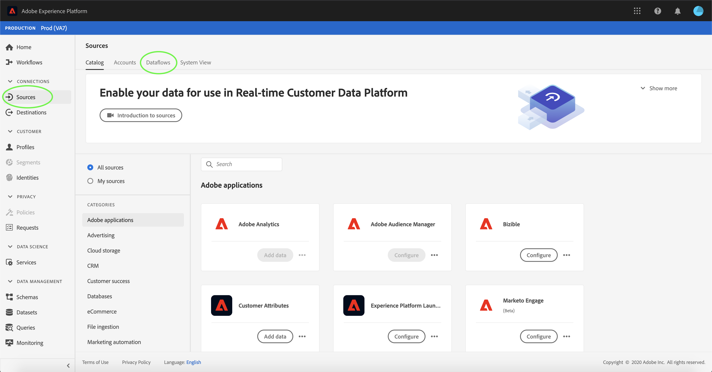

# Löschen von Datenflüssen in der Benutzeroberfläche

Die [!UICONTROL Quellen] Mit Workspace können Sie vorhandene Batch- und Streaming-Datenflüsse löschen, die Fehler enthalten oder mittlerweile veraltet sind.

In diesem Tutorial werden Schritte zum Löschen von Datenflüssen mithilfe des [!UICONTROL Quellen] Arbeitsbereich.

## Erste Schritte

Dieses Tutorial setzt ein Grundverständnis der folgenden Komponenten von Adobe Experience Platform voraus:

- [Quellen](../../home.md): [!DNL Experience Platform] ermöglicht die Aufnahme von Daten aus verschiedenen Quellen und bietet Ihnen die Möglichkeit, die eingehenden Daten mithilfe von [!DNL Platform]-Services zu strukturieren, zu kennzeichnen und anzureichern.
- [Sandboxes](../../../sandboxes/home.md): [!DNL Experience Platform] bietet virtuelle Sandboxes, die eine einzelne [!DNL Platform]-Instanz in separate virtuelle Umgebungen unterteilen, damit Sie Programme für digitale Erlebnisse entwickeln und weiterentwickeln können.

## Löschen von Datenflüssen

Im [Experience Platform-Benutzeroberfläche](https://platform.adobe.com)auswählen **[!UICONTROL Quellen]** über die linke Navigationsleiste auf [!UICONTROL Quellen] Arbeitsbereich und wählen Sie dann **[!UICONTROL Datenflüsse]** aus der oberen Kopfzeile.

Die **[!UICONTROL Datenflüsse]** angezeigt. Auf dieser Seite finden Sie eine Liste sichtbarer Datenflüsse, einschließlich Informationen zu ihrem Zieldatensatz, ihrer Quelle, dem Kontonamen und dem Erstellungsdatum.

Wählen Sie das Filtersymbol () oben links, um das Sortierungsfenster zu öffnen.

Das Sortierungsfenster bietet eine Liste aller Quellen. Sie können mehrere Quellen aus der Liste auswählen, um auf eine gefilterte Auswahl von Datenflüssen zuzugreifen, die mit den ausgewählten Quellen verknüpft sind.

Wählen Sie die Quelle aus, mit der Sie arbeiten möchten, um eine Liste der vorhandenen Datenflüsse anzuzeigen. Nachdem Sie den zu löschenden Datenfluss identifiziert haben, wählen Sie die Auslassungszeichen (`...`) neben dem Namen des Datenflusses.

Es wird ein Dropdown-Menü angezeigt, in dem Sie Optionen zum Bearbeiten des Zeitplans Ihres Datenflusses, zum Deaktivieren des Datenflusses oder zum vollständigen Löschen haben.

Auswählen **[!UICONTROL Löschen]** , um den Datenfluss zu löschen.

Ein letztes Bestätigungsdialogfeld wird angezeigt. Auswählen **[!UICONTROL Löschen]** , um den Prozess abzuschließen.

Nach einigen Augenblicken wird unten im Bildschirm ein Bestätigungsfeld angezeigt, um eine erfolgreiche Löschung zu bestätigen.

## Nächste Schritte

In diesem Tutorial haben Sie erfolgreich die [!UICONTROL Quellen] Arbeitsbereich zum Löschen eines vorhandenen Datenflusses.

Siehe Tutorial zu [Löschen von Datenflüssen mithilfe der Flow Service-API](../../tutorials/api/delete-dataflows.md) für Schritte zur programmatischen Ausführung dieser Vorgänge mithilfe von API-Aufrufen.
