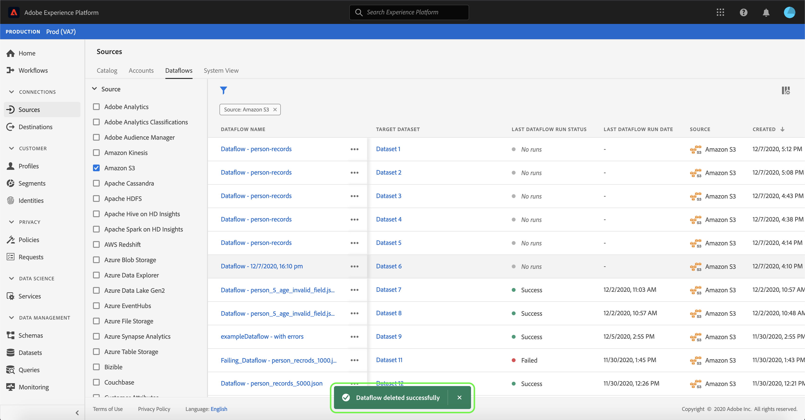

# Löschen von Datenflüssen in der Benutzeroberfläche

Im Arbeitsbereich &quot; [!UICONTROL Quellen] &quot;können Sie vorhandene Batch- und Streaming-Datenflüsse löschen, die Fehler enthalten oder veraltet sind.

Dieses Lernprogramm enthält Schritte zum Löschen von Datenflüssen mithilfe des [!UICONTROL Sources] -Arbeitsbereichs.

## Erste Schritte

Dieses Tutorial setzt ein Grundverständnis der folgenden Komponenten von Adobe Experience Platform voraus:

- [Quellen](../../home.md): [!DNL Experience Platform] ermöglicht die Erfassung von Daten aus verschiedenen Quellen und bietet Ihnen gleichzeitig die Möglichkeit, eingehende Daten mithilfe von [!DNL Platform] Diensten zu strukturieren, zu beschriften und zu verbessern.
- [Sandboxen](../../../sandboxes/home.md): [!DNL Experience Platform] bietet virtuelle Sandboxes, die eine einzelne [!DNL Platform] Instanz in separate virtuelle Umgebung unterteilen, um Anwendungen für digitale Erlebnisse zu entwickeln und weiterzuentwickeln.

## Datenflüsse löschen

Wählen Sie in der Benutzeroberfläche [der](https://platform.adobe.com)Experience Platform im linken Navigationsbereich die Option &quot; **[!UICONTROL Quellen]** &quot;, um auf den Arbeitsbereich &quot; [!UICONTROL Quellen] &quot;zuzugreifen, und wählen Sie dann in der oberen Kopfzeile die Option &quot; **[!UICONTROL Datenflüsse]** &quot;aus.

Die Seite &quot; **[!UICONTROL Datenflüsse]** &quot;wird angezeigt. Auf dieser Seite finden Sie eine Liste anzeigbarer Datenflüsse, einschließlich Informationen zu ihrem Dataset, ihrer Quelle, ihrem Kontonamen und dem Erstellungsdatum.

Wählen Sie oben links das Filtersymbol () aus, um das Sortierfeld zu starten.

Der Sortierbereich bietet eine Liste aller Quellen. Sie können mehr als eine Quelle aus der Liste auswählen, um auf eine gefilterte Auswahl von Datenflüssen zuzugreifen, die mit den ausgewählten Quellen verknüpft sind.

Wählen Sie die Quelle aus, mit der Sie arbeiten möchten, um eine Liste der vorhandenen Datenflüsse anzuzeigen. Nachdem Sie den zu löschenden Datendurchlauf identifiziert haben, wählen Sie die Ellipsen (`...`) neben dem Datenfeldnamen aus.

Es wird ein Dropdown-Menü angezeigt, mit Optionen zum Bearbeiten des Zeitplans des Datenflusses, zum Deaktivieren des Datenflusses oder zum vollständigen Löschen.

Wählen Sie &quot; **[!UICONTROL Löschen]** &quot;, um den Datendurchlauf zu löschen.

Ein Dialogfeld zur letzten Bestätigung wird angezeigt. Wählen Sie **[!UICONTROL Löschen]** , um den Vorgang abzuschließen.

Nach einigen Augenblicken wird unten im Bildschirm ein Bestätigungsfeld angezeigt, um einen erfolgreichen Löschvorgang zu bestätigen.

## Nächste Schritte

In diesem Lernprogramm haben Sie den Arbeitsbereich &quot; [!UICONTROL Quellen] &quot;erfolgreich zum Löschen eines vorhandenen Datenflusses verwendet.

Anweisungen zum programmatischen Ausführen dieser Vorgänge mithilfe von API-Aufrufen finden Sie im Lernprogramm zum [Löschen von Datenflüssen mithilfe der Flow Service API](../../tutorials/api/delete-dataflows.md) .