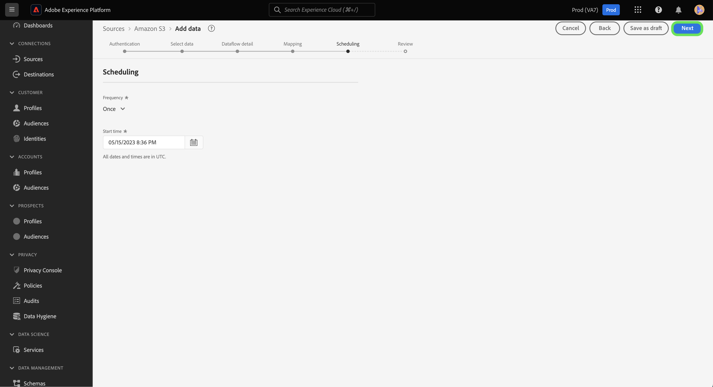

# Entwurf von Datenflüssen in der Benutzeroberfläche

Speichern Sie den Fortschritt des nicht abgeschlossenen Datenerfassungs-Workflows, indem Sie Ihren Datenfluss auf den Status Entwurf festlegen. Sie können Ihre entworfenen Datenflüsse zu einem späteren Zeitpunkt wieder aufnehmen und abschließen.

In diesem Dokument wird beschrieben, wie Sie Ihre Datenflüsse speichern, wenn Sie den Quellarbeitsbereich in der Adobe Experience Platform-Benutzeroberfläche verwenden.

## Erste Schritte

Dieses Dokument setzt ein Verständnis der folgenden Komponenten von Adobe Experience Platform voraus:

* [Quellen](../../home.md): Experience Platform ermöglicht die Aufnahme von Daten aus verschiedenen Quellen und bietet Ihnen die Möglichkeit, die eingehenden Daten mithilfe von Experience Platform-Services zu strukturieren, zu kennzeichnen und anzureichern.

## Speichern eines Datenflusses als Entwurf

Sie können den Fortschritt der Erstellung eines Datenflusses jederzeit anhalten, nachdem Sie die Daten ausgewählt haben, die Sie in Experience Platform importieren möchten.

Wenn Sie beispielsweise Ihren Fortschritt während des Schritts „Datenflussdetails“ speichern möchten, wählen Sie **[!UICONTROL Als Entwurf speichern]**.

Nachdem Sie Ihren Entwurf gespeichert haben, werden Sie zur Seite Ihres Kontos weitergeleitet, wo Sie eine Liste Ihrer vorhandenen Datenflüsse sehen können, einschließlich Ihrer Entwürfe.

>[!TIP]
>
>Entworfene Datenflüsse werden nicht aktiviert und ihr Status wird auf `draft` gesetzt.

Um mit dem Entwurf fortzufahren, wählen Sie die Auslassungszeichen (`...`) neben dem Namen Ihres Datenflusses und dann **[!UICONTROL Datenfluss aktualisieren]** aus.

>[!NOTE]
>
>Wenn Ihr Entwurf Planungsinformationen enthält, erhalten Sie im Dropdown-Fenster auch die Option **[!UICONTROL Zeitplan bearbeiten]**.

### Zugreifen auf Entwürfe aus dem Quellkatalog

Sie können über den Datenflusskatalog auch auf Ihre Datenflussentwürfe zugreifen. Wählen **[!UICONTROL Datenflüsse]** in der oberen Kopfzeile aus, um auf den Datenflusskatalog zuzugreifen. Suchen Sie von hier aus Ihren Entwurf aus der Liste der vorhandenen Datenflüsse in Ihrer Organisation, wählen Sie die Auslassungspunkte (`...`) neben dem Namen aus und wählen Sie dann **[!UICONTROL Datenfluss aktualisieren]**.

## Veröffentlichen des Datenflussentwurfs

Sie kehren zum Schritt [!UICONTROL Daten hinzufügen] des Quell-Workflows zurück, in dem Sie das Format Ihrer Daten erneut bestätigen und mit dem Fortschritt in Ihrem Datenfluss fortfahren können.

Nachdem Sie die Formatierung, das Trennzeichen und den Komprimierungstyp Ihrer Daten bestätigt haben, wählen Sie **[!UICONTROL Weiter]** aus, um fortzufahren.

Bestätigen Sie anschließend Ihre Datenflussdetails. Verwenden Sie die Oberfläche Datenflussdetails , um Konfigurationen mit dem Namen, der Beschreibung, der partiellen Aufnahme, den Einstellungen für die Fehlerdiagnose und die Warnhinweiseinstellungen Ihres Datenflusses zu aktualisieren.

Nachdem Sie Ihre Konfigurationen abgeschlossen haben, klicken Sie auf **[!UICONTROL Weiter]**, um fortzufahren.

Der Schritt [!UICONTROL Zuordnung] wird angezeigt. In diesem Schritt können Sie die Zuordnungskonfigurationen Ihres Datenflusses neu konfigurieren. Eine umfassende Anleitung zu den für die Zuordnung verwendeten Datenvorbereitungsfunktionen finden Sie im [Handbuch zur Datenvorbereitungs-Benutzeroberfläche](../../../data-prep/ui/mapping.md).

Nachdem Sie die Neukonfiguration der Zuordnung abgeschlossen haben, klicken Sie auf **[!UICONTROL Weiter]**, um fortzufahren.

Verwenden Sie den [!UICONTROL Zeitplan], um einen Aufnahmezeitplan für Ihren Datenfluss festzulegen. Sie können Ihre Aufnahmefrequenz auf `once`, `minute`, `hour`, `day` oder `week` festlegen. Wenn Sie fertig sind, wählen Sie **[!UICONTROL Weiter]** aus, um fortzufahren.

Überprüfen Sie abschließend die Details Ihres Datenflusses und wählen Sie dann **[!UICONTROL Beenden]** aus, um Ihren Entwurf zu veröffentlichen.

Nachdem Sie einen Entwurf gespeichert und veröffentlicht haben, ist der Datenfluss aktiviert und Sie können ihn nicht mehr als Entwurf zurücksetzen.

## Nächste Schritte

In diesem Tutorial haben Sie gelernt, wie Sie Ihren Fortschritt speichern und einen Datenfluss als Entwurf festlegen. Weitere Informationen zu Quellen finden Sie unter [Quellen - Übersicht](../../home.md).
