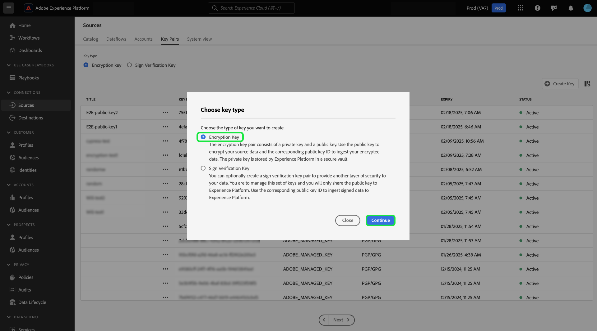

# Aufnehmen verschlüsselter Daten in der Quellen-Benutzeroberfläche

Sie können verschlüsselte Datendateien und Ordner mithilfe von Cloud-Speicher-Batch-Quellen in Adobe Experience Platform aufnehmen. Mithilfe der verschlüsselten Datenaufnahme können Sie asymmetrische Verschlüsselungsmechanismen nutzen, um Batch-Daten sicher in Experience Platform zu übertragen. Die unterstützten asymmetrischen Verschlüsselungsmechanismen sind PGP und GPG.

Lesen Sie dieses Handbuch, um zu erfahren, wie Sie verschlüsselte Daten mit Cloud-Speicher-Batch-Quellen über die Benutzeroberfläche aufnehmen können.

## Erste Schritte

Bevor Sie mit diesem Tutorial fortfahren, lesen Sie die folgenden Dokumente, um die folgenden Funktionen und Konzepte von Experience Platform besser zu verstehen.

* [Quellen](../../home.md): Verwenden Sie Quellen in Experience Platform, um Daten aus einer Adobe-Anwendung oder einer Datenquelle eines Drittanbieters aufzunehmen.
* [Datenflüsse](../../../dataflows/home.md): Datenflüsse sind Darstellungen von Datenvorgängen, die Daten über Experience Platform verschieben. Sie können den Arbeitsbereich „Quellen“ verwenden, um Datenflüsse zu erstellen, die Daten aus einer bestimmten Quelle in Experience Platform aufnehmen.
* [Sandboxes](../../../sandboxes/home.md): Verwenden Sie Sandboxes in Experience Platform, um virtuelle Partitionen zwischen Ihren Experience Platform-Instanzen zu erstellen und Umgebungen für Entwicklung oder Produktion zu erstellen.

### Allgemeine Übersicht

* Erstellen Sie ein Verschlüsselungsschlüsselpaar mit dem Arbeitsbereich Quellen in der Experience Platform-Benutzeroberfläche.
   * Optional können Sie auch Ihr eigenes Sign-Verifizierungs-Schlüsselpaar erstellen, um eine zusätzliche Sicherheitsebene für Ihre verschlüsselten Daten bereitzustellen.
* Verschlüsseln Sie Ihre Daten mit dem öffentlichen Schlüssel aus Ihrem Verschlüsselungsschlüsselpaar.
* Legen Sie Ihre verschlüsselten Daten in Ihrem Cloud-Speicher ab. In diesem Schritt müssen Sie auch sicherstellen, dass Sie über eine Beispieldatei Ihrer Daten in Ihrem Cloud-Speicher verfügen, die als Referenz verwendet werden kann, um Ihre Quelldaten einem Experience-Datenmodell (XDM)-Schema zuzuordnen.
* Verwenden Sie Ihre Cloud-Speicher-Batch-Quelle und starten Sie den Datenaufnahmeprozess im Quellarbeitsbereich in der Experience Platform-Benutzeroberfläche.
* Geben Sie während des Erstellungsprozesses der Quellverbindung die Schlüssel-ID an, die dem öffentlichen Schlüssel entspricht, den Sie zum Verschlüsseln Ihrer Daten verwendet haben.
   * Wenn Sie außerdem den Mechanismus für das Zeichenverifizierungsschlüsselpaar verwendet haben, müssen Sie auch die ID des Zeichenverifizierungsschlüssels angeben, die Ihren verschlüsselten Daten entspricht.
* Fahren Sie mit den Schritten zur Erstellung des Datenflusses fort.

## Erstellen eines Schlüsselpaars für Verschlüsselung {#create-an-encryption-key-pair}

>[!CONTEXTUALHELP]
>id="platform_sources_encrypted_encryptionKeyId"
>title="Verschlüsselungsschlüssel-ID"
>abstract="Geben Sie die Verschlüsselungsschlüssel-ID an, die Ihrem Verschlüsselungsschlüssel entspricht, der zum Verschlüsseln Ihrer Quelldaten verwendet wurde."

>[!BEGINSHADEBOX]

**Was ist ein Verschlüsselungsschlüsselpaar?**

Ein Verschlüsselungsschlüsselpaar ist ein asymmetrischer Verschlüsselungsmechanismus, der aus einem öffentlichen und einem privaten Schlüssel besteht. Der öffentliche Schlüssel wird zur Verschlüsselung von Daten und der private Schlüssel zur Entschlüsselung dieser Daten verwendet.

Sie können Ihr Verschlüsselungsschlüsselpaar über die Experience Platform-Benutzeroberfläche erstellen. Nach der Generierung erhalten Sie einen öffentlichen Schlüssel und eine entsprechende Schlüssel-ID. Verwenden Sie den öffentlichen Schlüssel zum Verschlüsseln Ihrer Daten und dann die Schlüssel-ID, um Ihre Identität zu bestätigen, wenn Sie dabei sind, Ihre verschlüsselten Daten aufzunehmen. Der private Schlüssel wird automatisch an Experience Platform gesendet, wo er in einem sicheren Tresor gespeichert wird. Er wird erst verwendet, wenn die Daten entschlüsselungsbereit sind.

>[!ENDSHADEBOX]

Navigieren Sie in der Experience Platform-Benutzeroberfläche zum Arbeitsbereich „Quellen“ und wählen Sie [!UICONTROL Schlüsselpaare] in der oberen Kopfzeile aus.

Sie gelangen zu einer Seite, auf der eine Liste der in Ihrer Organisation vorhandenen Verschlüsselungsschlüsselpaare angezeigt wird. Auf dieser Seite finden Sie Informationen zu Titel, ID, Typ, Verschlüsselungsalgorithmus, Ablauf und Status eines bestimmten Schlüssels. Um ein neues Schlüsselpaar zu erstellen, wählen Sie **[!UICONTROL Schlüssel erstellen]** aus.

Wählen Sie als Nächstes den Schlüsseltyp aus, den Sie erstellen möchten. Um einen Verschlüsselungsschlüssel zu erstellen, wählen Sie **[!UICONTROL Verschlüsselungsschlüssel]** und dann **[!UICONTROL Weiter]** aus.

Geben Sie einen Titel und eine Passphrase für Ihren Verschlüsselungsschlüssel an. Die Passphrase ist eine zusätzliche Schutzschicht für Ihre Verschlüsselungsschlüssel. Bei der Erstellung speichert Experience Platform die Passphrase in einem anderen sicheren Tresor als den öffentlichen Schlüssel. Sie müssen eine nicht leere Zeichenfolge als Passphrase angeben. Klicken Sie abschließend auf **[!UICONTROL Erstellen]**.

Bei erfolgreicher Ausführung wird ein neues Fenster angezeigt, in dem Ihr neuer Verschlüsselungsschlüssel angezeigt wird, einschließlich Titel, öffentlichem Schlüssel und Schlüssel-ID. Verschlüsseln Sie Ihre Daten mit dem öffentlichen Schlüsselwert. Sie verwenden die Schlüssel-ID in einem späteren Schritt, um Ihre Identität bei der Aufnahme Ihrer verschlüsselten Daten während des Erstellungsprozesses des Datenflusses nachzuweisen.

Um Informationen zu einem vorhandenen Verschlüsselungsschlüssel anzuzeigen, klicken Sie auf die Auslassungszeichen (`...`) neben dem Schlüsseltitel. Wählen Sie **[!UICONTROL Schlüsseldetails]** aus, um den öffentlichen Schlüssel und die Schlüssel-ID anzuzeigen. Wenn Sie den Verschlüsselungsschlüssel löschen möchten, wählen Sie alternativ **[!UICONTROL Löschen]** aus.

### Erstellen eines Signaturverifizierungsschlüssels {#create-a-sign-verification-key}

>[!CONTEXTUALHELP]
>id="platform_sources_encrypted_signVerificationKeyId"
>title="Signaturverifizierungsschlüssel-ID"
>abstract="Geben Sie die Signaturverifizierungsschlüssel-ID an, die Ihren signierten, verschlüsselten Quelldaten entspricht."

>[!BEGINSHADEBOX]

**Was ist ein Sign Verification Key?**

Ein Zeichenüberprüfungsschlüssel ist ein weiterer Verschlüsselungsmechanismus, der einen privaten Schlüssel und einen öffentlichen Schlüssel umfasst. In diesem Fall können Sie Ihr Sign-Verifizierungs-Schlüsselpaar erstellen und den privaten Schlüssel zum Signieren verwenden und eine zusätzliche Verschlüsselungsschicht für Ihre Daten bereitstellen. Sie geben dann den entsprechenden öffentlichen Schlüssel für Experience Platform frei. Während der Aufnahme verwendet Experience Platform den öffentlichen Schlüssel, um die Signatur zu überprüfen, die mit Ihrem privaten Schlüssel verknüpft ist.

>[!ENDSHADEBOX]

Um einen Signaturüberprüfungsschlüssel zu erstellen, wählen Sie **[!UICONTROL Signaturüberprüfungsschlüssel]** aus dem Auswahlfenster für den Schlüsseltyp aus und klicken Sie dann auf **[!UICONTROL Weiter]**.

Geben Sie als Nächstes einen Titel und einen [!DNL Base64] PGP-Schlüssel als öffentlichen Schlüssel an und wählen Sie dann **[!UICONTROL Erstellen]**.

Bei erfolgreicher Ausführung wird ein neues Fenster angezeigt, in dem der neue Schlüssel zur Zeichenüberprüfung einschließlich Titel und Schlüssel-ID angezeigt wird.

## Aufnehmen verschlüsselter Daten {#ingest-encrypted-data}

>[!CONTEXTUALHELP]
>id="platform_sources_encrypted_isFileEncrypted"
>title="Ist die Datei verschlüsselt?"
>abstract="Aktivieren Sie diese Option, wenn Sie eine bereits verschlüsselte Datei aufnehmen."

>[!CONTEXTUALHELP]
>id="platform_sources_encrypted_sampleFile"
>title="Auswählen einer Beispieldatei"
>abstract="Sie müssen bei der Aufnahme verschlüsselter Daten eine Beispieldatei aufnehmen, um eine Zuordnung zu erstellen."

Sie können verschlüsselte Daten mithilfe der folgenden Cloud-Speicher-Batch-Quellen aufnehmen:

* [[!DNL Amazon S3]](../ui/create/cloud-storage/s3.md)
* [[!DNL Azure Blob]](../ui/create/cloud-storage/blob.md)
* [[!DNL Azure Data Lake Storage Gen2]](../ui/create/cloud-storage/adls-gen2.md)
* [[!DNL Azure File Storage]](../ui/create/cloud-storage/azure-file-storage.md)
* [[!DNL Data Landing Zone]](../ui/create/cloud-storage/data-landing-zone.md)
* [[!DNL FTP]](../ui/create/cloud-storage/ftp.md)
* [[!DNL Google Cloud Storage]](../ui/create/cloud-storage/google-cloud-storage.md)
* [[!DNL HDFS]](../ui/create/cloud-storage/hdfs.md)
* [[!DNL Oracle Object Storage]](../ui/create/cloud-storage/oracle-object-storage.md)
* [[!DNL SFTP]](../ui/create/cloud-storage/sftp.md)

Authentifizierung mit der von Ihnen ausgewählten Cloud-Speicherquelle. Wählen Sie während des Datenauswahlschritts des Workflows die aufzunehmende verschlüsselte Datei bzw. den aufzunehmenden Ordner aus und aktivieren Sie dann den Umschalter **[!UICONTROL Ist die Datei verschlüsselt]**.

Wählen Sie anschließend eine Beispieldatei aus Ihren Quelldaten aus. Da Ihre Daten verschlüsselt sind, benötigt Experience Platform eine Beispieldatei, um ein XDM-Schema zu erstellen, das Ihren Quelldaten zugeordnet werden kann.

Nachdem Sie die Beispieldatei ausgewählt haben, konfigurieren Sie die Einstellungen Ihrer Daten, z. B. das entsprechende Datenformat, das Trennzeichen und den Komprimierungstyp. Warten Sie einige Zeit, bis die Vorschauoberfläche vollständig gerendert ist, und wählen Sie dann **[!UICONTROL Speichern]** aus.

Wählen Sie hier im Dropdown-Menü den Titel des öffentlichen Schlüssels der öffentlichen Schlüssel-ID aus, der dem öffentlichen Schlüssel entspricht, den Sie zum Verschlüsseln Ihrer Daten verwendet haben.

Wenn Sie auch das Schlüsselpaar für die Zeichenverifizierung verwendet haben, um eine zusätzliche Verschlüsselungsschicht bereitzustellen, aktivieren Sie den Umschalter für den Zeichenverifizierungsschlüssel und wählen Sie dann in ähnlicher Weise im Dropdown-Menü die Zeichenverifizierungsschlüssel-ID aus, die dem Schlüssel entspricht, den Sie zum Verschlüsseln Ihrer Daten verwendet haben.

Wenn Sie fertig sind, wählen **[!UICONTROL Weiter]**.

Führen Sie die verbleibenden Schritte im Quellen-Workflow aus, um die Erstellung Ihres Datenflusses abzuschließen.

* [Angeben von Datenfluss- und Datensatzdetails](../ui/dataflow/batch/cloud-storage.md#provide-dataflow-details)
* [Zuordnen Ihrer Quelldaten zu einem XDM-Schema](../ui/dataflow/batch/cloud-storage.md#map-data-fields-to-an-xdm-schema)
* [Konfigurieren eines Aufnahmezeitplans für Ihren Datenfluss](../ui/dataflow/batch/cloud-storage.md#schedule-ingestion-runs)
* [Überprüfen des Datenflusses](../ui/dataflow/batch/cloud-storage.md#review-your-dataflow)

Sie können [Aktualisierungen an Ihrem Datenfluss vornehmen](../ui/update-dataflows.md) nachdem er erfolgreich erstellt wurde.

## Nächste Schritte

Durch Lesen dieses Dokuments können Sie jetzt verschlüsselte Daten aus Ihrer Cloud-Speicher-Batch-Quelle in Experience Platform aufnehmen. Informationen zum Aufnehmen verschlüsselter Daten mithilfe der APIs finden Sie im Handbuch unter [Aufnehmen verschlüsselter Daten mithilfe der  [!DNL Flow Service] -API](../api/encrypt-data.md). Allgemeine Informationen zu Quellen in Experience Platform finden Sie unter [Quellen - Übersicht](../../home.md).
