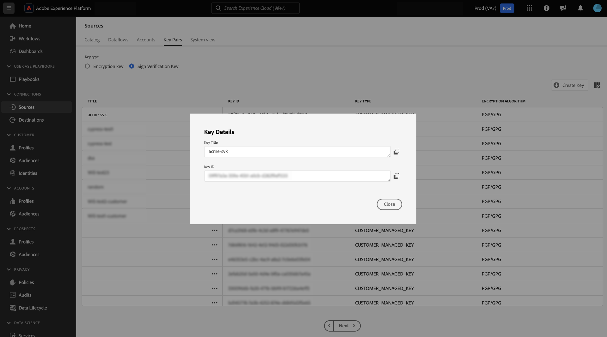
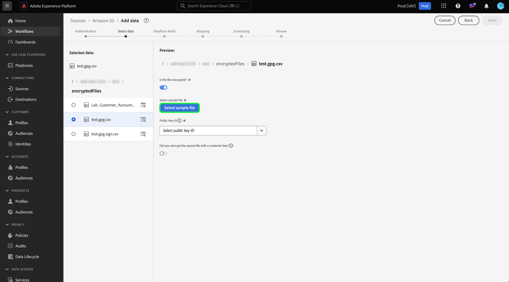

# Verschlüsselte Daten in der Quell-Benutzeroberfläche erfassen

>[!AVAILABILITY]
>
>Die Unterstützung für die verschlüsselte Datenerfassung in der Quell-Benutzeroberfläche befindet sich in der Beta-Phase und steht Ihrem Unternehmen möglicherweise nicht zur Verfügung. Die Funktion und die Dokumentation können sich ändern.

Sie können verschlüsselte Datendateien und Ordner mit Cloud-Speicher-Batch-Quellen in Adobe Experience Platform erfassen. Mithilfe der verschlüsselten Datenaufnahme können Sie asymmetrische Verschlüsselungsmechanismen nutzen, um Batch-Daten sicher in Experience Platform zu übertragen. Die unterstützten asymmetrischen Verschlüsselungsmechanismen sind PGP und GPG.

In diesem Handbuch erfahren Sie, wie Sie verschlüsselte Daten mit Cloud-Speicher-Batch-Quellen über die Benutzeroberfläche erfassen können.

## Erste Schritte

Bevor Sie mit diesem Tutorial fortfahren, lesen Sie bitte die folgenden Dokumente, um die folgenden Experience Platform-Funktionen und -Konzepte besser zu verstehen.

* [Quellen](../../home.md): Verwenden Sie Experience Platform-Quellen, um Daten aus einer Adobe-Anwendung oder einer Datenquelle von Drittanbietern zu erfassen.
* [Datenflüsse](../../../dataflows/home.md): Datenflüsse sind Darstellungen von Datenaufträgen, die Daten über Experience Platform verschieben. Sie können den Arbeitsbereich &quot;Quellen&quot;verwenden, um Datenflüsse zu erstellen, die Daten von einer bestimmten Quelle zu Experience Platform erfassen.
* [Sandboxes](../../../sandboxes/home.md): Verwenden Sie Sandboxes in Experience Platform, um virtuelle Partitionen zwischen Ihren Experience Platform-Instanzen zu erstellen und Umgebungen für die Entwicklung oder Produktion zu erstellen.

### Allgemeine Übersicht

* Erstellen Sie ein Verschlüsselungsschlüsselpaar mithilfe des Arbeitsbereichs &quot;Quellen&quot;in der Experience Platform-Benutzeroberfläche.
   * Optional können Sie auch Ihr eigenes Schlüsselpaar für die Signierüberprüfung erstellen, um eine zusätzliche Sicherheitsschicht für Ihre verschlüsselten Daten bereitzustellen.
* Verwenden Sie den öffentlichen Schlüssel aus Ihrem Verschlüsselungsschlüsselpaar, um Ihre Daten zu verschlüsseln.
* Platzieren Sie Ihre verschlüsselten Daten in Ihrem Cloud-Speicher. In diesem Schritt müssen Sie außerdem sicherstellen, dass Sie über eine Beispieldatei Ihrer Daten in Ihrem Cloud-Speicher verfügen, die als Referenz für die Zuordnung Ihrer Quelldaten zu einem Experience-Datenmodell (XDM)-Schema verwendet werden kann.
* Verwenden Sie Ihre Batch-Quelle für den Cloud-Speicher und starten Sie den Datenerfassungsprozess im Arbeitsbereich &quot;Quellen&quot;der Experience Platform-Benutzeroberfläche.
* Geben Sie bei der Erstellung der Quellverbindung die Schlüssel-ID an, die dem öffentlichen Schlüssel entspricht, den Sie zum Verschlüsseln Ihrer Daten verwendet haben.
   * Wenn Sie auch den Schlüssel-Paar-Mechanismus für die Signierüberprüfung verwendet haben, müssen Sie auch die Schlüssel-ID für die Signierüberprüfung angeben, die Ihren verschlüsselten Daten entspricht.
* Fahren Sie mit den Schritten zur Erstellung des Datenflusses fort.

## Erstellen eines Schlüsselpaars für Verschlüsselung {#create-an-encryption-key-pair}

>[!CONTEXTUALHELP]
>id="platform_sources_encrypted_encryptionKeyId"
>title="Verschlüsselungsschlüssel-ID"
>abstract="Geben Sie die Verschlüsselungsschlüssel-ID an, die Ihrem Verschlüsselungsschlüssel entspricht, der zum Verschlüsseln Ihrer Quelldaten verwendet wurde."

>[!BEGINSHADEBOX]

**Was ist ein Verschlüsselungsschlüsselpaar?**

Ein Verschlüsselungsschlüsselpaar ist ein asymmetrischer Kryptographiemechanismus, der aus einem öffentlichen Schlüssel und einem privaten Schlüssel besteht. Der öffentliche Schlüssel wird zum Verschlüsseln von Daten verwendet und der private Schlüssel wird dann zum Entschlüsseln dieser Daten verwendet.

Sie können Ihr Verschlüsselungsschlüsselpaar über die Experience Platform-Benutzeroberfläche erstellen. Nach der Erstellung erhalten Sie einen öffentlichen Schlüssel und eine entsprechende Schlüssel-ID. Verwenden Sie den öffentlichen Schlüssel zum Verschlüsseln Ihrer Daten und verwenden Sie dann die Schlüssel-ID, um Ihre Identität zu bestätigen, wenn Sie Ihre verschlüsselten Daten erfassen. Der private Schlüssel wird automatisch zum Experience Platform weitergeleitet, wo er in einem sicheren Vault gespeichert ist und erst verwendet wird, wenn Ihre Daten zur Entschlüsselung bereit sind.

>[!ENDSHADEBOX]

Navigieren Sie in der Platform-Benutzeroberfläche zum Arbeitsbereich &quot;Quellen&quot;und wählen Sie dann in der oberen Kopfzeile [!UICONTROL Schlüsselpaare] aus.

Sie gelangen zu einer Seite, auf der eine Liste der in Ihrem Unternehmen vorhandenen Verschlüsselungsschlüsselpaare angezeigt wird. Auf dieser Seite finden Sie Informationen zu Titel, Kennung, Typ, Verschlüsselungsalgorithmus, Ablauf und Status eines bestimmten Schlüssels. Um ein neues Schlüsselpaar zu erstellen, wählen Sie **[!UICONTROL Schlüssel erstellen]** aus.

Wählen Sie als Nächstes den Schlüsseltyp aus, den Sie erstellen möchten. Um einen Verschlüsselungsschlüssel zu erstellen, wählen Sie **[!UICONTROL Verschlüsselungsschlüssel]** und dann **[!UICONTROL Fortfahren]** aus.

Geben Sie einen Titel und eine Passphrase für Ihren Verschlüsselungsschlüssel an. Die Passphrase ist eine zusätzliche Schutzschicht für Ihre Verschlüsselungsschlüssel. Bei der Erstellung speichert Experience Platform die Passphrase in einem anderen sicheren Tresor als den öffentlichen Schlüssel. Sie müssen eine nicht leere Zeichenfolge als Passphrase angeben. Klicken Sie abschließend auf **[!UICONTROL Erstellen]**.

Bei erfolgreichem Abschluss wird ein neues Fenster mit dem neuen Verschlüsselungsschlüssel einschließlich Titel, öffentlicher Schlüssel und Schlüssel-ID angezeigt. Verwenden Sie den Wert des öffentlichen Schlüssels, um Ihre Daten zu verschlüsseln. Sie verwenden die Schlüssel-ID in einem späteren Schritt, um Ihre Identität bei der Erfassung Ihrer verschlüsselten Daten während des Erstellungsprozesses des Datenflusses zu beweisen.

Um Informationen zu einem vorhandenen Verschlüsselungsschlüssel anzuzeigen, wählen Sie die Auslassungszeichen (`...`) neben dem Schlüsseltitel aus. Wählen Sie **[!UICONTROL Schlüsseldetails]** aus, um den öffentlichen Schlüssel und die Schlüssel-ID anzuzeigen. Wenn Sie den Verschlüsselungsschlüssel löschen möchten, wählen Sie alternativ **[!UICONTROL Löschen]**.

### Erstellen eines Signaturverifizierungsschlüssels {#create-a-sign-verification-key}

>[!CONTEXTUALHELP]
>id="platform_sources_encrypted_signVerificationKeyId"
>title="Signaturverifizierungsschlüssel-ID"
>abstract="Geben Sie die Signaturverifizierungsschlüssel-ID an, die Ihren signierten, verschlüsselten Quelldaten entspricht."

>[!BEGINSHADEBOX]

**Was ist ein Verifizierungsschlüssel für Zeichen?**

Ein Signaturüberprüfungsschlüssel ist ein weiterer Verschlüsselungsmechanismus, der einen privaten Schlüssel und einen öffentlichen Schlüssel umfasst. In diesem Fall können Sie Ihr Schlüsselpaar für die Signierüberprüfung erstellen und mithilfe des privaten Schlüssels signieren und eine zusätzliche Verschlüsselungsschicht für Ihre Daten bereitstellen. Sie geben dann den entsprechenden öffentlichen Schlüssel für Experience Platform frei. Während der Erfassung verwendet Experience Platform den öffentlichen Schlüssel, um die mit Ihrem privaten Schlüssel verknüpfte Signatur zu überprüfen.

>[!ENDSHADEBOX]

Um einen Überprüfungsschlüssel für die Signaturüberprüfung zu erstellen, wählen Sie im Fenster zur Schlüsseltyp-Auswahl die Option **[!UICONTROL Überprüfungsschlüssel für Signaturen]** und klicken Sie dann auf **[!UICONTROL Weiter]**.

Geben Sie als Nächstes einen Titel und einen [!DNL Base64]-kodierten PGP-Schlüssel als öffentlichen Schlüssel ein und wählen Sie dann **[!UICONTROL Erstellen]** aus.

Bei erfolgreichem Abschluss wird ein neues Fenster mit Ihrem neuen Signierüberprüfungsschlüssel, einschließlich Titel und Schlüssel-ID, angezeigt.

## Aufnehmen verschlüsselter Daten {#ingest-encrypted-data}

>[!CONTEXTUALHELP]
>id="platform_sources_encrypted_isFileEncrypted"
>title="Ist die Datei verschlüsselt?"
>abstract="Aktivieren Sie diese Option, wenn Sie eine bereits verschlüsselte Datei aufnehmen."

>[!CONTEXTUALHELP]
>id="platform_sources_encrypted_sampleFile"
>title="Auswählen einer Beispieldatei"
>abstract="Sie müssen bei der Aufnahme verschlüsselter Daten eine Beispieldatei aufnehmen, um eine Zuordnung zu erstellen."

Sie können verschlüsselte Daten mit den folgenden Cloud-Speicher-Batch-Quellen erfassen:

* [[!DNL Amazon S3]](../ui/create/cloud-storage/s3.md)
* [[!DNL Azure Blob]](../ui/create/cloud-storage/blob.md)
* [[!DNL Azure Data Lake Storage Gen2]](../ui/create/cloud-storage/adls-gen2.md)
* [[!DNL Azure File Storage]](../ui/create/cloud-storage/azure-file-storage.md)
* [[!DNL Data Landing Zone]](../ui/create/cloud-storage/data-landing-zone.md)
* [[!DNL FTP]](../ui/create/cloud-storage/ftp.md)
* [[!DNL Google Cloud Storage]](../ui/create/cloud-storage/google-cloud-storage.md)
* [[!DNL HDFS]](../ui/create/cloud-storage/hdfs.md)
* [[!DNL Oracle Object Storage]](../ui/create/cloud-storage/oracle-object-storage.md)
* [[!DNL SFTP]](../ui/create/cloud-storage/sftp.md)

Authentifizieren Sie sich mit der gewünschten Cloud-Speicherquelle. Wählen Sie im Schritt zur Datenauswahl des Workflows die zu erfassende verschlüsselte Datei oder den Ordner aus und aktivieren Sie dann den Umschalter **[!UICONTROL Ist die Datei verschlüsselt]** .

Wählen Sie anschließend eine Beispieldatei aus den Quelldaten aus. Da Ihre Daten verschlüsselt sind, benötigt Experience Platform eine Beispieldatei, um ein XDM-Schema zu erstellen, das Ihren Quelldaten zugeordnet werden kann.

Nachdem Sie die Beispieldatei ausgewählt haben, konfigurieren Sie die Einstellungen Ihrer Daten, z. B. das entsprechende Datenformat, Trennzeichen und den Komprimierungstyp. Warten Sie etwas, bis die Vorschaufunktion vollständig gerendert ist, und wählen Sie dann **[!UICONTROL Speichern]** aus.

Wählen Sie hier im Dropdown-Menü den öffentlichen Schlüsseltitel der öffentlichen Schlüsselkennung aus, der dem öffentlichen Schlüssel entspricht, den Sie zum Verschlüsseln Ihrer Daten verwendet haben.

Wenn Sie auch das Schlüsselpaar für die Zeichenüberprüfung verwendet haben, um eine zusätzliche Verschlüsselungsschicht bereitzustellen, aktivieren Sie den Umschalter für die Signaturüberprüfung und wählen Sie auf ähnliche Weise über das Dropdown-Menü die ID des Signaturüberprüfungsschlüssels aus, die dem Schlüssel entspricht, den Sie zum Verschlüsseln Ihrer Daten verwendet haben.

Wählen Sie nach Abschluss **[!UICONTROL Weiter]** aus.

Führen Sie die verbleibenden Schritte im Ursprungs-Workflow aus, um die Erstellung des Datenflusses abzuschließen.

* [Datenfluss und Datensatzdetails angeben](../ui/dataflow/batch/cloud-storage.md#provide-dataflow-details)
* [Quelldaten einem XDM-Schema zuordnen](../ui/dataflow/batch/cloud-storage.md#map-data-fields-to-an-xdm-schema)
* [Konfigurieren eines Aufnahmezeitplans für Ihren Datenfluss](../ui/dataflow/batch/cloud-storage.md#schedule-ingestion-runs)
* [Überprüfen des Datenflusses](../ui/dataflow/batch/cloud-storage.md#review-your-dataflow)

Sie können [Aktualisierungen an Ihrem Datenfluss](../ui/update-dataflows.md) vornehmen, nachdem er erfolgreich erstellt wurde.

## Nächste Schritte

Durch Lesen dieses Dokuments können Sie jetzt verschlüsselte Daten von Ihrer Cloud-Speicher-Batch-Quelle auf Experience Platform erfassen. Informationen zum Erfassen verschlüsselter Daten mithilfe der APIs finden Sie im Handbuch zum [ Erfassen verschlüsselter Daten mit der  [!DNL Flow Service] API](../api/encrypt-data.md) . Allgemeine Informationen zu Quellen auf dem Experience Platform finden Sie in der [Quellenübersicht](../../home.md).
