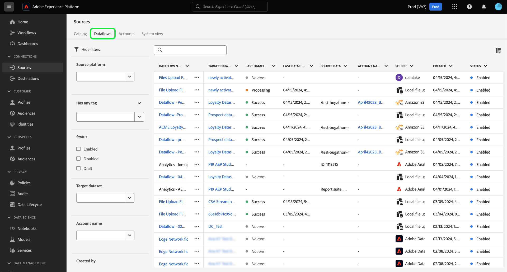
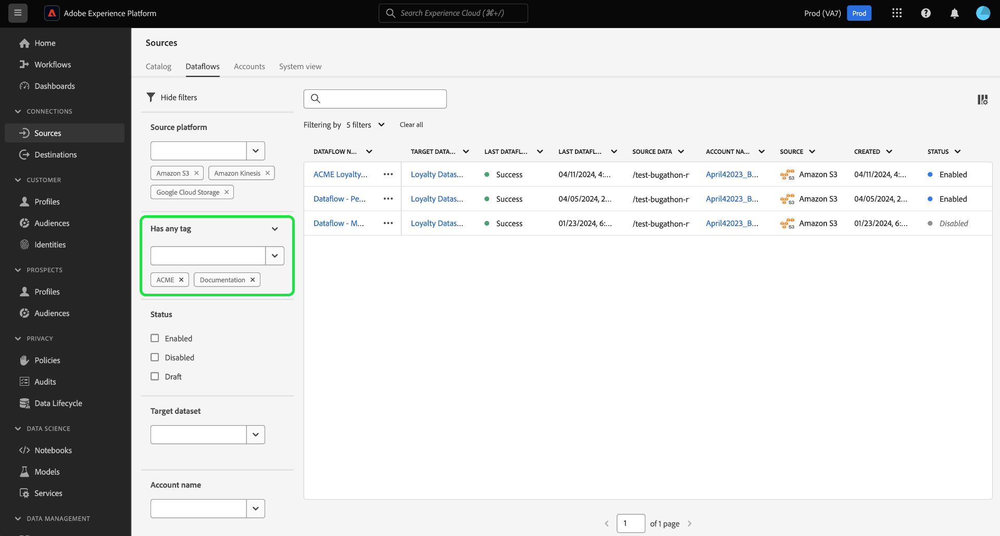
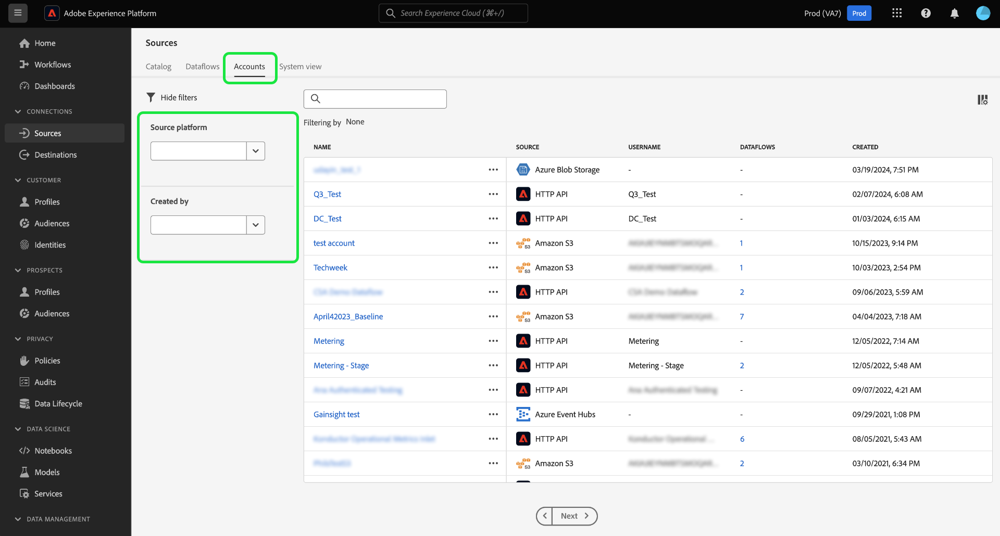
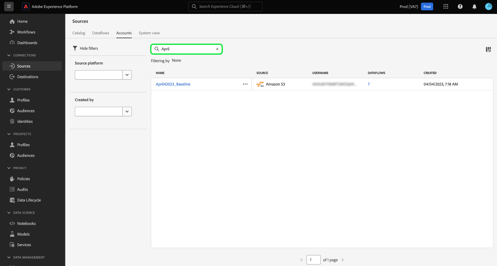

# Filtern von Quellobjekten in der Benutzeroberfläche

Verwenden Sie die Filter-, Such- und Inline-Aktions-Tools in der Benutzeroberfläche von Adobe Experience Platform, um Ihren Workflow im [!UICONTROL Sources]-Arbeitsbereich zu optimieren

* Verwenden Sie Filter- und Suchfunktionen, um sich durch Quellkonten und Datenflüsse in Ihrer Organisation zu navigieren.
* Verwenden Sie Inline-Aktionen, um Konfigurationseinstellungen zu ändern, die auf Ihre Datenflüsse angewendet werden, und um die Arbeitsabläufe in der Organisation zu verbessern. Sie können Inline-Aktionen verwenden, um Tags anzuwenden, Warnhinweise einzurichten oder Aufnahmeaufträge bei Bedarf zu erstellen.

## Erste Schritte

Bevor Sie mit den Objektnavigations-Tools im Quellarbeitsbereich arbeiten, sollten Sie die folgenden Experience Platform-Funktionen und -Konzepte kennen:

* [Quellen](../../home.md): Verwenden Sie Quellen in Experience Platform, um Daten aus einer Adobe-Anwendung oder einer Datenquelle eines Drittanbieters aufzunehmen.
* [Administrative Tags](../../../administrative-tags/overview.md): Verwenden Sie administrative Tags, um Metadaten-Keywords auf Ihre Objekte anzuwenden und die Suche zu aktivieren, um dieses Objekt im Experience Platform-Ökosystem zu finden.
* [Warnhinweise](../../../observability/home.md): Verwenden Sie Warnhinweise, um Benachrichtigungen zu erhalten, die den Status von Objekten aktualisieren, z. B. die Datenflüsse Ihrer Quellen.
* [Datenflüsse](../../../dataflows/home.md): Datenflüsse sind Darstellungen von Datenvorgängen, die Daten über Experience Platform verschieben. Sie können den Arbeitsbereich „Quellen“ verwenden, um Datenflüsse zu erstellen, die Daten aus einer bestimmten Quelle in Experience Platform aufnehmen.
* [Datensätze](../../../catalog/datasets/user-guide.md): Ein Datensatz ist ein Konstrukt zur Datenspeicherung und -verwaltung, in dem Daten, in der Regel eine Tabelle, erfasst werden, die ein Schema (Spalten) und Felder (Zeilen) enthält.
* [Sandboxes](../../../sandboxes/home.md): Verwenden Sie Sandboxes in Experience Platform, um virtuelle Partitionen zwischen Ihren Experience Platform-Instanzen zu erstellen und Umgebungen für Entwicklung oder Produktion zu erstellen.

## Filtern von Quelldatenflüssen {#filter-sources-dataflows}

Wählen Sie in der Benutzeroberfläche von Experience Platform im linken Navigationsbereich die Option **[!UICONTROL Sources]** und dann **[!UICONTROL Dataflows]** in der oberen Zeile aus.

Standardmäßig wird das Filtermenü auf der linken Seite der Benutzeroberfläche angezeigt. Um das Menü auszublenden, wählen Sie **[!UICONTROL Hide filters]** aus.

Sie können Ihre Quellen-Datenflüsse nach den folgenden Parametern filtern:

| Filter | Beschreibung |
| --- | --- |
| [Source-Plattform](#filter-dataflows-by-source-platform) | Filtern Sie Ihre Datenflüsse basierend auf der Quelle, mit der sie erstellt wurden. |
| [Tags](#filter-dataflows-by-tags) | Filtern Sie Ihre Datenflüsse anhand der darauf angewendeten Tags. |
| [Status](#filter-dataflows-by-status) | Filtern Sie Ihre Datenflüsse nach ihrem aktuellen Status. |
| [Zieldatensatz](#filter-dataflows-by-target-dataset) | Filtern Sie Ihre Datenflüsse anhand des Zieldatensatzes, mit dem sie erstellt wurden. |
| [Kontoname](#filter-dataflows-by-account-name) | Filtern Sie Ihre Datenflüsse nach dem Namen des Kontos, dem sie entsprechen. |
| [Erstellt von](#filter-dataflows-by-user) | Filtern Sie Ihre Datenflüsse danach, wer sie erstellt hat. |
| [Erstellungsdatum](#filter-dataflows-by-creation-date) | Filtern Sie Ihre Datenflüsse nach dem Datum, an dem sie erstellt wurden. |
| [Änderungsdatum](#filter-dataflows-by-modification-date) | Filtern Sie Ihre Datenflüsse nach dem Datum, an dem sie zuletzt aktualisiert wurden. |

### Filtern von Datenflüssen nach Quellplattform {#filter-dataflows-by-source-platform}

Verwenden Sie das Bedienfeld [!UICONTROL Source platform] , um Ihre Datenflüsse nach Quelltyp zu filtern. Sie können entweder eine bestimmte Quelle eingeben oder das Dropdown-Menü verwenden, um eine Liste der Quellen im Katalog anzuzeigen. Sie können auch nach mehreren verschiedenen Quellen für eine bestimmte Abfrage filtern. Sie können beispielsweise [!DNL Amazon S3], [!DNL Azure Data Lake Storage Gen2] und [!DNL Google Cloud Storage] auswählen, um den Katalog zu aktualisieren und nur die Datenflüsse anzuzeigen, die mit den ausgewählten Quellen erstellt wurden.

### Filtern von Datenflüssen nach Tags {#filter-dataflows-by-tags}

Verwenden Sie das Bedienfeld Tags , um Ihre Datenflüsse nach den jeweiligen Tags zu filtern.

Wählen Sie **[!UICONTROL Has any tag]** aus und wählen Sie dann mithilfe des Dropdown-Menüs die Tags aus, die Sie filtern möchten. Verwenden Sie diese Einstellung, um nach Datenflüssen zu filtern, die eines der ausgewählten Tags enthalten.

Wählen Sie **[!UICONTROL Has all tags]** aus und wählen Sie dann mithilfe des Dropdown-Menüs die Tags aus, die Sie filtern möchten. Verwenden Sie diese Einstellung, um nach Datenflüssen zu filtern, die alle ausgewählten Tags enthalten.

### Filtern von Datenflüssen nach Status {#filter-dataflows-by-status}

Über das Bedienfeld [!UICONTROL Status] können Sie nach Status filtern.

| Status | Beschreibung |
| --- | --- |
| Aktiviert | Wählen Sie **[!UICONTROL Enabled]** aus, um Ihre Ansicht zu filtern und nur aktive Datenflüsse anzuzeigen. |
| Deaktiviert | Wählen Sie **[!UICONTROL Disabled]** aus, um Ihre Ansicht zu filtern und nur deaktivierte Datenflüsse anzuzeigen. |
| Entwurf | Wählen Sie **[!UICONTROL Draft]** aus, um Ihre Ansicht zu filtern und nur Datenflüsse anzuzeigen, die sich im Entwurfsmodus befinden. |

### Filtern von Datenflüssen nach Zieldatensatz {#filter-dataflows-by-target-dataset}

Wählen Sie **[!UICONTROL Target dataset]** aus, um auf ein Dropdown-Menü aller Zieldatensätze zuzugreifen. Wählen Sie dann einen Zieldatensatz aus, um Ihre Ansicht zu filtern und nur die Datenflüsse anzuzeigen, die mit Ihren angegebenen Zieldatensätzen erstellt wurden.

### Filtern von Datenflüssen nach Kontoname {#filter-dataflows-by-account-name}

Wählen Sie **[!UICONTROL Account name]** aus, um auf ein Dropdown-Menü mit allen Konten zuzugreifen. Wählen Sie dann ein Konto aus, um Ihre Ansicht zu filtern und Datenflüsse anzuzeigen, die von Ihrem ausgewählten Konto erstellt wurden.

### Filtern von Datenflüssen nach Benutzer {#filter-dataflows-by-user}

Verwenden Sie das Bedienfeld [!UICONTROL Created by] , um Datenflüsse nach dem Benutzer zu filtern, der die Datenflüsse erstellt oder zuletzt aktualisiert hat. Wählen Sie das Dropdown-Menü aus und wählen Sie dann den Benutzernamen aus, nach dem Ihre Datenflüsse gefiltert werden sollen.

### Filtern von Datenflüssen nach Erstellungsdatum {#filter-dataflows-by-creation-date}

Sie können Ihre Datenflüsse nach ihrem Erstellungsdatum filtern. Konfigurieren Sie im Bedienfeld [!UICONTROL Created date] ein Start- und Enddatum, um ein Zeitrahmen-Fenster zu erstellen, und filtern Sie Ihre Ansicht so, dass nur die in diesem Fenster erstellten Datenflüsse angezeigt werden.

Sie können Ihren Zeitrahmen konfigurieren, indem Sie Ihr Start- und Enddatum eingeben. Alternativ können Sie das Kalendersymbol auswählen und den Kalender verwenden, um Ihre Daten zu konfigurieren.

Sie können auch die gleichen Schritte ausführen, Datenflüsse jedoch nach dem Datum der letzten Änderung und nicht nach dem Erstellungsdatum filtern.

### Filtern von Datenflüssen nach Änderungsdatum {#filter-dataflows-by-modification-date}

Auf ähnliche Weise können Sie dieselben Prinzipien anwenden und Ihren Datenfluss nach dem Änderungsdatum filtern. Verwenden Sie den **[!UICONTROL Modified date]**, um einen bestimmten Zeitrahmen zu konfigurieren und Ihre Ansicht zu filtern, sodass nur die Datenflüsse angezeigt werden, die in diesem Zeitraum geändert wurden.

### Kombinieren von Filtern {#combine-filters}

Sie können verschiedene Filter kombinieren, um Ihre Suche zu erweitern oder einzugrenzen. Im folgenden Beispiel wird ein Filter angewendet, um nach folgenden Elementen zu suchen:

* Datenflüsse, die mit der [!DNL Amazon S3] erstellt wurden.
* Datenflüsse, die das **[!DNL ACME]**-Tag enthalten.
* Derzeit aktivierte Datenflüsse.
* Datenflüsse, die mit dem [!DNL Loyalty Dataset B2C]-Datensatz erstellt wurden.
* Datenflüsse, die zwischen 4/1/2024 und 4/19/2024 erstellt wurden.

Um alle Filter zu entfernen, wählen Sie **[!UICONTROL Clear all]** aus.

## Filtern von Quellkonten {#filter-sources-accounts}

Wählen Sie in der Benutzeroberfläche von Experience Platform im linken Navigationsbereich die Option [!UICONTROL Sources] und dann **[!UICONTROL Accounts]** in der oberen Zeile aus. Sie können Ihre Quellkonten nach der Quelle filtern, mit der sie erstellt wurden, oder nach dem Benutzer, der sie erstellt hat.

## Suchen nach Konten und Datenflüssen {#search-for-accounts-and-dataflows}

Sie können die Effizienz steigern, indem Sie über die Suchleiste sofort zu einem bestimmten Konto oder Datenfluss navigieren.

>[!BEGINTABS]

>[!TAB Suchen nach Datenflüssen]

Verwenden Sie die Suchleiste auf der Seite &quot;[!UICONTROL Dataflows]&quot;, um einen bestimmten Datenfluss zu finden. Sie können mithilfe des Namens oder der Beschreibung nach einem Datenfluss suchen.

>[!TAB Nach Konten suchen]

Verwenden Sie die Suchleiste auf der Seite [!UICONTROL Accounts] , um ein bestimmtes Konto zu finden. Sie können über den Namen oder die Beschreibung nach einem Konto suchen.

>[!ENDTABS]

## Inline-Aktionen für Datenflüsse von Quellen {#inline-actions-for-sources-dataflows}

Klicken Sie auf die Auslassungszeichen (`...`) neben einem Datenflussnamen, um eine Liste von Inline-Aktionen anzuzeigen, mit denen Sie Änderungen an Ihrem Datenfluss vornehmen können.

| Inline-Aktionen | Beschreibung |
| --- | --- |
| [!UICONTROL Edit schedule] | Wählen Sie **[!UICONTROL Edit schedule]** aus, um den Aufnahmezeitplan Ihres Datenflusses zu aktualisieren. Ein Datenfluss, der auf eine einmalige Aufnahme festgelegt wurde, kann nicht bearbeitet werden. |
| [!UICONTROL Disable dataflow] | Wählen Sie **[!UICONTROL Disable dataflow]** aus, um eine Datenflussausführung zu deaktivieren. Diese Option löscht Ihren Datenfluss nicht. |
| [!UICONTROL View in monitoring] | Wählen Sie **[!UICONTROL View in monitoring]** aus, um die Metriken und den Status Ihres Datenflusses im Monitoring-Dashboard anzuzeigen. Weitere Informationen finden Sie im Handbuch unter [Überwachen von Quelldatenflüssen](../../../dataflows/ui/monitor-sources.md). |
| [!UICONTROL Delete] | Wählen Sie **[!UICONTROL Delete]** aus, um Ihren Datenfluss zu löschen. |
| [!UICONTROL Run on-demand] | Wählen Sie **[!UICONTROL Run on-demand]** aus, um eine einzelne Iteration einer Datenflussausführung in Trigger zu setzen. Weitere Informationen finden Sie im Handbuch unter [Erstellen eines On-Demand-Datenflusses](../ui/on-demand-ingestion.md). |
| [!UICONTROL Subscribe to alerts] | Wählen Sie **[!UICONTROL Subscribe to alerts]** aus, um ein Popup-Fenster mit Warnhinweisen anzuzeigen, die Sie abonnieren können: <ul><li>Start der Ausführung des Quell-Datenflusses: Wählen Sie diesen Warnhinweis aus, um eine Benachrichtigung zu erhalten, wenn die Ausführung des On-Demand-Datenflusses beginnt.</li><li>Erfolgreiche Ausführung des Quell-Datenflusses: Wählen Sie diesen Warnhinweis aus, um eine Benachrichtigung zu erhalten, wenn die Ausführung des On-Demand-Datenflusses erfolgreich abgeschlossen wurde.</li><li>Fehler bei der Ausführung des Quell-Datenflusses: Wählen Sie diesen Warnhinweis aus, wenn die Ausführung des On-Demand-Datenflusses aufgrund von Fehlern fehlschlägt.</li></ul> Weitere Informationen finden sich im Handbuch unter [Abonnieren von Warnhinweisen für Datenflüsse zu Quellen](../ui/alerts.md). |
| [!UICONTROL Add to package] | Wählen Sie **[!UICONTROL Add to package]** aus, um Ihren Datenfluss zu einem Paket hinzuzufügen und ihn zur Verwendung in einer anderen Sandbox zu exportieren. In diesem Schritt können Sie entweder ein neues Paket erstellen oder Ihren Datenfluss zu einem vorhandenen Paket hinzufügen. Weitere Informationen finden Sie im Handbuch unter [Sandbox-Tools](../../../sandboxes/ui/sandbox-tooling.md). |
| [!UICONTROL Manage tags] | Wählen Sie **[!UICONTROL Manage tags]** aus, um Tags zu Ihrem Datenfluss hinzuzufügen oder daraus zu entfernen. Verwenden Sie Tags, um Metadaten-Taxonomien zu verwalten und Geschäftsobjekte zu klassifizieren, um die Erkennung und Kategorisierung zu erleichtern. Weitere Informationen finden Sie im Handbuch unter [Verwalten von Tags](../../../administrative-tags/ui/managing-tags.md). |

## Nächste Schritte

Durch das Lesen dieses Dokuments haben Sie gelernt, wie Sie sich durch die Seiten zu Quellkonten und Datenflüssen navigieren können. Weitere Informationen zu Quellen finden Sie im Abschnitt [Quellen - Übersicht](../../home.md).
