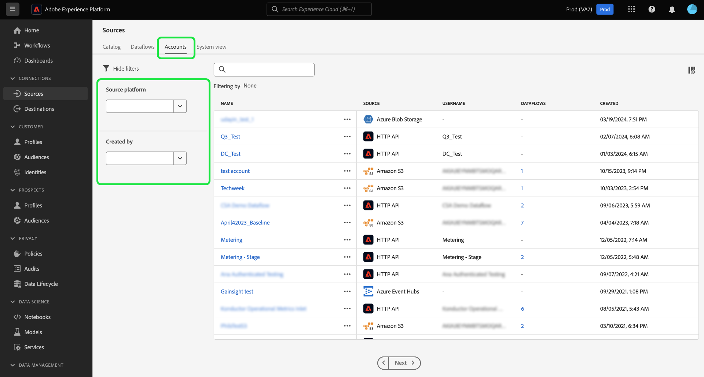

# Filtern von Quellenobjekten in der Benutzeroberfläche

Verwenden Sie die Filter-, Such- und Inline-Aktionstools in der Adobe Experience Platform-Benutzeroberfläche, um Ihren Workflow im Arbeitsbereich [!UICONTROL Quellen] zu optimieren.

* Verwenden Sie Filter- und Suchfunktionen, um durch Quellenkonten und Datenflüsse in Ihrer Organisation zu navigieren.
* Verwenden Sie Inline-Aktionen, um die auf Ihre Datenflüsse angewendeten Konfigurationseinstellungen zu ändern und die Organisations-Workflows zu verbessern. Sie können Inline-Aktionen verwenden, um Tags anzuwenden, Warnhinweise einzurichten oder Erfassungsaufträge bei Bedarf zu erstellen.

## Erste Schritte

Es ist hilfreich, sich mit den folgenden Experience Platform-Funktionen und -Konzepten vertraut zu machen, bevor Sie mit den Tools für die Objektnavigation im Arbeitsbereich &quot;Quellen&quot;arbeiten:

* [Quellen](../../home.md): Verwenden Sie Experience Platform-Quellen, um Daten aus einer Adobe-Anwendung oder einer Datenquelle von Drittanbietern zu erfassen.
* [Verwaltung von Tags](../../../administrative-tags/overview.md): Verwenden Sie administrative Tags, um Metadaten-Schlüsselwörter auf Ihre Objekte anzuwenden und die Suche zu aktivieren, um dieses Objekt im Experience Platform-Ökosystem zu finden.
* [Warnhinweise](../../../observability/home.md): Verwenden Sie Warnhinweise, um Benachrichtigungen zu erhalten, die eine Aktualisierung des Status von Objekten wie den Datenflüssen Ihrer Quellen ermöglichen.
* [Datenflüsse](../../../dataflows/home.md): Datenflüsse sind Darstellungen von Datenaufträgen, die Daten über Experience Platform verschieben. Sie können den Arbeitsbereich &quot;Quellen&quot;verwenden, um Datenflüsse zu erstellen, die Daten von einer bestimmten Quelle zu Experience Platform erfassen.
* [Datensätze](../../../catalog/datasets/user-guide.md): Ein Datensatz ist ein Speicher- und Verwaltungskonstrukt für eine Sammlung von Daten, normalerweise eine Tabelle, die ein Schema (Spalten) und Felder (Zeilen) enthält.
* [Sandboxes](../../../sandboxes/home.md): Verwenden Sie Sandboxes in Experience Platform, um virtuelle Partitionen zwischen Ihren Experience Platform-Instanzen zu erstellen und Umgebungen für die Entwicklung oder Produktion zu erstellen.

## Datenflüsse für Filterquellen {#filter-sources-dataflows}

Wählen Sie in der Experience Platform-Benutzeroberfläche im linken Navigationsbereich **[!UICONTROL Quellen]** und dann **[!UICONTROL Datenflüsse]** aus der oberen Kopfzeile.

Standardmäßig wird das Filtermenü auf der linken Seite der Benutzeroberfläche angezeigt. Um das Menü auszublenden, wählen Sie **[!UICONTROL Filter ausblenden]**.

Sie können die Datenflüsse Ihrer Quellen anhand der folgenden Parameter filtern:

| Filter | Beschreibung |
| --- | --- |
| [Source-Plattform](#filter-dataflows-by-source-platform) | Filtern Sie Ihre Datenflüsse nach der Quelle, mit der sie erstellt wurden. |
| [Tags](#filter-dataflows-by-tags) | Filtern Sie Ihre Datenflüsse anhand der auf sie angewendeten Tags. |
| [Status](#filter-dataflows-by-status) | Filtern Sie Ihre Datenflüsse nach ihrem aktuellen Status. |
| [Target-Datensatz](#filter-dataflows-by-target-dataset) | Filtern Sie Ihre Datenflüsse nach dem Zieldatensatz, mit dem sie erstellt wurden. |
| [Kontoname](#filter-dataflows-by-account-name) | Filtern Sie Ihre Datenflüsse nach dem Namen des Kontos, mit dem sie übereinstimmen. |
| [Erstellt von](#filter-dataflows-by-user) | Filtern Sie Ihre Datenflüsse danach, wer sie erstellt hat. |
| [Erstellungsdatum](#filter-dataflows-by-creation-date) | Filtern Sie Ihre Datenflüsse nach dem Erstellungsdatum. |
| [Änderungsdatum](#filter-dataflows-by-modification-date) | Filtern Sie Ihre Datenflüsse nach dem Datum der letzten Aktualisierung. |

### Filtern von Datenflüssen nach Quellplattform {#filter-dataflows-by-source-platform}

Verwenden Sie das Bedienfeld [!UICONTROL Source-Plattform] , um Ihre Datenflüsse nach Quelltyp zu filtern. Sie können entweder eine bestimmte Quelle eingeben oder das Dropdown-Menü verwenden, um eine Liste der Quellen im Katalog anzuzeigen. Sie können für eine bestimmte Abfrage auch nach verschiedenen Quellen filtern. Sie können beispielsweise [!DNL Amazon S3], [!DNL Azure Data Lake Storage Gen2] und [!DNL Google Cloud Storage] auswählen, um den Katalog zu aktualisieren und nur die Datenflüsse anzuzeigen, die mit den ausgewählten Quellen erstellt wurden.

### Filtern von Datenflüssen nach Tags {#filter-dataflows-by-tags}

Filtern Sie Ihre Datenflüsse mithilfe des Tags-Bedienfelds nach den entsprechenden Tags.

Wählen Sie &quot;**[!UICONTROL Hat ein Tag]**&quot;, und wählen Sie dann die Tags aus, die Sie mithilfe des Dropdown-Menüs filtern möchten. Verwenden Sie diese Einstellung, um nach Datenflüssen zu filtern, die eines der von Ihnen ausgewählten Tags enthalten.

Wählen Sie **[!UICONTROL Enthält alle Tags]** und wählen Sie dann die Tags aus, die Sie mithilfe des Dropdown-Menüs filtern möchten. Verwenden Sie diese Einstellung, um nach Datenflüssen zu filtern, die alle von Ihnen ausgewählten Tags enthalten.

### Filtern von Datenflüssen nach Status {#filter-dataflows-by-status}

Sie können mit dem Bedienfeld [!UICONTROL Status] nach Status filtern.

| Status | Beschreibung |
| --- | --- |
| Aktiviert | Wählen Sie **[!UICONTROL Aktiviert]** aus, um Ihre Ansicht zu filtern und nur aktive Datenflüsse anzuzeigen. |
| Deaktiviert | Wählen Sie **[!UICONTROL Deaktiviert]** aus, um Ihre Ansicht zu filtern und nur deaktivierte Datenflüsse anzuzeigen. |
| Entwurf | Wählen Sie **[!UICONTROL Entwurf]** aus, um Ihre Ansicht zu filtern und nur Datenflüsse anzuzeigen, die sich im Entwurfsmodus befinden. |

### Filtern von Datenflüssen nach Zieldatensätzen {#filter-dataflows-by-target-dataset}

Wählen Sie **[!UICONTROL Ziel-Datensatz]** aus, um auf ein Dropdown-Menü aller Zieldatensätze zuzugreifen. Wählen Sie dann einen Zieldatensatz aus, um Ihre Ansicht zu filtern und nur die Datenflüsse anzuzeigen, die mit Ihren angegebenen Zieldatensätzen erstellt wurden.

### Filtern von Datenflüssen nach Kontonamen {#filter-dataflows-by-account-name}

Wählen Sie **[!UICONTROL Kontoname]** aus, um auf ein Dropdown-Menü aller Konten zuzugreifen. Wählen Sie dann ein Konto aus, um Ihre Ansicht zu filtern und die von Ihrem ausgewählten Konto erstellten Datenflüsse anzuzeigen.

### Datenflüsse nach Benutzer filtern {#filter-dataflows-by-user}

Verwenden Sie das Bedienfeld [!UICONTROL  Erstellt von ] , um Datenflüsse nach dem Benutzer zu filtern, der die Datenflüsse erstellt oder zuletzt aktualisiert hat. Wählen Sie das Dropdown-Menü aus und wählen Sie dann den Benutzernamen aus, nach dem Ihre Datenflüsse gefiltert werden sollen.

### Filtern von Datenflüssen nach Erstellungsdatum {#filter-dataflows-by-creation-date}

Sie können Ihre Datenflüsse nach ihrem Erstellungsdatum filtern. Konfigurieren Sie im Bereich [!UICONTROL Erstellungsdatum] ein Start- und ein Enddatum, um ein Zeitrahmen-Fenster zu erstellen und Ihre Ansicht so zu filtern, dass nur die in diesem Fenster erstellten Datenflüsse angezeigt werden.

Sie können Ihren Zeitraum konfigurieren, indem Sie Ihr Start- und Enddatum eingeben. Wählen Sie alternativ das Kalendersymbol aus und konfigurieren Sie Ihre Daten mithilfe des Kalenders.

Sie können auch dieselben Schritte ausführen, aber Datenflüsse nach ihrem letzten Änderungsdatum und nicht nach ihrem Erstellungsdatum filtern.

### Filtern von Datenflüssen nach Änderungsdatum {#filter-dataflows-by-modification-date}

Ebenso können Sie dieselben Prinzipien anwenden und Ihren Datenfluss nach Änderungsdatum filtern. Verwenden Sie das **[!UICONTROL Änderungsdatum]** , um einen bestimmten Zeitrahmen zu konfigurieren und Ihre Ansicht so zu filtern, dass nur Datenflüsse angezeigt werden, die während dieses Zeitraums geändert wurden.

### Filter kombinieren {#combine-filters}

Sie können verschiedene Filter kombinieren, um Ihre Suche zu erweitern oder einzuschränken. Im folgenden Beispiel wird ein Filter angewendet, um nach Folgendem zu suchen:

* Datenflüsse, die mit der Quelle [!DNL Amazon S3] erstellt wurden.
* Datenflüsse mit dem Tag **[!DNL ACME]** .
* Datenflüsse, die derzeit aktiviert sind.
* Datenflüsse, die mit dem [!DNL Loyalty Dataset B2C] -Datensatz erstellt wurden.
* Datenflüsse, die zwischen dem 1.4.2024 und dem 19.4.2024 erstellt wurden.

Um alle Filter zu entfernen, wählen Sie **[!UICONTROL Alle löschen]** aus.

## Quellenkonten filtern {#filter-sources-accounts}

Wählen Sie in der Experience Platform-Benutzeroberfläche im linken Navigationsbereich [!UICONTROL Quellen] und dann in der oberen Kopfzeile **[!UICONTROL Konten]** aus. Sie können Ihre Quellenkonten nach der Quelle filtern, mit der sie erstellt wurden, oder nach dem Benutzer, der sie erstellt hat.

## Suchen nach Konten und Datenflüssen {#search-for-accounts-and-dataflows}

Mithilfe der Suchleiste können Sie die Effizienz beschleunigen, indem Sie sofort zu einem bestimmten Konto oder Datenfluss navigieren.

>[!BEGINTABS]

>[!TAB Suchen nach Datenflüssen]

Verwenden Sie die Suchleiste auf der Seite [!UICONTROL Datenflüsse] , um einen bestimmten Datenfluss zu finden. Sie können anhand des Namens oder der Beschreibung nach einem Datenfluss suchen.

>[!TAB Suche nach Konten]

Verwenden Sie die Suchleiste auf der Seite [!UICONTROL Konten] , um ein bestimmtes Konto zu finden. Sie können mit dem Namen oder der Beschreibung nach einem Konto suchen.

>[!ENDTABS]

## Inline-Aktionen für Datenflüsse zu Quellen {#inline-actions-for-sources-dataflows}

Wählen Sie die Auslassungszeichen (`...`) neben einem Dataflow-Namen für eine Liste von Inline-Aktionen aus, mit denen Sie Änderungen an Ihrem Datenfluss vornehmen können.

| Inline-Aktionen | Beschreibung |
| --- | --- |
| [!UICONTROL Zeitplan bearbeiten] | Wählen Sie **[!UICONTROL Zeitplan bearbeiten]** aus, um den Aufnahmezeitplan Ihres Datenflusses zu aktualisieren. Ein Datenfluss, der auf die einmalige Erfassung festgelegt wurde, kann nicht bearbeitet werden. |
| [!UICONTROL Datenfluss deaktivieren] | Wählen Sie **[!UICONTROL Datenfluss deaktivieren]** aus, um einen Datenfluss zu deaktivieren. Mit dieser Option wird Ihr Datenfluss nicht gelöscht. |
| [!UICONTROL Anzeigen in der Überwachung] | Wählen Sie **[!UICONTROL In Überwachung anzeigen]** aus, um die Metriken und den Status Ihres Datenflusses im Monitoring-Dashboard anzuzeigen. Weitere Informationen finden Sie im Handbuch zu [Datenflüssen der Überwachungsquellen](../../../dataflows/ui/monitor-sources.md). |
| [!UICONTROL Löschen] | Wählen Sie **[!UICONTROL Löschen]** aus, um Ihren Datenfluss zu löschen. |
| [!UICONTROL On-Demand ausführen] | Wählen Sie **[!UICONTROL On-Demand ausführen]** aus, um eine einzelne Iteration eines Datenflusses Trigger. Weitere Informationen finden Sie in der Anleitung zum Erstellen eines On-Demand-Datenflusses ](../ui/on-demand-ingestion.md).[ |
| [!UICONTROL Warnhinweise abonnieren] | Wählen Sie **[!UICONTROL Warnhinweise abonnieren]** aus, um ein Popup-Fenster mit Warnhinweisen anzuzeigen, die Sie abonnieren können: <ul><li>Start des Datenflusses für Quellen: Wählen Sie diesen Warnhinweis aus, um eine Benachrichtigung zu erhalten, wenn der Start des On-Demand-Datenflusses beginnt.</li><li>Quellen für Erfolg des Datenflusses: Wählen Sie diese Warnung aus, um eine Benachrichtigung zu erhalten, wenn der On-Demand-Datenfluss erfolgreich abgeschlossen wurde.</li><li>Fehler beim Ausführen des Datenflusses der Quellen: Wählen Sie diesen Warnhinweis aus, wenn der On-Demand-Datenfluss aufgrund von Fehlern fehlschlägt.</li></ul> Weitere Informationen finden Sie im Handbuch zum [Abonnieren von Warnhinweisen für Datenflüsse zu Quellen](../ui/alerts.md). |
| [!UICONTROL Zum Paket hinzufügen] | Wählen Sie **[!UICONTROL Zu Paket hinzufügen]** aus, um Ihren Datenfluss zu einem Paket hinzuzufügen und ihn zur Verwendung in einer anderen Sandbox zu exportieren. In diesem Schritt können Sie entweder ein neues Paket erstellen oder Ihren Datenfluss zu einem vorhandenen Paket hinzufügen. Weitere Informationen finden Sie in der Anleitung für [Sandbox-Tools](../../../sandboxes/ui/sandbox-tooling.md). |
| [!UICONTROL Tags verwalten] | Wählen Sie **[!UICONTROL Tags verwalten]** aus, um Tags zu Ihrem Datenfluss hinzuzufügen oder daraus zu entfernen. Verwenden Sie Tags, um Metadaten-Taxonomien zu verwalten und Geschäftsobjekte zu klassifizieren, um die Erkennung und Kategorisierung zu erleichtern. Weitere Informationen finden Sie in der Anleitung zum [Verwalten von Tags](../../../administrative-tags/ui/managing-tags.md). |

## Nächste Schritte

Durch Lesen dieses Dokuments haben Sie gelernt, wie Sie durch die Seiten zu Quellenkonten und Datenflüssen navigieren können. Weitere Informationen zu Quellen finden Sie in der [Quellenübersicht](../../home.md).
