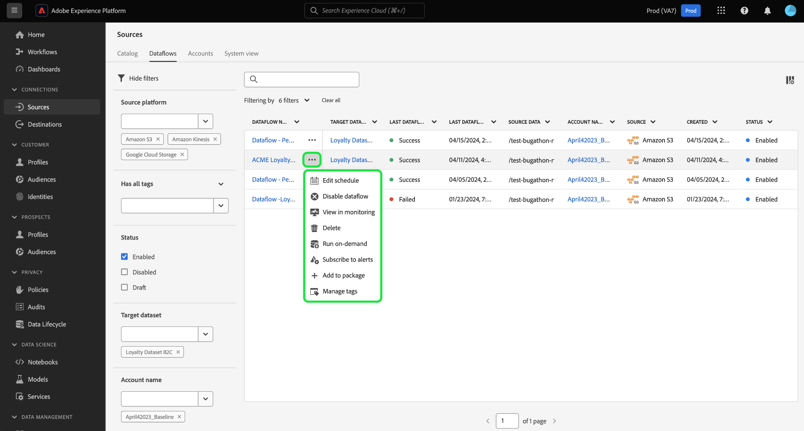

# Filtern von Quellenobjekten in der Benutzeroberfläche

Verwenden Sie die Filter-, Such- und Inline-Aktionstools in der Adobe Experience Platform-Benutzeroberfläche, um Ihren Workflow im [!UICONTROL Quellen] Arbeitsbereich

* Verwenden Sie Filter- und Suchfunktionen, um durch Quellenkonten und Datenflüsse in Ihrer Organisation zu navigieren.
* Verwenden Sie Inline-Aktionen, um die auf Ihre Datenflüsse angewendeten Konfigurationseinstellungen zu ändern und die Organisations-Workflows zu verbessern. Sie können Inline-Aktionen verwenden, um Tags anzuwenden, Warnhinweise einzurichten oder Erfassungsaufträge bei Bedarf zu erstellen.

## Erste Schritte

Es ist hilfreich, sich mit den folgenden Experience Platform-Funktionen und -Konzepten vertraut zu machen, bevor Sie mit den Tools für die Objektnavigation im Arbeitsbereich &quot;Quellen&quot;arbeiten:

* [Quellen](../../home.md): Verwenden Sie Quellen im Experience Platform, um Daten von einer Adobe-Anwendung oder einer Datenquelle von Drittanbietern zu erfassen.
* [Administrative Tags](../../../administrative-tags/overview.md): Verwenden Sie Admin-Tags, um Metadaten-Keywords auf Ihre Objekte anzuwenden und die Suche zu aktivieren, um dieses Objekt im Experience Platform-Ökosystem zu finden.
* [Warnhinweise](../../../observability/home.md): Verwenden Sie Warnhinweise, um Benachrichtigungen zu erhalten, die eine Aktualisierung des Status von Objekten wie den Datenflüssen Ihrer Quellen ermöglichen.
* [Datenflüsse](../../../dataflows/home.md): Datenflüsse sind Darstellungen von Datenaufträgen, die Daten über Experience Platform verschieben. Sie können den Arbeitsbereich &quot;Quellen&quot;verwenden, um Datenflüsse zu erstellen, die Daten von einer bestimmten Quelle zu Experience Platform erfassen.
* [Datensätze](../../../catalog/datasets/user-guide.md): Ein Datensatz ist ein Speicher- und Verwaltungskonstrukt für eine Sammlung von Daten, normalerweise eine Tabelle, die ein Schema (Spalten) und Felder (Zeilen) enthält.
* [Sandboxes](../../../sandboxes/home.md): Verwenden Sie Sandboxes in Experience Platform, um virtuelle Partitionen zwischen Ihren Experience Platform-Instanzen zu erstellen und Umgebungen zu erstellen, die für die Entwicklung oder Produktion vorgesehen sind.

## Datenflüsse für Filterquellen {#filter-sources-dataflows}

Wählen Sie in der Experience Platform-Benutzeroberfläche **[!UICONTROL Quellen]** in der linken Navigation und wählen Sie dann **[!UICONTROL Datenflüsse]** aus der oberen Kopfzeile.

Standardmäßig wird das Filtermenü auf der linken Seite der Benutzeroberfläche angezeigt. Um das Menü auszublenden, wählen Sie **[!UICONTROL Filter ausblenden]**.

Sie können die Datenflüsse Ihrer Quellen anhand der folgenden Parameter filtern:

| Filter | Beschreibung |
| --- | --- |
| [Quellplattform](#filter-dataflows-by-source-platform) | Filtern Sie Ihre Datenflüsse nach der Quelle, mit der sie erstellt wurden. |
| [Tags](#filter-dataflows-by-tags) | Filtern Sie Ihre Datenflüsse anhand der auf sie angewendeten Tags. |
| [Status](#filter-dataflows-by-status) | Filtern Sie Ihre Datenflüsse nach ihrem aktuellen Status. |
| [Target-Datensatz](#filter-dataflows-by-target-dataset) | Filtern Sie Ihre Datenflüsse nach dem Zieldatensatz, mit dem sie erstellt wurden. |
| [Kontoname](#filter-dataflows-by-account-name) | Filtern Sie Ihre Datenflüsse nach dem Namen des Kontos, mit dem sie übereinstimmen. |
| [Erstellt von](#filter-dataflows-by-user) | Filtern Sie Ihre Datenflüsse danach, wer sie erstellt hat. |
| [Erstellungsdatum](#filter-dataflows-by-creation-date) | Filtern Sie Ihre Datenflüsse nach dem Erstellungsdatum. |
| [Änderungsdatum](#filter-dataflows-by-modification-date) | Filtern Sie Ihre Datenflüsse nach dem Datum der letzten Aktualisierung. |

### Filtern von Datenflüssen nach Quellplattform {#filter-dataflows-by-source-platform}

Verwenden Sie die [!UICONTROL Quellplattform] -Bedienfeld zum Filtern Ihrer Datenflüsse nach Quelltyp. Sie können entweder eine bestimmte Quelle eingeben oder das Dropdown-Menü verwenden, um eine Liste der Quellen im Katalog anzuzeigen. Sie können für eine bestimmte Abfrage auch nach verschiedenen Quellen filtern. Sie können beispielsweise [!DNL Amazon S3], [!DNL Azure Data Lake Storage Gen2], und [!DNL Google Cloud Storage] , um den Katalog zu aktualisieren und nur die Datenflüsse anzuzeigen, die mit den ausgewählten Quellen erstellt wurden.

### Filtern von Datenflüssen nach Tags {#filter-dataflows-by-tags}

Filtern Sie Ihre Datenflüsse mithilfe des Tags-Bedienfelds nach den entsprechenden Tags.

Auswählen **[!UICONTROL Hat ein Tag]** und wählen Sie dann mithilfe des Dropdown-Menüs die Tags aus, die Sie filtern möchten. Verwenden Sie diese Einstellung, um nach Datenflüssen zu filtern, die eines der von Ihnen ausgewählten Tags enthalten.

Auswählen **[!UICONTROL Enthält alle Tags]** und wählen Sie dann mithilfe des Dropdown-Menüs die Tags aus, die Sie filtern möchten. Verwenden Sie diese Einstellung, um nach Datenflüssen zu filtern, die alle von Ihnen ausgewählten Tags enthalten.

### Filtern von Datenflüssen nach Status {#filter-dataflows-by-status}

Sie können nach Status filtern, indem Sie [!UICONTROL Status] Bedienfeld.

| Status | Beschreibung |
| --- | --- |
| Aktiviert | Auswählen **[!UICONTROL Aktiviert]** , um Ihre Ansicht zu filtern und nur aktive Datenflüsse anzuzeigen. |
| Deaktiviert | Auswählen **[!UICONTROL Behinderte]** , um Ihre Ansicht zu filtern und nur deaktivierte Datenflüsse anzuzeigen. |
| Entwurf | Auswählen **[!UICONTROL Entwurf]** , um Ihre Ansicht zu filtern und nur Datenflüsse anzuzeigen, die sich im Entwurfsmodus befinden. |

### Filtern von Datenflüssen nach Zieldatensätzen {#filter-dataflows-by-target-dataset}

Auswählen **[!UICONTROL Target-Datensatz]** , um auf ein Dropdown-Menü mit allen Zieldatensätzen zuzugreifen. Wählen Sie dann einen Zieldatensatz aus, um Ihre Ansicht zu filtern und nur die Datenflüsse anzuzeigen, die mit Ihren angegebenen Zieldatensätzen erstellt wurden.

### Filtern von Datenflüssen nach Kontonamen {#filter-dataflows-by-account-name}

Auswählen **[!UICONTROL Kontoname]** , um auf ein Dropdown-Menü aller Konten zuzugreifen. Wählen Sie dann ein Konto aus, um Ihre Ansicht zu filtern und die von Ihrem ausgewählten Konto erstellten Datenflüsse anzuzeigen.

### Datenflüsse nach Benutzer filtern {#filter-dataflows-by-user}

Verwenden Sie die [!UICONTROL Erstellt von] -Bedienfeld zum Filtern von Datenflüssen nach dem Benutzer, der die Datenflüsse erstellt oder zuletzt aktualisiert hat. Wählen Sie das Dropdown-Menü aus und wählen Sie dann den Benutzernamen aus, nach dem Ihre Datenflüsse gefiltert werden sollen.

### Filtern von Datenflüssen nach Erstellungsdatum {#filter-dataflows-by-creation-date}

Sie können Ihre Datenflüsse nach ihrem Erstellungsdatum filtern. Im [!UICONTROL Erstellungsdatum] -Bedienfeld ein Startdatum und ein Enddatum konfigurieren, um ein Zeitrahmen-Fenster zu erstellen und Ihre Ansicht so zu filtern, dass nur die in diesem Fenster erstellten Datenflüsse angezeigt werden.

Sie können Ihren Zeitraum konfigurieren, indem Sie Ihr Start- und Enddatum eingeben. Wählen Sie alternativ das Kalendersymbol aus und konfigurieren Sie Ihre Daten mithilfe des Kalenders.

Sie können auch dieselben Schritte ausführen, aber Datenflüsse nach ihrem letzten Änderungsdatum und nicht nach ihrem Erstellungsdatum filtern.

### Filtern von Datenflüssen nach Änderungsdatum {#filter-dataflows-by-modification-date}

Ebenso können Sie dieselben Prinzipien anwenden und Ihren Datenfluss nach Änderungsdatum filtern. Verwenden Sie die **[!UICONTROL Änderungsdatum]** um einen bestimmten Zeitraum zu konfigurieren und Ihre Ansicht so zu filtern, dass nur Datenflüsse angezeigt werden, die während dieses Zeitraums geändert wurden.

### Filter kombinieren {#combine-filters}

Sie können verschiedene Filter kombinieren, um Ihre Suche zu erweitern oder einzuschränken. Im folgenden Beispiel wird ein Filter angewendet, um nach Folgendem zu suchen:

* Datenflüsse, die mit der [!DNL Amazon S3] -Quelle.
* Datenflüsse, die die **[!DNL ACME]** -Tag.
* Datenflüsse, die derzeit aktiviert sind.
* Datenflüsse, die mit der [!DNL Loyalty Dataset B2C] Datensatz.
* Datenflüsse, die zwischen dem 1.4.2024 und dem 19.4.2024 erstellt wurden.

Um alle Filter zu entfernen, wählen Sie **[!UICONTROL Alle löschen]**.

## Quellenkonten filtern {#filter-sources-accounts}

Wählen Sie in der Experience Platform-Benutzeroberfläche [!UICONTROL Quellen] in der linken Navigation und wählen Sie dann **[!UICONTROL Konten]** aus der oberen Kopfzeile. Sie können Ihre Quellenkonten nach der Quelle filtern, mit der sie erstellt wurden, oder nach dem Benutzer, der sie erstellt hat.

## Suchen nach Konten und Datenflüssen {#search-for-accounts-and-dataflows}

Mithilfe der Suchleiste können Sie die Effizienz beschleunigen, indem Sie sofort zu einem bestimmten Konto oder Datenfluss navigieren.

>[!BEGINTABS]

>[!TAB Suchen nach Datenflüssen]

Verwenden Sie die Suchleiste im [!UICONTROL Datenflüsse] Seite, um einen bestimmten Datenfluss zu finden. Sie können anhand des Namens oder der Beschreibung nach einem Datenfluss suchen.

>[!TAB Konto suchen]

Verwenden Sie die Suchleiste im [!UICONTROL Konten] Seite, um ein bestimmtes Konto zu finden. Sie können mit dem Namen oder der Beschreibung nach einem Konto suchen.

>[!ENDTABS]

## Inline-Aktionen für Datenflüsse zu Quellen {#inline-actions-for-sources-dataflows}

Wählen Sie die Auslassungszeichen (`...`) neben einem Dataflow-Namen für eine Liste von Inline-Aktionen, mit denen Sie Änderungen an Ihrem Datenfluss vornehmen können.

| Inline-Aktionen | Beschreibung |
| --- | --- |
| [!UICONTROL Zeitplan bearbeiten] | Auswählen **[!UICONTROL Zeitplan bearbeiten]** , um den Aufnahmezeitplan Ihres Datenflusses zu aktualisieren. Ein Datenfluss, der auf die einmalige Erfassung festgelegt wurde, kann nicht bearbeitet werden. |
| [!UICONTROL Datenfluss deaktivieren] | Auswählen **[!UICONTROL Datenfluss deaktivieren]** , um einen Datenfluss zu deaktivieren. Mit dieser Option wird Ihr Datenfluss nicht gelöscht. |
| [!UICONTROL Anzeigen in der Überwachung] | Auswählen **[!UICONTROL Anzeigen in der Überwachung]** , um die Metriken und den Status Ihres Datenflusses im Monitoring-Dashboard anzuzeigen. Weitere Informationen finden Sie im Handbuch unter [Datenflüsse für Überwachungsquellen](../../../dataflows/ui/monitor-sources.md). |
| [!UICONTROL Löschen] | Auswählen **[!UICONTROL Löschen]** , um Ihren Datenfluss zu löschen. |
| [!UICONTROL On-Demand ausführen] | Auswählen **[!UICONTROL On-Demand ausführen]** , um eine einzelne Iteration eines Datenfluss-Vorgangs Trigger. Weitere Informationen finden Sie im Handbuch unter [Erstellen eines On-Demand-Datenflusses](../ui/on-demand-ingestion.md). |
| [!UICONTROL Warnhinweise abonnieren] | Auswählen **[!UICONTROL Warnhinweise abonnieren]** um ein Popup-Fenster mit Warnungen anzuzeigen, die Sie abonnieren können: <ul><li>Start des Datenflusses für Quellen: Wählen Sie diesen Warnhinweis aus, um eine Benachrichtigung zu erhalten, wenn der Start des On-Demand-Datenflusses beginnt.</li><li>Quellen für Erfolg des Datenflusses: Wählen Sie diese Warnung aus, um eine Benachrichtigung zu erhalten, wenn der On-Demand-Datenfluss erfolgreich abgeschlossen wurde.</li><li>Fehler beim Ausführen des Datenflusses der Quellen: Wählen Sie diesen Warnhinweis aus, wenn der On-Demand-Datenfluss aufgrund von Fehlern fehlschlägt.</li></ul> Weitere Informationen finden Sie im Handbuch unter [Abonnieren von Warnhinweisen für Datenflüsse zu Quellen](../ui/alerts.md). |
| [!UICONTROL Zu Paket hinzufügen] | Auswählen **[!UICONTROL Zu Paket hinzufügen]** , um Ihren Datenfluss zu einem Paket hinzuzufügen und ihn zur Verwendung in einer anderen Sandbox zu exportieren. In diesem Schritt können Sie entweder ein neues Paket erstellen oder Ihren Datenfluss zu einem vorhandenen Paket hinzufügen. Weitere Informationen finden Sie im Handbuch unter [Sandbox-Tools](../../../sandboxes/ui/sandbox-tooling.md). |
| [!UICONTROL Tags verwalten] | Auswählen **[!UICONTROL Tags verwalten]** , um Tags zu Ihrem Datenfluss hinzuzufügen oder daraus zu entfernen. Verwenden Sie Tags, um Metadaten-Taxonomien zu verwalten und Geschäftsobjekte zu klassifizieren, um die Erkennung und Kategorisierung zu erleichtern. Weitere Informationen finden Sie im Handbuch unter [Tags verwalten](../../../administrative-tags/ui/managing-tags.md). |

## Nächste Schritte

Durch Lesen dieses Dokuments haben Sie gelernt, wie Sie durch die Seiten zu Quellenkonten und Datenflüssen navigieren können. Weitere Informationen zu Quellen finden Sie im Abschnitt [Quellen - Übersicht](../../home.md).
