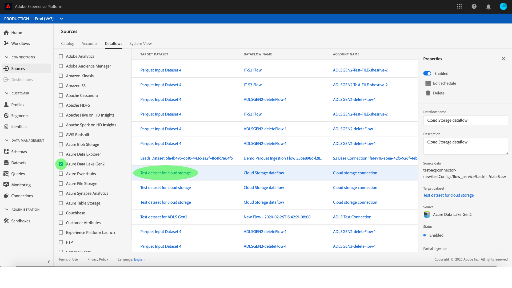

# Datenflüsse überwachen und löschen

Quellschnittstellen in Adobe Experience Platform bieten die Möglichkeit, extern beschaffte Daten planmäßig zu erfassen. Dieses Lernprogramm enthält Schritte zum Anzeigen vorhandener Konten und Datenflüsse aus dem *[!UICONTROL Sources]* -Arbeitsbereich. Dieses Lernprogramm enthält außerdem Schritte zum Löschen von Datenflüssen aus dem *[!UICONTROL Sources]* -Arbeitsbereich.

## Erste Schritte

Dieses Tutorial setzt ein Grundverständnis der folgenden Komponenten von Adobe Experience Platform voraus:

- [XDM-System (Experience-Datenmodell)](../../../xdm/home.md)[!DNL Experience Platform]: Das standardisierte Framework, nach dem Daten zum Kundenerlebnis in organisiert werden.
   - [Grundlagen zum Aufbau von Schemas](../../../xdm/schema/composition.md): Machen Sie sich mit den Grundbausteinen von XDM-Schemas sowie den zentralen Konzepten und Best Practices rund um die Erstellung von Schemas vertraut.
   - [Schema-Editor-Lernprogramm](../../../xdm/tutorials/create-schema-ui.md): Erfahren Sie, wie Sie mit der Benutzeroberfläche des Schema-Editors benutzerdefinierte Schema erstellen.
- [Echtzeit-Kundenprofil](../../../profile/home.md): Ein durch die Zusammenführung von Daten aus verschiedenen Quellen erstelltes Profil, das eine zentrale Echtzeit-Sicht auf Kunden liefert.

## Konten überwachen

Melden Sie sich bei [Adobe Experience Platform](https://platform.adobe.com) an und wählen Sie dann in der linken Navigationsleiste **[!UICONTROL Quellen]** , um auf den *[!UICONTROL Quellarbeitsbereich]* zuzugreifen. Im Anzeigebereich &quot; *[!UICONTROL Katalog]* &quot;werden verschiedene Quellen angezeigt, für die Sie Konten und Datenflüsse erstellen können. Jede Quelle zeigt die Anzahl der vorhandenen Konten und Datenflüsse, die ihnen zugeordnet sind.

Wählen Sie *[!UICONTROL Konten]* aus der oberen Kopfzeile zur Ansicht vorhandener Konten.

Die Seiten *[!UICONTROL Konten]* werden angezeigt. Auf dieser Seite finden Sie eine Liste von anzeigbaren Konten, einschließlich Informationen zu deren Quelle, Benutzername, Anzahl der Datenflüsse und Erstellungsdatum.

Wählen Sie das Trichtersymbol oben links aus, um das Sortierfenster zu starten.

Über das Sortierfeld können Sie auf Konten aus einer bestimmten Quelle zugreifen. Wählen Sie die Quelle aus, mit der Sie arbeiten möchten, und wählen Sie das Konto in der Liste auf der rechten Seite aus.

Auf der Seite &quot; *[!UICONTROL Konten]* &quot;können Sie eine Liste der vorhandenen Datenflüsse, die mit dem Konto, auf das Sie zugegriffen haben, verknüpft sind, Ansicht haben. Wählen Sie den zu Ansicht Datenfluss aus.

Der Bildschirm &quot; *[!UICONTROL Dataflow-Aktivität]* &quot;wird angezeigt. Diese Seite zeigt die Rate der Nachrichten an, die in Form eines Diagramms konsumiert werden.

## Überwachen von Datenflüssen

Datenflüsse können direkt von der Seite &quot; *[!UICONTROL Katalog]* &quot;aus aufgerufen werden, ohne *[!UICONTROL Konten]* anzuzeigen. Wählen Sie *[!UICONTROL Datenflüsse]* aus der oberen Kopfzeile aus, um eine Liste der vorhandenen Datenflüsse Ansicht.

Eine Liste der vorhandenen Datenflüsse wird angezeigt. Auf dieser Seite finden Sie eine Liste mit anzeigbaren Datenflüssen, einschließlich Informationen zu Quelle, Benutzername, Anzahl der Datenflüsse und Status. Wählen Sie das Trichtersymbol oben links, das sortiert werden soll.

Das Sortierfeld wird angezeigt. Wählen Sie im Bildlaufmenü die Quelle aus, auf die Sie zugreifen möchten, und wählen Sie dann in der Liste auf der rechten Seite den Datendurchlauf aus.

Der Bildschirm &quot; *[!UICONTROL Dataflow-Aktivität]* &quot;wird angezeigt. Diese Seite zeigt die Rate der Nachrichten an, die in Form eines Diagramms konsumiert werden.

Weitere Informationen zur Überwachung von Datenflüssen und zur Erfassung finden Sie im Lernprogramm zur [Überwachung von Streaming-Datenflüssen](../../../ingestion/quality/monitor-data-flows.md).

## Löschen eines Datenflusses

Sie können Datenflüsse löschen, die falsch erstellt wurden oder nicht mehr benötigt werden, indem Sie auf den Datenflug-Bildschirm zugreifen. Suchen Sie den zu löschenden Datenfluss mithilfe des Sortierungstrichtersymbols und wählen Sie den Datenfluss aus, um das **[!UICONTROL Eigenschaftenbedienfeld]** zu öffnen.

Um einen Datendurchlauf zu löschen, wählen Sie oben rechts in den Eigenschaften die Option &quot; **[!UICONTROL Löschen]** &quot;aus.

Eine letzte Bestätigungsmeldung wird angezeigt. Wählen Sie **[!UICONTROL Löschen]** zur Bestätigung.

Nach einigen Augenblicken wird am unteren Bildschirmrand ein grünes Bestätigungsfeld angezeigt, um eine erfolgreiche Löschung zu bestätigen.

Alternativ können Sie einen Datenflug auch aus dem Bildschirm &quot; *[!UICONTROL Konten]* &quot;löschen. Suchen Sie das Konto, auf das Sie zugreifen möchten, mithilfe des Sortierungstrichtersymbols und wählen Sie das Konto in der Liste aus.

Die Seite &quot; *[!UICONTROL Konten]* &quot;wird angezeigt. Wählen Sie den zu löschenden Datenfluss aus und wählen Sie dann im Eigenschaftenbedienfeld die Option &quot; **[!UICONTROL Löschen]** &quot;, um den Prozess abzuschließen.

Führen Sie die oben genannten Bestätigungsschritte aus, um den Vorgang abzuschließen.

## Nächste Schritte

In diesem Lernprogramm haben Sie erfolgreich auf vorhandene Konten und Datenflüsse im *[!UICONTROL Sources]* -Arbeitsbereich zugegriffen. Eingehende Daten können nun von nachgelagerten [!DNL Platform] Diensten wie [!DNL Real-time Customer Profile] und [!DNL Data Science Workspace]genutzt werden. Weitere Informationen finden Sie in den folgenden Dokumenten:

- [Übersicht über das Echtzeit-Kundenprofil](../../../profile/home.md)
- [Übersicht über den Data Science Workspace](../../../data-science-workspace/home.md)