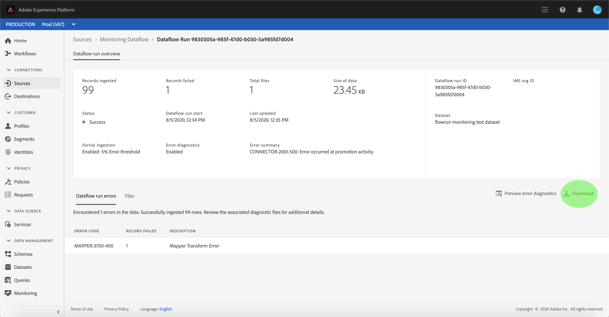

# Überwachen von Konten und Datenflüssen in der Benutzeroberfläche

Die Source Connectors in Adobe Experience Platform bieten die Möglichkeit, extern beschaffte Daten planmäßig zu erfassen. Dieses Lernprogramm enthält Schritte zum Anzeigen vorhandener Konten und Datenflüsse aus dem *[!UICONTROL Sources]* -Arbeitsbereich.

## Erste Schritte

Dieses Tutorial setzt ein Grundverständnis der folgenden Komponenten von Adobe Experience Platform voraus:

- [Experience-Datenmodell (XDM)-System](../../../xdm/home.md)[!DNL Experience Platform]: Das standardisierte Framework, mit dem Kundenerlebnisdaten organisiert.
   - [Grundlagen der Schemakomposition](../../../xdm/schema/composition.md): Machen Sie sich mit den Grundbausteinen von XDM-Schemas sowie den zentralen Konzepten und Best Practices rund um die Erstellung von Schemas vertraut.
   - [Schema-Editor-Lernprogramm](../../../xdm/tutorials/create-schema-ui.md): Erfahren Sie, wie Sie mit der Benutzeroberfläche des Schema-Editors benutzerdefinierte Schema erstellen.
- [Echtzeit-Kundenprofil](../../../profile/home.md): Bietet ein einheitliches Echtzeit-Kundenprofil, das auf aggregierten Daten aus verschiedenen Quellen basiert.

## Konten überwachen

Melden Sie sich bei [Adobe Experience Platform](https://platform.adobe.com) an und wählen Sie dann in der linken Navigationsleiste die Option &quot; **[!UICONTROL Quellen]** &quot;, um auf den *[!UICONTROL Quellarbeitsbereich]* zuzugreifen. Im Anzeigebereich &quot; *[!UICONTROL Katalog]* &quot;werden verschiedene Quellen angezeigt, für die Sie Konten und Datenflüsse erstellen können. Jede Quelle zeigt die Anzahl der vorhandenen Konten und Datenflüsse, die ihnen zugeordnet sind.

Wählen Sie *[!UICONTROL Konten]* aus der oberen Kopfzeile zur Ansicht vorhandener Konten.

Die Seiten *[!UICONTROL Konten]* werden angezeigt. Auf dieser Seite finden Sie eine Liste von anzeigbaren Konten, einschließlich Informationen zu deren Quelle, Benutzername, Anzahl der Datenflüsse und Erstellungsdatum.

Wählen Sie das Trichtersymbol oben links aus, um das Sortierfenster zu starten.

Über das Sortierfeld können Sie auf Konten aus einer bestimmten Quelle zugreifen. Wählen Sie die Quelle aus, mit der Sie arbeiten möchten, und wählen Sie das Konto in der Liste auf der rechten Seite aus.

Auf der Seite &quot; *[!UICONTROL Konten]* &quot;können Sie eine Liste mit vorhandenen Datenflüssen oder Zielgruppen-Datensätzen, die mit dem Konto, auf das Sie zugegriffen haben, verknüpft sind, Ansicht haben.

## Überwachen von Datenflüssen

Datenflüsse können direkt von der Seite &quot; *[!UICONTROL Katalog]* &quot;aus aufgerufen werden, ohne *[!UICONTROL Konten]* anzuzeigen. Wählen Sie *[!UICONTROL Datenflüsse]* aus der oberen Kopfzeile aus, um eine Liste der vorhandenen Datenflüsse Ansicht.

Eine Liste der vorhandenen Datenflüsse wird angezeigt. Auf dieser Seite finden Sie eine Liste mit anzeigbaren Datenflüssen, einschließlich Informationen zu Quelle, Benutzername, Anzahl der Datenflüsse und Status. Wählen Sie das Trichtersymbol oben links, das sortiert werden soll.

Das Sortierfeld wird angezeigt. Wählen Sie im Bildlaufmenü die Quelle aus, auf die Sie zugreifen möchten, und wählen Sie dann in der Liste auf der rechten Seite den Datendurchlauf aus.

Auf der Seite &quot; *[!UICONTROL Dataflow-Aktivität]* &quot;finden Sie Angaben zur Anzahl der erfassten und fehlgeschlagenen Datensätze sowie Informationen zum Datenaflow-Status und zur Verarbeitungszeit. Wählen Sie das Kalendersymbol oberhalb des Datenflusses aus, um den Zeitraum Ihrer Erfassungsdatensätze anzupassen.

Der Kalender ermöglicht die Ansicht der verschiedenen Zeitrahmen für erfasste Datensätze. Sie können zwischen den beiden voreingestellten Optionen &quot; *[!UICONTROL Letzte 7 Tage]* &quot;und &quot; *[!UICONTROL Letzte 30 Tage]*&quot;wählen. Alternativ können Sie einen benutzerdefinierten Zeitraum mithilfe des Kalenders festlegen. Wählen Sie den gewünschten Zeitraum aus und wählen Sie &quot; **[!UICONTROL Anwenden]** &quot;, um fortzufahren.

Standardmäßig wird in der Aktivität *[!UICONTROL &quot;]* Dataflow&quot;das Bedienfeld &quot; *[!UICONTROL Eigenschaften]* &quot;angezeigt, das mit dem Datenflug verknüpft ist. Wählen Sie den Fluss aus, der von der Liste ausgeführt wird, um die zugehörigen Metadaten einschließlich Informationen zur eindeutigen Ausführen-ID anzuzeigen.

Wählen Sie &quot; **[!UICONTROL Datenaflow-Run-Beginn]** &quot;aus, um auf die *[!UICONTROL Datenaflow-Übersicht]* zuzugreifen.

Die Übersicht *[!UICONTROL zum Ausführen des]* Datenflusses enthält Informationen zum Datenfluss, einschließlich Metadaten, *[!UICONTROL Teilerfassung]* -Status und zugewiesener *[!UICONTROL Fehlerschwellenwert]*. Die obere Kopfzeile enthält auch eine *[!UICONTROL Fehlerzusammenfassung]*. Die *[!UICONTROL Fehlerzusammenfassung]* enthält den spezifischen Fehler der obersten Ebene, der anzeigt, in welchem Schritt beim Erfassungsvorgang ein Fehler aufgetreten ist.

In der folgenden Tabelle finden Sie Fehlercodes, die in der *[!UICONTROL Fehlerzusammenfassung]* angezeigt werden können.

| Fehler-Code | Fehlermeldung |
| ---------- | ----------- |
| `CONNECTOR-1001-500` | &quot;Bei der Aktivität zum Kopieren ist ein Problem aufgetreten.&quot; |
| `CONNECTOR-2001-500` | &quot;Beim Kopieren der Experience Platform in den Datensatz ist ein Problem aufgetreten.&quot; |
| `CONNECTOR-3001-500` | &quot;Beim Flow-Provider ist beim Erstellen des Stapels mit der Massen-Erfassungsschnittstelle ein Problem aufgetreten.&quot; |

Die untere Hälfte des Bildschirms enthält Informationen zu *[!UICONTROL Dataflow-Ausführungsfehlern]*. Von hier aus können Sie auch die erfassten Dateien Ansicht, die Fehlerdiagnose für Vorschau und Download durchführen oder das Dateimanifest herunterladen.

Im Abschnitt &quot; *[!UICONTROL Datenflussausführungsfehler]* &quot;werden der *[!UICONTROL Fehlercode]*, die Anzahl der fehlgeschlagenen Datensätze und die Informationen zum Fehler angezeigt.

Wählen Sie **[!UICONTROL Fehlerdiagnose]** für Vorschauen aus, um weitere Informationen zum Erfassungsfehler anzuzeigen.

Das Fenster *[!UICONTROL Vorschau]* für die Fehlerdiagnose wird angezeigt. In diesem Bildschirm werden spezifische Informationen zum Erfassungsfehler angezeigt, einschließlich *[!UICONTROL Dateiname]*, *[!UICONTROL Fehlercode]*, Name der Spalte, in der der Fehler aufgetreten ist, und Beschreibung des Fehlers.

Dieser Abschnitt enthält auch eine Vorschau der Spalte, die den Fehler enthält.

>[!IMPORTANT]
>
>Zur Aktivierung der *[!UICONTROL Fehlerdiagnose-Vorschau]* müssen Sie beim Konfigurieren eines Datenflusses die *[!UICONTROL teilweise Erfassung]* und *[!UICONTROL Fehlerdiagnose]* aktivieren. Dadurch kann das System alle während der Ausführung erfassten Datensätze überprüfen.

Nach der Vorschau der Fehler können Sie im Übersichtsbedienfeld für den **[!UICONTROL UICONTROL-Datendurchlauf die Option &quot;]** Herunterladen *[&quot;auswählen, um auf die vollständige Fehlerdiagnose zuzugreifen und das Dateimanifest herunterzuladen]* . Weitere Informationen finden Sie in den Dokumenten zur [Fehlerdiagnose](../../../ingestion/batch-ingestion/partial.md#retrieve-errors) und zum [Herunterladen von Metadaten](../../../ingestion/batch-ingestion/partial.md#download-metadata) .

Weitere Informationen zur Überwachung von Datenflüssen und zur Erfassung finden Sie im Lernprogramm zur [Überwachung von Streaming-Datenflüssen](../../../ingestion/quality/monitor-data-flows.md).

## Nächste Schritte

In diesem Lernprogramm haben Sie erfolgreich auf vorhandene Konten und Datenflüsse im *[!UICONTROL Sources]* -Arbeitsbereich zugegriffen. Eingehende Daten können nun von nachgelagerten [!DNL Platform] Diensten wie [!DNL Real-time Customer Profile] und [!DNL Data Science Workspace]genutzt werden. Weitere Informationen finden Sie in den folgenden Dokumenten:

- [Übersicht über das Echtzeit-Kundenprofil](../../../profile/home.md)
- [Übersicht über den Data Science Workspace](../../../data-science-workspace/home.md)
