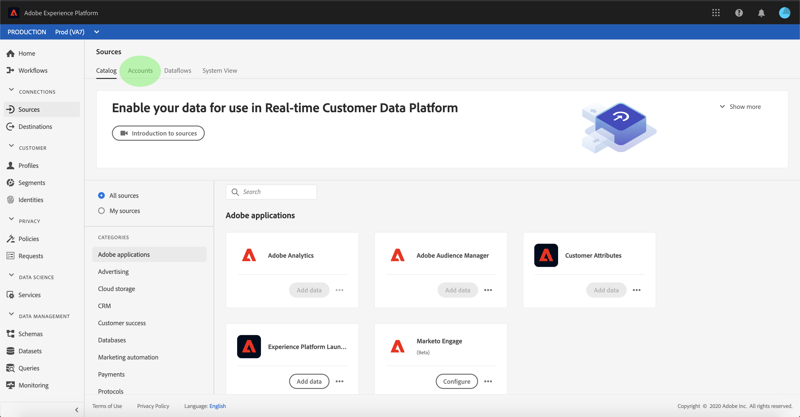
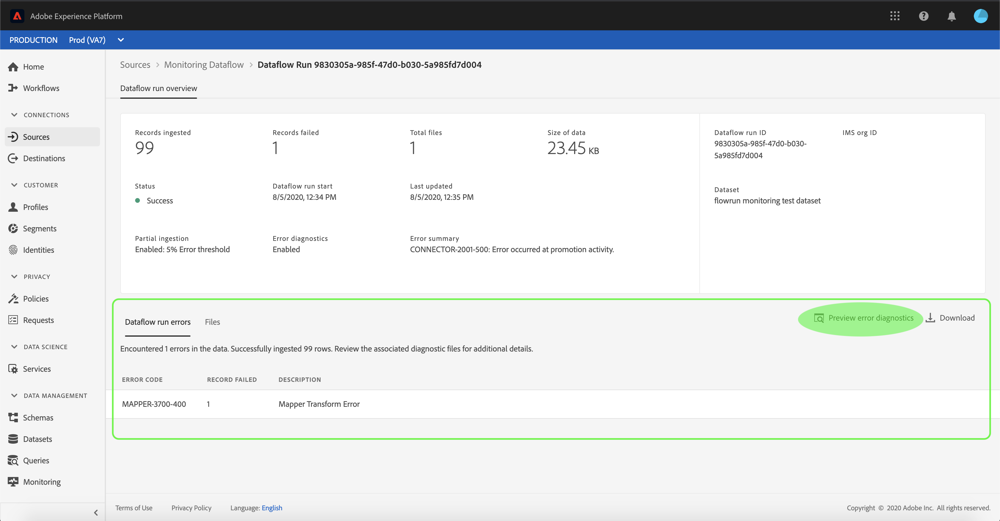

# Monitor accounts and dataflows in the UI

Source connectors in Adobe Experience Platform provide the ability to ingest externally sourced data on a scheduled basis. This tutorial provides steps for viewing existing accounts and dataflows from the *[!UICONTROL Sources]* workspace.

## Erste Schritte

Dieses Tutorial setzt ein Grundverständnis der folgenden Komponenten von Adobe Experience Platform voraus:

- [Experience-Datenmodell (XDM)-System](../../../xdm/home.md)[!DNL Experience Platform]: Das standardisierte Framework, mit dem Kundenerlebnisdaten organisiert.
   - [Grundlagen der Schemakomposition](../../../xdm/schema/composition.md): Machen Sie sich mit den Grundbausteinen von XDM-Schemas sowie den zentralen Konzepten und Best Practices rund um die Erstellung von Schemas vertraut.
   - [Schema Editor tutorial](../../../xdm/tutorials/create-schema-ui.md): Learn how to create custom schemas using the Schema Editor UI.
- [Echtzeit-Kundenprofil](../../../profile/home.md): Bietet ein einheitliches Echtzeit-Kundenprofil, das auf aggregierten Daten aus verschiedenen Quellen basiert.

## Monitor accounts

Log in to [Adobe Experience Platform](https://platform.adobe.com) and then select **[!UICONTROL Sources]** from the left navigation bar to access the *[!UICONTROL Sources]* workspace. The *[!UICONTROL Catalog]* screen displays a variety of sources for which you can create accounts and dataflows with. Each source shows the number of existing accounts and dataflows associated to them.

Select *[!UICONTROL Accounts]* from the top header to view existing accounts.

The *[!UICONTROL Accounts]* pages appears. On this page is a list of viewable accounts, including information about their source, username, number of dataflows, and date of creation.

Select the funnel icon on the top left to launch the sort window.

The sorting panel allows you to access accounts from a specific source. Select the source you wish to work with and select the account from the list on the right.

Auf der Seite &quot; *[!UICONTROL Konten]* &quot;können Sie eine Liste mit vorhandenen Datenflüssen oder Zielgruppen-Datensätzen, die mit dem Konto, auf das Sie zugegriffen haben, verknüpft sind, Ansicht haben.

## Überwachen von Datenflüssen

Datenflüsse können direkt von der Seite &quot; *[!UICONTROL Katalog]* &quot;aus aufgerufen werden, ohne *[!UICONTROL Konten]* anzuzeigen. Wählen Sie *[!UICONTROL Datenflüsse]* aus der oberen Kopfzeile aus, um eine Liste der vorhandenen Datenflüsse Ansicht.

Eine Liste der vorhandenen Datenflüsse wird angezeigt. Auf dieser Seite finden Sie eine Liste mit anzeigbaren Datenflüssen, einschließlich Informationen zu Quelle, Benutzername, Anzahl der Datenflüsse und Status. Wählen Sie das Trichtersymbol oben links, das sortiert werden soll.

Das Sortierfeld wird angezeigt. Wählen Sie im Bildlaufmenü die Quelle aus, auf die Sie zugreifen möchten, und wählen Sie dann in der Liste auf der rechten Seite den Datendurchlauf aus.

Auf der Seite &quot; *[!UICONTROL Dataflow-Aktivität]* &quot;finden Sie Angaben zur Anzahl der erfassten und fehlgeschlagenen Datensätze sowie Informationen zum Datenaflow-Status und zur Verarbeitungszeit. Wählen Sie das Kalendersymbol oberhalb des Datenflusses aus, um den Zeitraum Ihrer Erfassungsdatensätze anzupassen.

Der Kalender ermöglicht die Ansicht der verschiedenen Zeitrahmen für erfasste Datensätze. Sie können zwischen den beiden voreingestellten Optionen &quot; *[!UICONTROL Letzte 7 Tage]* &quot;und &quot; *[!UICONTROL Letzte 30 Tage]*&quot;wählen. Alternativ können Sie einen benutzerdefinierten Zeitraum mithilfe des Kalenders festlegen. Wählen Sie den gewünschten Zeitraum aus und wählen Sie &quot; **[!UICONTROL Anwenden]** &quot;, um fortzufahren.

Standardmäßig wird in der Aktivität *[!UICONTROL &quot;]* Dataflow&quot;das Bedienfeld &quot; *[!UICONTROL Eigenschaften]* &quot;angezeigt, das mit dem Datenflug verknüpft ist. Wählen Sie den Fluss aus, der von der Liste ausgeführt wird, um die zugehörigen Metadaten einschließlich Informationen zur eindeutigen Ausführen-ID anzuzeigen.

Wählen Sie &quot; **[!UICONTROL Datenaflow-Run-Beginn]** &quot;aus, um auf die *[!UICONTROL Datenaflow-Übersicht]* zuzugreifen.

Die Übersicht *[!UICONTROL zum Ausführen des]* Datenflusses enthält Informationen zum Datenfluss, einschließlich Metadaten, *[!UICONTROL Teilerfassung]* -Status und zugewiesener *[!UICONTROL Fehlerschwellenwert]*. Die obere Kopfzeile enthält auch eine *[!UICONTROL Fehlerzusammenfassung]*. Die *[!UICONTROL Fehlerzusammenfassung]* enthält den spezifischen Fehler der obersten Ebene, der anzeigt, in welchem Schritt beim Erfassungsvorgang ein Fehler aufgetreten ist.

In der folgenden Tabelle finden Sie Fehlercodes, die in der *[!UICONTROL Fehlerzusammenfassung]* angezeigt werden können.

| Error code | Error Message |
| ---------- | ----------- |
| `CONNECTOR-1001-500` | &quot;Bei der Aktivität zum Kopieren ist ein Problem aufgetreten.&quot; |
| `CONNECTOR-2001-500` | &quot;Beim Kopieren der Experience Platform in den Datensatz ist ein Problem aufgetreten.&quot; |
| `CONNECTOR-3001-500` | &quot;Beim Flow-Provider ist beim Erstellen des Stapels mit der Massen-Erfassungsschnittstelle ein Problem aufgetreten.&quot; |

Die untere Hälfte des Bildschirms enthält Informationen zu *[!UICONTROL Dataflow-Ausführungsfehlern]*. Von hier aus können Sie auch die erfassten Dateien Ansicht, die Fehlerdiagnose für Vorschau und Download durchführen oder das Dateimanifest herunterladen.

Im Abschnitt &quot; *[!UICONTROL Datenflussausführungsfehler]* &quot;werden der *[!UICONTROL Fehlercode]*, die Anzahl der fehlgeschlagenen Datensätze und die Informationen zum Fehler angezeigt.

Wählen Sie **[!UICONTROL Fehlerdiagnose]** für Vorschauen aus, um weitere Informationen zum Erfassungsfehler anzuzeigen.

Das Fenster *[!UICONTROL Vorschau]* für die Fehlerdiagnose wird angezeigt. In diesem Bildschirm werden spezifische Informationen zum Erfassungsfehler angezeigt, einschließlich *[!UICONTROL Dateiname]*, *[!UICONTROL Fehlercode]*, Name der Spalte, in der der Fehler aufgetreten ist, und Beschreibung des Fehlers.

Dieser Abschnitt enthält auch eine Vorschau der Spalte, die den Fehler enthält.

>[!IMPORTANT]
>
>Zur Aktivierung der *[!UICONTROL Fehlerdiagnose-Vorschau]* müssen Sie beim Konfigurieren eines Datenflusses die *[!UICONTROL teilweise Erfassung]* und *[!UICONTROL Fehlerdiagnose]* aktivieren. Dadurch kann das System alle während der Ausführung erfassten Datensätze überprüfen.

Nach der Vorschau der Fehler können Sie im Übersichtsbedienfeld für den **[!UICONTROL UICONTROL-Datendurchlauf die Option &quot;]** Herunterladen *[&quot;auswählen, um auf die vollständige Fehlerdiagnose zuzugreifen und das Dateimanifest herunterzuladen]* . See the documents on [error diagnostics](../../../ingestion/batch-ingestion/partial.md#retrieve-errors) and [downloading metadata](../../../ingestion/batch-ingestion/partial.md#download-metadata) for more information.

For more information on monitoring dataflows and ingestion, refer to the tutorial on [monitoring streaming dataflows](../../../ingestion/quality/monitor-data-flows.md).

## Nächste Schritte

By following this tutorial, you have successfully accessed existing accounts and dataflows from the *[!UICONTROL Sources]* workspace. Incoming data can now be used by downstream [!DNL Platform] services such as [!DNL Real-time Customer Profile] and [!DNL Data Science Workspace]. See the following documents for more details:

- [Übersicht über das Echtzeit-Kundenprofil](../../../profile/home.md)
- [Übersicht über den Data Science Workspace](../../../data-science-workspace/home.md)
