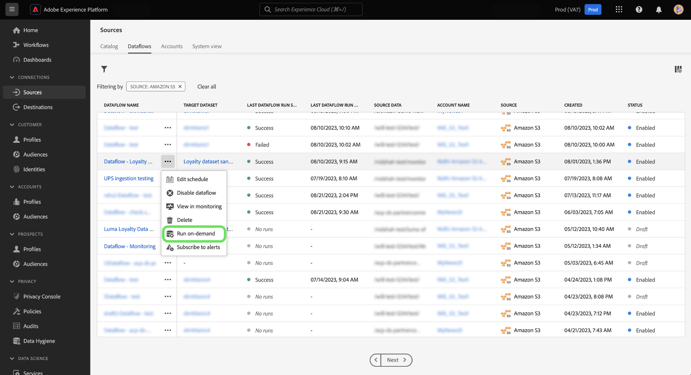
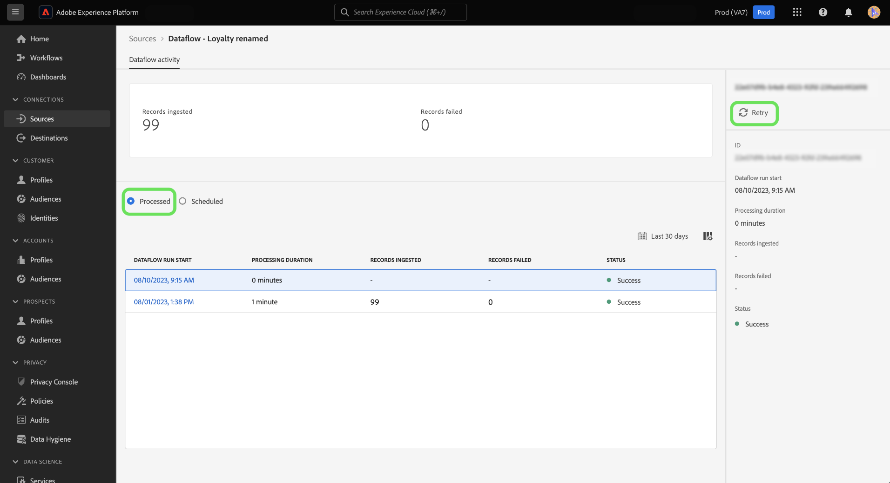

# On-Demand-Erfassung für Datenflüsse zu Quellen in der Benutzeroberfläche

Sie können die On-Demand-Erfassung verwenden, um mithilfe des Arbeitsbereichs &quot;Quellen&quot;in der Benutzeroberfläche von Adobe Experience Platform eine Fluss-Run-Iteration eines vorhandenen Datenflusses Trigger.

In diesem Dokument erfahren Sie, wie Sie Datenflüsse bei Bedarf für Quellen erstellen und wie Sie Flüsse erneut versuchen, die verarbeitet wurden oder fehlgeschlagen sind.

>[!BEGINSHADEBOX]

**Was ist ein Flusslauf?**

Flussläufe stellen eine Instanz der Ausführung des Datenflusses dar. Wenn beispielsweise ein Datenfluss für 9:00 Uhr, 10:00 Uhr und 11:00 Uhr geplant ist, haben Sie drei Instanzen eines Durchlaufs. Flussläufe sind spezifisch für Ihre jeweilige Organisation.

>[!ENDSHADEBOX]

## Erste Schritte

>[!NOTE]
>
>Um einen Flusslauf zu erstellen, müssen Sie zunächst über die Fluss-ID eines Datenflusses verfügen, der für die einmalige Erfassung geplant ist.

Dieses Dokument setzt ein Verständnis der folgenden Komponenten von Experience Platform voraus:

* [Quellen](../../home.md): Experience Platform ermöglicht die Aufnahme von Daten aus verschiedenen Quellen und bietet Ihnen die Möglichkeit, die eingehenden Daten mithilfe von Platform-Services zu strukturieren, zu kennzeichnen und anzureichern.
* [Datenflüsse](../../../dataflows/home.md): Ein Datenfluss ist eine Darstellung von Datenaufträgen, die Daten über Platform verschieben. Datenflüsse werden über verschiedene Dienste hinweg konfiguriert und ermöglichen so das Verschieben von Daten aus Quell-Connectoren in Zieldatensätze, in den Identitätsdienst und das Echtzeit-Kundenprofil sowie in Ziele.
* [Sandboxes](../../../sandboxes/home.md): Experience Platform bietet virtuelle Sandboxes, die eine einzelne Platform-Instanz in separate virtuelle Umgebungen unterteilen, damit Sie Programme für digitale Erlebnisse entwickeln und weiterentwickeln können.

## Erstellen eines Datenflusses bei Bedarf {#create-a-dataflow-on-demand}

Navigieren Sie zum *[!UICONTROL Datenflüsse]* im Arbeitsbereich &quot;Quellen&quot;angezeigt. Suchen Sie hier den Datenfluss, den Sie bei Bedarf ausführen möchten, und wählen Sie dann die Auslassungspunkte (**`...`**) neben Ihrem Dataflow-Namen.

Wählen Sie als Nächstes **[!UICONTROL On-Demand ausführen]** aus dem angezeigten Dropdown-Menü.

Konfigurieren Sie den Zeitplan Ihrer On-Demand-Erfassung. Wählen Sie die **[!UICONTROL Startzeit der Aufnahme]**, die **[!UICONTROL Startzeit des Datumsbereichs]** und die **[!UICONTROL Endzeit des Datumsbereichs]**.

| Planungskonfiguration | Beschreibung |
| --- | --- |
| [!UICONTROL Startzeit der Aufnahme] | Die geplante Zeit, zu der der On-Demand-Fluss beginnt. |
| [!UICONTROL Startzeit des Datumsbereichs] | Das früheste Datum und die früheste Uhrzeit, aus der Daten abgerufen werden. |
| [!UICONTROL Endzeit des Datumsbereichs] | Datum und Uhrzeit des Abrufs der Daten. |

Auswählen **[!UICONTROL Zeitplan]** und lassen Sie einige Augenblicke für Ihren On-Demand-Datenfluss zu Trigger zu.

Wählen Sie den Namen Ihres Datenflusses aus, um Ihre Datenfluss-Aktivität anzuzeigen. Hier sehen Sie eine Liste Ihrer Datenflug-Ausführungen, die verarbeitet wurden. Wählen Sie einen Datenfluss aus und wählen Sie dann **[!UICONTROL Wiederholen]** über die rechte Leiste aus, um die Aufnahme für eine ausgewählte DataFlow-Run-Iteration erneut auszuführen.

Auswählen **[!UICONTROL Geplant]** , um eine Liste der Datenfluss-Ausführungen anzuzeigen, die für die zukünftige Erfassung geplant sind.

## Nächste Schritte

Durch Lesen dieses Dokuments haben Sie gelernt, wie Sie Fluss-Läufe bei Bedarf für vorhandene Datenflüsse aus Quellen erstellen können. Weitere Informationen zu Quellen finden Sie im Abschnitt [Quellen - Übersicht](../../home.md)
