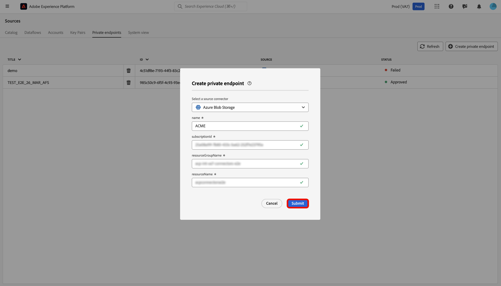

# Unterstützung privater Links für Quellen in der Benutzeroberfläche

>[!AVAILABILITY]
>
>Diese Funktion wird von den folgenden Quellen unterstützt:
>
>* [[!DNL Azure Blob Storage]](../../connectors/cloud-storage/blob.md)
>* [[!DNL ADLS Gen2]](../../connectors/cloud-storage/adls-gen2.md)
>* [[!DNL Azure File Storage]](../../connectors/cloud-storage/azure-file-storage.md)
>
>Der Support für private Links ist derzeit nur für Organisationen verfügbar, die Adobe Healthcare Shield oder Adobe Privacy &amp; Security Shield erworben haben.

Sie können die Funktion für private Links verwenden, um private Endpunkte zu erstellen, mit denen sich Ihre Adobe Experience Platform-Quellen verbinden können. Verbinden Sie Ihre Quellen mithilfe privater IP-Adressen sicher mit einem virtuellen Netzwerk, sodass keine öffentlichen IPs mehr benötigt werden und Sie Ihre Angriffsfläche reduzieren können. Vereinfachen Sie die Einrichtung Ihres Netzwerks, indem Sie die Notwendigkeit komplexer Konfigurationen für die Übersetzung von Firewall- oder Netzwerkadressen beseitigen und gleichzeitig sicherstellen, dass der Datenverkehr nur genehmigte Services erreicht.

Lesen Sie dieses Handbuch, um zu erfahren, wie Sie den Quellarbeitsbereich in der Experience Platform-Benutzeroberfläche verwenden können, um einen privaten Endpunkt zu erstellen und zu verwenden.

>[!BEGINSHADEBOX]

## Lizenznutzungsberechtigungen für die Unterstützung privater Links

Die Lizenznutzungsberechtigungsmetriken für die Unterstützung privater Links in Quellen lauten wie folgt:

* Kunden haben Anspruch auf eine Datenübertragung von bis zu 2 TB pro Jahr über unterstützte Quellen ([!DNL Azure Blob Storage], [!DNL ADLS Gen2] und [!DNL Azure File Storage]) in allen Sandboxes und Organisationen.
* Jede Organisation kann für alle Produktions-Sandboxes maximal 10 Endpunkte haben.
* Jede Organisation kann über maximal 1 Endpunkt für alle Entwicklungs-Sandboxes verfügen.

>[!ENDSHADEBOX]

## Erstellen eines privaten Endpunkts

Um mit privaten Links zu beginnen, navigieren Sie zum Katalog *[!UICONTROL Quellen]* der Experience Platform-Benutzeroberfläche und wählen Sie **[!UICONTROL Private Endpunkte]** aus dem Menü der Registerkarten im Arbeitsbereich „Quellen“ aus.

Über die Benutzeroberfläche können Sie Informationen zu vorhandenen privaten Endpunkten anzeigen, z. B. ihre ID, die zugehörige Quelle und den aktuellen Status. Um einen neuen privaten Endpunkt zu erstellen, wählen Sie **[!UICONTROL Privaten Endpunkt erstellen]** aus.

Wählen Sie als Nächstes Ihre gewünschte Quelle aus und geben Sie dann Werte für die folgenden Eigenschaften ein:

| Eigenschaft | Beschreibung |
| --- | --- |
| `name` | Der Name Ihres privaten Endpunkts. |
| `subscriptionId` | Die ID, die Ihrem [!DNL Azure]-Abonnement zugeordnet ist. Weitere Informationen finden Sie im [!DNL Azure] unter [Abrufen Ihrer Abonnement- und Mandanten-IDs aus der [!DNL Azure Portal]](https://learn.microsoft.com/en-us/azure/azure-portal/get-subscription-tenant-id). |
| `resourceGroupName` | Der Name Ihrer Ressourcengruppe auf [!DNL Azure]. Eine Ressourcengruppe enthält zugehörige Ressourcen für eine [!DNL Azure]. Weitere Informationen finden Sie im [!DNL Azure] Handbuch unter [Verwalten von Ressourcengruppen](https://learn.microsoft.com/en-us/azure/azure-resource-manager/management/manage-resource-groups-portal). |
| `resourceGroup` | Der Name Ihrer Ressource. In [!DNL Azure] bezieht sich eine Ressource auf Instanzen wie virtuelle Maschinen, Web-Anwendungen und Datenbanken. Weitere Informationen finden Sie im [!DNL Azure] Handbuch unter [Grundlegendes zum Ressourcen [!DNL Azure] Manager](https://learn.microsoft.com/en-us/azure/azure-resource-manager/management/overview). |

{style="table-layout:auto"}

Wenn Sie fertig sind, klicken Sie auf **[!UICONTROL Absenden]**..

### Genehmigen eines privaten Endpunkts

Ein neu erstellter Endpunkt verbleibt im Status „Ausstehend“, bis er von einem Administrator genehmigt wird.

Um eine private Endpunktanfrage für die [!DNL Azure Blob] und [!DNL Azure Data Lake Gen2] Quellen zu genehmigen, melden Sie sich bei der [!DNL Azure Portal] an. Klicken Sie in der linken Navigation auf **[!DNL Data storage]** und gehen Sie dann zur Registerkarte **[!DNL Security + networking]** und wählen Sie **[!DNL Networking]** aus. Wählen Sie als Nächstes **[!DNL Private endpoints]** aus, um eine Liste der mit Ihrem Konto verknüpften privaten Endpunkte und deren aktuellen Verbindungsstatus anzuzeigen. Um eine ausstehende Anfrage zu genehmigen, wählen Sie den gewünschten Endpunkt aus und klicken Sie auf **[!DNL Approve]**.

## Erstellen eines Kontos mit einem privaten Endpunkt

Navigieren Sie zum Quellkatalog und wählen Sie eine Quelle aus, die private Endpunkte unterstützt. Erstellen Sie als Nächstes ein neues Konto mit Ihrer Quelle und wählen Sie während der Kontoauthentifizierung den **[!UICONTROL Privater Endpunkt]** aus. Geben Sie die Authentifizierungsdaten Ihrer Quelle ein und wählen Sie **[!UICONTROL Mit Quelle verbinden]** Warten Sie einige Minuten, bis die Verbindung hergestellt ist.

>[!NOTE]
>
>Wenn die Option [!UICONTROL Privater Endpunkt] aktiviert ist, prüft Experience Platform, ob für die ausgewählte Quelle ein genehmigter privater Endpunkt vorhanden ist. Wenn kein genehmigter Endpunkt gefunden wird, können Sie keine Verbindung herstellen.

Navigieren Sie dann zur [!UICONTROL Vorhandenes Konto] Ihrer Quelle. Über diese Benutzeroberfläche können Sie eine Liste Ihrer bestehenden Konten und der entsprechenden Status anzeigen. Sie können das Filtersymbol  auswählen, um nur die Konten anzuzeigen, die für die Verbindung mit einem privaten Endpunkt aktiviert wurden.

Wählen Sie das gewünschte Konto aus und aktivieren Sie dann **[!UICONTROL Interaktives Authoring]**. Dieser Umschalter aktiviert [!UICONTROL Interaktives Authoring], eine [!DNL Azure] Funktion, mit der Sie Verbindungen testen, Ordnerlisten durchsuchen und Daten in der Vorschau anzeigen können. Die Aktivierung [!UICONTROL Interaktives Authoring] ist für private Endpunktverbindungen erforderlich. Beachten Sie, dass Sie diesen Umschalter nicht manuell deaktivieren können. Er wird nach 60 Minuten automatisch deaktiviert.

[!UICONTROL Interaktives Authoring] benötigt einige Minuten, um zu aktivieren. Nachdem die Einstellung aktiviert ist, klicken Sie **[!UICONTROL Weiter]**, um mit dem nächsten Schritt fortzufahren und die Daten auszuwählen, die Sie aufnehmen möchten.

## Nächste Schritte

Nachdem Sie erfolgreich einen privaten Endpunkt erstellt haben, können Sie Quellverbindungen und Datenflüsse erstellen und Daten mithilfe privater Endpunkte aufnehmen. In den folgenden Handbüchern finden Sie Informationen zum Erstellen von Datenflüssen in der Benutzeroberfläche:

* [Datenfluss für eine Cloud-Speicherquelle erstellen](../ui/dataflow/batch/cloud-storage.md)
* [Erstellen eines Datenflusses für eine Datenbankquelle](../ui/dataflow/databases.md)
