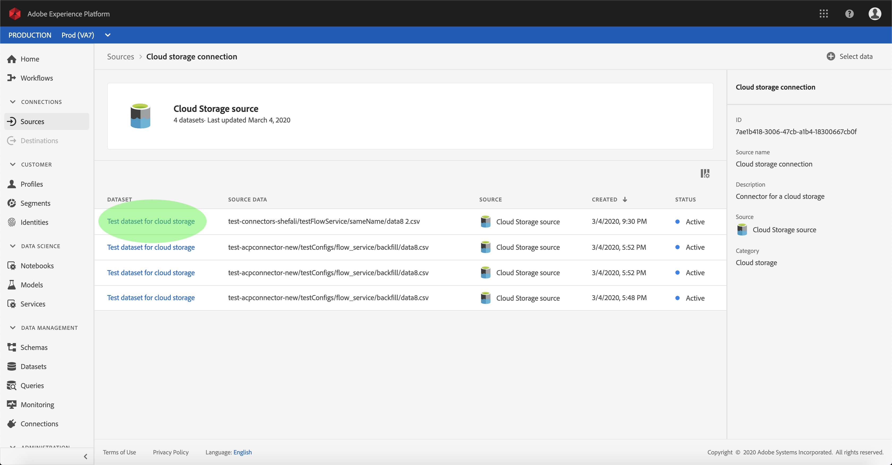

# Aktivieren Sie eingehende Quelldaten, um Kundendaten zu füllen.

Eingehende Daten aus Ihrem Quell-Connector können zur Bereicherung und zum Ausfüllen Ihrer Echtzeit-Kundendaten verwendet werden.

## Erste Schritte

Dieses Lernprogramm erfordert ein Verständnis der folgenden Komponenten der Adobe Experience Platform:

- [Erlebnis-Datenmodell (XDM)-System](../../../xdm/home.md): Das standardisierte Framework, mit dem Experience Platform Kundenerlebnisdaten organisiert.
   - [Grundlagen der Zusammensetzung](../../../xdm/schema/composition.md)des Schemas: Erfahren Sie mehr über die grundlegenden Bausteine von XDM-Schemas, einschließlich der wichtigsten Grundsätze und Best Practices bei der Schema-Komposition.
   - [Schema-Editor-Lernprogramm](../../../xdm/tutorials/create-schema-ui.md): Erfahren Sie, wie Sie mit der Benutzeroberfläche des Schema-Editors benutzerdefinierte Schema erstellen.
- [Echtzeit-Profil](../../../profile/home.md): Bietet ein einheitliches, Echtzeit-Profil für Kunden, das auf aggregierten Daten aus mehreren Quellen basiert.

Darüber hinaus erfordert dieses Lernprogramm, dass Sie bereits einen Quellanschluss erstellt und konfiguriert haben.  Eine Liste von Übungen zum Erstellen verschiedener Connectors in der Benutzeroberfläche finden Sie in der Übersicht über die [Quell-Connectors](../../home.md).

## Daten zum Echtzeit-Profil von Kunden ausfüllen

Um die Profile von Kunden zu bereichern, muss das Quell-Schema des Zielgruppe-Datasets für die Verwendung im Echtzeit-Customer-Profil kompatibel sein. Ein kompatibles Schema erfüllt folgende Anforderungen:

- Das Schema hat mindestens ein Attribut, das als Identitätseigenschaft angegeben wurde.
- Das Schema verfügt über eine Identitätseigenschaft, die als primäre Identität definiert ist.
- Eine Zuordnung innerhalb des Datenflusses ist vorhanden, wobei die primäre Zielgruppe ein Attribut ist.

Klicken Sie im Quellenarbeitsbereich auf die Registerkarte &quot; **Durchsuchen** &quot;, um Ihre Basisverbindungen Liste. Suchen Sie in der angezeigten Liste die Verbindung, die den Datenfluss enthält, mit dem Sie Profil füllen möchten. Klicken Sie auf den Namen der Verbindung, um deren Details anzuzeigen.

Der Bildschirm &quot; *Quelldaten* &quot;der Verbindung wird angezeigt und zeigt die Datensätze an, in die die Verbindung Quelldaten eingibt. Klicken Sie auf den Namen des Datensatzes, den Sie zum Profil aktivieren möchten.

Der Bildschirm &quot; *Aktivität* des Datensatzes&quot;wird angezeigt. In der Spalte &quot; *Eigenschaften* &quot;auf der rechten Seite des Bildschirms werden die Details des Datensatzes angezeigt. Sie enthält einen **Profil** -Schalter und einen Link zum Schema, dem der Datensatz entspricht. Klicken Sie auf den Namen des Schemas, um seine Zusammensetzung Ansicht.

Der *Schema-Editor* wird angezeigt und zeigt die Struktur des Schemas in der mittleren Arbeitsfläche an. Wählen Sie auf der Arbeitsfläche das Feld aus, das als primäre Identität festgelegt werden soll. Aktivieren Sie unter der angezeigten Registerkarte *Feldeigenschaften* das Kontrollkästchen **Identität** und anschließend **Primäre Identität**. Wählen Sie schließlich einen entsprechenden **Identitäts-Namensraum** und klicken Sie dann auf **Übernehmen**.

Klicken Sie auf das Objekt auf der obersten Ebene der Struktur des Schemas, und die Spalte mit den Eigenschaften des *Schemas* wird angezeigt. Aktivieren Sie das Schema zum Profil, indem Sie auf den **Profil** -Schalter umschalten. Klicken Sie auf **Speichern** , um die Änderungen abzuschließen.

Nachdem das Schema zum Profil aktiviert wurde, kehren Sie zum Bildschirm &quot; *Datenaset-Aktivität* &quot;zurück und aktivieren Sie den Datensatz zum Profil, indem Sie auf den Umschalter **Profil** in der Spalte &quot; *Eigenschaften* &quot;klicken.

Wenn sowohl das Schema als auch der Datensatz zum Profil aktiviert sind, füllen die in diesen Datensatz erfassten Daten nun auch die Profil der Kunden aus.

>[!NOTE] Vorhandene Daten in einem kürzlich aktivierten Datensatz werden nicht von Profil genutzt

## Nächste Schritte

In diesem Lernprogramm haben Sie die eingehenden Daten für die Profil-Population erfolgreich aktiviert. Weitere Informationen finden Sie in der Übersicht über das [Echtzeit-Profil](../../../profile/home.md).