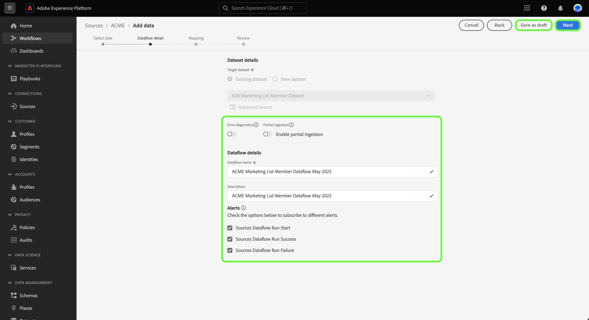

# Erstellen eines Quellen-Datenflusses mithilfe von Vorlagen in der Benutzeroberfläche {#create-a-sources-dataflow-using-templates-in-the-ui}

>[!CONTEXTUALHELP]
>id="platform_sources_marketo_mapping"
>title="Vorlagen für Quellen in der Platform-Benutzeroberfläche"
>abstract="Zu Vorlagen gehören automatisch generierte Assets wie Schemata, Datensätze, Identitäten, Zuordnungsregeln, Identity-Namespaces und Datenflüsse, die Sie beim Einbringen von Daten aus einer Quelle in Experience Platform verwenden können. Sie können automatisch generierte Assets aktualisieren, um sie an Anwendungsfälle anzupassen."

>[!IMPORTANT]
>
>Vorlagen befinden sich in der Beta-Phase und werden von den folgenden Quellen unterstützt:
>
>* [[!DNL Marketo Engage]](../../connectors/adobe-applications/marketo/marketo.md)
>* [[!DNL Microsoft Dynamics]](../../connectors/crm/ms-dynamics.md)
>* [[!DNL Salesforce]](../../connectors/crm/salesforce.md)
>
>Dokumentation und Funktionalität können sich ändern.

Adobe Experience Platform stellt vorkonfigurierte Vorlagen bereit, mit denen Sie den Datenerfassungsprozess beschleunigen können. Zu Vorlagen gehören automatisch generierte Assets wie Schemata, Datensätze, Identitäten, Zuordnungsregeln, Identitäts-Namespaces und Datenflüsse, die Sie beim Einbringen von Daten aus einer Quelle in Experience Platform verwenden können.

Mit Vorlagen können Sie:

* die Amortisierungszeit der Datenaufnahme durch Beschleunigung der vorlagenbasierten Asset-Erstellung reduzieren.
* Fehler minimieren, die während der manuellen Datenerfassung auftreten können.
* automatisch generierte Assets zu jedem Zeitpunkt entsprechend Ihren Anwendungsfällen aktualisieren.

Das folgende Tutorial enthält Schritte zur Verwendung von Vorlagen in der Platform-Benutzeroberfläche.

## Erste Schritte

Dieses Tutorial setzt ein Grundverständnis der folgenden Komponenten von Experience Platform voraus:

* [Quellen](../../home.md): Experience Platform ermöglicht die Aufnahme von Daten aus verschiedenen Quellen und bietet Ihnen die Möglichkeit, die eingehenden Daten mithilfe von Platform-Services zu strukturieren, zu kennzeichnen und anzureichern.
* [[!DNL Experience Data Model (XDM)] System](../../../xdm/home.md): Das standardisierte Framework, mit dem Experience Platform Kundenerlebnisdaten organisiert.
* [Sandboxes](../../../sandboxes/home.md): Experience Platform bietet virtuelle Sandboxes, die eine einzelne Platform-Instanz in separate virtuelle Umgebungen unterteilen, damit Sie Programme für digitale Erlebnisse entwickeln und weiterentwickeln können.

## Vorlagen in der Platform-Benutzeroberfläche verwenden {#use-templates-in-the-platform-ui}

>[!CONTEXTUALHELP]
>id="platform_sources_templates_accounttype"
>title="Geschäftstyp auswählen"
>abstract="Wählen Sie den entsprechenden Geschäftstyp für Ihren Anwendungsfall aus. Ihr Zugriff variiert je nach Ihrem Real-time Customer Data Platform-Abonnementkonto."
>additional-url="https://experienceleague.adobe.com/docs/experience-platform/rtcdp/overview.html?lang=de" text="Real-Time CDP – Übersicht"

Wählen Sie in der Platform-Benutzeroberfläche die Option **[!UICONTROL Quellen]** über die linke Navigationsleiste auf [!UICONTROL Quellen] Arbeitsbereich und sehen Sie sich einen Quellkatalog an, der unter Experience Platform verfügbar ist.

Verwenden Sie die *[!UICONTROL Kategorien]* Menü zum Filtern von Quellen nach Kategorie. Geben Sie alternativ einen Quellnamen in die Suchleiste ein, um eine bestimmte Quelle aus dem Katalog zu finden.

Navigieren Sie zu [!UICONTROL Adobe-Anwendungen] -Kategorie, um die [!DNL Marketo Engage] Quellkarte und wählen Sie dann [!UICONTROL Daten hinzufügen] um zu beginnen.

Es wird ein Popup-Fenster angezeigt, in dem Sie die Möglichkeit haben, Vorlagen zu durchsuchen oder vorhandene Schemata und Datensätze zu verwenden.

* **Vorlagen durchsuchen**: Quellvorlagen erstellen automatisch Schemata, Identitäten, Datensätze und Datenflüsse mit Zuordnungsregeln für Sie. Sie können diese Assets nach Bedarf anpassen.
* **Meine vorhandenen Assets verwenden**: Nehmen Sie Ihre Daten mit vorhandenen Datensätzen und Schemata auf, die Sie erstellt haben. Sie können bei Bedarf auch neue Datensätze und Schemata erstellen.

Um automatisch generierte Assets zu verwenden, wählen Sie **[!UICONTROL Vorlagen durchsuchen]** und dann **[!UICONTROL Auswählen]** aus.

### Authentifizierung

Der Authentifizierungsschritt wird angezeigt und Sie werden aufgefordert, entweder ein neues Konto zu erstellen oder ein vorhandenes Konto zu verwenden.

>[!BEGINTABS]

>[!TAB Vorhandenes Konto verwenden]

Um ein vorhandenes Konto zu verwenden, wählen Sie [!UICONTROL Vorhandenes Konto] und dann das Konto, das Sie verwenden möchten, aus der angezeigten Liste aus.

>[!TAB Neues Konto erstellen]

Um ein neues Konto zu erstellen, wählen Sie **[!UICONTROL Neues Konto]** aus und geben Sie dann Ihre Details zur Quellverbindung und Anmeldedaten für die Kontoauthentifizierung an. Wenn Sie fertig sind, wählen Sie **[!UICONTROL Mit Quelle verbinden]** und warten Sie dann einige Zeit, bis die neue Verbindung hergestellt ist.

>[!ENDTABS]

### Vorlagen auswählen

Nachdem Ihr Konto authentifiziert wurde, können Sie jetzt die Vorlage auswählen, die Sie für Ihren Datenfluss verwenden möchten.

+++[!DNL Marketo Engage] Vorlagen In der folgenden Tabelle sind die für die [!DNL Marketo Engage] -Quelle.

| [!DNL Marketo Engage] templates | Beschreibung |
| --- | --- |
| Aktivitäten | Die Aktivitätsvorlage erfasst ereignisbasierte Momentaufnahmen von Aktivitäten wie E-Mail-Interaktionen, Website-Interaktionen und Verkaufsaufrufen. |
| Firmen | Die Unternehmensvorlage erfasst Geschäftskontodetails wie firmografische Informationen, Standort und Rechnungsinformationen des Unternehmens. |
| Benannte Konten | Die Vorlage Spezifische Konten erfasst Details zu Konten, die als Zielkonten für die Verfolgung bestimmt wurden. |
| Opportunitys | Die Angebotsvorlage erfasst Details zu Geschäftschancen wie Typ, Verkaufsstufe und zugehörige Konten. |
| Kontaktrollen für Opportunity | Die Vorlage Kontaktrollen für Chancen erfasst Details zu den Rollen für Leads, die mit einer bestimmten Gelegenheit verknüpft sind. |
| Personen | Die Personenvorlage erfasst Attribute für einzelne Personen, wie demografische Details, Kontaktinformationen und Zustimmungseinstellungen. |
| Programmmitgliedschaften | Die Vorlage Programmmitgliedschaften erfasst Details zu Kontakten, die mit einer Unternehmenskampagne verbunden sind, einschließlich Pflegekadenzen und Kontaktantworten. |
| Programme | Die Programmvorlage erfasst Details zu Geschäftskampagnen wie Status, Kanäle, Zeitpläne und Kosten. |
| Statische Listenzugehörigkeiten | Die Vorlage Statische Listenmitgliedschaften erfasst die Beziehungen zwischen Personen und deren Mitgliedschaft in statischen Listen. |
| Statische Listen | Die Vorlage Statische Liste erfasst instanziierte Listen von Personen für bestimmte Anwendungsfälle. |

{style="table-layout:auto"}

+++

+++[!DNL Salesforce] B2B-Vorlagen In der folgenden Tabelle sind die für die Variablen [!DNL Salesforce] -Quelle.

| [!DNL Salesforce] B2B-Vorlagen | Beschreibung |
| --- | --- |
| Kontokontaktrelation | Die Vorlage für die Kontokontaktbeziehung erfasst die Beziehung zwischen einem Kontakt und einem oder mehreren Konten. |
| Konten | Die Kontovorlage erfasst Geschäftskontodetails wie firmografische Informationen, Ort und Rechnungsinformationen des Unternehmens. |
| Campaign-Mitglieder | Die Vorlage &quot;Campaign Members&quot;erfasst die Beziehung zwischen einem einzelnen Lead oder Kontakt und einem bestimmten [!DNL Salesforce] Kampagne. |
| Kampagnen | Die Kampagnenvorlage erfasst Geschäftskontodetails wie firmografische Informationen, Ort und Rechnungsinformationen des Unternehmens. |
| Kontakte | Die Kontaktvorlage erfasst Attribute für Kontakte wie demografische Details, Kontaktinformationen und verwandte Geschäftseinheiten. |
| Leads | Die Leads-Vorlage erfasst Attribute für Leads wie demografische Details, Kontaktinformationen und verwandte Geschäftseinheiten. |
| Opportunitys | Die Angebotsvorlage erfasst Details zu Geschäftschancen wie Typ, Verkaufsstufe und zugehöriges Konto. |
| Kontaktrollen für Opportunity | Die Vorlage Kontaktrollen für Chancen erfasst Details zu den Rollen für Leads, die mit einer bestimmten Gelegenheit verknüpft sind. |

{style="table-layout:auto"}

+++

+++[!DNL Salesforce] B2C-Vorlagen In der folgenden Tabelle sind die für die [!DNL Salesforce] -Quelle.

| [!DNL Salesforce] B2C-Vorlagen | Beschreibung |
| --- | --- |
| Kontakt | Die Kontaktvorlage erfasst Attribute für Kontakte wie demografische Details, Kontaktinformationen und verwandte Geschäftseinheiten. |
| Lead | Die Lead-Vorlage erfasst Attribute für Leads wie demografische Details, Kontaktinformationen und verwandte Geschäftseinheiten. |

{style="table-layout:auto"}

+++

+++[!DNL Microsoft Dynamics] B2B-Vorlagen In der folgenden Tabelle sind die für die Variablen [!DNL Microsoft Dynamics] -Quelle.

| [!DNL Microsoft Dynamics] B2B-Vorlagen | Beschreibung |
| --- | --- |
| Konten | Die Kontovorlage erfasst Geschäftskontodetails wie firmografische Informationen, Ort und Rechnungsinformationen des Unternehmens. |
| Kampagnen | Die Kampagnenvorlage erfasst Geschäftskontodetails wie firmografische Informationen, Ort und Rechnungsinformationen des Unternehmens. |
| Kontakte | Die Kontaktvorlage erfasst Attribute für Kontakte wie demografische Details, Kontaktinformationen und verwandte Geschäftseinheiten. |
| Leads | Die Leads-Vorlage erfasst Attribute für Leads wie demografische Details, Kontaktinformationen und verwandte Geschäftseinheiten. |
| Marketingliste | Die Vorlage Marketingliste erfasst eine Gruppe bestehender oder potenzieller Kunden, die für eine Marketing-Kampagne oder andere Vertriebszwecke erstellt wurden. |
| Marketing-Listenmitglieder | Die Mitglieder der Marketing-Liste erfassen die Details eines beliebigen Kundendatensatzes, wie z. B. Leads, Konten oder Kontakte, in einer Marketing-Liste. |
| Opportunitys | Die Angebotsvorlage erfasst Details zu Geschäftschancen wie Typ, Verkaufsstufe und zugehöriges Konto. |
| Kontaktrollen für Opportunity | Die Vorlage Kontaktrollen für Chancen erfasst Details zu den Rollen für Leads, die mit einer bestimmten Gelegenheit verknüpft sind. |

{style="table-layout:auto"}

+++

+++[!DNL Microsoft Dynamics] B2C-Vorlagen In der folgenden Tabelle sind die für die [!DNL Microsoft Dynamics] -Quelle.

| [!DNL Microsoft Dynamics] B2C-Vorlagen | Beschreibung |
| --- | --- |
| Kontakt | Die Kontaktvorlage erfasst Attribute für Kontakte wie demografische Details, Kontaktinformationen und verwandte Geschäftseinheiten. |
| Lead | Die Lead-Vorlage erfasst Attribute für Leads wie demografische Details, Kontaktinformationen und verwandte Geschäftseinheiten. |

{style="table-layout:auto"}

+++

Je nach ausgewähltem Geschäftstyp wird eine Liste mit Vorlagen angezeigt. Vorschausymbol auswählen  neben einem Vorlagennamen, um eine Vorschau der Beispieldaten aus der Vorlage anzuzeigen.

Das Vorschaufenster wird angezeigt, in dem Sie Beispieldaten aus Ihrer Vorlage analysieren und überprüfen können. Wenn Sie fertig sind, wählen Sie **[!UICONTROL Verstanden]** aus.

Wählen Sie als Nächstes aus der Liste die Vorlage aus, die Sie verwenden möchten. Sie können mehrere Vorlagen auswählen und mehrere Datenflüsse gleichzeitig erstellen. Eine Vorlage kann jedoch nur einmal pro Konto verwendet werden. Nachdem Sie Ihre Vorlagen ausgewählt haben, klicken Sie auf **[!UICONTROL Beenden]** und gewähren Sie etwas Zeit, um die Assets zu generieren.

Wenn Sie ein oder mehrere Elemente aus der Liste der verfügbaren Vorlagen auswählen, werden weiterhin alle B2B-Schemata und Identitäts-Namespaces generiert, um sicherzustellen, dass B2B-Beziehungen zwischen Schemata korrekt konfiguriert sind.

>[!NOTE]
>
>Bereits verwendete Vorlagen werden von der Auswahl ausgeschlossen.

### Festlegen eines Zeitplans

Die [!DNL Microsoft Dynamics] und [!DNL Salesforce] -Quellen unterstützen beide die Planung von Datenflüssen.

Verwenden Sie die Planungsschnittstelle, um einen Aufnahmezeitplan für Ihre Datenflüsse zu konfigurieren. Legen Sie die Aufnahmefrequenz auf **Einmal** , um eine einmalige Erfassung zu erstellen.

Alternativ können Sie die Aufnahmefrequenz auf **Minute**, **Stunde**, **Tag** oder **Woche**. Wenn Sie Ihren Datenfluss für mehrere Erfassungsvorgänge planen, müssen Sie ein Intervall festlegen, um einen Zeitrahmen zwischen jeder Aufnahme festzulegen. Eine Erfassungsfrequenz, die beispielsweise auf **Stunde** und ein Intervall festgelegt auf **15** bedeutet, dass Ihr Datenfluss Daten alle **15 Stunden**.

Während dieses Schritts können Sie auch **Aufstockung** und definieren eine Spalte für die inkrementelle Datenaufnahme. Die Aufstockung wird verwendet, um historische Daten zu erfassen, während die Spalte, die Sie für die inkrementelle Erfassung definieren, es ermöglicht, neue Daten von vorhandenen Daten zu unterscheiden.

Nachdem Sie die Konfiguration Ihres Aufnahmezeitplans abgeschlossen haben, wählen Sie **[!UICONTROL Beenden]**.

### Überprüfen von Assets {#review-assets}

>[!CONTEXTUALHELP]
>id="platform_sources_templates_review"
>title="Überprüfen der automatisch generierten Assets"
>abstract="Die Generierung aller Assets kann bis zu fünf Minuten dauern. Wenn Sie die Seite verlassen möchten, erhalten Sie die Benachrichtigung zum Zurückkehren, wenn die Assets abgeschlossen sind. Sie können die Assets überprüfen, sobald sie generiert wurden, und jederzeit zusätzliche Konfigurationen an Ihrem Datenfluss vornehmen."

Die Seite [!UICONTROL Vorlagen-Assets überprüfen] zeigt die Assets an, die automatisch als Teil Ihrer Vorlage generiert wurden. Auf dieser Seite können Sie die automatisch generierten Schemata, Datensätze, Identitäts-Namespaces und Datenflüsse anzeigen, die mit Ihrer Quellverbindung verknüpft sind. Die Generierung aller Assets kann bis zu fünf Minuten dauern. Wenn Sie die Seite verlassen möchten, erhalten Sie die Benachrichtigung zum Zurückkehren, wenn die Assets abgeschlossen sind. Sie können die Assets überprüfen, sobald sie generiert wurden, und jederzeit zusätzliche Konfigurationen an Ihrem Datenfluss vornehmen.

Standardmäßig werden automatisch generierte Datenflüsse auf den Entwurfsstatus gesetzt, um eine weitere Anpassung von Konfigurationen zu ermöglichen, z. B. Zuordnungsregeln oder geplante Frequenzen. Wählen Sie die Auslassungszeichen (`...`) neben dem Namen des Datenflusses und wählen Sie dann **[!UICONTROL Zuordnungen in der Vorschau anzeigen]** , um die für Ihren Datenfluss erstellten Zuordnungssätze anzuzeigen.

Eine Vorschauseite wird angezeigt, auf der Sie die Zuordnungsbeziehung zwischen Ihren Quelldatenfeldern und den Zielschemafeldern überprüfen können. Nachdem Sie die Zuordnungen Ihres Datenflusses angezeigt haben. Klicken Sie auf **[!UICONTROL Verstanden]**.

Sie können Ihre Datenflüsse jederzeit nach der Ausführung aktualisieren. Klicken Sie auf die Auslassungszeichen (`...`) neben dem Namen des Datenflusses und dann auf **[!UICONTROL Datenfluss aktualisieren]**. Sie gelangen auf die Seite mit dem Quellen-Workflow, auf der Sie Ihre Datenflussdetails aktualisieren können, einschließlich der Einstellungen für die partielle Aufnahme, Fehlerdiagnose und Warnbenachrichtigungen sowie der Zuordnung Ihres Datenflusses.

Sie können die Ansicht des Schema-Editors verwenden, um am automatisch erstellten Schema Aktualisierungen vorzunehmen. Besuchen Sie das Handbuch unter [Verwenden des Schema-Editors](../../../xdm/tutorials/create-schema-ui.md) für weitere Informationen.

>[!TIP]
>
>Sie können auf Ihren Datenfluss zu Entwürfen über die [!UICONTROL Datenflüsse] Katalogseite im Arbeitsbereich &quot;Quellen&quot;. Auswählen **[!UICONTROL Datenflüsse]** aus der oberen Kopfzeile und wählen Sie dann den Datenfluss aus, den Sie in der Liste aktualisieren möchten.
>
>

### Datenfluss veröffentlichen

Starten Sie den Veröffentlichungsprozess, indem Sie den Quellen-Workflow durchlaufen. Nachdem Sie [!UICONTROL Aktualisieren des Datenflusses], werden Sie zum *[!UICONTROL Daten hinzufügen]* Schritt des Workflows. Klicken Sie auf **[!UICONTROL Weiter]**, um fortzufahren.

Bestätigen Sie anschließend Ihre Datenflussdetails und konfigurieren Sie die Einstellungen für Fehlerdiagnosen, partielle Erfassung und Warnhinweise. Wenn Sie fertig sind, klicken Sie auf die Schaltfläche **[!UICONTROL Weiter]**.

>[!NOTE]
>
>Sie können **[!UICONTROL Als Entwurf speichern]** jederzeit beenden und speichern Sie die Änderungen, die Sie an Ihrem Datenfluss vorgenommen haben.

Der Zuordnungsschritt wird angezeigt. In diesem Schritt können Sie die Zuordnungskonfigurationen Ihres Datenflusses neu konfigurieren. Eine umfassende Anleitung zu den für die Zuordnung verwendeten Datenvorbereitungsfunktionen finden Sie im [Benutzerhandbuch zur Datenvorbereitung](../../../data-prep/ui/mapping.md).

Überprüfen Sie abschließend die Details Ihres Datenflusses und wählen Sie **[!UICONTROL Speichern und aufnehmen]** , um Ihren Entwurf zu veröffentlichen.

## Nächste Schritte

In diesem Tutorial haben Sie jetzt Datenflüsse sowie Assets wie Schemata, Datensätze und Identitäts-Namespaces mithilfe von Vorlagen erstellt. Allgemeine Informationen zu Quellen finden Sie unter [Quellen – Übersicht](../../home.md).

## Warnhinweise und Benachrichtigungen {#alerts-and-notifications}

Vorlagen werden von Adobe Experience Platform-Warnhinweisen unterstützt. Sie können im Benachrichtigungsfenster Aktualisierungen zum Status Ihrer Assets erhalten und zur Überprüfungsseite zurückkehren.

Klicken Sie auf das Benachrichtigungssymbol in der oberen Kopfzeile der Platform-Benutzeroberfläche und wählen Sie die Statuswarnung aus, um die Assets anzuzeigen, die Sie überprüfen möchten.

Sie können die Warnhinweiseinstellungen Ihrer Vorlagen aktualisieren, um sowohl E-Mail- als auch In-Platform-Benachrichtigungen zum Status Ihrer Datenflüsse zu erhalten. Weitere Informationen zum Konfigurieren von Warnhinweisen finden Sie im Handbuch unter [Abonnieren von Warnhinweisen für Datenflüsse zu Quellen](../ui/alerts.md).