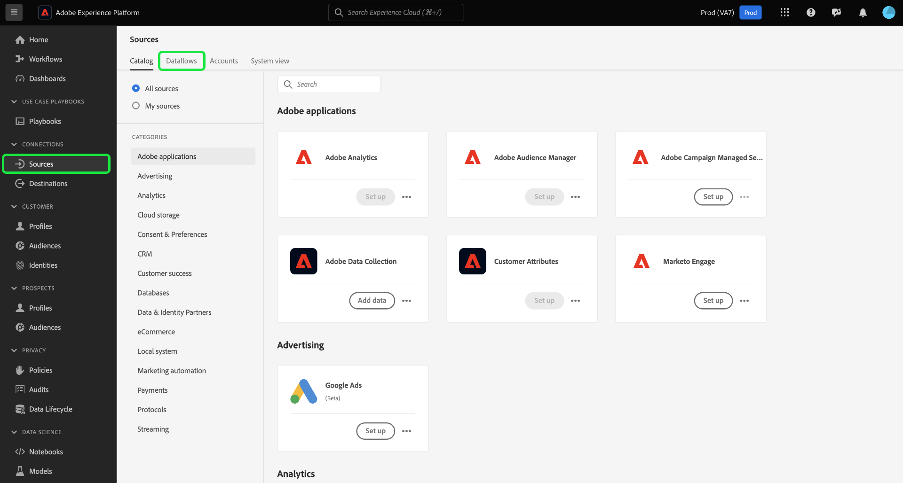
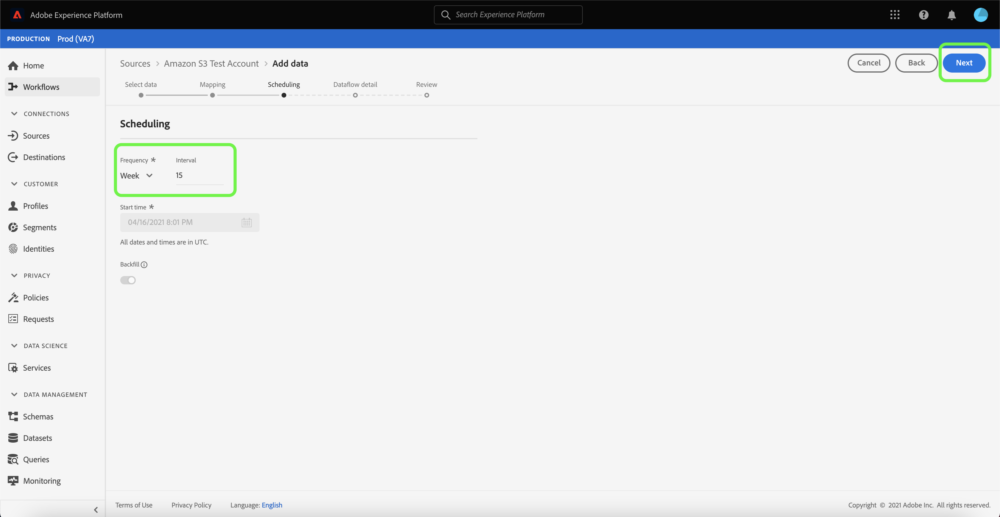

# Aktualisieren von Datenflüssen in der Benutzeroberfläche

In diesem Tutorial erfahren Sie, wie Sie einen vorhandenen Datenfluss aktualisieren, einschließlich Informationen zum Bearbeiten eines Datenflusszeitplans und -zuordnung unter Verwendung des Arbeitsbereichs [!UICONTROL Quellen].

## Erste Schritte

Dieses Tutorial setzt ein Grundverständnis der folgenden Komponenten von Adobe Experience Platform voraus:

- [Quellen](../../home.md): Experience Platform ermöglicht die Erfassung von Daten aus verschiedenen Quellen und bietet Ihnen gleichzeitig die Möglichkeit, eingehende Daten mithilfe von Platform-Diensten zu strukturieren, zu beschriften und zu erweitern.
- [Sandboxes](../../../sandboxes/home.md): Experience Platform bietet virtuelle Sandboxes, die eine einzelne Platform-Instanz in separate virtuelle Umgebungen unterteilen, damit Sie Anwendungen für digitale Erlebnisse entwickeln und weiterentwickeln können.

## Zuordnung bearbeiten

>[!NOTE]
>
>Die Bearbeitungszuordnungsfunktion wird für die folgenden Quellen derzeit nicht unterstützt: Adobe Analytics, Adobe Audience Manager, HTTP-API und [!DNL Marketo Engage].

Wählen Sie in der Platform-Benutzeroberfläche **[!UICONTROL Quellen]** aus dem linken Navigationsbereich aus, um auf den Arbeitsbereich [!UICONTROL Quellen] zuzugreifen. Wählen Sie **[!UICONTROL Datenflüsse]** aus der oberen Kopfzeile aus, um eine Liste der vorhandenen Datenflüsse anzuzeigen.

Die Seite [!UICONTROL Datenflüsse] enthält eine Liste aller vorhandenen Datenflüsse, einschließlich Informationen zum Ausführungsstatus, zum letzten Ausführungsdatum und zum Kontonamen.

Wählen Sie oben links das Filtersymbol  aus, um das Sortierungsfenster zu öffnen.

Das Sortierungsfenster bietet eine Liste aller verfügbaren Quellen. Sie können mehrere Quellen aus der Liste auswählen, um auf eine gefilterte Auswahl von Datenflüssen aus verschiedenen Quellen zuzugreifen.

Wählen Sie die Quelle aus, mit der Sie arbeiten möchten, um eine Liste der vorhandenen Datenflüsse anzuzeigen. Nachdem Sie den zu aktualisierenden Datenfluss identifiziert haben, wählen Sie die Auslassungszeichen (`...`) neben dem Kontonamen aus.

Es wird ein Dropdown-Menü mit Optionen zum Aktualisieren des ausgewählten Datenflusses angezeigt. Von hier aus können Sie die Zuordnungs- und Erfassungszeitpläne eines Datenflusses aktualisieren. Sie können auch Optionen zum Überprüfen des Datenflusses im Monitoring-Dashboard sowie zum Deaktivieren oder Löschen des Datenflusses auswählen.

Wählen Sie **[!UICONTROL Quelle bearbeiten]** aus, um die Zuordnung zu aktualisieren.

Der Schritt [!UICONTROL Daten hinzufügen] wird angezeigt. Wählen Sie das entsprechende Datenformat aus, um den Inhalt der ausgewählten Daten zu überprüfen, und klicken Sie dann auf **[!UICONTROL Weiter]**, um fortzufahren.

Die Seite [!UICONTROL Mapping] bietet eine Schnittstelle, über die Sie Zuordnungssätze hinzufügen und entfernen können, die mit Ihrem Datensatz verknüpft sind.

>[!TIP]
>
>Zuordnungsaktualisierungen werden nur auf in der Zukunft geplante Datenfluss-Läufe angewendet.

Wählen Sie **[!UICONTROL Neue Zuordnung hinzufügen]** aus, um einen neuen Zuordnungssatz hinzuzufügen.

Geben Sie als Nächstes das entsprechende Quellfeldattribut und die XDM-Zielfeldwerte ein, um Ihren zusätzlichen Zuordnungssatz abzuschließen. Wählen Sie **[!UICONTROL Weiter]** aus, um fortzufahren.

Der Schritt [!UICONTROL Planung] wird angezeigt, mit dem Sie den Aufnahmeplan Ihres Datenflusses aktualisieren und die ausgewählten Quelldaten automatisch mit den aktualisierten Zuordnungen erfassen können.

>[!NOTE]
>
>Sie können keine Zuordnungssätze für Datenflüsse aktualisieren, die für die einmalige Erfassung geplant waren und deren Startzeit in der Vergangenheit liegt.

Auf der Seite [!UICONTROL Datenfluss-Detail] können Sie einen aktualisierten Namen und eine Beschreibung für Ihren Datenfluss angeben und den Fehlerschwellenwert Ihres Datenflusses neu konfigurieren.

Nachdem Sie die aktualisierten Werte angegeben haben, wählen Sie **[!UICONTROL Weiter]** aus.

Der Schritt **[!UICONTROL Überprüfen]** wird angezeigt, sodass Sie Ihren Datenfluss überprüfen können, bevor er aktualisiert wird.

Nachdem Sie Ihren Datenfluss überprüft haben, wählen Sie **[!UICONTROL Beenden]** aus und lassen Sie etwas Zeit für den Datenfluss zu, wobei die neuen Zuordnungssätze erstellt werden.

## Zeitplan bearbeiten

Um den Erfassungszeitplan eines vorhandenen Datenflusses zu bearbeiten, wählen Sie die Auslassungszeichen (`...`) neben einem Datenflussnamen aus und wählen Sie dann **[!UICONTROL Zeitplan bearbeiten]** aus dem Dropdown-Menü aus.

Das Dialogfeld **[!UICONTROL Zeitplan bearbeiten]** bietet Optionen zum Aktualisieren der Erfassungsfrequenz und Intervallrate Ihres Datenflusses. Nachdem Sie die aktualisierten Häufigkeits- und Intervallwerte festgelegt haben, wählen Sie **[!UICONTROL Speichern]** aus.

>[!NOTE]
>
>Sie können einen Datenfluss, der für die einmalige Erfassung geplant war, nicht neu planen.

| Zeitplan | Beschreibung |
| ---------- | ----------- |
| Häufigkeit | Die Häufigkeit, mit der der Datenfluss Daten erfasst. Zulässige Werte für den Zeitplan für die Bearbeitungsfrequenz eines bereits vorhandenen Datenflusses umfassen: `minute`, `hour`, `day` oder `week`. |
| Intervall | Das Intervall bezeichnet den Zeitraum zwischen zwei aufeinander folgenden Durchsatzausführungen. Der Wert des Intervalls sollte eine Ganzzahl ungleich null sein und größer oder gleich `15` sein. |

Nach einigen Augenblicken wird unten im Bildschirm ein Bestätigungsfeld angezeigt, um eine erfolgreiche Aktualisierung zu bestätigen.

## Nächste Schritte

In diesem Tutorial haben Sie erfolgreich den Arbeitsbereich [!UICONTROL Quellen] verwendet, um den Erfassungszeitplan und die Zuordnungssätze Ihres Datenflusses zu aktualisieren.

Anweisungen zum programmgesteuerten Ausführen dieser Vorgänge mithilfe der [!DNL Flow Service]-API finden Sie im Tutorial zum Aktualisieren von Datenflüssen mithilfe der Flow Service-API](../../tutorials/api/update-dataflows.md).[
