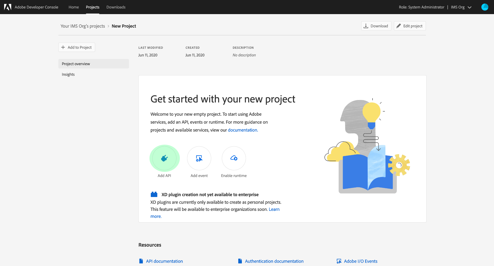
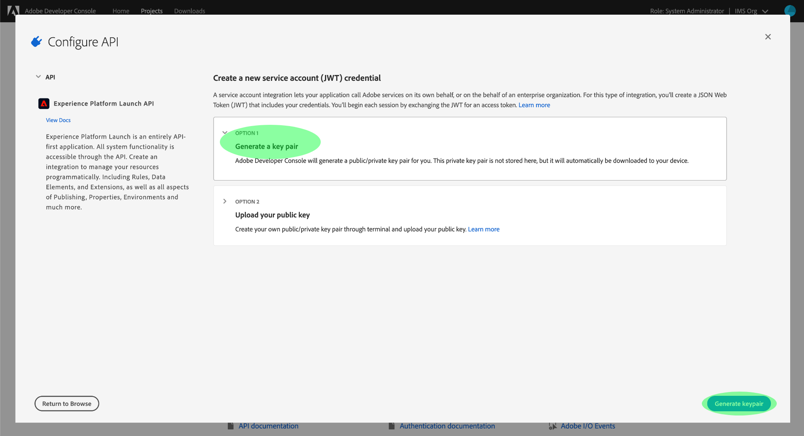
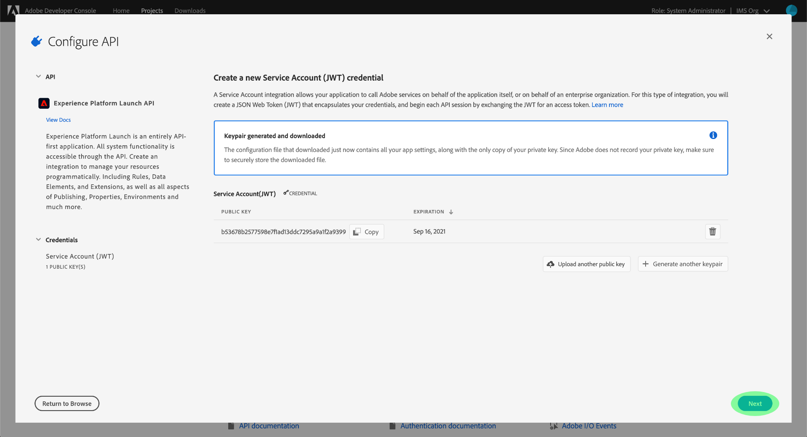
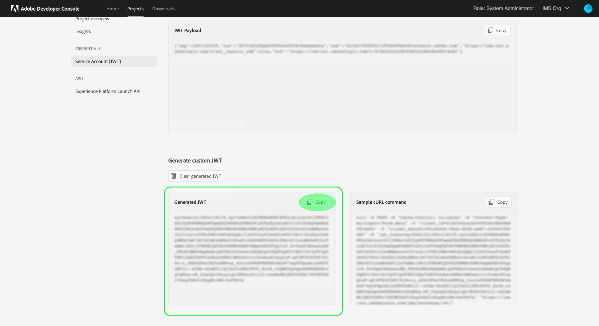

# Erste Schritte mit der Reactor-API

Um die [Reactor-API](https://www.adobe.io/experience-platform-apis/references/reactor/) verwenden zu können, muss jede Anfrage die folgenden Authentifizierungs-Header enthalten:

* `Authorization: Bearer {ACCESS_TOKEN}`
* `x-api-key: {API_KEY}`
* `x-gw-ims-org-id: {ORG_ID}`

In diesem Handbuch wird beschrieben, wie Sie die Adobe-Entwicklerkonsole verwenden, um die Werte für die einzelnen Header zu erfassen, damit Sie Aufrufe an die Reactor-API durchführen können.

## Erhalten von Entwicklerzugriff auf Adobe Experience Platform

Bevor Sie Authentifizierungswerte für die Reactor-API generieren können, müssen Sie über Entwicklerzugriff auf Experience Platform verfügen. Um Entwicklerzugriff zu erhalten, führen Sie die ersten Schritte im [Authentifizierungs-Tutorial für Experience Platform](https://experienceleague.adobe.com/docs/experience-platform/landing/platform-apis/api-authentication.html?lang=de) aus. Sobald Sie den Schritt „Anmeldeinformationen in der Adobe-Entwicklerkonsole generieren“ erreicht haben, kehren Sie zu diesem Tutorial zurück, um die spezifischen Anmeldeinformationen für die Reactor-API zu generieren.

## Generieren von Zugriffsberechtigungen

Mithilfe der Adobe-Entwicklerkonsole müssen Sie die folgenden drei Zugriffsberechtigungen generieren:

* `{ORG_ID}`
* `{API_KEY}`
* `{ACCESS_TOKEN}`

Die ID (`{ORG_ID}`) Ihrer IMS-Organisation und der API-Schlüssel (`{API_KEY}`) können, wenn sie einmal generiert worden sind, in zukünftigen API-Aufrufen wiederverwendet werden. Ihr Zugriffs-Token (`{ACCESS_TOKEN}`) ist jedoch temporär und muss alle 24 Stunden neu generiert werden.

Die Schritte zum Generieren dieser Werte werden im Folgenden detailliert beschrieben.

### Einmalige Einrichtung

Wechseln Sie zur [Adobe-Entwicklerkonsole](https://www.adobe.com/go/devs_console_ui) und melden Sie sich mit Ihrer Adobe ID an. Führen Sie anschließend die im Tutorial [Erstellen eines leeren Projekts](https://www.adobe.io/apis/experienceplatform/console/docs.html#!AdobeDocs/adobeio-console/master/projects-empty.md) in der Dokumentation zur Entwicklerkonsole beschriebenen Schritte aus.

Nachdem Sie ein Projekt erstellt haben, wählen Sie **API hinzufügen** im Bildschirm **Projektübersicht** aus.



Der Bildschirm **API hinzufügen** wird angezeigt. Wählen Sie **Experience Platform Reactor-API** aus der Liste der verfügbaren APIs, bevor Sie auf **Weiter** klicken.


Im nächsten Bildschirm werden Sie aufgefordert, eine Berechtigung für ein JSON Web Token (JWT) zu erstellen, die entweder ein neues Schlüsselpaar generiert oder Ihren eigenen öffentlichen Schlüssel hochlädt. Wählen Sie für dieses Tutorial die Option **Schlüsselpaar generieren** und dann **Schlüsselpaar generieren** in der rechten unteren Ecke.



Im nächsten Bildschirm wird bestätigt, dass das Schlüsselpaar erfolgreich generiert wurde und ein komprimierter Ordner mit einem öffentlichen Zertifikat und einem privaten Schlüssel automatisch auf den Computer heruntergeladen wird. Dieser private Schlüssel ist in einem späteren Schritt erforderlich, um ein Zugriffs-Token zu generieren.

Klicken Sie auf **Weiter**, um fortzufahren.



Im nächsten Bildschirm werden Sie aufgefordert, ein oder mehrere Produktprofile auszuwählen, die mit der API-Integration verknüpft werden sollen.

>[!NOTE]
>
>Produktprofile werden von Ihrem Unternehmen über die Adobe Admin Console verwaltet und enthalten bestimmte Berechtigungssätze für granulare Funktionen. Produktprofile und ihre Berechtigungen können nur von Benutzern mit Administratorrechten innerhalb Ihres Unternehmens verwaltet werden. Wenn Sie sich nicht sicher sind, welche Produktprofile für die API ausgewählt werden sollen, wenden Sie sich an Ihren Administrator.

Wählen Sie die gewünschten Produktprofile aus der Liste aus und klicken Sie dann auf **Konfigurierte API speichern**, um die API-Registrierung abzuschließen.


Nachdem die API zum Projekt hinzugefügt wurde, wird die Projektseite erneut auf der Seite der Experience Platform Reactor-API angezeigt. Scrollen Sie von hier nach unten zum Abschnitt **Service-Konto (JWT)**, der die folgenden Zugriffsberechtigungen bereitstellt, die für alle Aufrufe der Reactor-API erforderlich sind:

* **CLIENT-ID**: Die Client-ID ist der erforderliche `{API_KEY}`, der im `x-api-key`-Header angegeben werden muss.
* **ORGANISATIONS-ID**: Die Organisations-ID ist der `{ORG_ID}`-Wert, der im `x-gw-ims-org-id`-Header verwendet werden muss.


### Authentifizierung für jede Sitzung

Nachdem Sie nun über die Werte `{API_KEY}` und `{ORG_ID}` verfügen, generiert der letzte Schritt einen `{ACCESS_TOKEN}`-Wert.

>[!NOTE]
>
>Diese Token laufen nach 24 Stunden ab. Wenn Sie diese Integration für ein Programm verwenden, empfiehlt es sich, Ihr Träger-Token programmgesteuert aus Ihrem Programm abzurufen.

Je nach Anwendungsfall haben Sie zwei Möglichkeiten, Ihre Zugriffs-Token zu generieren:

* [Manuelles Generieren von Token](#manual)
* [Programmgesteuertes Generieren von Token](#program)

#### Manuelles Generieren von Zugriffs-Token {#manual}

Öffnen Sie den zuvor heruntergeladenen privaten Schlüssel in einem Texteditor oder Browser und kopieren Sie den Inhalt. Navigieren Sie dann zurück zur Entwicklerkonsole und fügen Sie den privaten Schlüssel in den Abschnitt **Zugriffs-Token generieren** auf der Reactor-API-Seite für Ihr Projekt ein, bevor Sie **Token generieren** auswählen.


Es wird ein neues Zugriffs-Token generiert und eine Schaltfläche zum Kopieren des Tokens in die Zwischenablage bereitgestellt. Dieser Wert wird für den erforderlichen `Authorization`-Header verwendet und muss im Format `Bearer {ACCESS_TOKEN}` angegeben werden.


#### Programmgesteuertes Generieren von Zugriffs-Token {#program}

Wenn Sie Ihre Integration für ein Programm verwenden, können Sie über API-Anfragen programmgesteuert Zugriffs-Token generieren. Um dies zu erreichen, müssen Sie die folgenden Werte abrufen:

* Client-ID (`{API_KEY}`)
* Client-Geheimnis (`{SECRET}`)
* Ein JSON-Web-Token (`{JWT}`)

Ihre Client-ID und Ihr Client-Geheimnis können Sie auf der Hauptseite für Ihr Projekt abrufen, wie im [vorherigen Schritt](#one-time-setup) dargestellt.


Um Ihre JWT-Berechtigung zu erhalten, navigieren Sie im linken Navigationsbereich zu **Service-Konto (JWT)** und wählen Sie dann die Registerkarte **JWT generieren** aus. Fügen Sie auf dieser Seite unter **Benutzerdefiniertes JWT generieren** den Inhalt Ihres privaten Schlüssels in das bereitgestellte Textfeld ein und wählen Sie dann **Token generieren** aus.


Das generierte JWT wird unten angezeigt, sobald die Verarbeitung abgeschlossen ist, zusammen mit einem cURL-Beispielbefehl, mit dem Sie das Token bei Bedarf testen können. Verwenden Sie die Schaltfläche **Kopieren**, um das Token in die Zwischenablage zu kopieren.



Nachdem Sie Ihre Anmeldedaten gesammelt haben, können Sie den untenstehenden API-Aufruf in Ihr Programm integrieren, um Zugriffs-Token programmgesteuert zu generieren.

**Anfrage**

Die Anfrage muss eine `multipart/form-data`-Payload senden und Ihre Authentifizierungsberechtigungen angeben, wie unten gezeigt:

```shell
curl -X POST \
  https://ims-na1.adobelogin.com/ims/exchange/jwt/ \
  -H 'Content-Type: multipart/form-data' \
  -F 'client_id={API_KEY}' \
  -F 'client_secret={SECRET}' \
  -F 'jwt_token={JWT}'
```

**Antwort**

Eine erfolgreiche Antwort gibt ein neues Zugriffs-Token sowie die Anzahl der Sekunden zurück, die bis zu seinem Ablauf verbleiben.

```json
{
  "token_type": "bearer",
  "access_token": "{ACCESS_TOKEN}",
  "expires_in": 86399999
}
```

| Eigenschaft | Beschreibung |
| :-- | :-- |
| `access_token` | Der neu generierte Wert des Zugriffs-Tokens. Dieser Wert wird für den erforderlichen `Authorization`-Header verwendet und muss im Format `Bearer {ACCESS_TOKEN}` angegeben werden. |
| `expires_in` | Die verbleibende Zeit bis zum Ablauf des Tokens in Millisekunden. Sobald ein Token abläuft, muss ein neues generiert werden. |

{style=&quot;table-layout:auto&quot;}

## Nächste Schritte

Durch Befolgen der Schritte in diesem Tutorial sollten Sie über gültige Werte für `{ORG_ID}`, `{API_KEY}` und `{ACCESS_TOKEN}` verfügen. Sie können diese Werte jetzt testen, indem Sie sie in einer einfachen cURL-Anfrage an die Reactor-API verwenden.

Beginnen Sie mit dem Versuch, einen API-Aufruf durchzuführen, um [alle Unternehmen aufzulisten](./endpoints/companies.md#list).

>[!NOTE]
>
>Möglicherweise haben Sie in Ihrer Organisation keine Unternehmen. In diesem Fall lautet die Antwort HTTP-Status 404 (Nicht gefunden). Solange kein 403-Fehler (Verboten) ausgegeben wird, sind Ihre Zugangsdaten gültig und funktionieren.

Sobald Sie sich vergewissert haben, dass Ihre Zugriffsberechtigungen funktionieren, lesen Sie die weitere API-Referenzdokumentation, um mehr über die vielen Funktionen der API zu erfahren.

## Zusätzliche Ressourcen

JWT-Bibliotheken und SDKs: [https://jwt.io/](https://jwt.io/)

Postman-API-Entwicklung: [https://www.postman.com/](https://www.postman.com/)
