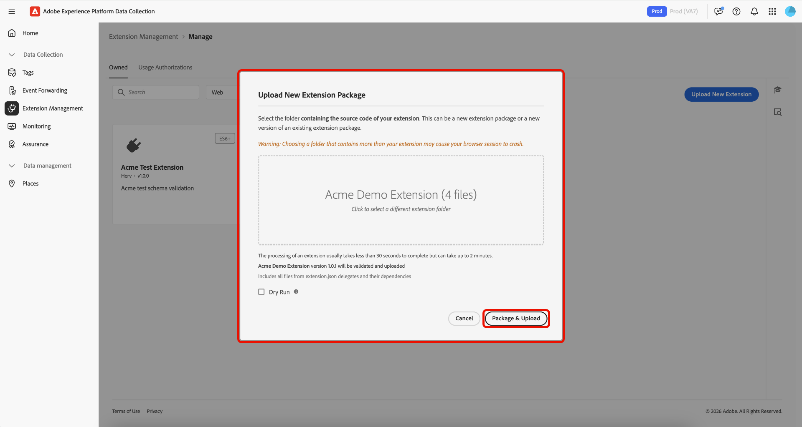

# Verwaltung von Tags-Erweiterungen

Mit Adobe Experience Platform können Sie **[!UICONTROL Owned]** verwalten. Sie können neue Erweiterungen hochladen, neue Versionen bereitstellen und entweder für die private oder öffentliche Verfügbarkeit freigeben.

## Verwalten einer Erweiterung  {#manage-extension}

Nachdem Sie Ihr Erweiterungspaket lokal vorbereitet haben, verwenden Sie **[!UICONTROL Extension Management]** in der Datenerfassungs-Benutzeroberfläche, um es hochzuladen, das Paket zu validieren und Versionen über die Verfügbarkeit **Entwicklung**, **Privat** und **Öffentlich** veröffentlichen. Anschließend können Sie die Erweiterung in einer Eigenschaft installieren und zum Testen verwenden.

### Hochladen einer Erweiterung {#upload-extension}

Um eine Erweiterung hochzuladen, navigieren Sie zur Datenerfassungs-Benutzeroberfläche und wählen Sie **[!UICONTROL Extension Management]** in der linken Navigationsleiste aus. Wählen Sie von hier aus die Registerkarte **[!UICONTROL Owned]** . Auf dieser Registerkarte werden alle Erweiterungen angezeigt, die Ihnen oder Ihrem Unternehmen gehören. Sie sind nach Plattform getrennt, und Sie können mithilfe der Dropdown-Liste sehen, welche Erweiterungen auf den einzelnen Plattformen (Web, Mobile und Edge) vorhanden sind. Wählen Sie **[!UICONTROL Upload New Extension]** aus.

Klicken **auf der Seite „Neue Erweiterung**, auf **[!UICONTROL Select Extension Folder]**, navigieren Sie zu dem Ordner, der Ihre Erweiterung enthält, wählen Sie den Ordner aus und klicken Sie dann auf **[!UICONTROL Upload]**.

Bestätigen Sie die Anzahl der Dateien, die hochgeladen werden sollen, indem Sie **[!UICONTROL Upload]** auswählen.

Die Anzahl der Dateien, die hochgeladen werden, wird angezeigt, einschließlich Name und Version der Erweiterung. Sie haben die Möglichkeit, eine **[!UICONTROL Dry Run]** durchzuführen, mit der eine ZIP-Datei zur Überprüfung auf Ihren lokalen Computer heruntergeladen wird. Wählen Sie **[!UICONTROL Validate & Upload]** aus.

Die Bestätigung, dass Ihre Erweiterung erfolgreich hochgeladen und verarbeitet wurde, wird zusammen mit Ihrer **Erweiterungspaket-ID** angezeigt. Wählen Sie **[!UICONTROL Close]** aus, um zur Registerkarte **[!UICONTROL Owned]** zurückzukehren, auf der Ihre Erweiterung angezeigt wird.

Sie kehren zur Registerkarte [!UICONTROL Owned] zurück, auf der die hochgeladene Erweiterung angezeigt wird.

>[!IMPORTANT]
>
>Erweiterungen werden in der **Entwicklung“**. Erweiterungen in **Entwicklung** Verfügbarkeit können erst freigegeben werden, wenn sie für die (**)** Verfügbarkeit freigegeben wurden.

### Freigeben einer Erweiterung {#release-extension}

Um die Erweiterung für den privaten Gebrauch freizugeben, wählen Sie Ihre Erweiterung aus, um das Informationsfenster auf der rechten Seite anzuzeigen. Hier können Sie die folgenden Details der Erweiterung sehen:

* **Version** - Zeigt die neueste Version und den Status an, in dem sie sich derzeit befindet. Über das Dropdown-Menü können Sie den Versionsverlauf der Erweiterung anzeigen.
* **Aktionen** - Ermöglicht das **[!UICONTROL Upload New Version]** der Erweiterung und der **[!UICONTROL Release To Private]**.
* **ID des Erweiterungspakets** wird unten angezeigt. Dies ändert sich je nach ausgewählter Version.

Klicken Sie auf **[!UICONTROL Release To Private]** und dann erneut auf **[!UICONTROL Release To Private]** , um die Freigabe zu bestätigen.

Sie erhalten eine Bestätigung, sobald die Erweiterung erfolgreich für die (private **Verfügbarkeit** wurde. Die aktualisierte Verfügbarkeit wird im rechten Bereich angezeigt.

>[!NOTE]
>
>Sobald die Erweiterung für &quot;**&quot; freigegeben**, kann sie für andere Organisationen freigegeben werden.

Um die Erweiterung für die Verfügbarkeit **Öffentlich** freizugeben, wählen Sie **[!UICONTROL Request Public Release]** im rechten Bedienfeld aus.

Der **[!UICONTROL Release Extension Package]** Bildschirm enthält Details, die auf dem Anfrageformular erforderlich sind, sowie die Option, die Details zu kopieren. Wählen Sie **[!UICONTROL Go To Request Form]** aus.

Eine neue Browser-Registerkarte mit dem Anfrageformular wird geöffnet. Kopieren Sie die Informationen aus dem **[!UICONTROL Release Extension Package]** und fügen Sie sie in die entsprechenden Felder ein. Reichen Sie das ausgefüllte Formular zur Überprüfung ein. Sie werden benachrichtigt, sobald die Erweiterung veröffentlicht wurde.

## Erweiterungspakete für andere Organisationen freigeben {#share-extension}

>[!NOTE]
>
>Erweiterungspakete müssen eine private oder öffentliche Version aufweisen, damit sie über [!UICONTROL Usage Authorizations] freigegeben werden können. Versionen, die als Entwicklungsverfügbarkeit gekennzeichnet sind, können nicht freigegeben werden und werden nicht in der Autorisierungs-Dropdown-Liste angezeigt. Dies gilt auch dann, wenn bereits eine frühere Version (z. B. 1.0.0) freigegeben wurde. Neuere Versionen (z. B. 1.0.1) müssen mindestens als privat eingestuft werden, bevor sie von empfangenden Organisationen autorisiert oder installiert werden können.
>
>Alle Hinweise zur Freigabe privater Erweiterungspakete gelten auch, wenn Sie diese Pakete später veröffentlichen. Dieselben Überlegungen hinsichtlich Sichtbarkeit, Versionierung, Sicherheit, Kompatibilität, Support und Dokumentation bleiben unabhängig vom Verfügbarkeitsstatus des Pakets relevant.

**[!UICONTROL Usage Authorizations]** ist eine leistungsstarke Funktion, mit der Sie private Erweiterungspakete sicher für vertrauenswürdige Partner freigeben können, ohne sie im Erweiterungskatalog öffentlich verfügbar zu machen. Verwenden Sie diese Funktion, um eine sichere Verbindung zwischen Organisationen herzustellen, sodass Sie den benutzerdefinierten Erweiterungs-Code der anderen nutzen können, während Sie den Datenschutz wahren und die Kontrolle über Ihre proprietären Lösungen behalten.

Unternehmen entwickeln häufig spezielle Erweiterungen, die auf ihre individuellen Geschäftsanforderungen zugeschnitten sind. Diese Erweiterungen können proprietäre Logik, benutzerdefinierte Integrationen oder vertrauliche Konfigurationen enthalten, die nicht öffentlich zugänglich gemacht werden sollten. Nutzungsautorisierungen lösen diese Herausforderung, indem sie Folgendes ermöglichen:

* **Selektive Freigabe**: Geben Sie private Erweiterungen nur für vertrauenswürdige Partnerorganisationen frei.
* **Wahrung der**: Vertraulichen Erweiterungs-Code aus dem öffentlichen Katalog ausschließen.
* **Kollaborative Entwicklung**: Ermöglichen Sie es vertrauenswürdigen Partnern, von Ihren individuellen Lösungen zu profitieren.
* **Kontrollierter Zugriff** Behalten Sie die volle Kontrolle darüber, wer auf Ihre privaten Erweiterungen zugreifen und diese verwenden kann.

Der Freigabeprozess umfasst zwei Hauptbeteiligte:

1. **Freigabeorganisation**: Die Organisation, die im Besitz des privaten Erweiterungspakets ist und dieses freigibt
2. **Empfängerorganisation**: Die vertrauenswürdige Organisation, die Zugriff auf die freigegebene Erweiterung erhält

Wenn eine private Version freigegeben wird, erhält die empfangende Organisation Zugriff auf diese spezifische Version, wodurch eine direkte Verbindung zwischen den beiden Organisationen hergestellt wird. Wenn eine neuere Version später als privat eingestuft wird, steht sie auch der empfangenden Organisation zur Verfügung, ohne dass diese zusätzliche Schritte ausführen muss.

### Erstellen einer Autorisierung für die Verwendung von Erweiterungspaketen {#package-usage-authorization}

Um eine Erweiterung freizugeben, navigieren Sie zur Datenerfassungs-Benutzeroberfläche und wählen Sie **[!UICONTROL Extension Management]** in der linken Navigationsleiste aus. Wählen Sie von hier aus die Registerkarte **[!UICONTROL Usage Authorizations]** .

Hier sehen Sie eine Liste der vorhandenen freigegebenen Berechtigungen, die in zwei Kategorien unterteilt sind:

* **Für diese Organisation freigegeben**: Erweiterungen, die andere Organisationen für Sie freigegeben haben.
* **Für andere Organisationen freigegeben**: Erweiterungen, die Sie für andere Organisationen freigegeben haben.

Wählen Sie **[!UICONTROL Add Authorization]** aus.

![Die Registerkarte &quot;[!UICONTROL Usage Authorizations]&quot; mit einer Liste der für diese Organisation freigegebenen Erweiterungen und hervorgehobener [!UICONTROL Add Authorization]](../images/shared-extensions/add-authorization.png)

>[!IMPORTANT]
>
>Sie müssen die **`Organization ID`** der Zielorganisation als Verantwortlichen der Organisation abrufen. Organisationen können nicht nach Namen durchsucht werden.

Wählen Sie aus der Dropdown-Liste die **[!UICONTROL Platform]** aus, für die Sie eine Erweiterung autorisieren möchten. Sie können Erweiterungen für **[!UICONTROL Web]**, **[!UICONTROL Mobile]** und **[!UICONTROL Edge]** freigeben.

Wählen Sie als Nächstes die **[!UICONTROL Extension]** aus, die Sie aus Ihren verfügbaren Erweiterungen im Dropdown-Menü freigeben möchten. In der Liste werden Erweiterungen angezeigt, die Ihrem Unternehmen gehören, zusammen mit ihrem Verfügbarkeitsstatus. Erweiterungen, deren neueste Version die Verfügbarkeit **Entwicklung** aufweist, werden nicht in dieser Liste angezeigt.

Geben Sie anschließend die Kennung der empfangenden Organisation ein und wählen Sie dann **[!UICONTROL Save]** aus.

![Die [!UICONTROL Create extension package usage authorization] mit der ausgewählten Erweiterung und der eingegebenen Adobe-Organisations-ID, wobei [!UICONTROL Save]](../images/shared-extensions/save-authorization.png) hervorgehoben wird

Sie kehren zur Registerkarte [!UICONTROL Usage Authorizations] zurück, auf der Sie die Erweiterung in Ihrer **[!UICONTROL Shared with other orgs]** sehen können. Der Status **„Genehmigung ausstehend**, bis die empfangende Organisation die Autorisierung genehmigt hat. Anschließend wird sie auf &quot;**&quot;**.

![Die Registerkarte &quot;[!UICONTROL Usage Authorizations]&quot; mit einer Liste der für andere Organisationen freigegebenen Erweiterungen, auf der die neue Autorisierung hervorgehoben ist](../images/shared-extensions/new-authorization.png)

>[!TIP]
>
>Sie können Erweiterungen auch direkt über die **[!UICONTROL Extension Catalog]** freigeben, indem Sie auf das Menü (⋯) auf der Erweiterungskarte klicken und dann im Menü die Option Freigeben auswählen.

Wenn eine Autorisierung aktiv ist, zeigt die freigegebene Erweiterung im Katalog ein ***Freigabe***-Badge an, das angibt, dass sie für andere Organisationen freigegeben wird.

![Die Registerkarte &quot;[!UICONTROL Catalog]&quot;, auf der die freigegebene Erweiterung mit dem Badge angezeigt wird](../images/shared-extensions/sharing-badge.png)

### Freigegebene Erweiterungen autorisieren und verwalten {#manage-shared-extension}

>[!NOTE]
>
>Als empfangende Organisation können Sie nur freigegebene Erweiterungen genehmigen oder ablehnen. Sie können die Autorisierungsdetails nicht verwalten oder ändern, da diese von der Freigabeorganisation gesteuert werden.

Um eine freigegebene Erweiterung für Ihr Unternehmen zu autorisieren, navigieren Sie zur Datenerfassungs-Benutzeroberfläche und wählen Sie **[!UICONTROL Extension Management]** in der linken Navigationsleiste und klicken Sie dann auf die Registerkarte **[!UICONTROL Usage Authorizations]** .

Eine Liste der freigegebenen Erweiterungen, einschließlich der Erweiterungen **Genehmigung ausstehend** finden Sie im Abschnitt **[!UICONTROL Shared with this org]** . Wählen Sie die Erweiterung aus, die Sie genehmigen möchten, und klicken Sie dann auf **[!UICONTROL Approve]**.

![Die Registerkarte &quot;[!UICONTROL Usage Authorizations]&quot; mit einer Liste der für diese Organisation freigegebenen Erweiterungen und der ausgewählten Erweiterung, die auf Genehmigung wartet, wobei [!UICONTROL Approve]](../images/shared-extensions/approve-authorization.png) hervorgehoben ist

>[!NOTE]
>
>Sie können eine Anfrage auch auf der Registerkarte **[!UICONTROL Usage Authorizations]** ablehnen, wenn die freigegebene Erweiterung für Ihre Organisation nicht mehr erforderlich ist.

Wählen Sie **[!UICONTROL OK]** im Dialogfeld **[!UICONTROL Authorization Usages]** aus.

![Das Dialogfeld &quot;[!UICONTROL Authorization Usages]&quot;, Hervorhebung [!UICONTROL OK]](../images/shared-extensions/confirmation.png)

Sie kehren zur Registerkarte [!UICONTROL Usage Authorizations] zurück, auf der Sie sehen können, dass die Erweiterung jetzt den Status **Genehmigt** aufweist.

![Die Registerkarte &quot;[!UICONTROL Usage Authorizations]&quot; mit einer Liste der für diese Organisation freigegebenen Erweiterungen, wobei die Erweiterung mit dem Status „Genehmigt“ hervorgehoben wird](../images/shared-extensions/approved-authorization.png)

Sobald die Autorisierung genehmigt wurde, ist die Erweiterung in Ihrem Katalog verfügbar und kann wie jede andere Erweiterung installiert und verwendet werden. Die freigegebene Erweiterung weist mit einem ***Empfangen*** -Badge darauf hin, dass es sich um eine Erweiterung handelt, die von einer anderen Organisation für Sie freigegeben wurde.

![Die Registerkarte &quot;[!UICONTROL Catalog]&quot;, auf der die freigegebene Erweiterung mit dem Badge „Empfangen“ angezeigt wird](../images/shared-extensions/receiving-badge.png)

### Widerrufen von Berechtigungen {#revoke-authorization}

Als Eigentümerorganisation können Sie eine Autorisierung jederzeit löschen, unabhängig von ihrem aktuellen Status (Warten auf Genehmigung, Abgelehnt oder Genehmigt).

**Wenn Ihre Erweiterung nie veröffentlicht wurde:**

* Alle privaten Versionen, die die empfangende Organisation bereits installiert hat, werden weiterhin in der Liste der installierten Erweiterungen angezeigt.
* Wenn die empfangende Organisation Ihre Erweiterung nie installiert hat, wird sie an keiner Stelle mehr in der Benutzeroberfläche angezeigt.

**Wenn Ihre Erweiterung veröffentlicht wurde:**

* Alle privaten Versionen, die von der empfangenden Organisation installiert wurden, bleiben in der Liste der installierten Erweiterungen sichtbar.
* Wenn Ihre private Version nie installiert wurde, wird die neueste öffentliche Version weiterhin im Katalog angezeigt und kann installiert werden.
* Sie können bei Bedarf auch ein Downgrade von Ihrer privaten Version auf die neueste verfügbare öffentliche Version durchführen.

Wenn Sie eine Autorisierung widerrufen, behält die empfangende Organisation bestimmte Rechte zum Schutz ihrer vorhandenen Implementierungen bei:

* **Weitere Verwendung**: Die empfangende Organisation kann weiterhin eine private Version verwenden, die bereits installiert wurde, selbst wenn Sie den Zugriff widerrufen haben.
* **Build-Schutz**: Wenn die empfangende Organisation Ihre private Version 1.0.0 installiert hat und Sie später eine private Version 1.0.1 veröffentlichen, wird die neuere Version nicht angezeigt, aber die Erstellung mit Version 1.0.0 kann ohne Unterbrechung fortgesetzt werden.
* **Zukünftige Upgrades**: Wenn Sie Ihre Erweiterung später veröffentlichen (z. B. Version 2.0.0 öffentlich freigeben), kann die empfangende Organisation von ihrer privaten Version 1.0.0 direkt auf die neue öffentliche Version 2.0.0 aktualisieren.

>[!IMPORTANT]
>
>Durch das Widerrufen der Autorisierung werden bestehende Builds oder Implementierungen nicht beschädigt. Empfängerorganisationen behalten den Zugriff auf bereits installierte private Versionen, um die Business Continuity sicherzustellen.

## Nächste Schritte {#next-steps}

In diesem Dokument wurde gezeigt, wie die Funktion „Freigegebene Erweiterung“ in Experience Platform verwendet wird. Informationen zur Entwicklung von Erweiterungen finden Sie im [Benutzerhandbuch zur Erweiterungsentwicklung](./getting-started.md).

Einen umfassenden Überblick über die Entwicklung von Erweiterungen in Experience Platform finden Sie in der [Übersichtsdokumentation](./overview.md).
