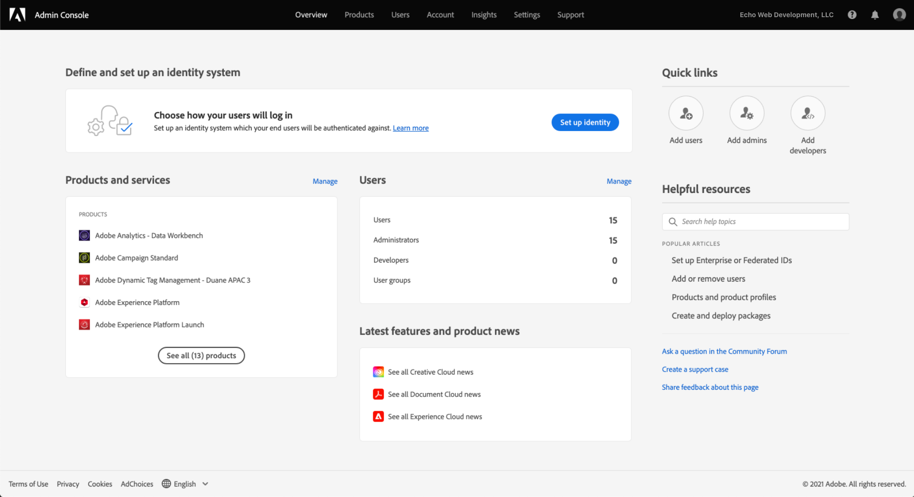

# Gewähren von Benutzerzugriff

>[!NOTE]
>
>Adobe Experience Platform Launch wurde als eine Suite von Datenerfassungstechnologien in Adobe Experience Platform umbenannt. Infolgedessen wurden in der gesamten Produktdokumentation mehrere terminologische Änderungen eingeführt. Eine konsolidierte Übersicht der terminologischen Änderungen finden Sie im folgenden [Dokument](../../term-updates.md).

Bevor Sie mit Ihrem „extension_package“ beginnen, müssen Sie für Ihre Team-Mitglieder Benutzerkonten und Berechtigungen einrichten. Sie verwenden dazu [Adobe Admin Console](https://adminconsole.adobe.com/).

In diesem Dokument werden die Schritte beschrieben, mit denen Sie Benutzern über Admin Console Zugriff auf Tags in Adobe Experience Platform gewähren.

## Voraussetzungen

In dieser Anleitung wird davon ausgegangen, dass Sie ein über Admin Console festgelegter Organisationsadministrator sind. Wenn Sie weitere Informationen zu Admin Console und zum Zuweisen von Rollen benötigen, finden Sie diese in den folgenden Ressourcen:

* [Administrations-Benutzerhandbuch](https://helpx.adobe.com/de/enterprise/administering/user-guide.html?topic=/enterprise/administering/morehelp/introduction.ug.js): Informationen zu allen Elementen und Funktionen von Admin Console
* [Unternehmensadministrationsrollen](https://helpx.adobe.com/de/enterprise/using/admin-roles.html): Weitere Informationen zu den verschiedenen Arten von Administrationsrollen. In der nachstehenden Anleitung wird davon ausgegangen, dass Sie ein Organisationsadministrator sind.

## Wählen des Unternehmens

Ihr Adobe Experience Cloud-Organisationsadministrator sollte sich bei [Admin Console](https://adminconsole.adobe.com/) anmelden. Der erste Bildschirm ist die Übersicht.

Einige von Ihnen haben möglicherweise Zugriff auf mehr als ein Unternehmen (Organisation). Um die Tag-Funktionen der richtigen Organisation hinzuzufügen, wählen Sie den Namen des Unternehmens, den Sie in der oberen rechten Ecke des Bildschirms sehen. Wählen Sie als Nächstes die Organisation, in der Sie Tags verwenden möchten, aus der Dropdown-Liste aus.

## Erstellen eines Produktprofils

Ein Produktprofil ist eine Gruppe. Produktprofilen werden individuelle Rechte zugewiesen und alle Benutzer im Profil erben diese Rechte.

Wählen Sie oben den Link **[!UICONTROL Produkte]** und links **[!UICONTROL Experience Cloud]**. Wenn die Datenerfassungs-Benutzeroberfläche nicht aufgelistet ist, sollten sich Kunden an ihr Konto-Team wenden und Partner sollten eine E-Mail an <ExchangeTechEC@adobe.com> senden.

Der obige Screenshot zeigt ein Beispielprofil, das Sie möglicherweise noch nicht haben. Um ein Profil zu erstellen, wählen Sie **[!UICONTROL Neues Profil]** aus. Fügen Sie im Bildschirm **Neues Profil erstellen** einfach einen **Profilnamen** (z. B. „Datensammlungstest“) und eine optionale **Beschreibung** hinzu und klicken Sie dann auf **[!UICONTROL Speichern]**:

Das Produktprofil wurde der Organisation hinzugefügt. Fügen Sie als Nächstes Benutzer zum Produktprofil hinzu.

## Zuweisen von Benutzern zum Produktprofil

Beachten Sie, dass im Produktprofil eine Null für **BERECHTIGTE BENUTZER** und **ADMINISTRATOREN** angezeigt wird. Klicken Sie auf den Namen des von Ihnen erstellten Produktprofils (in unserem Beispiel „Datensammlungstest“).

Wählen Sie die Registerkarte **[!UICONTROL Benutzer]** aus. Hier können Sie nach vorhandenen Adobe ID-Benutzern anhand der E-Mail-Adresse suchen oder neue Benutzer zu diesem Produktprofil hinzufügen. Wählen Sie **[!UICONTROL Benutzer-Link hinzufügen]** aus.

Geben Sie einen Namen, eine Benutzergruppe oder eine E-Mail-Adresse in das entsprechende Textfeld ein. Es wird empfohlen, wenn möglich, einen Vor- und Nachnamen anzugeben. Wählen Sie **[!UICONTROL Speichern]** aus, um den Benutzer hinzuzufügen.

Wenn alle benötigten Benutzer in diesem Produktprofil vorhanden sind, fügen wir die Berechtigungen für sie hinzu. Wählen Sie die Registerkarte **[!UICONTROL Berechtigungen]** aus. Auf dem Bildschirm mit den Berechtigungen sehen Sie **[!UICONTROL Eigenschaften]**, **[!UICONTROL Unternehmensrechte]** und **[!UICONTROL Eigentumsrechte]**. Wählen Sie **[!UICONTROL Bearbeiten]** aus.

Um Erweiterungen zu erstellen, muss Ihr Team mindestens über die folgenden Berechtigungen verfügen:

* „Eigenschaften verwalten“ aus der Unternehmensgruppe.
* „Erweiterungen verwalten“, „Umgebungen verwalten“ und „Entwickeln“ aus der Eigenschaftsgruppe.

Sie können später weitere Produktprofile mit eingeschränkteren Rechten erstellen, aber zunächst einfach **[!UICONTROL + Alle hinzufügen]** sowohl für **Unternehmensrechte** als auch für **Eigenschaftsrechte** auswählen. Stellen Sie sicher, dass Sie jeweils **[!UICONTROL Speichern]** auswählen.

Bisher haben wir die entsprechende Organisation ausgewählt, ein Produktprofil erstellt, Benutzer zum Produktprofil hinzugefügt und Berechtigungen zugewiesen.

Damit ist die erforderliche Einrichtung in der Admin Console abgeschlossen. Sie und Ihre Team-Mitglieder, die als Benutzer eingerichtet wurden, können sich jetzt bei der [Datenerfassungs-Benutzeroberfläche](https://launch.adobe.com/) anmelden.

## Bestätigen der Bereitstellung

Nachdem Ihr Unternehmen Zugriff auf Tags erhalten hat und Ihre Benutzer wie oben beschrieben eingerichtet wurden, sollten Sie auf die [Datenerfassungs-Benutzeroberfläche](https://launch.adobe.com/) zugreifen können. Wenn Sie für Tags bereitgestellt wurden und die oben genannten Schritte für die Admin Console ausgeführt haben, sich aber immer noch nicht bei der Datenerfassungs-Benutzeroberfläche anmelden können, wenden Sie sich an Ihren Adobe-Support-Mitarbeiter.
