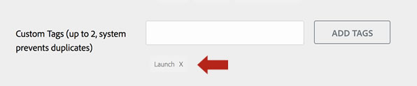

# Erstellen einer Exchange-Liste für eine Erweiterung

>[!NOTE]
>
>Adobe Experience Platform Launch wurde als eine Suite von Datenerfassungstechnologien in Adobe Experience Platform umbenannt. Infolgedessen wurden in der gesamten Produktdokumentation mehrere terminologische Änderungen eingeführt. Eine konsolidierte Übersicht der terminologischen Änderungen finden Sie im folgenden [Dokument](../../term-updates.md).

Adobe Experience Platform verfügt über einen einzigen einheitlichen Katalog, in dem Benutzer Tag-Erweiterungen anzeigen können, die für die Installation verfügbar sind. Dieser Katalog ist innerhalb des Produkts verfügbar und enthält Erweiterungen von drei Typen:

1. **Öffentliche Erweiterungen**: Hierbei handelt es sich um fertige Erweiterungen, die für die Verwendung durch beliebige Benutzer in der Produktion ausgelegt sind.
1. **Private Erweiterungen**: Hierbei handelt es sich um fertige Erweiterungen, die für die Produktion entwickelt wurden, aber von anderen Anwendern in Ihrer Firma entwickelt wurden und nur für Benutzer in Ihrer Firma verfügbar sind.
1. **Entwicklungserweiterungen**: Diese Erweiterungen befinden sich in der aktiven Entwicklung und sind nur in Ihrer Firma und nur für eine Eigenschaft verfügbar, die speziell als Entwicklungseigenschaft gekennzeichnet ist.

Neben den Erweiterungen im Produktkatalog sind im [Experience Cloud Exchange Marketplace](https://exchange.adobe.com/experiencecloud.experience-platform-launch.html#product) auch einige Erweiterungen aufgeführt.

Diese Einträge ermöglichen es Entwicklern von Erweiterungen, Beschreibungen über Funktionen zu posten, Links zu zusätzlichem Support- und Dokumentationsmaterial bereitzustellen sowie Ihre Erweiterungen für potenzielle Anwender zu vermarkten, welche Ihre Firma oder die Funktionen Ihrer Erweiterung möglicherweise noch nicht kennen. In diesem Marketplace verfügt Ihre Erweiterung über eine öffentliche Liste, die angezeigt werden kann, ohne dass der Benutzer für Platform authentifiziert ist.  Viele Entwickler finden es nützlich, einen Exchange-Eintrag zu erstellen, dies ist jedoch kein erforderlicher Schritt.

Wenn Sie keine Firma haben, um Ihr Erweiterungspaket hochzuladen und zu testen, sollten Sie sich für das Exchange-Programm registrieren und einen Eintrag erstellen.  Dadurch wird die Erstellung eines Firmenkontos ausgelöst (es dauert einige Zeit, bis dies abgeschlossen ist, Sie erhalten daraufhin eine E-Mail), mit dem Sie Ihre Erweiterung hochladen und testen können.  Sie müssen den Eintrag zu keinem Zeitpunkt öffentlich machen.

Wenn Sie bereits über ein Firmenkonto verfügen oder noch nicht planen, Ihren Eintrag abzuschließen, können Sie den Rest dieses Schritts überspringen und mit [Hochladen und Testen Ihrer Erweiterung](./upload-and-test.md) fortfahren.

## Erstellen einer Liste

>[!NOTE]
>
>Im folgenden Prozess wird die Erstellung einer Anwendungsliste im Adobe Exchange-Programm beschrieben. Dieser Begriff wird für die verschiedenen Integrationen und Erweiterungen in Adobe Experience Platform verwendet.

1. Melden Sie sich bei der [Exchange Partner-Site](https://partners.adobe.com/exchangeprogram/experiencecloud) an. Klicken Sie nach der Anmeldung auf den Link **App-Manager** neben Ihrem Namen.
1. Wählen Sie die Registerkarte **Neue Anwendung erstellen** und dann **Neue App erstellen** für eine angepasste Lösung oder wählen Sie eine entsprechende Vorlage aus.
1. Geben Sie Ihre Listeninformationen ein. Ausführliche Informationen zum App Manager finden Sie im vollständigen [Artikel](https://adobeexchangeec.zendesk.com/hc/en-us/articles/360024197931). Die Auflistungsinformationen sollten sehr klar sein, was die Erweiterung tut und warum sie nützlich ist. Die Liste dient als Marketing-Bereich für Ihre App. Erweitern Sie Ihre Erweiterung hier mit klaren Beschreibungen, Links zu Landingpages auf Ihrer Site, Links zu Hilfedokumenten oder Support-E-Mail-Adressen usw. Obwohl der Platz in den Erweiterungsansichten begrenzt ist, bietet die Exchange-Liste eine Möglichkeit, sowohl Ihre Erweiterung als auch Ihr Unternehmen zu bewerben. Im Folgenden finden Sie Vorschläge zur Verbesserung der Promotion der Erweiterung:
   - **App-Symbol**: Stellen Sie sicher, dass das Symbol für die Exchange-Liste die entsprechenden Abmessungen (512 x 512 für PNG oder 1:1-Seitenverhältnis für JPG) hat.

   >[!NOTE]
   >
   >Dies ist ein anderes Dateiformat als im Erweiterungscode verwendet. Die Erweiterung selbst enthält eine SVG-Datei als [Symbol](../manifest.md).
   - **Vorgestelltes Bild**  - Erhalten Sie Ihre Aufmerksamkeit durch die Verwendung eines Bildes, das alleine stehen kann und Ihre Marke zeigt und Ihre Anwendung hervorhebt. Das präsentierte Bild wird angezeigt, wenn ein Benutzer einen Link zu Ihrer Exchange-Liste oder zu Social Media-Beiträgen darüber teilt. Es muss daher eine Modelldarstellung Ihrer Marke sein.
   - **Logo des App-Herausgebers**: Dies ist Ihr Firmenlogo. Vergewissern Sie sich, dass das Symbol die entsprechenden Abmessungen von 1280 x 720 oder 2560 x 1440 (16:9) im PNG- oder JPG-Format aufweist.
   - **Konfigurationsanweisungen**  - Informieren Sie Kunden darüber, wie Sie Ihre Adobe Experience Platform-Erweiterung konfigurieren. Vergewissern Sie sich, dass sie alle erforderlichen Einstellungen und die nächsten Schritte verstehen, wenn die [Konfigurationsansicht](../configuration.md) unmittelbar nach der Installation Ihrer Erweiterung in einer Eigenschaft angezeigt wird. 
   - **Tags**: Auf der ersten Seite der Bearbeitung Ihrer Liste sollten Sie unbedingt das Wort „Launch“ in das Feld „Benutzerdefinierte Tags“ aufnehmen. Dadurch wird Ihre Liste bei der Suche nach Tags im Exchange Marketplace angezeigt:
      
   - **Sandboxes**  - Ihr Zugriff auf Adobe-Lösungen erfolgt über ein Sandbox-Konto, über das Sie Zugriff auf eine voll funktionsfähige Version von Adobe Experience Platform haben. Diese Sandbox-Accounts werden angefordert, wenn Sie die Liste Ihrer Applikationen erstellen. Wählen Sie im Abschnitt **Verbindungen** die spezifischen Verbindungen aus, die für die von Ihnen erstellte Anwendung gelten (Ihre Tag-Erweiterung). Wenn Sie **Speichern** drücken, wird bei Bedarf die Sandbox-Anforderung generiert.
1. Reichen Sie Ihre Liste ein. Das Adobe Exchange-Team prüft Ihre Applikation und gibt Ihnen Feedback, wenn Updates erforderlich sind. Wenn Sie das Kontrollkästchen **Sofort veröffentlichen** markieren, wenn Sie Ihre Liste übermitteln, wird sie sofort nach der Genehmigung veröffentlicht. Wenn Sie Ihre Anwendung zu einem späteren Zeitpunkt veröffentlichen möchten, lassen Sie das Kontrollkästchen deaktiviert. Wenn Ihre Erweiterungsliste genehmigt ist, wird neben ihr auf der Seite mit den Auflistungen für Ihre App (Erweiterung) eine blaue Schaltfläche **Publish** angezeigt.

### Erstellen einer effektiven Liste

Sehen Sie sich unseren [Leitfaden für die Einreichung von Mobile Apps](https://partners.adobe.com/exchangeprogram/experiencecloud/build/ec-exchange.html) an, um detaillierte Informationen dazu zu erhalten, wie Sie den ansprechendsten Eintrag erstellen.

#### Nach dem Einreichen Ihrer Exchange-Liste

Nach der Einreichung prüft das Adobe Exchange-Team die Applikation und genehmigt sie oder reagiert mit Kommentaren zu erforderlichen Änderungen. Dieser Vorgang wird im Leitfaden für die Einreichung von Applikationen beschrieben.

Wenn Sie nicht über Anmeldedaten für die Exchange-Website verfügen, stellen Sie sicher, dass Ihre E-Mail für das Exchange-Programm registriert ist, indem Sie die Anweisungen im [Leitfaden zur Programmregistrierung](https://partners.adobe.com/content/mcp/us/en/home/reg-guide.html) befolgen. Jeder Benutzer muss seine E-Mail mit dem Partnerkonto für sein Unternehmen verknüpfen. Fragen zu diesem Prozess können per E-Mail an <ExchangeHelpEC@adobe.com> weitergeleitet werden.

#### Aktualisieren Ihrer Exchange-Liste nach der ersten Genehmigung

Wenn Sie Ihre Erweiterung oder auch lediglich Ihre Exchange-Liste aktualisieren möchten, melden Sie sich beim [Partner-Portal](https://partners.adobe.com/exchangeprogram/experiencecloud) an und klicken Sie auf den Button „App Manager“ neben Ihrem Namen. Wählen Sie dann Ihre Applikation aus und folgen Sie dem obigen Fluss, der ursprünglich zum Erstellen der Auflistung verwendet wurde. Nach der erneuten Einreichung prüft das Adobe Exchange-Team die Änderungen und genehmigt entweder die Änderungen oder reagiert mit Kommentaren.

## Verknüpfen Sie Ihr Erweiterungspaket mit Ihrem Eintrag.

Nachdem Ihr Eintrag genehmigt wurde und öffentlich verfügbar ist, empfehlen wir, im Feld `exchange_url` der Datei `extension.json` innerhalb Ihres Erweiterungspakets einen Link zum öffentlichen Eintrag anzugeben.  Dadurch wird ein &quot;Mehr Infos&quot;-Link im Tag-Erweiterungskatalog erstellt, über den Benutzer innerhalb des Produkts Ihre Liste finden und zusätzliche Informationen erhalten können.
