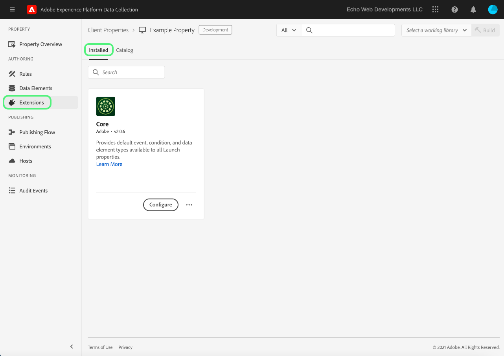
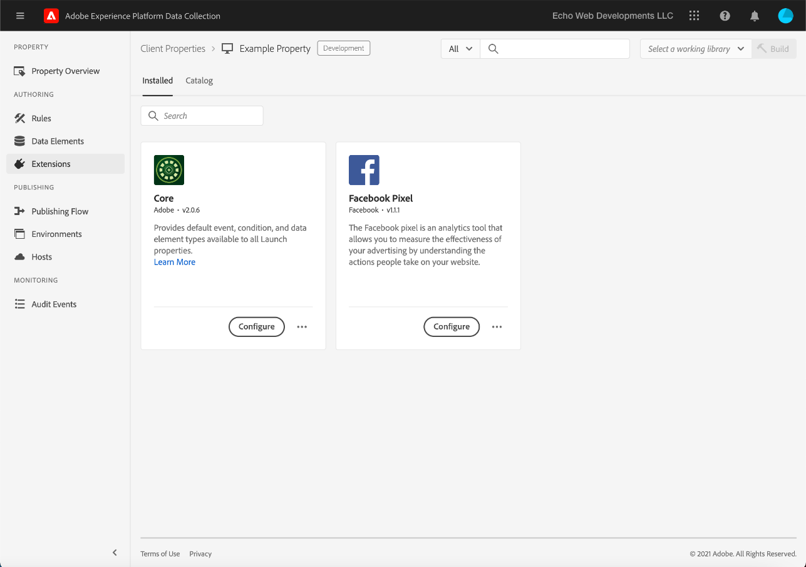
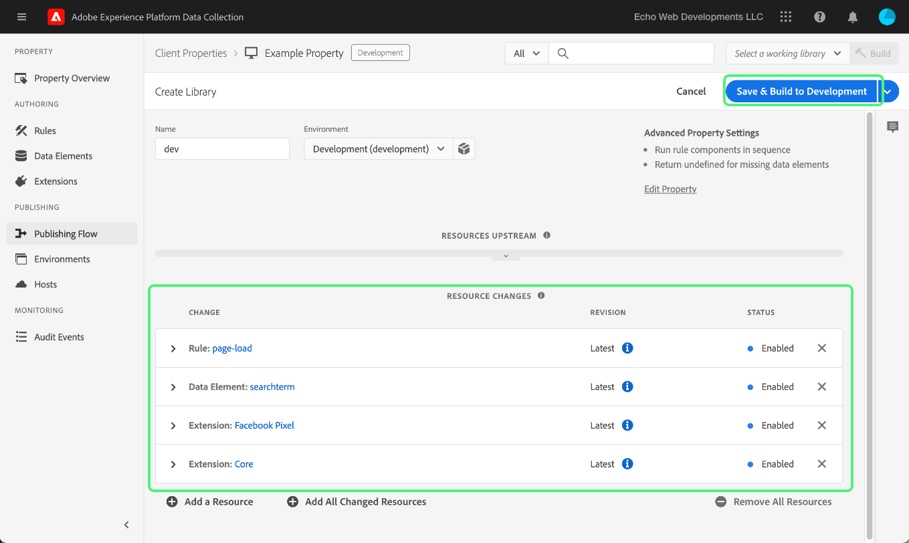

# Hochladen und Implementieren von End-to-End-Tests

>[!NOTE]
>
>Adobe Experience Platform Launch wurde als eine Suite von Datenerfassungstechnologien in Adobe Experience Platform umbenannt. Infolgedessen wurden in der gesamten Produktdokumentation mehrere terminologische Änderungen eingeführt. Eine konsolidierte Übersicht der terminologischen Änderungen finden Sie im folgenden [Dokument](../../term-updates.md).

Verwenden Sie zum Testen von Tag-Erweiterungen in Adobe Experience Platform die Tags-API und/oder die Befehlszeilen-Tools, um Ihre Erweiterungspakete hochzuladen. Verwenden Sie anschließend die Platform-Benutzeroberfläche oder die Datenerfassungs-Benutzeroberfläche, um Ihr Erweiterungspaket in einer Eigenschaft zu installieren und seine Funktionen in einer Tag-Bibliothek und einem Build zu nutzen.

In diesem Dokument wird beschrieben, wie Sie End-to-End-Tests für Ihre Erweiterung implementieren.

>[!NOTE]
>
>In diesem Handbuch wird davon ausgegangen, dass Sie macOS mit installiertem und verfügbarem Node.js und npm verwenden.

## Validieren der Erweiterung {#validate}

Sobald Ihr Team mit der Performance Ihrer Erweiterung und den Ergebnissen im [Sandbox](https://www.npmjs.com/package/@adobe/reactor-sandbox#running-the-sandbox)-Tool zufrieden ist, können Sie Ihr Erweiterungspaket in Tags hochladen.

Überprüfen Sie vor dem Hochladen, ob die erforderlichen Felder oder Einstellungen vorhanden sind. Empfehlenswert ist, (zumindest) das [Erweiterungsverzeichnis](../manifest.md), die [Erweiterungskonfiguration](../configuration.md), die [Ansichten](../web/views.md) und die [Bibliotheksmodule](../web/format.md) zu überprüfen.

Ein konkretes Beispiel ist Ihre Logodatei: Fügen Sie die Zeile `"iconPath": "example.svg",` der Datei `extension.json` hinzu und binden Sie diese Logo-Grafikdatei in Ihr Projekt ein. Das ist der relative Pfad zu dem Symbol, das für die Erweiterung angezeigt wird. Er darf nicht mit einem Schrägstrich beginnen. Er muss auf eine SVG-Datei mit der Erweiterung `.svg` verweisen. Die SVG sollte normal aussehen, wenn sie quadratisch gerendert wird, und sie kann durch die Benutzeroberfläche skaliert werden. Weitere Informationen finden Sie unter [Skalieren von SVG](https://css-tricks.com/scale-svg/).

>[!NOTE]
>
>Für öffentliche Erweiterungen fügen Sie in Ihre Datei `extension.json` ein Element mit einem Link zu Ihrem Exchange-Listeneintrag ein. Ihr [Erweiterungsmanifest](../manifest.md) sollte einen Eintrag wie den folgenden enthalten: `"exchangeUrl":"https://www.adobeexchange.com/experiencecloud.details.12345.html"`, der auf die URL Ihres Exchange-Listeneintrags verweist.

## Erstellen einer Adobe I/O-Integration {#integration}

Um die API oder die Befehlszeilen-Tools verwenden zu können, benötigen Sie ein technisches Konto bei Adobe I/O. Sie müssen das technische Konto in der I/O-Konsole erstellen und dann das Erweiterungspaket mit dem Uploader-Tool hochladen.

Informationen zum Erstellen eines technischen Kontos für die Verwendung mit Tags in Adobe Experience Platform finden Sie im Abschnitt [Reactor-API - Erste Schritte](../../api/getting-started.md) Handbuch.

>[!IMPORTANT]
>
>Um eine Integration in Adobe I/O erstellen zu können, müssen Sie Experience Cloud-Organisationsadministrator oder Experience Cloud-Organisationsentwickler sein.

Wenn Sie keine Integration erstellen können, verfügen Sie wahrscheinlich nicht über die notwendigen Berechtigungen. Dazu muss entweder ein Administrator Ihres Unternehmens die Schritte für Sie durchführen oder Sie als Entwickler festlegen.

## Hochladen des Erweiterungspakets {#upload}

Nachdem Sie über die Berechtigungen verfügen, können Sie Ihr Erweiterungspaket vollumfänglich testen.

Wenn Sie das Erweiterungspaket zum ersten Mal hochladen, wird ihm der Status `development` zugewiesen. Das bedeutet, dass es nur für Ihr eigenes Unternehmen und nur bei einer Eigenschaft sichtbar ist, die für die Erweiterungsentwicklung markiert wurde.

Verwenden Sie die Befehlszeile, um den folgenden Befehl in dem Ordner auszuführen, der Ihr .zip-Paket enthält.

```bash
npx @adobe/reactor-uploader
```

`npx` ermöglicht Ihnen, ein npm-Paket herunterzuladen und auszuführen, ohne es tatsächlich auf Ihrem Computer zu installieren. Dies ist die einfachste Möglichkeit, Uploader auszuführen.

Der Uploader fordert Sie auf, mehrere Informationen einzugeben. Die ID des technischen Kontos, der API-Schlüssel und weitere Informationen können über die Adobe I/O-Konsole abgerufen werden. Navigieren Sie in der I/O-Konsole zur Seite [Integrationen](https://console.adobe.io/integrations). Wählen Sie die korrekte Organisation im Dropdown-Menü aus, suchen Sie die richtige Integration und klicken Sie auf **[!UICONTROL Ansicht]**.

- Wie lautet der Pfad zu Ihrem privaten Schlüssel? /path/to/private.key. Dies ist der Ort, an dem Sie in Schritt 2 oben Ihren privaten Schlüssel gespeichert haben.
- Wie lautet Ihre Organisations-ID? Kopieren Sie diese aus der Übersichtsseite der I/O-Konsole, die Sie zuvor geöffnet gelassen haben, und fügen Sie sie ein.
- Wie lautet die ID Ihres technischen Kontos? Kopieren Sie diese aus der I/O-Konsole und fügen Sie sie ein.
- Wie lautet Ihr API-Schlüssel? Kopieren Sie diese aus der I/O-Konsole und fügen Sie sie ein.
- Wie lautet das Client-Geheimnis? Kopieren Sie diese aus der I/O-Konsole und fügen Sie sie ein.
- Wie lautet der Pfad des Pakets extension_package, das Sie hochladen möchten? /path/to/extension_package.zip. Wenn Sie Uploader aus dem Verzeichnis heraus aufrufen, das Ihr ZIP-Paket enthält, können Sie dies einfach aus der Liste auswählen, anstatt den Pfad einzugeben.

Das Erweiterungspaket wird dann hochgeladen und Uploader gibt die ID des extension_package aus.

>[!NOTE]
>
>Beim Hochladen oder Patchen werden Erweiterungspakete in einen ausstehenden Status versetzt, während das System das Paket asynchron extrahiert und bereitstellt. Während dieses Vorgangs können Sie die `extension_package` Kennung für den Status mithilfe der API und innerhalb der Benutzeroberfläche. Im Katalog wird eine Erweiterungskarte angezeigt, die als „Ausstehend“ markiert ist.

>[!NOTE]
>
>Wenn Sie den Uploader häufig ausführen möchten, kann es umständlich sein, diese Informationen jedes Mal eingeben zu müssen. Sie können sie auch als Argument in der Befehlszeile eingeben. Weitere Informationen finden Sie im Abschnitt [Befehlszeilenargumente](https://www.npmjs.com/package/@adobe/reactor-uploader#command-line-arguments) der NPM-Dokumentation.

## Erstellen einer Entwicklungseigenschaft {#property}

Nachdem Sie sich bei der Benutzeroberfläche angemeldet haben, wählen Sie **[!UICONTROL Tags]** im linken Navigationsbereich die [!UICONTROL Eigenschaften] angezeigt. Eine Eigenschaft ist ein Container für die Tags, die Sie bereitstellen möchten, und kann auf einer oder mehreren Sites verwendet werden.


Bei der ersten Anmeldung werden auf Ihrem Bildschirm keine Eigenschaften angezeigt. Klicken Sie auf **Neue Eigenschaft**, um eine Eigenschaft zu erstellen. Geben Sie einen Namen und eine URL ein. Verwenden Sie die URL Ihrer Test-Site oder der Seite, auf der Sie die Erweiterung testen möchten. Dieses Domain-Feld kann von einigen Erweiterungen oder von einer Bedingung unter Nutzung der Core-Erweiterung verwendet werden.

>[!NOTE]
>
>`localhost` funktioniert nicht als URL-Wert. Verwenden Sie stattdessen einen beliebigen Testwert, wenn Sie eine `localhost`-URL verwenden. Beispiel: beispiel.com.

Um diese Eigenschaft für das Testen von Erweiterungsentwicklungen zu verwenden, müssen Sie **ERWEITERTE OPTIONEN** einblenden und das Kontrollkästchen **Für Erweiterungsentwicklung konfigurieren** aktivieren.


Wählen Sie unten **Speichern** aus, um Ihre neue Eigenschaft zu speichern.

Der Bildschirm „Eigenschaften“ wird angezeigt. Wählen Sie den Namen der soeben erstellten Eigenschaft aus. Der Bildschirm „Eigenschaftenübersicht“ wird angezeigt. Er enthält Links zu jedem Bereich des Systems mit den globalen Navigations-Links in der linken Spalte.

## Installieren der Erweiterung {#install-extension}

Um Ihre Erweiterung in dieser Eigenschaft zu installieren, klicken Sie in den Hauptnavigations-Links in der linken Spalte auf **Erweiterungen**. Die **Core**-Erweiterung wird auf dem Bildschirm **Installiert** angezeigt. Die Core-Erweiterung enthält alle Tag-Management-Funktionen in der Datenerfassung. 



Um Ihre Erweiterung hinzuzufügen, wählen Sie die Registerkarte **Katalog**.


Im Katalog werden Kartensymbole für alle verfügbaren Erweiterungen angezeigt. Wenn Ihre Erweiterung nicht im Katalog angezeigt wird, vergewissern Sie sich, dass Sie die zuvor unter „Einrichten der Adobe Administration Console“ und „Erstellen eines Erweiterungspakets“ beschriebenen Schritte ausgeführt haben. Ihr Erweiterungspaket wird möglicherweise als „Ausstehend“ angezeigt, wenn die ursprüngliche Verarbeitung in Platform nicht abgeschlossen wurde.

Wenn Sie die vorherigen Schritte ausgeführt haben und immer noch kein Erweiterungspaket vom Typ Ausstehend oder Fehlgeschlagen im Katalog angezeigt wird, sollten Sie den Status Ihres Erweiterungspakets direkt mithilfe der API überprüfen. Informationen zum Ausführen des entsprechenden API-Aufrufs finden Sie unter [Abrufen eines Erweiterungspakets](../../api/endpoints/extension-packages.md#lookup) in der API-Dokumentation.

Nachdem das Erweiterungspaket fertig verarbeitet wurde, wählen Sie unten auf der Karte **Installieren** aus.


Der Konfigurationsbildschirm wird geöffnet (sofern die Erweiterung über einen verfügt). Fügen Sie alle zum Konfigurieren der Erweiterung erforderlichen Informationen hinzu und klicken Sie auf **Speichern** am unteren Rand. Der hier als Beispiel dargestellte Konfigurationsbildschirm verwendet die Facebook-Erweiterung, für die eine Pixel-ID erforderlich ist.


Jetzt sollte unter „Erweiterungen“ der Bildschirm **Installierte** mit der Erweiterung „Core“ und Ihrer Erweiterung angezeigt werden.



## Erstellen von Ressourcen zum Testen der Erweiterung {#resources}

Erweiterungen bieten neue Funktionen für Benutzer von Adobe Experience Platform. Diese werden normalerweise in Datenelementen oder im Regel-Builder angezeigt.

### Datenelemente

Tag-Datenelemente sollen Benutzern dabei helfen, Werte beizubehalten. Jedes Datenelement ist eine Zuordnung zu Quelldaten oder ein Zeiger auf Quelldaten. Ein einzelnes Datenelement ist eine Variable, die Abfragezeichenfolgen, URLs, Cookie-Werten, JavaScript-Variablen usw. zugeordnet werden kann. Wählen Sie **Datenelemente** aus der linken Navigationsleiste und dann **Neues Datenelement erstellen**.


Erweiterungen können Datenelementtypen definieren, wenn dies für die Funktion der Erweiterung erforderlich ist oder um den Benutzern die Arbeit zu erleichtern. Wenn eine Erweiterung Datenelementtypen bereitstellt, werden diese für Benutzer im Bildschirm **Neues Datenelement erstellen** in einer Dropdown-Liste angezeigt.


Sobald ein Benutzer Ihre Erweiterung im Dropdown-Menü **Erweiterung** auswählt, wird die Dropdown-Liste **Datenelementtyp** mit allen Datenelementtypen gefüllt, die von Ihrer Erweiterung bereitgestellt werden. Der Benutzer kann dann jedes Datenelement seinem Quellwert zuordnen. Datenelemente können beim Erstellen von Regeln im Ereignis zur Änderung von Datenelementen (Data Element Change Event) oder im Ereignis für benutzerspezifischen Code (Custom Code Event) verwendet werden, um die Ausführung einer Regel auszulösen. Ein Datenelement kann auch in der Datenelementbedingung oder weiteren Bedingungen, Ausnahmen oder Aktionen in einer Regel verwendet werden.

Nachdem das Datenelement erstellt worden ist (die Zuordnung eingerichtet wurde), können Benutzer einfach über einen Verweis auf das Datenelement auf die Quelldaten verweisen. Wenn sich die Quelle des Werts ändert (Site-Umgestaltungen usw.), -Benutzer müssen die Zuordnung nur einmal in der Benutzeroberfläche aktualisieren. Alle Datenelemente erhalten automatisch den neuen Quellwert.

### Regeln

Wählen Sie in der linken Navigationsleiste den Link **Regeln** und anschließend **Neue Regel erstellen**.


Geben Sie zunächst einen beschreibenden Namen für die Regel ein. Der Bildschirm **Regel erstellen** ist wie eine `if-then`-Anweisung aufgebaut.


Wenn ein Ereignis auftritt, Bedingungen übergeben werden und keine Ausnahmen vorliegen, wird die Aktion ausgelöst. Derselbe Ablauf gilt für Erweiterungen, in denen Sie Ereignis, Bedingungen, Ausnahmen, Datenelemente oder Aktionen erstellen oder verwenden können.

Fügen Sie mithilfe des Beispiels der Facebook-Erweiterung bei jedem Laden einer Seite auf der Test-Site ein Ereignis hinzu.


Der `Window Loaded`-**Ereignistyp** stellt sicher, dass diese Regel jedes Mal beim Laden einer Seite auf der Test-Site ausgelöst wird. Wählen Sie **Änderungen beibehalten** aus. Ignorieren Sie für dieses Beispiel **Bedingungen**, da die Regel für jede Seite der Test-Site ausgelöst werden sollte.

Klicken Sie unter **AKTIONEN** auf **Hinzufügen**. Der Bildschirm **Aktionskonfiguration** wird angezeigt. Als Nächstes müssen Sie die Erweiterung auswählen, auf die die Regel angewendet werden soll, und die Aktion, die ausgeführt werden soll, wenn die Regel ausgelöst wird. Wählen Sie **Facebook-Pixel** aus der Dropdown-Liste **Erweiterung** und **Seitenansicht senden** aus der Dropdown-Liste **Aktionstyp** aus. Wählen Sie **Änderungen annehmen** und dann **Speichern** im darauf folgenden Bildschirm **Regel bearbeiten**.


Wählen Sie beim Testen Ihrer Erweiterung alle relevanten Ereignisse und Bedingungen aus. in einer beliebigen Anzahl von Regeln auswählen.

## Veröffentlichen der Änderungen {#publish}

Klicken Sie im Hauptnavigationsmenü auf **Publishing** und dann auf den Link **Neue Bibliothek hinzufügen**:


Eine Bibliothek enthält eine Reihe von Anweisungen dafür, wie Erweiterungen, Datenelemente und Regeln miteinander und mit einer Website interagieren. Bibliotheken werden in Builds kompiliert. Eine Bibliothek kann so viele Änderungen enthalten, wie ein Benutzer gleichzeitig durchführen oder testen kann.

Geben Sie in der Ansicht **Bibliothek erstellen** einen Namen in das Textfeld **Name** ein. Tags stellen eine standardmäßige Entwicklungsumgebung mit dem Namen **Entwicklung** zur Verfügung. Wählen Sie **Entwicklung** aus der Dropdown-Liste **Umgebung** aus. Fügen Sie zur Vereinfachung alle verfügbaren Ressourcen hinzu. Wählen Sie **Alle geänderten Ressourcen hinzufügen** und dann **Speichern** aus.

>[!NOTE]
>
>Wenn Sie einer Bibliothek eine Ressource hinzufügen, wird eine aktuelle Momentaufnahme dieser Ressource erstellt und der Bibliothek hinzugefügt. Wenn Sie später Änderungen an den Ressourcen vornehmen (z. B. aufgrund von notwendigen Korrekturen), müssen Sie die Bibliothek ebenfalls aktualisieren, um die neuesten Änderungen an den Ressourcen aufzunehmen. Die Schaltfläche **Add All Changed Resources** ist auch zu diesem Zweck nützlich.


Nachdem alle Änderungen in die neu erstellte Bibliothek aufgenommen wurden (im angegebenen Beispiel **dev** genannt), wählen Sie **Speichern und in Entwicklung erstellen** aus.



Nach Abschluss des Build-Prozesses wird neben dem Bibliotheksnamen ein grüner Indikator für **Erfolg** angezeigt werden.


Die Tag-Bibliothek ist jetzt veröffentlicht und zur Verwendung verfügbar. Die Testseite muss die neu erstellte Bibliothek verwenden, um das Verhalten der Seite für den Endbenutzer in einem Browser zu testen.

## Installieren von Tags auf einer Test-Site {#install-data-collection-tags}

Installationsanweisungen finden Sie auf der Registerkarte „Umgebung“. Auf dieser Seite werden alle verfügbaren Umgebungen angezeigt und Sie können auch weitere erstellen. Da die Bibliothek in der Entwicklungsumgebung veröffentlicht wurde, aktivieren Sie das Kästchen in der Spalte **INSTALLIEREN** in der Zeile **Entwicklung**.


Das **Web-Installationsanweisungs**-Dialogfeld für die Entwicklungsumgebung wird angezeigt. Wählen Sie das Kopiersymbol aus, um das gesamte Tag `<script>` zu kopieren.


Die Installation wird abgeschlossen, indem Sie dieses Einzel-Tag `<script>` Tag in den Bereich `<head>` Ihrer Dokument- oder Site-Vorlage einfügen. Besuchen Sie als Nächstes die Test-Site, um das Verhalten der veröffentlichten Tag-Bibliothek zu untersuchen.

## Test {#test}

Im Folgenden finden Sie eine Liste mit hilfreichen Konsolenbefehlen zum Überprüfen der Erweiterung auf Ihrer Testseite oder Site.

- `_satellite.setDebug(true);` aktiviert den Debug-Modus und gibt nützliche Protokolle an die Konsole aus.
- Das `_satellite._container`-Objekt enthält nützliche Informationen über die bereitgestellte Bibliothek einschließlich Details zum Build, Datenelementen, Regeln und Erweiterungen.

Ziel dieser Tests ist es, die Funktionalität der bereitgestellten Bibliothek zu überprüfen und sicherzustellen, dass sich das Erweiterungspaket wie erwartet verhält, nachdem es einer Bibliothek hinzugefügt wurde.

Wenn Sie feststellen, dass Sie Änderungen an Ihrem Erweiterungspaket vornehmen müssen, ähnelt der Iterationsvorgang dem Entwicklungsprozess.

1. Vornehmen von Änderungen am Code des Projekts.
1. Validieren der Änderungen mit dem Sandbox-Tool.
1. Erstellen eines neuen ZIP-Pakets mit dem Packager-Tool
1. Verwenden Sie das Uploader-Tool, um Ihr neues .zip-Paket hochzuladen. Der Prozess folgt denselben Anweisungen wie beim ersten Upload. Sie werden jedoch feststellen, dass dieses neue Paket die ältere Version überschreibt, anstatt eine neue zu erstellen, da es bereits ein Erweiterungspaket mit diesem Namen im Entwicklungsmodus gibt.

   >[!NOTE]
   >
   >Um Zeit zu sparen, können Argumente an die Befehlszeile übergeben werden. So wird die wiederholte Eingabe von Anmeldeinformationen vermieden. Weitere Informationen hierzu finden Sie in der [Dokumentation zu Reactor Uploader](https://www.npmjs.com/package/@adobe/reactor-uploader).
1. Der Installationsschritt kann beim Aktualisieren eines vorhandenen Pakets übersprungen werden.
1. Ändern von Ressourcen: Wenn die Konfiguration für eine Ihrer Erweiterungskomponenten geändert wurde, müssen Sie diese Ressourcen in der Benutzeroberfläche aktualisieren.
1. Hinzufügen der neuesten Änderungen zur Bibliothek und erneutes Erstellen.
1. Schließen Sie eine weitere Reihe von Tests ab.
