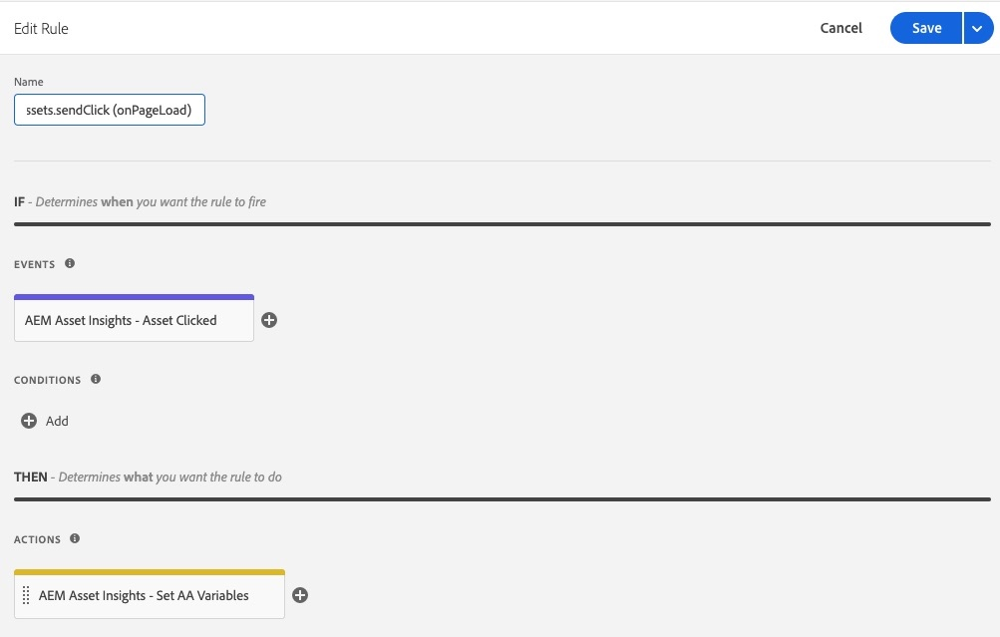

# AEM Asset Insights-Erweiterung – Übersicht

>[!NOTE]
>
>Adobe Experience Platform Launch wurde als eine Suite von Datenerfassungstechnologien in Adobe Experience Platform umbenannt. Infolgedessen wurden in der gesamten Produktdokumentation mehrere terminologische Änderungen eingeführt. Eine konsolidierte Übersicht der terminologischen Änderungen finden Sie im folgenden [Dokument](../../../term-updates.md).

Diese Erweiterung sollte zusammen mit [AEM Asset Insights](https://experienceleague.adobe.com/docs/experience-manager-65/assets/managing/touch-ui-configuring-asset-insights.html?lang=de) verwendet werden. Genauer gesagt ersetzt es den „pageTracker“-Prozess und den Einbettungscode. Wenn diese Erweiterung konfiguriert ist, sendet sie Metriken bezüglich *Impressionen* und *Klicks* auf Kreativelemente an Adobe Analytics. Danach werden diese in AEM Asset Insights-Berichte importiert. Die Asset-Metriken können dann entweder über AEM Asset Insights oder Adobe Analytics Project Workspaces in Berichten dargestellt werden.

## Voraussetzungen für die Erweiterung

### Analytics

Die AEM Asset-Berichte in Analytics enthalten drei AEM-Dimensionen:

* Kreativelement-ID
* Kreativelement-Quelle
* Angeklicktes Kreativelement

Es gibt auch zwei Metriken:
* Kreativelement-Impressionen
* Kreativelement-Klicks.

Diese Berichte müssen unter Verwendung von Analytics Administrator aktiviert werden (klicken Sie auf **[!UICONTROL Analytics] > [!UICONTROL Admin] > [!UICONTROL Report Suites] > `<report suite>` > [!UICONTROL Einstellungen bearbeiten] > [!UICONTROL AEM] > [!UICONTROL AEM Assets-Berichte]**). Danach können sie über diese Erweiterung befüllt werden.

Die Tag-Erweiterung *Adobe Analytics* für Adobe Experience Platform muss in dieselbe Web-Eigenschaft installiert werden.

### Adobe Experience Manager (AEM)

1. Aktivieren Sie [AEM Asset Insights](https://experienceleague.adobe.com/docs/experience-manager-65/assets/managing/touch-ui-configuring-asset-insights.html?lang=de). Wählen Sie in AEM **[!UICONTROL Tools > Assets]** aus und öffnen Sie dann das Bedienfeld **[!UICONTROL Insights-Konfiguration]**.

1. Deaktivieren Sie UUID-Tracking.

   >[!IMPORTANT]
   >
   >Diese Erweiterung funktioniert *nicht*, wenn die AEM Asset-Konfigurationseinstellung **[!UICONTROL UUID-Tracking deaktivieren]** aktiviert ist. Sie ist standardmäßig deaktiviert.

   

## Konfigurieren von Adobe Experience Manager (AEM)

In diesem Abschnitt wird beschrieben, wie Sie AEM mit Tags in Adobe Experience Platform konfigurieren, wie Sie Asset Insight in AEM aktivieren und wie Sie das UUID-Tracking für Assets aktivieren.

### Integrieren von AEM mit Tags

Die empfohlene Integration von [Platform](https://experienceleague.adobe.com/docs/experience-manager-learn/sites/integrations/experience-platform-launch/overview.html?lang=de) mit Adobe Experience Manager erfolgt über Adobe I/O.

1. [Verbinden von AEM mit Tags über Adobe I/O](https://experienceleague.adobe.com/docs/experience-manager-learn/sites/integrations/experience-platform-launch/connect-aem-launch-adobe-io.html?lang=de).

2. [Erstellen einer Adobe Experience Platform Cloud Service-Konfiguration](https://experienceleague.adobe.com/docs/experience-manager-learn/sites/integrations/experience-platform-launch/create-launch-cloud-service.html?lang=de).

### Aktivieren von Asset Insight in AEM

Anweisungen zum Aktivieren von Asset Insights finden Sie im [Benutzerhandbuch zu Experience Manager 6.5 Assets](https://experienceleague.adobe.com/docs/experience-manager-65/assets/managing/touch-ui-configuring-asset-insights.html?lang=de).

### Aktivieren von UUID-Tracking für Assets

Tracken Sie Kreativelemente in Analytics mithilfe der UUID des Kreativelements in AEM.

Um das Tracking mit der UUID des Kreativelements zu aktivieren, öffnen Sie die Komponentenrichtlinienkonsole der bearbeitbaren Vorlage und deaktivieren Sie die Eigenschaft „UUID-Tracking deaktivieren“. (Standardmäßig ist diese Eigenschaft für die OOTB-Bildkomponente aktiviert.)

Nachdem Sie die UUID aktiviert haben, sollte das Datenelement „data-asset-id“ mit der UUID des Kreativelements gefüllt werden. Analytics trackt mit dieser UUID den Klick oder die Impression des Kreativelements.

## Verwendung der Erweiterung

Diese Erweiterung umfasst zwei Ereignisse und eine Aktion.

* **Element angeklickt:** Ein _Ereignis_, das ausgelöst wird, wenn der Besucher auf ein AEM Asset klickt, das für Tracking aktiviert ist und über ein Ziel (href-Attribut) verfügt.

* **Element angeklickt (kein Ziel):** Ein _Ereignis_, das ausgelöst wird, wenn der Besucher auf ein AEM Asset klickt, das für Tracking aktiviert ist und kein Ziel hat (kein href-Attribut).

* **AA-Variablen festlegen:** Eine _Aktion_, mit der die für AEM Assets reservierten Analytics-Variablen (Kontextdatenvariablen `a.assets.source`, `a.assets.idlist` und `a.asset.clickedid`) je nach verwendetem Ereignis und Konfiguration des Ereignisses und der Aktion festgelegt werden. Diese Erweiterung verwendet keine Analytics-Ereignisse, -Props oder -eVars.

### Kreativelement-Impressionen

Fügen Sie die Aktion „Set AA Variables“ einer neuen oder vorhandenen Tag-Regel hinzu, die auf jeder Seite ausgelöst wird und eine Analytics-Bildanforderung sendet. Die Aktion „Set AA Variables“ muss **vor** der Aktion „Adobe Analytics - Send Beacon“ angezeigt werden. Bei Bedarf können weitere Aktionen hinzugefügt werden.

Wählen Sie auf der Konfigurationsseite **[Set AA Variables]** die Option **[Viewed Assets]** (Standard). Dadurch wird nur das Impressionsereignis für Kreativelemente ausgewählt, die vom Besucher tatsächlich gesehen werden.

>[!NOTE]
>
>Obwohl dies nicht empfohlen wird, unterstützt die Aktion „Set AA Variables“ auch die Option „loaded“, mit der Kreativelement-Impressionen für jedes Kreativelement auf der Seite gesendet werden, unabhängig davon, ob der Besucher sie gesehen hat oder nicht.

### Kreativelement-Klicks

Konfigurieren Sie eine zweite Regel mithilfe des Ereignisses „Asset Clicked“ und der Aktion „Set AA Variables“. Das Ereignis „Asset Clicked“ sollte so konfiguriert werden, dass „Asset Clicked image request“ mit „On PageLoad“ (Standard) festgelegt ist. Diese Regel erfordert keine Adobe Analytics-Aktionen (wie „Send Beacon“), da die Kreativelement-ID in `sessionStorage` gespeichert und von der nachfolgenden Impressionsregel gesendet wird.

Das Ereignis „Asset Clicked“ unterstützt auch die Einstellung „Asset Clicked image request“ von „On Click“. Dadurch wird die Klickmetrik sofort an Analytics gesendet. Zusätzlich ist die Analytics-Aktion „Send Beacon“ erforderlich.

Konfigurieren Sie eine dritte Regel, die ausgelöst wird, wenn sich Kreativelemente auf den Seiten befinden, die kein Ziel haben (kein `href`-Attribut). Die neue Regel muss zumindest das Ereignis „Asset Clicked (No Destination)“ sowie die Aktionen „Set AA Variables“ und „Adobe Analytics - Send Beacon“ verwenden. Zusätzliche Bedingungen und Aktionen können nach Bedarf hinzugefügt werden.

### Tipps zu Erweiterungstests

Konfigurieren Sie wie oben beschrieben drei Regeln:

* Kreativelement-Impressionen
* Kreativelement-Klicks
* Kreativelement-Klicks ohne Ziel

**Impressionen**

1. Navigieren Sie zu einer Seite, die AEM-Kreativelemente enthält.

1. Sollten im Browser keine Assets sein, scrollen Sie soweit, bis Sie mindestens ein Asset antreffen und wählen Sie es aus. Navigieren Sie andernfalls einfach zu einer anderen Seite.

1. Sehen Sie sich die Analytics-Bildanforderung an.

   Wenn `a.assets.idlist` die Kreativelement-IDs enthält, die auf der vorherigen Seite sichtbar waren, funktioniert die Regel ordnungsgemäß.

   Wenn `a.assets.idlist` nicht in der Bildanforderung enthalten ist, hat dies wahrscheinlich eine von zwei Ursachen:

   * Im Anzeigebereich des Browsers gab es nie ein Kreativelement.

   * Auf der Seite wurden keine Kreativelemente konfiguriert, für die [Asset Insights](https://experienceleague.adobe.com/docs/experience-manager-65/assets/managing/touch-ui-configuring-asset-insights.html?lang=de) in AEM aktiviert war.

**Klicks**

1. Navigieren Sie zu einer Seite, die AEM-Kreativelemente enthält.

1. Wählen Sie eines der Assets aus.

Bei der resultierenden Analytics-Bildanforderung (auf der nächsten Seite) funktioniert die Regel ordnungsgemäß, wenn in `a.assets.idlist` die Asset-IDs auf der Zielseite vorhanden sind und `a.assets.clickedid` die Asset-ID des Assets enthält, das auf der Ausgangsseite ausgewählt wurde.

Wenn `a.assets.clickedid` nicht in der Bildanforderung enthalten ist, liegt der Grund meist darin, dass in AEM [Asset Insights](https://experienceleague.adobe.com/docs/experience-manager-65/assets/managing/touch-ui-configuring-asset-insights.html?lang=de) nicht für das ausgewählte Asset aktiviert war.

**Klicks ohne Ziel**

1. Navigieren Sie zu einer Seite, die mindestens ein AEM-Kreativelement ohne Ziel enthält (kein `href`-Attribut).

1. Wählen Sie dieses Asset aus.

In der resultierenden Analytics-Bildanforderung funktioniert die Regel ordnungsgemäß, wenn die Kreativelement-ID in `a.assets.clickedid` vorhanden ist.

Wenn `a.assets.clickedid` nicht in der Bildanforderung enthalten ist, liegt der Grund meist darin, dass in AEM [Asset Insights](https://experienceleague.adobe.com/docs/experience-manager-65/assets/managing/touch-ui-configuring-asset-insights.html?lang=de) nicht für das ausgewählte Asset aktiviert war.
