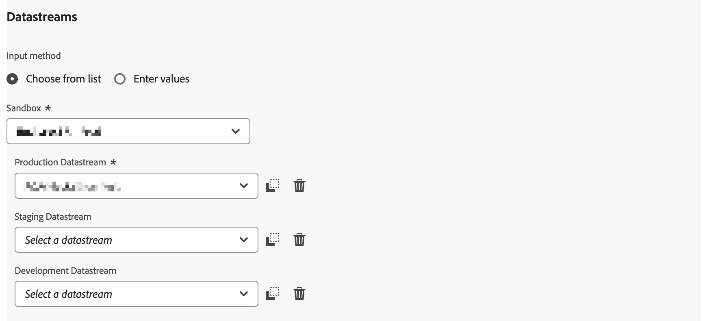
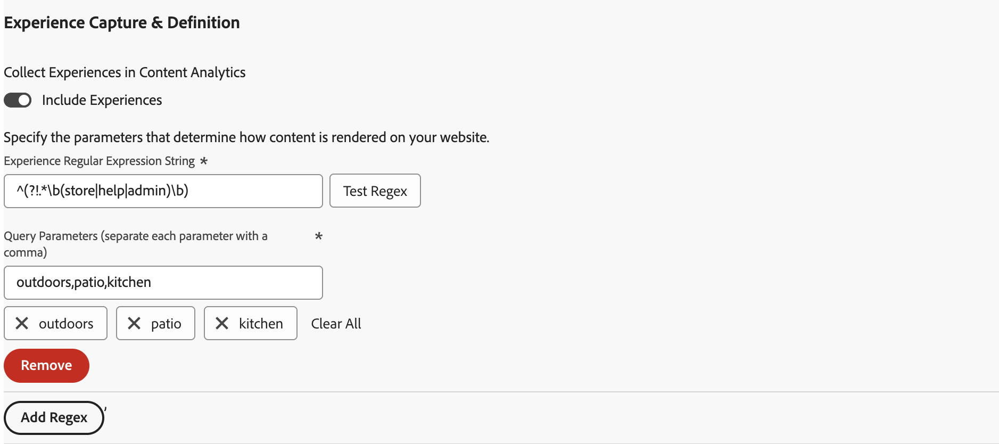

# Adobe Content Analytics-Erweiterung - Übersicht

Die [!DNL Adobe Content Analytics] Tag-Erweiterung ermöglicht das Tracking von inhaltsbezogenen Ereignissen auf einer Website. Die -Erweiterung sendet Inhaltsdaten (Erlebnisse und Assets) von Web-Eigenschaften über Experience Platform Edge Network an einen Datenstrom in Adobe Experience Cloud.

Mit der -Erweiterung können Sie bestimmte inhaltsbezogene Ereignisdaten in Experience Platform streamen, damit Sie diese Daten in Ihren Inhaltsanalyseberichten in Customer Journey Analytics verwenden können.

In diesem Dokument wird erläutert, wie Sie die Tag-Erweiterung in der Tags-Benutzeroberfläche konfigurieren.

## Installieren der Tag-Erweiterung &quot;Adobe Content Analytics“ {#install}

>[!NOTE]
>
>Die Tag-Erweiterung &quot;Adobe Content Analytics“ wird automatisch als Teil der Tag-Eigenschaft installiert, die bei Verwendung des [Konfigurationsassistenten für Inhaltsanalysen“ automatisch erstellt ](https://experienceleague.adobe.com/en/docs/analytics-platform/using/content-analytics/configuration/guided){target="_blank"}.

### Manuelle Installation

Bei einer manuellen Konfiguration muss für die Tag-Erweiterung von Adobe Content Analytics eine Eigenschaft installiert sein. Wenn Sie dies noch nicht getan haben, lesen Sie die Dokumentation unter [Erstellen einer Tag-Eigenschaft](https://experienceleague.adobe.com/en/docs/platform-learn/implement-in-websites/configure-tags/create-a-property).

Nachdem Sie eine Eigenschaft erstellt haben oder wenn Sie die mit dem Assistenten für die geführte Konfiguration von [Content Analytics erstellte Eigenschaft auswählen](https://experienceleague.adobe.com/en/docs/analytics-platform/using/content-analytics/configuration/guided) öffnen Sie die Eigenschaft und wählen Sie in der linken Seitenleiste die Registerkarte **[!UICONTROL Erweiterungen]** aus.

Wählen Sie die **[!UICONTROL Katalog]** aus. Suchen Sie in der Liste der verfügbaren Erweiterungen nach der **[!DNL Adobe Content Analytics]** Erweiterung und wählen Sie **[!UICONTROL Installieren]** aus.

Nach Auswahl von **[!UICONTROL Installieren]** müssen Sie die Tag-Erweiterung für Adobe Content Analytics konfigurieren und die Konfiguration speichern.

<!--
## Configure schema

The [Content Analytics guided configuration wizard](https://experienceleague.adobe.com/en/docs/analytics-platform/using/content-analytics/configuration/guided) automatically populates the proper value for the **[!UICONTROL Tenant Schema Name]**. 

>[!WARNING]
>
>Do not modify the value for **[!UICONTROL Tenant Schema Name]**.

-->

## Konfigurieren von Datenströmen

Der Assistent für die geführte Konfiguration von &lbrace;0[&#128279;](https://experienceleague.adobe.com/en/docs/analytics-platform/using/content-analytics/configuration/guided) Content Analytics wählt automatisch den richtigen Wert für den **[!UICONTROL Sandbox]**- und **[!UICONTROL Produktionsdatenstrom]**.  Sie können optional einen zusätzlichen **[!UICONTROL Staging-Datenstrom]** und **[!UICONTROL Entwicklungsdatenstrom]** konfigurieren.

Sie können die automatisch ausgewählten Werte für **[!UICONTROL Sandbox]** und **[!UICONTROL Produktionsdatenstrom]** überschreiben, wenn Sie Content Analytics auf einer anderen Sandbox und mit verschiedenen Datenströmen verwenden möchten. Dabei können Sie entweder eine Sandbox und Datenströme aus den verfügbaren Dropdown-Menüs auswählen oder **[!UICONTROL Werte eingeben]** auswählen und für jede Umgebung eine benutzerdefinierte Datenstrom-ID eingeben.

>[!IMPORTANT]
>
>Stellen Sie beim Konfigurieren einer anderen Sandbox und anderer Datenströme sicher, dass
>
>* Die ausgewählte Sandbox ist noch nicht mit einer anderen Content Analytics-Konfiguration verknüpft
>* Für jeden ausgewählten Datenstrom ist der Experience Platform-Service mit einem aktivierten Content Analytics Experience Event-Datensatz konfiguriert.

Informationen zum Konfigurieren eines [ finden ](../../../../datastreams/overview.md) im Handbuch zu Datenströmen .

## Konfigurieren der Erlebniserfassung und -definition

Im Abschnitt **[!UICONTROL Erlebniserfassung und -definition]** können Sie **[!UICONTROL Erlebnisse einschließen]** aktivieren, um Erlebnisse bei der Datenerfassung für Content Analytics einzubeziehen.

1. Aktivieren Sie **[!UICONTROL Erlebnisse einschließen]**.
1. Optional. Geben Sie die Parameter an, wie Inhalte auf Ihrer Website gerendert werden. Bei den Parametern handelt es sich um keine oder mehrere Kombinationen aus einem **[!UICONTROL regulären Domänenausdruck]** und **[!UICONTROL Abfrageparametern]**.
   1. Geben Sie einen **[!UICONTROL Regulären Ausdruck der Domain]** ein, z. B. `^(?!.*\b(store|help|admin)\b)`.
   1. Geben Sie eine kommagetrennte Liste von **[!UICONTROL Abfrageparametern]** an, z. B. `outdoors, patio, kitchen`.
Verwenden Sie , um einzelne Parameter zu löschen, oder **[!UICONTROL Alle löschen]**, um alle Parameter zu löschen.
1. Wählen **[!UICONTROL Entfernen]** aus, wenn Sie eine Kombination aus regulären Domain-Ausdrücken und Abfrageparametern entfernen möchten.
1. Wählen **[!UICONTROL Regex hinzufügen]** aus, wenn Sie eine weitere Kombination aus einem regulären Ausdruck und Abfrageparametern hinzufügen möchten.

## Konfigurieren der Ereignisfilterung

Im Abschnitt **[!UICONTROL Ereignisfilterung]** können Sie die regulären Ausdrücke ändern, um **[!UICONTROL Seiten-URLs]** und **[!UICONTROL Assets-URLs]** beim Erfassen von Daten für Content Analytics zu filtern. Die regulären Ausdrücke, die Sie im Konfigurationsassistenten für [Inhaltsanalysen“ definiert haben](https://experienceleague.adobe.com/en/docs/analytics-platform/using/content-analytics/configuration/guided) werden automatisch ausgefüllt.

### Beispiele

* Sie möchten alle Dokumentationsseiten aus der Inhaltsanalyse ausschließen. Verwenden Sie folgenden regulären Ausdruck: `^(?!.*documentation).*`
* Sie möchten alle JPEG- und SVG-Logo-Bilder von Content Analytics ausschließen. Verwenden Sie folgenden regulären Ausdruck: `^(?!.*(logo\.jpg|\.svg)).*$`

Sie können **[!UICONTROL Regex testen]** verwenden, um Ihren regulären Ausdruck im **[!UICONTROL Regular Expression Tester]** zu testen.

