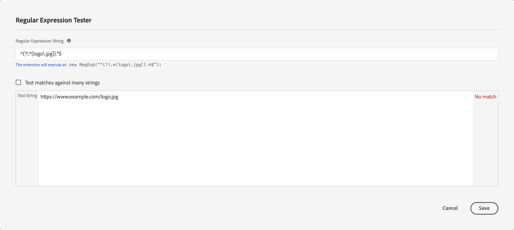

# Adobe Content Analytics-Erweiterung - Übersicht

Die [!DNL Adobe Content Analytics] Tag-Erweiterung ermöglicht das Tracking von inhaltsbezogenen Ereignissen auf einer Website. Die -Erweiterung sendet Inhaltsdaten (Erlebnisse und Assets) von Web-Eigenschaften über Experience Platform Edge Network an einen Datenstrom in Adobe Experience Cloud.

Mit der -Erweiterung können Sie bestimmte inhaltsbezogene Ereignisdaten in Platform streamen, damit Sie diese Daten in Ihren Inhaltsanalyseberichten in Customer Journey Analytics verwenden können.

In diesem Dokument wird erläutert, wie Sie die Tag-Erweiterung in der Tags-Benutzeroberfläche konfigurieren.

## Installieren der Tag-Erweiterung &quot;Adobe Content Analytics“ {#install}

>[!NOTE]
>
>Die Tag-Erweiterung &quot;Adobe Content Analytics“ wird automatisch als Teil der Tag-Eigenschaft installiert, die bei Verwendung des [Konfigurationsassistenten für Inhaltsanalysen“ automatisch erstellt ](https://experienceleague.adobe.com/en/docs/analytics-platform/using/content-analytics/configuration/guided){target="_blank"}.

### Manuelle Installation

Bei einer manuellen Konfiguration muss für die Tag-Erweiterung &quot;Adobe Content Analytics“ eine Eigenschaft installiert sein. Wenn Sie dies noch nicht getan haben, lesen Sie die Dokumentation unter [Erstellen einer Tag-Eigenschaft](https://experienceleague.adobe.com/en/docs/platform-learn/implement-in-websites/configure-tags/create-a-property).

Nachdem Sie eine Eigenschaft erstellt haben oder wenn Sie die mit dem Konfigurationsassistenten für [Geführte Konfiguration von Content Analytics](https://experienceleague.adobe.com/en/docs/analytics-platform/using/content-analytics/configuration/guided) erstellte Eigenschaft auswählen, öffnen Sie die Eigenschaft und wählen Sie die Registerkarte **[!UICONTROL Erweiterungen]** in der linken Seitenleiste aus.

Wählen Sie die **[!UICONTROL Katalog]** aus. Suchen Sie in der Liste der verfügbaren Erweiterungen nach der **[!DNL Adobe Content Analytics]** Erweiterung und wählen Sie **[!UICONTROL Installieren]** aus.

Nach Auswahl von **[!UICONTROL Installieren]** müssen Sie die Tag-Erweiterung &quot;Adobe Content Analytics“ konfigurieren und die Konfiguration speichern.

<!--
## Configure schema

The [Content Analytics guided configuration wizard](https://experienceleague.adobe.com/en/docs/analytics-platform/using/content-analytics/configuration/guided) automatically populates the proper value for the **[!UICONTROL Tenant Schema Name]**. 

>[!WARNING]
>
>Do not modify the value for **[!UICONTROL Tenant Schema Name]**.

-->

## Konfigurieren von Datenströmen

Der [Konfigurationsassistent für Inhaltsanalysen](https://experienceleague.adobe.com/en/docs/analytics-platform/using/content-analytics/configuration/guided) wählt automatisch den richtigen Wert für den **[!UICONTROL Sandbox]** und **[!UICONTROL Produktionsdatenstrom]**. Sie können optional einen zusätzlichen **[!UICONTROL Staging-Datenstrom]** und **[!UICONTROL Entwicklungsdatenstrom]** konfigurieren.

Sie können die automatisch ausgewählten Werte für **[!UICONTROL Sandbox]** und **[!UICONTROL Produktionsdatenstrom]** überschreiben, wenn Sie Inhaltsanalysen auf einer anderen Sandbox und mit verschiedenen Datenströmen verwenden möchten. Dabei können Sie entweder eine Sandbox und Datenströme aus den verfügbaren Dropdown-Menüs auswählen oder **[!UICONTROL Werte eingeben]** auswählen und für jede Umgebung eine benutzerdefinierte Datenstrom-ID eingeben.

>[!IMPORTANT]
>
>Stellen Sie beim Konfigurieren einer anderen Sandbox und anderer Datenströme sicher, dass
>
>* die ausgewählte Sandbox noch nicht mit einer anderen Content Analytics-Konfiguration verknüpft ist und
>* Für jeden ausgewählten Datenstrom ist der Experience Platform-Service mit einem aktivierten Content Analytics-Erlebnisereignis-Datensatz konfiguriert.

Informationen zum Konfigurieren eines [ finden ](../../../../datastreams/overview.md) im Handbuch zu Datenströmen .

## Ereignisfilter konfigurieren

Im Abschnitt **[!UICONTROL Ereignisfilterung]** können Sie die regulären Ausdrücke ändern, um **[!UICONTROL Seiten-URLs]** und **[!UICONTROL Assets-URLs]** beim Erfassen von Daten für Content Analytics zu filtern. Die regulären Ausdrücke, die Sie im Konfigurationsassistenten für [Inhaltsanalysen“ definiert haben](https://experienceleague.adobe.com/en/docs/analytics-platform/using/content-analytics/configuration/guided) werden automatisch ausgefüllt.

### Beispiele

* Sie möchten alle Dokumentationsseiten aus der Inhaltsanalyse ausschließen. Verwenden Sie folgenden regulären Ausdruck: `^(?!.*documentation).*`
* Sie möchten alle JPEG- und SVG-Logobilder aus Content Analytics ausschließen. Verwenden Sie folgenden regulären Ausdruck: `^(?!.*(logo\.jpg|\.svg)).*$`

Sie können **[!UICONTROL Regex testen]** verwenden, um Ihren regulären Ausdruck im **[!UICONTROL Regular Expression Tester]** zu testen.

