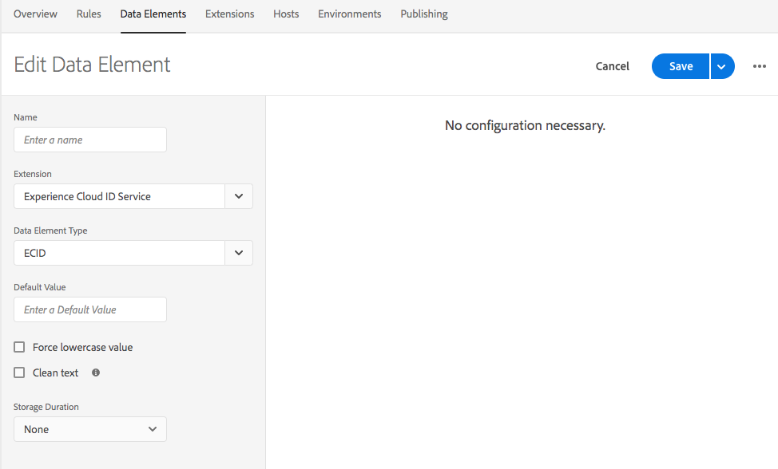

# Adobe Experience Cloud Identity Service-Erweiterung – Versionshinweise

>[!NOTE]
>
>Adobe Experience Platform Launch wurde als eine Suite von Datenerfassungstechnologien in Adobe Experience Platform umbenannt. Infolgedessen wurden in der gesamten Produktdokumentation mehrere terminologische Änderungen eingeführt. Eine konsolidierte Übersicht der terminologischen Änderungen finden Sie im folgenden [Dokument](../../../term-updates.md).

In diesem Dokument werden die Versionshinweise für die Tag-Erweiterung des Adobe Experience Cloud Identity Service beschrieben. Versionshinweise zum Experience Cloud Identity-Dienst selbst finden Sie im Abschnitt [Dokumentation zu Identity Service](https://experienceleague.adobe.com/docs/id-service/using/release-notes/release-notes.html?lang=de).

## 17. Oktober 2022

### Experience Cloud ID-Erweiterung 5.5.0

* Die Erweiterung unterstützt jetzt Version 5.5.0 der [Besucher-JS-Client](https://github.com/Adobe-Marketing-Cloud/id-service). Siehe Abschnitt [Versionshinweise zu Besuchern](https://github.com/Adobe-Marketing-Cloud/id-service/releases/tag/5.5.0) für spezifische Aktualisierungen.

## 9. März 2022

### Experience Cloud ID-Erweiterung 5.4.0

* Diese Version enthält die neueste Version von Visitor 5.4.0, die folgende Aktualisierungen aufweist:

   * Möglichkeit, die Lebensdauer der `s_ecid` Cookie mit cookieLifetime config
   * Aktualisierung eines Firefox-Browserproblems, das auftritt, wenn eine Seite in einen untergeordneten iFrame geladen wird

## 10. Oktober 2021

### Experience Cloud ID-Erweiterung 5.3.1

* Diese Version enthält die neueste Version von Visitor 5.3.0, die die folgenden neuen Aktualisierungen aufweist:

   * Der Algorithmus wurde aktualisiert, um eine lokale ECID zu generieren
   * Neueste Opt-in-Funktion mit `Secure` und `SameSite` Flags für das Datenschutz-Cookie
   * Korrektur eines Firefox-Browserproblems, das auftrat, wenn eine Seite in einen untergeordneten iFrame geladen wurde

## 12. Januar 2021

### Experience Cloud ID-Erweiterung 5.2.0

* Das Aktualisieren auf den Patch „VisitorJS 5.2.0“ mit einer Fehlerbehebung für „ECID DataElement“ konnte bei Eingang der Zustimmung nicht aktualisiert werden.

## 3. November 2020

### Experience Cloud ID-Erweiterung 5.2.1

* Dieser Patch enthält eine Fehlerbehebung für das Schreiben von Cookies aus einem iFrame mit dem Attribut `SameSite=None` im Google Chrome-Browser.

## 27. Oktober 2020

### Experience Cloud ID-Erweiterung 5.1.0

* Hinzufügen der Konfiguration `sameSiteCookie`, um das `SameSite`-Attribut des `AMCV`-Cookies zu spezifizieren.
Diese Konfiguration unterstützt die folgenden Werte für das `SameSite`-Attribut:

   * `Strict`
   * `Lax`
   * `None`

Details zu diesen Attributwerten finden Sie unter [web.dev](https://web.dev/samesite-cookies-explained/) und [chromium](https://www.chromium.org/updates/same-site)

## 13. August 2020

### Experience Cloud ID-Erweiterung 5.0.1

* Aktualisierung auf den Patch VisitorJS 5.0.1 mit einer Fehlerbehebung zum Hinzufügen des Flag d_cf, wenn die IAB-Zustimmungszeichenfolge geändert wurde.

## 15. Juni 2020

### Experience Cloud ID-Erweiterung 5.0.0

* Unterstützung für as `IAB TCF` – Transparency &amp; Consent Framework – `Version 2.0` wurde hinzugefügt.

## 13. April 2020

### Experience Cloud ID-Erweiterung 4.6.0

* Markierung `loadSSL` standardmäßig aktiviert. Alle Aufrufe von Identity Service sind standardmäßig auf `https` gesetzt. Kunden können den Wert auf „false“ setzen, wenn sie Identity Services auf HTTP von ihren Nicht-SSL-Seiten aufrufen möchten.
* Die Funktion zur Erkennung der Internet Explorer-Version (IE) wurde aktualisiert, um ein von ESLint gemeldetes Problem zu beheben.
* Fehlerbehebung für ein Leistungsproblem in Internet Explorer (IE) 11, wenn die ECID mit der OptIn-Vorabgenehmigung versehen und später aktualisiert wird.

## 22. Januar 2020

### Experience Cloud ID-Erweiterung 4.5.2

* „visitor.js“ in 4.5.2 aktualisiert
* Visitor 4.5.1 enthält eine Fehlerbehebung für das IAB-Plugin für Optin
* Die `setCustomerIDs`-Methode zur Ablehnung von gesendeten leeren IDs wurde aktualisiert.

## 7. Januar 2020

### Experience Cloud ID-Erweiterung 4.4.2

* „visitor.js“ in 4.4.2 aktualisiert
* Verbesserungen bei der `getVisitorValues`-Methode zum schnelleren Abrufen von Werten.

## 19. September 2019

### Experience Cloud ID-Erweiterung 4.4.1

* „visitor.js“ in 4.4.1 aktualisiert
* Ein Fehler für Eingabe von „get Opt-In preApprovals“ wurde behoben
* VIDEO_ANALYTICS in MEDIA_ANALYTICS in preOptInApprovals umbenannt

   

## 17. Juli 2019

### Experience Cloud ID-Erweiterung 4.4.0

* „visitor.js“ in 4.4.0 aktualisiert
* SHA256-Hashing-Unterstützung für setCustomerIDs hinzugefügt

   

## 13. Mai 2019

### Experience Cloud ID-Erweiterung 4.3.1

* „visitor.js“ in 4.3 aktualisiert
* Datenelementtyp für ECID als Teil der Tag-Erweiterung hinzugefügt

   

## 9. April 2019

### Experience Cloud ID-Erweiterung 4.2.0

* Aktualisierung von visitor.js auf Version 4.2 mit Unterstützung für das IAB TCF-Plug-in für Audience Manager.

## 25. Februar 2019

### Experience Cloud ID-Erweiterung 4.1.0

* Die Datei visitor.js wurde auf Version 4.1 aktualisiert, mit der die Datei „publishDestinations“ entsprechend der neuen API-Änderung aktualisiert wurde. Mit dieser Aktualisierung können die Referrer-Informationen der Seite während der ID-Synchronisierung offengelegt werden, wenn gewünscht.

## 15. Februar 2019

### Experience Cloud ID-Erweiterung 4.0.0

* „visitor.js“ in 4.0 aktualisiert
* Hinzufügung von Konfigurationsoptionen für das neue integrierte Opt-in-Objekt. Opt-in-Einstellungen können verwendet werden, um Cookie- und Signalaufrufe von Adobe Solutions zu unterdrücken und so bessere Supportregeln wie DSGVO zu erhalten.

   

## 20. März 2018

### Experience Cloud ID-Erweiterung 3.1.0

* „visitor.js“ in 3.1 aktualisiert
* Fügt zwei Konfigurationseigenschaften hinzu: `resetBeforeVersion` und `serverState`.
