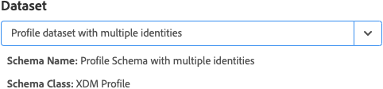
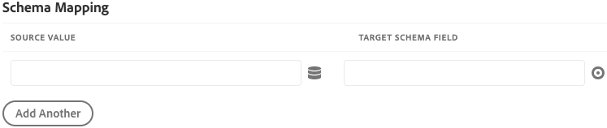

# Adobe Experience Platform Demo-Erweiterung

>[!NOTE]
>
>Adobe Experience Platform Launch wurde als eine Suite von Datenerfassungstechnologien in Adobe Experience Platform umbenannt. Infolgedessen wurden in der gesamten Produktdokumentation mehrere terminologische Änderungen eingeführt. Eine konsolidierte Übersicht der terminologischen Änderungen finden Sie im folgenden [Dokument](../../../term-updates.md).

>[!NOTE]
>
>Diese Erweiterung wird eingestellt und durch das [Adobe Experience Platform Web SDK](../web-sdk/overview.md) ersetzt.

Die Funktionen dieser Erweiterung werden auf die neue Erweiterung portiert. Nachfolgend ein kurzer Vergleich der aktuellen Funktionen:

| Platform Demo-Erweiterung | Platform Web-SDK |
| ------------------ | ----------- |
| Unterstützung für benutzerdefinierte Kunden-IDs | Unterstützung für benutzerdefinierte Kunden-IDs |
| Client-seitige Mapping-Benutzeroberfläche für XDM | Build in ECID (visitor.js nicht benötigt) |
| Möglichkeit zur Erstellung einer Streaming-Verbindung | Opt-in-Unterstützung |
| | Unterstützung von XDM als Datenelement |
| | Unterstützung für Erstanbieter-Domain |
| | Debugging-Tools integriert |
| | Automatische Erfassung des Browserkontexts |
| | Vollständig quelloffen (Open Source) |

## Konfigurieren der Adobe Experience Platform-Erweiterung

Dieser Abschnitt enthält eine Referenz zu den verfügbaren Optionen beim Konfigurieren der Adobe Experience Platform-Erweiterung.

Wenn die Adobe Experience Platform-Erweiterung noch nicht installiert ist, öffnen Sie die Eigenschaft, wählen Sie **[!UICONTROL Erweiterungen > Katalog]** aus, bewegen Sie den Mauszeiger über die Adobe Experience Platform-Erweiterung und klicken Sie auf **[!UICONTROL Installieren]**.

Öffnen Sie zum Konfigurieren der Erweiterung die Registerkarte [!UICONTROL Erweiterungen], bewegen Sie den Mauszeiger über die Erweiterung und wählen Sie dann **[!UICONTROL Konfigurieren]** aus.

### Streaming-Verbindung

Die Auswahl einer Streaming-Verbindung ist der erste Schritt beim Streamen von Daten an die Adobe Experience Platform. Sie können eine aus dem Kombinationsfeld für Streaming-Verbindungen wählen. „Streaming-Verbindung“ ist ein erforderliches Feld. Sofern noch nicht erfolgt, können Sie eine Streaming-Verbindung über die Schaltfläche **[!UICONTROL Streaming-Verbindung erstellen]** erstellen.

Wenn Sie **[!UICONTROL Streaming-Verbindung erstellen]** auswählen, wird ein modales Fenster angezeigt.

Die darin enthaltenen Felder sind bereits ausgefüllt, Sie können sie jedoch Ihren Anforderungen entsprechend ändern. Wenn Sie mehr als eine Streaming-Verbindung erstellen möchten, sollten Sie beachten, dass das Feld **[!UICONTROL Datenquelle]** eindeutig sein muss. Wenn Sie versuchen, eine Streaming-Verbindung mit einer bereits für eine andere Verbindung verwendeten **[!UICONTROL Datenquelle]** zu erstellen, schlägt dies fehl.

Nachdem Sie einen Streaming-Endpunkt ausgewählt haben, geben Sie die Streaming-Endpunkt-URL und die Quelle an.

## Aktionstypen der Adobe Experience Platform-Erweiterung

In diesem Abschnitt werden die in der Adobe Experience Platform-Erweiterung verfügbaren Aktionstypen beschrieben.

### Signal senden {#send-beacon}

Dies ist der Aktionstyp, den Sie verwenden, um Daten an Adobe Experience Platform zu senden.

Sie müssen zuerst den Datensatz auswählen, in dem die Daten gespeichert werden. Allgemein stellen Datensätze eine Tabelle dar, die die über die Streaming-Verbindung gesendeten Daten speichert. Bevor Sie diesen Aktionstyp verwenden können, müssen Sie die Datensätze in Adobe Experience Platform erstellen.

Für den für die Speicherung der Daten ausgewählten Datensatz werden Details zu dem zu dem mit diesem verknüpften Schema angezeigt.

### Schemazuordnung

Nachdem Sie den Datensatz ausgewählt haben, können Sie Ihre Schemazuordnung definieren.

Im Quellwertfeld kann ein Wert oder ein Datenelement eingegeben werden. Sie können ein Datenelement hinzufügen, indem Sie auf den Datenelement-Button neben dem Quellwertfeld klicken.

Das Zielschemafeld enthält den Pfad eines XDM-Felds, das im Datensatzschema definiert ist. Für Felder, die tiefer in der Schemahierarchie definiert sind, können Sie einen Punkt als Trennzeichen zwischen den Pfadteilen verwenden (z. B. timeSeriesEvents.eventType).

### Schemafeldauswahl

Die Erweiterung bietet außerdem die Möglichkeit, ein Zielschemafeld mithilfe einer visuellen Auswahl auszuwählen. Wenn Sie auf den Ziel-Button klicken, der sich neben der Zielschemafeldeingabe befindet, wird ein modales Fenster angezeigt, in dem die Schemastruktur des Datensatzes angezeigt wird. Sie können ein Feld auswählen und auf den Button **Auswählen** klicken. Die Zielschemafeldeingabe wird dann mit dem korrekten XDM-Pfad aktualisiert.

### Identitätsfelder in Adobe Experience Platform

Datensatz-Datenschemata und Zeitserien-Datenschemata können ein oder mehrere Identitätsfelder enthalten. Identitätsfelder werden zusammengeführt, um eine einzelne Identitätsdarstellung eines Subjekts zu bilden und Informationen wie CRM-Kennung, Experience Cloud ID (ECID), Browser-Cookie, AdvertisingId oder andere IDs in unterschiedlichen Domains einzuschließen.

Identitätsfelder können innerhalb des Schemas auf zwei Arten definiert werden:

1. Aufzeichnungs- und Zeitreihen-Schemas enthalten jeweils ein spezielles Feld namens `xdm:identityMap`, das eine Zuordnung von Identitäten enthalten kann.
1. Schlüsselfelder können als „Identitäts“-Felder innerhalb des Schemas markiert werden.

### Identitätsfelder in der Adobe Experience Platform-Erweiterung

Für jedes Schemafeld, das als Identitätsfeld definiert ist, wird dem Abschnitt für die Schemazuordnung eine Zeile hinzugefügt. Jede hinzugefügte Zeile enthält das Zielschemafeld, das bereits mit dem entsprechenden XDM-Schemapfad ausgefüllt wurde. Sie können erkennen, ob ein Schemafeld auch ein Identitätsfeld ist, wenn bei dem Feld ein Profilsymbol angezeigt wird.

Die primären Identitätsfelder sind immer erforderlich, sodass Sie die Zeilen, die sie enthalten, nicht aus dem Abschnitt der Schemazuordnung löschen können.

Ein Schemafeld, das als nicht primäres Identitätsfeld definiert ist, wird dem Abschnitt für die Schemazuordnung automatisch hinzugefügt, die Quellwerteingabe darf jedoch leer bleiben. Dieses Feld kann gelöscht werden. Das Feld wird verworfen, wenn die entsprechende Quellwerteingabe leer ist.

Es wird ein Warnsymbol bei jedem nicht primären Identitätsfeld angezeigt, das keinen Wert enthält.

Ein Identitätsabschnitt wird angezeigt, wenn Ihr Schema ein `xdm:identityMap`-Feld enthält. Sie können diesen Abschnitt verwenden, wenn Sie es vorziehen, Daten im Zusammenhang mit den Identitäten mit `xdm:identityMap` zu senden.

Der Abschnitt zur Identitätszuordnung kann mehrere Zeilen enthalten. Jede Zeile kann einen bestimmten Identitätstyp definieren. Sie können die folgenden Attribute für eine Identität definieren: Typ, Authentifizierungsstatus, Primär und Wert.

Wenn Sie im Abschnitt zur Identitätszuordnung über mehrere Identitäten verfügen, kann nur eine Identität als primärer Eintrag markiert werden.

Wenn Sie ein Schema mit einem `xdm:identityMap`-Feld haben und gleichzeitig ein anderes Feld als primäres Identitätsfeld markiert ist, wird die primäre Spalte innerhalb des Abschnitts zur Identitätszuordnung nicht angezeigt.

### Erforderliche Felder

Einige Schemata verfügen über erforderliche Felder auf höchster Ebene. Die häufigsten sind `timestamp` und `_id`. Ohne Definition dieser Felder schlägt das Signal fehl. Sie können sie im Abschnitt zur Schemazuordnung definieren.

Wenn Ihr Abschnitt zur Schemazuordnung `timestamp` oder `_id` nicht enthält, das Datensatzschema sie aber benötigt, sendet die Adobe Experience Platform-Erweiterung ein Signal mit automatisch generierten Werten, damit das Signal nicht fehlschlägt. Die automatisch generierten Werte werden den Signaldaten nur hinzugefügt, wenn Sie diese Felder im Abschnitt zur Schemazuordnung nicht definiert haben.
