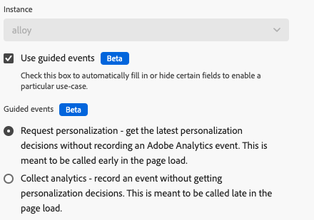

# Aktionstypen

Nachdem Sie die Tag-Erweiterung [Adobe Experience Platform Web SDK](web-sdk-extension-configuration.md) konfiguriert haben, müssen Sie Ihre Aktionstypen konfigurieren.

Auf dieser Seite werden die von der [Adobe Experience Platform Web SDK-Tag-Erweiterung unterstützten Aktionstypen beschrieben](web-sdk-extension-configuration.md).

## Vorschläge anwenden {#apply-propositions}

Mit **[!UICONTROL Aktionstyp &quot;]** anwenden“ können Sie Vorschläge in Single Page Applications rendern, ohne die Metriken zu inkrementieren.

Dieser Aktionstyp ist nützlich bei der Arbeit mit Einzelseitenanwendungen, bei denen Teile der Seite erneut gerendert werden, wodurch möglicherweise bereits auf die Seite angewendete Personalisierungen überschrieben werden.

Sie können diesen Aktionstyp für verschiedene Anwendungsfälle verwenden, z. B.:

1. **Rendern von Mbox HTML-Angeboten**. Vorschläge, die explizit über einen Bereich oder eine Oberfläche von einer **[!UICONTROL Ereignis senden]**-Aktion angefordert werden, werden nicht automatisch gerendert. Sie können den Aktionstyp **[!UICONTROL Vorschläge anwenden]** verwenden, um Web SDK mitzuteilen, wo sie gerendert werden sollen, indem Sie die Vorschlagsmetadaten angeben.
2. **Rendern der Angebote für eine Ansicht auf einer Einzelseitenanwendung**. Wenn beim Rendern eines Ansichtsänderungsereignisses die Analysedaten noch nicht bereit sind, können Sie die Aktion **[!UICONTROL Vorschläge anwenden]** verwenden, um die Ansichtsvorschläge oben auf der Seite zu rendern. Siehe [Ereignisse oben und unten auf der Seite (Zweite Seitenansicht - Option 2)](../../../../web-sdk/use-cases/top-bottom-page-events.md) für weitere Details. Um dies zu verwenden, geben Sie einen **[!UICONTROL Ansichtsnamen]** in das Formular ein.
3. **Vorschläge neu rendern**. Wenn Ihre Site ein Framework wie React verwendet, um Inhalte erneut zu rendern, müssen Sie möglicherweise die Personalisierung erneut anwenden. In solchen Fällen können Sie den Aktionstyp **[!UICONTROL Vorschläge anwenden]** verwenden, um dies zu tun.

Dieser Aktionstyp sendet kein Anzeigeereignis für gerenderte Vorschläge. Er verfolgt die gerenderten Vorschläge, damit diese in nachfolgenden (Ereignis senden **[!UICONTROL Aufrufen]** werden können.

Dieser Aktionstyp unterstützt die folgenden Felder:

* **[!UICONTROL Vorschläge]**: Ein Array von Vorschlagsobjekten, die Sie erneut rendern möchten.
* **[!UICONTROL Ansichtsname]**: Der Name der zu rendernden Ansicht.
* **[!UICONTROL Vorschlagmetadaten]**: Ein Objekt, das bestimmt, wie HTML-Angebote angewendet werden können. Sie können diese Informationen entweder über das Formular oder über ein Datenelement bereitstellen. Sie enthält die folgenden Eigenschaften:
   * **[!UICONTROL Perimeter]**
   * **[!UICONTROL selector]**
   * **[!UICONTROL Aktionstyp]**

## Antwort anwenden {#apply-response}

Verwenden Sie **[!UICONTROL Aktionstyp]** Antwort anwenden“, wenn Sie basierend auf einer Antwort von Edge Network verschiedene Aktionen ausführen möchten. Dieser Aktionstyp wird normalerweise in Hybridbereitstellungen verwendet, bei denen der Server einen ersten Aufruf an die Edge Network sendet. Dieser Aktionstyp nimmt die Antwort aus diesem Aufruf entgegen und initialisiert die Web-SDK im Browser.

Die Verwendung dieses Aktionstyps kann die Client-Ladezeiten für Anwendungsfälle der hybriden Personalisierung reduzieren.

Dieser Aktionstyp unterstützt die folgenden Konfigurationsoptionen:

* **[!UICONTROL Instanz]**: Wählen Sie die verwendete Web-SDK-Instanz aus.
* **[!UICONTROL Antwort-Header]**: Wählen Sie das Datenelement aus, das ein -Objekt zurückgibt, das die Header-Schlüssel und -Werte enthält, die vom Edge Network-Server-Aufruf zurückgegeben werden.
* **[!UICONTROL Antworttext]**: Wählen Sie das Datenelement aus, das das Objekt mit der JSON-Payload zurückgibt, die von der Edge Network-Antwort bereitgestellt wird.
* **[!UICONTROL Visuelle Personalisierungsentscheidungen rendern]**: Aktivieren Sie diese Option, um den von Edge Network bereitgestellten Personalisierungsinhalt automatisch zu rendern und den Inhalt vorab auszublenden, um ein Flackern zu verhindern.

## Regelsätze auswerten {#evaluate-rulesets}

Mit diesem Aktionstyp wird die Auswertung von Regelsätzen manuell Trigger. Regelsätze werden von Adobe Journey Optimizer zurückgegeben, um Funktionen wie In-Browser-Nachrichten zu unterstützen.

Dieser Aktionstyp unterstützt die folgenden Optionen:

* **[!UICONTROL Visuelle Personalisierungsentscheidungen rendern]**: Aktivieren Sie diese Option, um visuelle Personalisierungsentscheidungen für die entsprechenden Regelsatzelemente zu rendern.
* **[!UICONTROL Entscheidungskontext]**: Dies ist eine Schlüssel-Wert-Zuordnung, die bei der Auswertung von Adobe Journey Optimizer-Regelsätzen für die geräteinterne Entscheidungsfindung verwendet wird. Sie können den Entscheidungskontext manuell oder über ein Datenelement bereitstellen.

## Abrufen von Media Analytics Tracker {#get-media-analytics-tracker}

Mit dieser Aktion wird die veraltete Media Analytics-API abgerufen. Wenn Sie die Aktion konfigurieren und einen Objektnamen angeben, wird die veraltete Media Analytics-API in dieses Fensterobjekt exportiert. Wenn keine angegeben wird, wird sie wie die aktuelle Media JS-Bibliothek nach `window.Media` exportiert.

## Mit Identität umleiten {#redirect-with-identity}

Verwenden Sie diesen Aktionstyp, um Identitäten von der aktuellen Seite für andere Domains freizugeben. Diese Aktion ist für die Verwendung mit einem **[!UICONTROL Klick]**-Ereignistyp und einer Wertvergleichsbedingung vorgesehen. Weitere Informationen [ Verwendung dieses Aktionstyps finden Sie unter „Anfügen von ](../../../../web-sdk/commands/appendidentitytourl.md#extension) an URL mithilfe der Web-SDK-Erweiterung“.

## Ereignis senden {#send-event}

Sendet ein Ereignis an Experience Platform, damit Experience Platform die von Ihnen gesendeten Daten erfassen und auf diese Informationen reagieren kann. Alle Daten, die Sie senden möchten, können im Feld **[!UICONTROL XDM-Daten]** gesendet werden. Verwenden Sie ein [!DNL JSON], das der Struktur Ihres [!DNL XDM] entspricht. Dieses Objekt kann entweder auf Ihrer Seite oder über ein **[!UICONTROL benutzerdefinierter Code]**-**[!UICONTROL erstellt]**.

Der **[!UICONTROL Ereignis senden]** Aktionstyp unterstützt die unten beschriebenen Felder und Einstellungen. Diese Felder sind alle optional.

### Instanzeneinstellungen {#instance}

Verwenden Sie den **[!UICONTROL Instance]**-Selektor, um die Web SDK-Instanz auszuwählen, die Sie konfigurieren möchten. Wenn Sie nur eine Instanz haben, ist diese vorausgewählt.

* **[!UICONTROL Instanz]**: Wählen Sie die Web-SDK-Instanz aus, die Sie konfigurieren möchten. Wenn Sie nur über eine Instanz verfügen, ist diese vorausgewählt.
* **[!UICONTROL Geführte Ereignisse verwenden]**: Aktivieren Sie diese Option, um bestimmte Felder automatisch auszufüllen oder auszublenden, um einen bestimmten Anwendungsfall zu aktivieren. Durch Aktivierung dieser Option wird die Anzeige der folgenden Einstellungen Trigger.
   * **[!UICONTROL Personalisierung anfordern]**: Dieses Ereignis sollte am Seitenanfang aufgerufen werden. Wenn dieses Ereignis ausgewählt ist, werden die folgenden Felder festgelegt:
      * **[!UICONTROL type]**: **[!UICONTROL decisioning-Vorschlag abrufen]**
      * **[!UICONTROL Anzeige-Ereignis automatisch senden]**: **[!UICONTROL false]**
      * Um in diesem Fall die Personalisierung automatisch zu rendern, aktivieren Sie die Option **[!UICONTROL Visuelle Personalisierungsentscheidungen rendern]** .
   * **[!UICONTROL Analytics erfassen]**: Dieses Ereignis soll am unteren Rand der Seite aufgerufen werden. Wenn dieses Ereignis ausgewählt ist, werden die folgenden Felder festgelegt:
      * **[!UICONTROL Gerenderte Vorschläge einschließen]**: **[!UICONTROL true]**
      * Die Einstellungen für **[!UICONTROL Personalization]** sind ausgeblendet

  >[!NOTE]
  >
  >Die geführten Ereignisse beziehen sich auf [Ereignisse oben und unten auf der Seite](../../../../web-sdk/use-cases/top-bottom-page-events.md).

### Daten {#data}

* **[!UICONTROL Type]**: In diesem Feld können Sie einen Ereignistyp angeben, der in Ihrem XDM-Schema aufgezeichnet wird. Weitere Informationen finden Sie unter [`type`](/help/web-sdk/commands/sendevent/type.md) im `sendEvent`.
* **[!UICONTROL XDM]**:
* **[!UICONTROL Data]**: Verwenden Sie dieses Feld, um Daten zu senden, die nicht mit einem XDM-Schema übereinstimmen. Dieses Feld ist nützlich, wenn Sie versuchen, ein Adobe Target-Profil zu aktualisieren oder Target Recommendations-Attribute zu senden. Weitere Informationen finden Sie unter [`data`](/help/web-sdk/commands/sendevent/data.md) im `sendEvent`.
* **[!UICONTROL Gerenderte Vorschläge einschließen]**: Aktivieren Sie diese Option, um alle Vorschläge einzuschließen, die gerendert wurden, für die jedoch kein Anzeigeereignis gesendet wurde. Verwenden Sie diese Option zusammen mit **[!UICONTROL Automatisch ein Anzeigeereignis senden]** deaktiviert. Diese Einstellung aktualisiert das XDM-Feld `_experience.decisioning` mit Informationen zu den gerenderten Vorschlägen.
* **[!UICONTROL Dokument wird entladen]**: Aktivieren Sie diese Option, um sicherzustellen, dass die Ereignisse den Server erreichen, auch wenn der Benutzer die Seite verlässt. Dadurch können Ereignisse den Server erreichen, Antworten werden jedoch ignoriert.
* **[!UICONTROL Zusammenführungs-ID]**: **Dieses Feld ist veraltet**. Dadurch wird das `eventMergeId` XDM-Feld ausgefüllt.

### Personalisierung {#personalization}

* **[!UICONTROL Bereiche]**: Wählen Sie die Bereiche (Adobe Target-[!DNL mboxes]) aus, die Sie explizit von der Personalisierung anfordern möchten. Sie können die Bereiche manuell eingeben oder ein Datenelement bereitstellen.
* **[!UICONTROL Oberflächen]**: Legen Sie die Web-Oberflächen fest, die auf der Seite zur Personalisierung verfügbar sind. Weitere Informationen finden Sie in der Dokumentation [&#128279;](https://experienceleague.adobe.com/docs/journey-optimizer/using/web/create-web.html?lang=de) Adobe Journey Optimizer .
* **Visuelle Personalisierungsentscheidungen rendern:** Wenn Sie personalisierte Inhalte auf Ihrer Seite rendern möchten, aktivieren Sie das Kontrollkästchen **[!UICONTROL Visuelle Personalisierungsentscheidungen rendern]**. Sie können bei Bedarf auch Entscheidungsumfänge und/oder Oberflächen angeben. Weitere Informationen [ Rendern personalisierter Inhalte finden ](/help/web-sdk/personalization/rendering-personalization-content.md#automatically-rendering-content) in der Personalisierungsdokumentation .
* **[!UICONTROL Standardpersonalisierung anfordern]**: Verwenden Sie diesen Abschnitt, um zu steuern, ob der seitenweite Bereich (globale Mbox) und die Standardoberfläche (Web-Oberfläche basierend auf der aktuellen URL) angefordert werden. Standardmäßig wird dies automatisch beim ersten `sendEvent` des Seitenladevorgangs angefordert. Sie können aus den folgenden Optionen wählen:
   * **[!UICONTROL Automatisch]**: Dies ist das Standardverhalten. Fordern Sie nur die Standard-Personalisierung an, wenn sie noch nicht angefordert wurde. Dies entspricht `requestDefaultPersonalization` , die im Web-SDK-Befehl nicht festgelegt sind.
   * **[!UICONTROL Aktiviert]**: Explizit den Seitenbereich und die Standardoberfläche anfordern. Dadurch wird der SPA-Ansichts-Cache aktualisiert. Dies entspricht `requestDefaultPersonalization` auf `true` festgelegten Wert.
   * **[!UICONTROL Deaktiviert]**: Unterdrückt die Anforderung für den Seitenbereich und die Standardoberfläche explizit. Dies entspricht `requestDefaultPersonalization` auf `false` festgelegten Wert.
* **[!UICONTROL Entscheidungskontext]**: Dies ist eine Schlüssel-Wert-Zuordnung, die bei der Auswertung von Adobe Journey Optimizer-Regelsätzen für die geräteinterne Entscheidungsfindung verwendet wird. Sie können den Entscheidungskontext manuell oder über ein Datenelement bereitstellen.

### Überschreibungen der Datenstromkonfiguration {#datastream-overrides}

Mit Datenstromüberschreibungen können Sie zusätzliche Konfigurationen für Ihre Datenströme definieren, die über das Web SDK an das Edge-Netzwerk übergeben werden.

Auf diese Weise können Sie andere Datenstromverhaltensweisen als die standardmäßigen Trigger vornehmen, ohne einen neuen Datenstrom zu erstellen oder Ihre bestehenden Einstellungen zu ändern. Weitere Informationen finden Sie in [ Dokumentation unter „Konfigurieren von ](web-sdk-extension-configuration.md#datastream-overrides)&quot;.

## Medienereignis senden {#send-media-event}

Sendet ein Medienereignis an Adobe Experience Platform und/oder Adobe Analytics. Diese Aktion ist nützlich, wenn Sie Medienereignisse auf Ihrer Website verfolgen. Instanz auswählen (wenn mehrere Instanzen vorhanden sind) Die Aktion erfordert eine `playerId`, die eine eindeutige Kennung für eine verfolgte Mediensitzung darstellt. Darüber hinaus sind **[!UICONTROL „Erlebnisqualität]** und ein `playhead` Datenelement beim Starten einer Mediensitzung erforderlich.

Der Aktionstyp **[!UICONTROL Medienereignis senden]** unterstützt die folgenden Eigenschaften:

* **[!UICONTROL Instance]**: Die verwendete Web-SDK-Instanz.
* **[!UICONTROL Medienereignistyp]**: Der Typ des verfolgten Medienereignisses.
* **[!UICONTROL Player-ID]**: Die eindeutige Kennung der Mediensitzung.
* **[!UICONTROL Abspielkopf]**: Die aktuelle Position der Medienwiedergabe in Sekunden.
* **[!UICONTROL Details zur Mediensitzung]**: Beim Senden eines Medienstartereignisses sollten die erforderlichen Details zur Mediensitzung angegeben werden.
* **[!UICONTROL Kapiteldetails]**: In diesem Abschnitt können Sie die Kapiteldetails beim Senden eines Medienereignisses für den Kapitelstart angeben.
* **[!UICONTROL Advertising-]**: Beim Senden eines `AdBreakStart` müssen Sie die erforderlichen Werbedetails angeben.
* **[!UICONTROL Advertising-Pod-]**: Details zum Advertising-Pod beim Senden eines `AdStart`.
* **[!UICONTROL Fehlerdetails]**: Details zum Wiedergabefehler, der verfolgt wird.
* **[!UICONTROL Statusaktualisierungsdetails]**: Der Player-Status, der aktualisiert wird.
* **[!UICONTROL Benutzerdefinierte Metadaten]**: Die benutzerdefinierten Metadaten über das Medienereignis, das verfolgt wird.
* **[!UICONTROL Erlebnisqualität]**: Die Medienqualität der Erlebnisdaten, die verfolgt wird.

## Einverständnis festlegen {#set-consent}

Nachdem Sie das Einverständnis Ihres Benutzers erhalten haben, muss dieses Einverständnis mithilfe des Aktionstyps „Einverständnis festlegen“ an die Adobe Experience Platform Web SDK übermittelt werden. Derzeit werden zwei Arten von Standards unterstützt: „Adobe“ und „IAB TCF“. Siehe [Unterstützen von Voreinstellungen für das Kundeneinverständnis](../../../../web-sdk/commands/setconsent.md). Bei Verwendung von Adobe Version 2.0 wird nur ein Datenelementwert unterstützt. Sie müssen ein Datenelement erstellen, das zum Einverständnisobjekt aufgelöst wird.

In dieser Aktion wird Ihnen auch ein optionales Feld bereitgestellt, um eine Identitätszuordnung einzuschließen, damit Identitäten nach Erhalt des Einverständnisses synchronisiert werden können. Die Synchronisierung ist nützlich, wenn das Einverständnis als „Ausstehend“ oder „Out“ konfiguriert ist, da der Einverständnisaufruf wahrscheinlich der erste auszulösende Aufruf ist.

## Variable aktualisieren {#update-variable}

Verwenden Sie diese Aktion, um ein XDM-Objekt als Ergebnis eines Ereignisses zu ändern. Diese Aktion dient zum Erstellen eines -Objekts, auf das später von einer **[!UICONTROL Ereignis senden]**-Aktion verwiesen werden kann, um das Ereignis-XDM-Objekt aufzuzeichnen.

Um diesen Aktionstyp verwenden zu können, müssen Sie ein Datenelement [Variable](data-element-types.md#variable) definiert haben. Nachdem Sie ein variables Datenelement zum Ändern ausgewählt haben, wird ein Editor angezeigt, ähnlich dem Editor für das Datenelement [XDM](data-element-types.md#xdm-object)Objekt.

Das XDM-Schema, das für den Editor verwendet wird, ist das Schema, das im Datenelement [!UICONTROL Variable] ausgewählt wird. Sie können eine oder mehrere Eigenschaften des Objekts festlegen, indem Sie auf eine der Eigenschaften im Baum links klicken und dann den Wert rechts ändern. Im folgenden Screenshot wird beispielsweise die Eigenschaft „productedBy“ auf das Datenelement „Produced by data element“ festgelegt.

Es gibt einige Unterschiede zwischen dem Editor in der Aktion „Variable aktualisieren“ und dem Editor im XDM-Objektdatenelement. Erstens verfügt die Aktion Variable aktualisieren über ein Stammelement mit der Bezeichnung „xdm“. Wenn Sie auf dieses Element klicken, können Sie ein Datenelement angeben, das zum Festlegen des gesamten Objekts verwendet werden soll. Zweitens verfügt die Aktion Variable aktualisieren über Kontrollkästchen, um die Daten aus dem XDM-Objekt zu löschen. Klicken Sie auf eine der Eigenschaften auf der linken Seite, und aktivieren Sie dann das Kontrollkästchen auf der rechten Seite, um den Wert zu löschen. Dadurch wird der aktuelle Wert gelöscht, bevor Werte für die Variable festgelegt werden.

## Nächste Schritte {#next-steps}

Nach dem Lesen dieses Artikels sollten Sie besser verstehen, wie Sie Ihre Aktionen konfigurieren können. Lesen Sie als Nächstes über das [Konfigurieren Ihrer Datenelementtypen](data-element-types.md).
