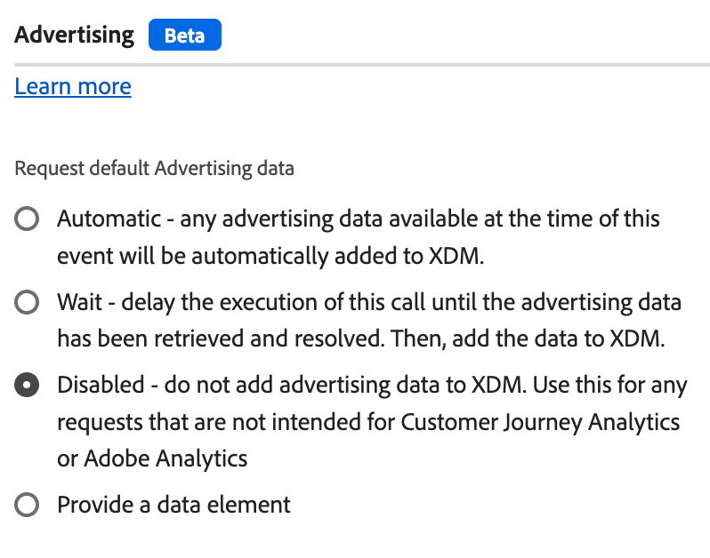

# Ereignis senden

Die **[!UICONTROL Send event]**-Aktion sendet eine Payload an einen Datenstrom auf der Adobe Experience Platform Edge Network. Dies ist eine Kernfunktion der Datenerfassung und Personalisierung. Fast alle Unternehmen verwenden diese Funktion als Teil ihrer Web SDK-Implementierung.

1. Melden Sie sich mit Ihren Adobe ID[Anmeldeinformationen bei &#x200B;](https://experience.adobe.com)experience.adobe.com) an.
1. Navigieren Sie zu **[!UICONTROL Data Collection]** > **[!UICONTROL Tags]**.
1. Wählen Sie die gewünschte Tag-Eigenschaft aus.
1. Navigieren Sie zu **[!UICONTROL Rules]** und wählen Sie dann die gewünschte Regel aus.
1. Wählen Sie unter [!UICONTROL Actions] eine vorhandene Aktion aus oder erstellen Sie eine Aktion.
1. Legen Sie das Dropdown-Feld [!UICONTROL Extension] auf **[!UICONTROL Adobe Experience Platform Web SDK]** und dann den [!UICONTROL Action type] auf **[!UICONTROL Send event]** fest.

## Allgemeine Felder

* **[!UICONTROL Instance]**: Die SDK-Instanz, für die die Aktion gilt. Dieses Dropdown-Menü ist deaktiviert, wenn Ihre Implementierung eine einzige SDK-Instanz verwendet.
* **[!UICONTROL Use guided events]**: Aktivieren Sie diese Option, um bestimmte Felder automatisch auszufüllen oder auszublenden, um einen bestimmten Anwendungsfall zu ermöglichen. Diese Einstellung kann dazu beitragen, das Rauschen der verfügbaren Optionen zu reduzieren, wenn Sie die Aktion für den jeweiligen Zweck einrichten, und folgt den Best Practices von Adobe für [Top-/Bottom Page Events](/help/collection/use-cases/personalization/top-bottom-page-events.md). Durch Aktivieren dieses Kontrollkästchens wird die Anzeige der folgenden Optionsfelder Trigger:
   * **[!UICONTROL Request personalization]**: Erhalten Sie die neuesten Personalisierungsentscheidungen, ohne ein Adobe Analytics-Ereignis aufzuzeichnen. Er wird am häufigsten oben auf der Seite genannt. Wenn dieses Optionsfeld ausgewählt ist, werden die folgenden Felder festgelegt:
      * [!UICONTROL Type] ist gesperrt für [!UICONTROL Decisioning Proposition Fetch]
      * [!UICONTROL Render visual personalization decisions] ist gesperrt in aktiviert
      * [!UICONTROL Automatically send a display event] ist gesperrt oder deaktiviert
   * **[!UICONTROL Collect analytics]**: Aufzeichnen eines Ereignisses ohne Abrufen von Personalisierungsentscheidungen. Er wird am häufigsten am unteren Rand der Seite genannt. Wenn dieses Optionsfeld ausgewählt ist, werden die folgenden Felder festgelegt:
      * [!UICONTROL Include rendered propositions] ist gesperrt in aktiviert

## Datenfelder

* **[!UICONTROL Type]**: Der Ereignistyp. Sie können aus einem vordefinierten Wertesatz auswählen oder einen eigenen Wert definieren. Weitere [&#x200B; finden Sie unter „Akzeptierte Werte für `eventType`](/help/xdm/classes/experienceevent.md#accepted-values-for-eventtype)&quot;. Die JavaScript-Bibliothek, die diesem Feld entspricht, ist [`eventType`](/help/collection/js/commands/sendevent/eventtype.md).
* **[!UICONTROL XDM]**: Die XDM-Payload, die Sie an Adobe senden möchten. Sie können entweder ein [XDM-Objekt](../data-element-types.md#xdm-object) oder [Variable](../data-element-types.md#variable) in diesem Feld verwenden. Wenn Sie Regeln haben, die mehrere XDM-Objekte befüllen, können Sie [Zusammengeführte Objekte](../../core/overview.md#merged-objects) verwenden, um sie zu kombinieren.
* **[!UICONTROL Data]**: Die Daten-Payload, die Sie an Adobe senden möchten. Bei einigen Apps und Services ist die Einhaltung eines XDM-Schemas, z. B. Adobe Analytics oder Adobe Target, nicht erforderlich. Verwenden Sie [&#x200B; Datenelementtyp &#x200B;](../data-element-types.md#variable)Variable“ für dieses Feld.
* **[!UICONTROL Include rendered propositions]**: Aktivieren Sie dieses Kontrollkästchen, um dieses Ereignis als Anzeigeereignis zu verwenden, einschließlich der Vorschläge, die gerendert werden, wenn „Anzeigeereignis automatisch senden“ deaktiviert wurde. Das `_experience.decisioning` XDM-Feld enthält Informationen zur gerenderten Personalisierung.
* **[!UICONTROL Document will unload]**: Aktivieren Sie dieses Kontrollkästchen, um sicherzustellen, dass das Ereignis den Server erreicht, auch wenn der Benutzer die Seite verlässt. Bei dieser Einstellung können Ereignisse den Server erreichen, Antworten von der Edge Network werden jedoch ignoriert.
* **[!UICONTROL Merge ID]** _(veraltet)_: Füllt das `eventMergeId` XDM-Feld.

## Personalisierungsfelder 

* **[!UICONTROL Scopes]**: Ein Array von Bereichen, die explizit von der Personalisierung angefordert werden sollen. Sie können die Bereiche manuell eingeben oder ein Datenelement bereitstellen. Bei der manuellen Eingabe von Bereichen stellt jedes Feld einen Bereich dar. Wählen Sie **[!UICONTROL Add scope]** aus, um der Aktion weitere Bereiche hinzuzufügen.
* **[!UICONTROL Surfaces]**: Ein Array von Oberflächen, die mit dem Ereignis abgefragt werden sollen. Weitere Informationen [&#x200B; Sie in der Dokumentation &#x200B;](https://experienceleague.adobe.com/docs/journey-optimizer/using/web/create-web.html?lang=de) Adobe Journey Optimizer unter „Erstellen von Web-Erlebnissen“. Beim manuellen Eingeben von Oberflächen stellt jedes Feld eine Oberfläche dar. Wählen Sie **[!UICONTROL Add surface]** aus, um der Aktion weitere Oberflächen hinzuzufügen.
* **Visuelle Personalisierungsentscheidungen rendern** Ein Kontrollkästchen, mit dem Sie personalisierte Inhalte auf der Seite rendern können, wenn es aktiviert ist. Weitere Informationen [&#x200B; Sie unter &#x200B;](/help/collection/use-cases/personalization/rendering-personalization-content.md#automatically-rendering-content) von personalisierten Inhalten .
* **[!UICONTROL Request default personalization]**: Steuert, ob der seitenweite Bereich und die Standardoberfläche angefordert werden. Standardmäßig wird sie beim ersten `sendEvent` des Seitenladevorgangs automatisch angefordert. Die JavaScript-Bibliothek, die diesen Optionsfeldern entspricht, ist [`requestDefaultPersonalization`](/help/collection/js/commands/sendevent/personalization.md). Sie können aus den folgenden Optionen wählen:
   * **[!UICONTROL Automatic]**: Das Standardverhalten. Fordern Sie nur die Standard-Personalisierung an, wenn sie noch nicht angefordert wurde.
   * **[!UICONTROL Enabled]**: Anfordern des Seitenbereichs und der Standardoberfläche explizit. Dadurch wird der SPA-Ansichts-Cache aktualisiert.
   * **[!UICONTROL Disabled]**: Unterdrückt explizit die Anfrage für den Seitenbereich und die Standardoberfläche.
* **[!UICONTROL Decision context]**: Eine Schlüssel-Wert-Zuordnung, die bei der Auswertung von Adobe Journey Optimizer-Regelsätzen für die geräteinterne Entscheidungsfindung verwendet wird. Sie können den Entscheidungskontext manuell oder über ein Datenelement bereitstellen.

## Advertising-Felder

* **[!UICONTROL Request default advertising data]**: Bestimmt, wann (oder ob) die Bibliothek Werbeinformationen zur XDM-Payload hinzufügt. Sie können aus den folgenden Optionen wählen:
   * **[!UICONTROL Automatic]**: Alle zum Zeitpunkt des Ereignisses verfügbaren Werbedaten werden zur Ereignis-Payload hinzugefügt.
   * **[!UICONTROL Wait]**: Senden des Ereignisses verzögern, bis die Werbedaten empfangen werden.
   * **[!UICONTROL Disabled]**: Fügen Sie keine Werbedaten zur Ereignis-Payload hinzu. Wählen Sie diese Option aus, wenn Ihre Implementierung nicht Adobe Analytics oder Customer Journey Analytics verwendet.

## Überschreibungen der Datenstromkonfiguration

Dieser Befehl unterstützt Überschreibungen der Datenstromkonfiguration, sodass Sie steuern können, welche Apps und Services diese Daten erhalten. Wenn Sie eine Überschreibung der Datenstromkonfiguration sowohl in einem einzelnen Befehl als auch in den Konfigurationseinstellungen der Tag-Erweiterung festlegen, hat der einzelne Befehl Vorrang. Weitere [&#x200B; finden Sie unter &#x200B;](../configure/configuration-overrides.md) der Datenstromkonfiguration .
