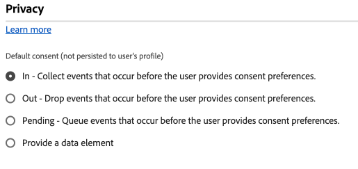

# Konfigurationseinstellungen des Einverständnisses {#consent}

>[!CONTEXTUALHELP]
>id="platform_tags_websdk_consent"
>title="Einverständnis"
>abstract="Wählt die Standardebene für das Einverständnis aus, die angenommen wird, wenn keine andere explizite Einverständnisvoreinstellung angegeben wird."

Im **[!UICONTROL Consent]** Abschnitt können Sie die Standardebene für das Einverständnis auswählen, von der ausgegangen wird, wenn keine andere explizite Einverständnisvoreinstellung angegeben wird. Die standardmäßige Einverständnisebene wird nicht in Benutzerprofilen gespeichert.

1. Melden Sie sich mit Ihren Adobe ID[Anmeldeinformationen bei ](https://experience.adobe.com)experience.adobe.com) an.
1. Navigieren Sie zu **[!UICONTROL Data Collection]** > **[!UICONTROL Tags]**.
1. Wählen Sie die gewünschte Tag-Eigenschaft aus.
1. Navigieren Sie zu **[!UICONTROL Extensions]** und wählen Sie **[!UICONTROL Configure]** auf der [!UICONTROL Adobe Experience Platform Web SDK] aus.
1. Scrollen Sie nach unten zum Abschnitt **[!UICONTROL Consent]** .

Dieser Abschnitt enthält einen einzigen Satz von Optionsfeldern, die die standardmäßige Einverständnisebene bestimmen:

* **[!UICONTROL In]**: Erfassen Sie Ereignisse, die auftreten, bevor die Benutzerin bzw. der Benutzer die Einverständnisvoreinstellungen angibt.
* **[!UICONTROL Out]**: Ereignisse ablegen, die auftreten, bevor die Benutzerin bzw. der Benutzer Einverständnisvoreinstellungen angibt.
* **[!UICONTROL Pending]**: Ereignisse in die Warteschlange stellen, die auftreten, bevor der Benutzer Einverständnisvoreinstellungen eingibt. Wenn das Einverständnis erteilt wird, werden Ereignisse in der Warteschlange an Adobe gesendet. Wenn das Einverständnis verweigert wird, werden Ereignisse in der Warteschlange verworfen.
* **[!UICONTROL Provide a data element]**: Wählen Sie ein Datenelement aus, das eine der oben genannten Konfigurationseinstellungen bestimmt. Gültige Werte sind die Zeichenfolgen `"in"`, `"out"` oder `"pending"`.

Wenn Ihr Unternehmen ein explizites Benutzereinverständnis zum Erfassen von Daten benötigt, empfiehlt Adobe, das standardmäßige Einverständnis entweder auf **[!UICONTROL Out]** oder auf **[!UICONTROL Pending]** festzulegen.
