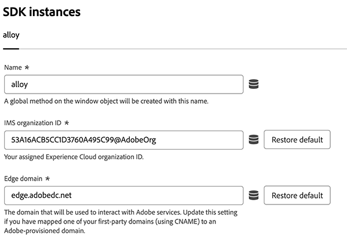

# Konfigurationseinstellungen der SDK-Instanz

Dieser Konfigurationsabschnitt regelt den Namen der Web-SDK-Instanz, die IMS-Organisation, für die sie gilt, und den Speicherort, an den Sie Daten senden möchten. Standardmäßig heißt eine Instanz `alloy`.

1. Melden Sie sich mit Ihren Adobe ID[Anmeldeinformationen bei ](https://experience.adobe.com)experience.adobe.com) an.
1. Navigieren Sie zu **[!UICONTROL Data Collection]** > **[!UICONTROL Tags]**.
1. Wählen Sie die gewünschte Tag-Eigenschaft aus.
1. Navigieren Sie zu **[!UICONTROL Extensions]** und wählen Sie **[!UICONTROL Configure]** auf der [!UICONTROL Adobe Experience Platform Web SDK] aus.
1. Suchen Sie den Instanznamen direkt unter dem erweiterten Akkordeon [!UICONTROL SDK instances] .

Die folgenden Optionen sind verfügbar:

## [!UICONTROL Name]

Die Tag-Erweiterung &quot;Adobe Experience Platform Web SDK&quot; unterstützt mehrere Instanzen auf der Seite. Der Name wird verwendet, um Daten an mehrere Unternehmen zu senden, ohne dass doppelte Web-SDK-Tag-Bibliotheken erforderlich sind. Sie können den Instanznamen in einen beliebigen gültigen JavaScript-Objektnamen ändern.

## [!UICONTROL IMS organization ID]

Die ID der Organisation, an die die Daten unter Adobe gesendet werden sollen. Meistens verwenden Sie den Standardwert, der automatisch ausgefüllt wird. Wenn sich auf der Seite mehrere Instanzen befinden, füllen Sie dieses Feld mit dem Wert der zweiten Organisation, an die Sie Daten senden möchten.

## [!UICONTROL Edge domain]

Die Domain, von der die Erweiterung Daten sendet und empfängt. Standardmäßig enthält das Feld `<COMPANYID>.data.adobedc.net`. Ältere Implementierungen enthalten möglicherweise den Standardwert `edge.adobedc.net`, der ebenfalls gültig ist.

Adobe empfiehlt in den meisten Fällen die Verwendung einer Erstanbieter-Domain. Anweisungen zum Einrichten einer für die Datenerfassung geeigneten Erstanbieterdomäne finden [ im Adobe-verwalteten Zertifikatprogramm ](https://experienceleague.adobe.com/en/docs/core-services/interface/data-collection/adobe-managed-cert). Anleitungen zum Festlegen dieses Werts finden Sie auch in der JavaScript-Bibliotheksdokumentation unter [`edgeDomain`](/help/collection/js/commands/configure/edgedomain.md) .
