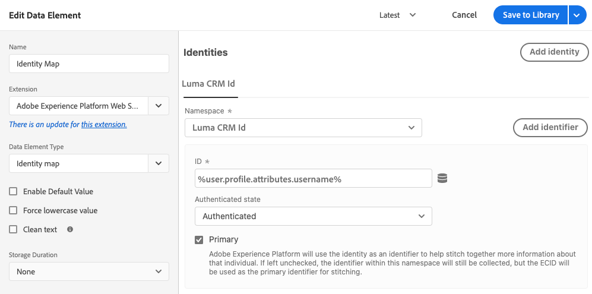

# Datenelementtypen

Nachdem Sie die [Aktionstypen](action-types.md) im [Adobe Experience Platform Web SDK-Tag-Erweiterung](web-sdk-extension-configuration.md)müssen Sie Ihre Datenelementtypen konfigurieren. Auf dieser Seite werden die verfügbaren Datenelementtypen beschrieben.

## Identitätszuordnung {#identity-map}

Mit einer Identitätszuordnung können Sie Identitäten für den Besucher Ihrer Webseite festlegen. Eine Identitätszuordnung besteht aus Namespaces wie `CRMID`, `Phone` oder `Email`, wobei jeder Namespace eine oder mehrere IDs enthält. Wenn beispielsweise die Person auf Ihrer Website zwei Telefonnummern angegeben hat, sollte Ihr Smartphone-Namespace zwei Kennungen enthalten.

Im [!UICONTROL Identitätskarte] -Datenelement verwenden, stellen Sie für jede Kennung die folgenden Informationen bereit:

* **[!UICONTROL ID]**: Der Wert, der den Besucher identifiziert. Wenn die Kennung beispielsweise zum _phone_ Namespace, die [!UICONTROL ID] kann _555-555-555_. Dieser Wert wird normalerweise aus einer JavaScript-Variablen oder einem anderen Datenelement auf Ihrer Seite abgeleitet. Daher ist es am besten, ein Datenelement zu erstellen, das auf die Seitendaten verweist, und dann auf das Datenelement im [!UICONTROL ID] -Feld innerhalb der [!UICONTROL Identitätskarte] Datenelement. Wenn der ID-Wert bei der Ausführung auf Ihrer Seite etwas Anderes als eine ausgefüllte Zeichenfolge ist, wird der Bezeichner automatisch aus der Identitätszuordnung entfernt.
* **[!UICONTROL Authentifizierter Status]**: Eine Auswahl, die angibt, ob der Besucher authentifiziert ist.
* **[!UICONTROL Primär]**: Eine Auswahl, die angibt, ob die Kennung als primäre Kennung für die Person verwendet werden soll. Wenn keine Kennung als primär markiert ist, wird die ECID als primäre Kennung verwendet.

>[!TIP]
>
>Adobe empfiehlt, Identitäten zu senden, die eine Person repräsentieren, z. B. `Luma CRM Id` als primäre Identität.
>
>Wenn die Identitätszuordnung die Personenkennung enthält (z. B. `Luma CRM Id`), wird die Personenkennung zur primären Kennung. Andernfalls `ECID` wird zur primären Identität.

Sie sollten keine [!DNL ECID] beim Erstellen einer Identitätszuordnung. Bei der Verwendung des SDK wird ein [!DNL ECID] wird automatisch auf dem Server generiert und in die Identitätszuordnung aufgenommen.

Das Datenelement &quot;Identitätszuordnung&quot;wird häufig zusammen mit der Variablen [[!UICONTROL XDM-Objekt] Datenelementtyp](#xdm-object) und [[!UICONTROL Einverständnis festlegen] Aktionstyp](action-types.md#set-consent).

Mehr dazu [Adobe Experience Platform Identity-Dienst](../../../../identity-service/home.md).

## XDM-Objekt {#xdm-object}

Die Formatierung Ihrer Daten in XDM ist mit dem XDM-Objektdatenelement einfacher. Wenn Sie dieses Datenelement zum ersten Mal öffnen, wählen Sie die richtige Adobe Experience Platform-Sandbox und das richtige Schema aus. Nachdem Sie Ihr Schema ausgewählt haben, sehen Sie die Struktur Ihres Schemas, die Sie einfach ausfüllen können.

Beachten Sie Folgendes, wenn Sie bestimmte Felder Ihres Schemas öffnen, z. B. `web.webPageDetails.URL`, werden einige Elemente automatisch erfasst. Obwohl mehrere Elemente automatisch erfasst werden, können Sie bei Bedarf alle Elemente überschreiben. Alle Werte können manuell oder mithilfe anderer Datenelemente ausgefüllt werden.

>[!NOTE]
>
>Füllen Sie nur die Informationen aus, die Sie sammeln möchten. Alles, was nicht ausgefüllt wird, wird beim Senden der Daten an die Lösungen weggelassen.

## Variable {#variable}

Eine andere Möglichkeit zum Erstellen von XDM-Objekten besteht in der Verwendung der **[!UICONTROL Variable]** Datenelement. Während das XDM-Objektdatenelement erstellt wird, wenn darauf verwiesen wird, z. B. in einem `sendEvent` -Befehl, **[!UICONTROL Variable]** Datenelement kann aktualisiert werden über [!UICONTROL Variable aktualisieren] Aktionen. Um das Datenelement zu verwenden, wählen Sie die richtige Adobe Experience Platform-Sandbox und das richtige Schema aus.

Nachdem Sie dieses Datenelement erstellt haben, können Sie [Variable aktualisieren](./action-types.md#update-variable) Aktionen zum Ändern des Datenelements. Verwenden Sie dann innerhalb der Sendeereignisaktionen das variable Datenelement für die XDM-Option.

## Nächste Schritte {#next-steps}

Erfahren Sie mehr über bestimmte Anwendungsfälle wie [Zugriff auf die ECID](accessing-the-ecid.md).
