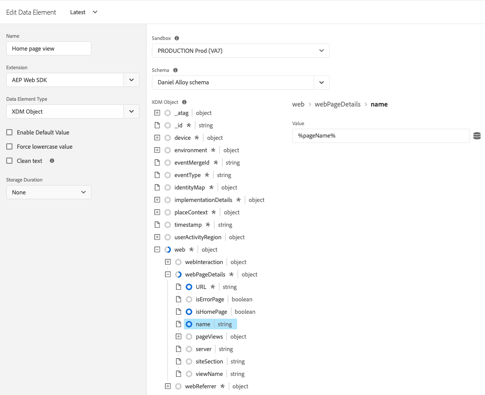

# Datenelementtypen

Nachdem Sie die [Aktionstypen](action-types.md) in der [Adobe Experience Platform Web SDK Tag-Erweiterung](web-sdk-extension-configuration.md) festgelegt haben, müssen Sie Ihre Datenelementtypen konfigurieren. Auf dieser Seite werden die verfügbaren Datenelementtypen beschrieben.

## Identitätszuordnung {#identity-map}

Mit einer Identitätszuordnung können Sie Identitäten für den Besucher Ihrer Webseite festlegen. Eine Identitätszuordnung besteht aus Namespaces wie `CRMID`, `Phone` oder `Email`, wobei jeder Namespace mindestens eine Kennung enthält. Wenn beispielsweise die Person auf Ihrer Website zwei Telefonnummern angegeben hat, sollte Ihr Smartphone-Namespace zwei Kennungen enthalten.

Im Datenelement [!UICONTROL Identitätszuordnung] geben Sie für jede Kennung die folgenden Informationen an:

* **[!UICONTROL ID]**: Der Wert, der den Besucher identifiziert. Wenn die Kennung beispielsweise zum Namespace _phone_ gehört, kann die [!UICONTROL ID] _555-555-5555_ lauten. Dieser Wert wird normalerweise von einer JavaScript-Variablen oder einem anderen Datenelement auf Ihrer Seite abgeleitet. Daher ist es am besten, ein Datenelement zu erstellen, das auf die Seitendaten verweist, und dann im Datenelement [!UICONTROL ID] im Feld [!UICONTROL Identitätszuordnung] auf das Datenelement zu verweisen. Wenn der ID-Wert bei der Ausführung auf Ihrer Seite etwas Anderes als eine ausgefüllte Zeichenfolge ist, wird der Bezeichner automatisch aus der Identitätszuordnung entfernt.
* **[!UICONTROL Authentifizierter Status]**: Eine Auswahl, die angibt, ob der Besucher authentifiziert ist.
* **[!UICONTROL Primär]**: Eine Auswahl, die angibt, ob die Kennung als primäre Kennung für die Person verwendet werden soll. Wenn keine Kennung als primär markiert ist, wird die ECID als primäre Kennung verwendet.

>[!TIP]
>
>Adobe empfiehlt das Senden von Identitäten, die eine Person repräsentieren, z. B. `Luma CRM Id` als primäre Identität.
>
>Wenn die Identitätszuordnung die Personenkennung enthält (z. B. `Luma CRM Id`), wird die Personenkennung zur primären Kennung. Andernfalls wird `ECID` zur primären Identität.

Sie sollten beim Erstellen einer Identitätszuordnung keinen [!DNL ECID] angeben. Bei Verwendung des SDK wird automatisch ein [!DNL ECID] auf dem Server generiert und in die Identitätszuordnung aufgenommen.

Das Datenelement &quot;Identitätszuordnung&quot;wird oft zusammen mit dem Datenelementtyp [[!UICONTROL XDM-Objekt] und dem Aktionstyp [[!UICONTROL Einverständnis festlegen] ](action-types.md#set-consent) verwendet.](#xdm-object)

Weitere Informationen zu [Adobe Experience Platform Identity Service](../../../../identity-service/home.md).

## XDM-Objekt {#xdm-object}

Die Formatierung Ihrer Daten in XDM ist mit dem XDM-Objektdatenelement einfacher. Wenn Sie dieses Datenelement zum ersten Mal öffnen, wählen Sie die richtige Adobe Experience Platform-Sandbox und das richtige Schema aus. Nachdem Sie Ihr Schema ausgewählt haben, sehen Sie die Struktur Ihres Schemas, die Sie einfach ausfüllen können.

Beachten Sie, dass beim Öffnen bestimmter Felder Ihres Schemas, z. B. `web.webPageDetails.URL`, einige Elemente automatisch erfasst werden. Obwohl mehrere Elemente automatisch erfasst werden, können Sie bei Bedarf alle Elemente überschreiben. Alle Werte können manuell oder mithilfe anderer Datenelemente ausgefüllt werden.

>[!NOTE]
>
>Füllen Sie nur die Informationen aus, die Sie sammeln möchten. Alles, was nicht ausgefüllt wird, wird beim Senden der Daten an die Lösungen weggelassen.

## Variable {#variable}

Sie können Payload-Objekte mithilfe des Datenelements **[!UICONTROL Variable]** erstellen. Sowohl [!UICONTROL XDM] - als auch [!UICONTROL Data] -Objekte werden unterstützt.

* Wenn Sie [!UICONTROL XDM] auswählen, wählen Sie die gewünschte [!UICONTROL Sandbox] und [!UICONTROL Schema] aus.
* Wenn Sie [!UICONTROL Daten] auswählen, wählen Sie die gewünschten Lösungen aus. Zu den verfügbaren Lösungen gehören [!UICONTROL Adobe Analytics] und [!UICONTROL Adobe Target].

Nachdem Sie dieses Datenelement erstellt haben, können Sie es mit der Aktion [Variable aktualisieren](./action-types.md#update-variable) ändern. Wenn Sie bereit sind, können Sie dieses Datenelement in die Aktion [Ereignis senden](./action-types.md#send-event) aufnehmen, um Daten an einen Datastream zu senden.

## Medien: Erlebnisqualität {#quality-experience}

Beim Senden von Streaming-Medienereignissen an Adobe Experience Platform ist ein Datenelement vom Typ **[!UICONTROL Erlebnisqualität]** hilfreich. Sie können dieses Element beim Erstellen einer Mediensitzung hinzufügen. Die folgenden Medienereignisse enthalten aktualisierte Daten zur Erlebnisqualität.

## Nächste Schritte {#next-steps}

Erfahren Sie mehr über bestimmte Anwendungsfälle wie den Zugriff auf die ECID](accessing-the-ecid.md).[
