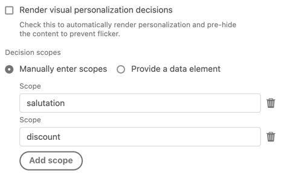
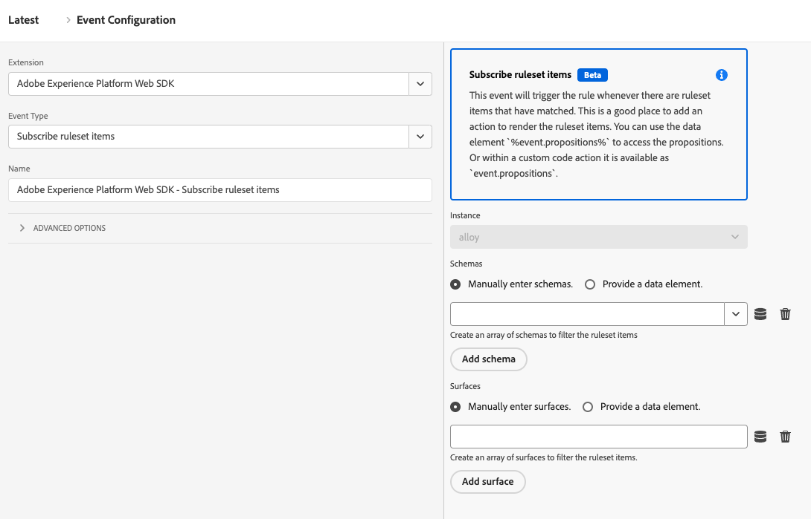

# Ereignistypen

Auf dieser Seite werden die Adobe Experience Platform-Ereignistypen beschrieben, die von der Adobe Experience Platform Web SDK-Tag-Erweiterung bereitgestellt werden. Diese werden zum [Erstellen von Regeln](https://experienceleague.adobe.com/docs/platform-learn/data-collection/tags/build-rules.html?lang=de) verwendet und sollten nicht mit dem Feld `eventType` im [`xdm`-Objekt verwechselt werden](/help/web-sdk/commands/sendevent/xdm.md).

## Überwachungs-Hook ausgelöst {#monitoring-hook-triggered}

Adobe Experience Platform Web SDK enthält Überwachungs-Hooks, mit denen Sie verschiedene Systemereignisse überwachen können. Diese Tools sind nützlich, um eigene Debugging-Tools zu entwickeln und Web SDK-Protokolle zu erfassen.

Ausführliche Informationen zu den Parametern, die die einzelnen Überwachungs-Hook-Ereignisse enthalten, finden Sie in der [Dokumentation zu den Überwachungs-Hooks für Web SDK](../../../../web-sdk/monitoring-hooks.md).


Die Web SDK-Tag-Erweiterung unterstützt die folgenden Überwachungs-Hooks:

* **[!UICONTROL onInstanceCreated]**: Dieses Überwachungs-Hook-Ereignis wird ausgelöst, wenn Sie erfolgreich eine neue Web SDK-Instanz erstellt haben.
* **[!UICONTROL onInstanceConfiged]**: Dieses Überwachungs-Hook-Ereignis wird von der Web-SDK ausgelöst, wenn der [`configure`](../../../../web-sdk/commands/configure/overview.md) erfolgreich aufgelöst wurde
* **[!UICONTROL onBeforeCommand]**: Dieses Überwachungs-Hook-Ereignis wird von Web SDK ausgelöst, bevor ein anderer Befehl ausgeführt wird. Mit diesem Überwachungs-Hook können Sie die Konfigurationsoptionen eines bestimmten Befehls abrufen.
* **[!UICONTROL onCommandResolved]**: Dieses Überwachungs-Hook-Ereignis wird ausgelöst, bevor die Befehlszusage aufgelöst wird. Sie können diese Funktion verwenden, um die Befehlsoptionen und das Ergebnis anzuzeigen.
* **[!UICONTROL onCommandRejected]**: Dieses Überwachungs-Hook-Ereignis wird ausgelöst, wenn eine Befehlszusage abgelehnt wird, und enthält Informationen zur Fehlerursache.
* **[!UICONTROL onBeforeNetworkRequest]**: Dieses Überwachungs-Hook-Ereignis wird ausgelöst, bevor eine Netzwerkanfrage ausgeführt wird.
* **[!UICONTROL onNetworkResponse]**: Dieses Überwachungs-Hook-Ereignis wird ausgelöst, wenn der Browser eine Antwort erhält.
* **[!UICONTROL onNetworkError]**: Dieses Überwachungs-Hook-Ereignis wird ausgelöst, wenn die Netzwerkanfrage fehlgeschlagen ist.
* **[!UICONTROL onBeforeLog]**: Dieses Überwachungs-Hook-Ereignis wird ausgelöst, bevor Web SDK etwas in der Konsole protokolliert.
* **[!UICONTROL onContentRendering]**: Dieses Überwachungs-Hook-Ereignis wird von der `personalization`-Komponente ausgelöst und hilft Ihnen beim Debuggen des Renderings des Personalisierungsinhalts. Dieses Ereignis kann unterschiedliche Status haben:
   * `rendering-started`: Gibt an, dass Web SDK Vorschläge rendern wird. Bevor Web SDK mit dem Rendern eines Entscheidungsumfangs oder einer Ansicht beginnt, können Sie im `data` die Vorschläge sehen, die von der `personalization` gerendert werden sollen, sowie den Namen des Bereichs.
   * `no-offers`: Gibt an, dass für die angeforderten Parameter keine Payload empfangen wurde.
   * `rendering-failed`: Gibt an, dass Web SDK einen Vorschlag nicht rendern konnte.
   * `rendering-succeeded`: Gibt an, dass das Rendering für einen Entscheidungsumfang abgeschlossen ist.
   * `rendering-redirect`: Gibt an, dass Web SDK einen Umleitungsvorschlag ausführt.
* **[!UICONTROL onContentHiding]**: Dieses Überwachungs-Hook-Ereignis wird ausgelöst, wenn ein Stil zum Vorab-Ausblenden angewendet oder entfernt wird.


## [!UICONTROL Senden des Ereignisses abgeschlossen]

Normalerweise verfügt Ihre Eigenschaft über eine oder mehrere Regeln, die die Aktion [[!UICONTROL Ereignis senden] verwenden, ](action-types.md#send-event) Ereignisse an das Adobe Experience Platform-Edge Network zu senden. Jedes Mal, wenn ein Ereignis an Edge Network gesendet wird, wird eine Antwort mit nützlichen Daten an den Browser zurückgegeben. Ohne den Ereignistyp [!UICONTROL Ereignis senden abgeschlossen] hätten Sie keinen Zugriff auf diese zurückgegebenen Daten.

Um auf die zurückgegebenen Daten zuzugreifen, erstellen Sie eine separate Regel und fügen Sie dann der Regel [!UICONTROL  Ereignis ]Ereignis „Ereignis senden abgeschlossen“ hinzu. Diese Regel wird jedes Mal ausgelöst, wenn als Ergebnis der Aktion „Ereignis senden[!UICONTROL  eine erfolgreiche Antwort vom Server ] wird.

Wenn ein [!UICONTROL Sendeereignis abgeschlossen] eine Regel erstellt, stellt sie vom Server zurückgegebene Daten bereit, die für die Ausführung bestimmter Trigger nützlich sein können. In der Regel fügen Sie derselben Regel[!UICONTROL  die ] „Benutzerdefinierter Code“ (aus der Erweiterung [!UICONTROL Core]) hinzu, die das Ereignis [!UICONTROL send event complete] enthält. In der [!UICONTROL Benutzerspezifischer Code]-Aktion hat Ihr benutzerdefinierter Code Zugriff auf eine Variable namens `event`. Diese `event` enthält die vom Server zurückgegebenen Daten.

Ihre Regel für die Verarbeitung der vom Edge Network zurückgegebenen Daten könnte in etwa wie folgt aussehen:


Im Folgenden finden Sie einige Beispiele für die Durchführung bestimmter Aufgaben mithilfe der Aktion [!UICONTROL Benutzerdefinierter Code] in dieser Regel.

### Personalisierte Inhalte manuell rendern

In der Aktion für benutzerspezifischen Code, die in der Regel für die Verarbeitung von Antwortdaten enthalten ist, können Sie auf Personalisierungsvorschläge zugreifen, die vom Server zurückgegeben wurden. Dazu geben Sie den folgenden benutzerdefinierten Code ein:

```javascript
var propositions = event.propositions;
```

Wenn `event.propositions` vorhanden ist, handelt es sich um ein Array mit Personalisierungsvorschlagsobjekten. Die im Array enthaltenen Vorschläge werden größtenteils davon bestimmt, wie das Ereignis an den Server gesendet wurde.

Angenommen, Sie haben bei diesem ersten Szenario das Kontrollkästchen [!UICONTROL Entscheidungen rendern] nicht aktiviert und keine [!UICONTROL Entscheidungsumfänge] innerhalb der [!UICONTROL Ereignis senden]-Aktion angegeben, die das Ereignis sendet.


In diesem Beispiel enthält das `propositions`-Array nur Vorschläge im Zusammenhang mit dem Ereignis, die für die automatische Wiedergabe geeignet sind.

Das `propositions`-Array könnte in etwa wie im folgenden Beispiel aussehen:

```json
[
  {
    "id": "AT:eyJhY3Rpdml0eUlkIjoiMTI3MDE5IiwiZXhwZXJpZW5jZUlkIjoiMCJ9",
    "scope": "__view__",
    "items": [
      {
        "id": "11223344",
        "schema": "https://ns.adobe.com/personalization/dom-action",
        "data": {
          "content": "<h2 style=\"color: yellow\">An HTML proposition.</h2>",
          "selector": "#hero",
          "type": "setHtml"
        },
        "meta": {}
      }
    ],
    "renderAttempted": false
  },
  {
    "id": "AT:PyJhY3Rpdml0eUlkIjoiMTI3MDE5IiwiZXhwZXJpZW5jZUlkIjoiMCJ8",
    "scope": "__view__",
    "items": [
      {
        "id": "11223345",
        "schema": "https://ns.adobe.com/personalization/dom-action",
        "data": {
          "content": "<h2 style=\"color: yellow\">Another HTML proposition.</h2>",
          "selector": "#sidebar",
          "type": "setHtml"
        },
        "meta": {}
      }
    ],
    "renderAttempted": false
  }
]
```

Beim Senden des Ereignisses wurde das Kontrollkästchen [!UICONTROL Entscheidungen rendern] nicht aktiviert, sodass die SDK nicht versucht hat, automatisch Inhalte zu rendern. Die SDK hat jedoch weiterhin automatisch die Inhalte abgerufen, die für die automatische Wiedergabe infrage kommen, und hat Ihnen diese zum manuellen Rendern bereitgestellt, falls Sie dies tun möchten. Beachten Sie, dass die `renderAttempted` jedes Vorschlagsobjekts auf `false` gesetzt ist.

Wenn Sie stattdessen beim Senden des Ereignisses das Kontrollkästchen [!UICONTROL Entscheidungen rendern] aktiviert hätten, hätte die SDK versucht, alle Vorschläge zu rendern, die für das automatische Rendering geeignet sind. Infolgedessen würde die `renderAttempted`-Eigenschaft jedes Vorschlagsobjekts auf `true` gesetzt. In diesem Fall müssten diese Vorschläge nicht manuell gerendert werden.

Bisher haben Sie sich nur mit Personalisierungsinhalten befasst, die für das automatische Rendering geeignet sind (z. B. alle Inhalte, die in Visual Experience Composer von Adobe Target erstellt wurden). Um Personalisierungsinhalte abzurufen _die nicht für_ automatische Rendering geeignet sind, fordern Sie den Inhalt an, indem Sie Entscheidungsumfänge mithilfe des Felds [!UICONTROL Entscheidungsumfänge] in der Aktion [!UICONTROL Ereignis senden] angeben. Ein Bereich ist eine Zeichenfolge, die einen bestimmten Vorschlag identifiziert, den Sie vom Server abrufen möchten.

Die [!UICONTROL Ereignis senden] Aktion würde wie folgt aussehen:



Wenn in diesem Beispiel Vorschläge auf dem Server gefunden werden, die mit dem `salutation`- oder `discount` übereinstimmen, werden sie zurückgegeben und in das `propositions`-Array aufgenommen. Beachten Sie, dass Vorschläge, die sich für das automatische Rendering qualifizieren, weiterhin im `propositions`-Array enthalten sind, unabhängig davon, wie Sie die Felder [!UICONTROL Render-] oder [!UICONTROL Entscheidungsumfänge] in der [!UICONTROL Ereignis senden]-Aktion konfigurieren. Das `propositions`-Array würde in diesem Fall in etwa wie im folgenden Beispiel aussehen:

```json
[
  {
    "id": "AT:cZJhY3Rpdml0eUlkIjoiMTI3MDE5IiwiZXhwZXJpZW5jZUlkIjoiMCJ2",
    "scope": "salutation",
    "items": [
      {
        "schema": "https://ns.adobe.com/personalization/json-content-item",
        "data": {
          "id": "4433221",
          "content": {
            "salutation": "Welcome, esteemed visitor!"
          }
        },
        "meta": {}
      }
    ],
    "renderAttempted": false
  },
  {
    "id": "AT:FZJhY3Rpdml0eUlkIjoiMTI3MDE5IiwiZXhwZXJpZW5jZUlkIjoiMCJ0",
    "scope": "discount",
    "items": [
      {
        "schema": "https://ns.adobe.com/personalization/html-content-item",
        "data": {
          "id": "4433222",
          "content": "<div>50% off your order!</div>",
          "format": "text/html"
        },
        "meta": {}
      }
    ],
    "renderAttempted": false
  },
  {
    "id": "AT:eyJhY3Rpdml0eUlkIjoiMTI3MDE5IiwiZXhwZXJpZW5jZUlkIjoiMCJ9",
    "scope": "__view__",
    "items": [
      {
        "id": "11223344",
        "schema": "https://ns.adobe.com/personalization/dom-action",
        "data": {
          "content": "<h2 style=\"color: yellow\">An HTML proposition.</h2>",
          "selector": "#hero",
          "type": "setHtml"
        },
        "meta": {}
      }
    ],
    "renderAttempted": false
  },
  {
    "id": "AT:PyJhY3Rpdml0eUlkIjoiMTI3MDE5IiwiZXhwZXJpZW5jZUlkIjoiMCJ8",
    "scope": "__view__",
    "items": [
      {
        "id": "11223345",
        "schema": "https://ns.adobe.com/personalization/dom-action",
        "data": {
          "content": "<h2 style=\"color: yellow\">Another HTML proposition.</h2>",
          "selector": "#sidebar",
          "type": "setHtml"
        },
        "meta": {}
      }
    ],
    "renderAttempted": false
  }
]
```

An dieser Stelle können Sie den Vorschlagsinhalt nach Belieben rendern. In diesem Beispiel ist der Vorschlag, der mit dem `discount` übereinstimmt, ein HTML-Vorschlag, der mit dem formularbasierten Experience Composer von Adobe Target erstellt wurde. Angenommen, Sie haben ein Element auf Ihrer Seite mit der ID `daily-special` und möchten den Inhalt aus dem `discount` in das `daily-special` rendern. Gehen Sie folgendermaßen vor:

1. Extrahieren von Vorschlägen aus dem `event`.
1. Durchsuchen Sie jeden Vorschlag auf der Suche nach dem Vorschlag mit einem Umfang von `discount`.
1. Wenn Sie einen Vorschlag finden, durchsuchen Sie jedes Element im Vorschlag und suchen Sie nach dem Element, das Inhalt HTML ist. (Es ist besser zu überprüfen, als anzunehmen.)
1. Wenn Sie ein Element finden, das HTML-Inhalte enthält, suchen Sie das `daily-special` auf der Seite und ersetzen Sie die HTML durch den personalisierten Inhalt.

Ihr benutzerdefinierter Code innerhalb der Aktion [!UICONTROL Benutzerdefinierter Code] kann wie folgt aussehen:

```javascript
var propositions = event.propositions;

var discountProposition;
if (propositions) {
  // Find the discount proposition, if it exists.
  for (var i = 0; i < propositions.length; i++) {
    var proposition = propositions[i]; 
    if (proposition.scope === "discount") {
      discountProposition = proposition;
      break;
    }
  }
}

var discountHtml;
if (discountProposition) {
  // Find the item from proposition that should be rendered.
  // Rather than assuming there a single item that has HTML
  // content, find the first item whose schema indicates
  // it contains HTML content.
  for (var j = 0; j < discountProposition.items.length; j++) {
    var discountPropositionItem = discountProposition.items[i]; 
    if (discountPropositionItem.schema === "https://ns.adobe.com/personalization/html-content-item") {
      discountHtml = discountPropositionItem.data.content;
      break;
    }
  }
}

if (discountHtml) {
  // Discount HTML exists. Time to render it.
  var dailySpecialElement = document.getElementById("daily-special");
  dailySpecialElement.innerHTML = discountHtml;
}
```

### Zugriff auf Adobe Target-Antwort-Token

Von Adobe Target zurückgegebene Personalization-Inhalte enthalten [Antwort-Token](https://experienceleague.adobe.com/docs/target/using/administer/response-tokens.html) mit Details zur Aktivität, zum Angebot, zum Erlebnis, zum Benutzerprofil, zu geografischen Informationen und mehr. Diese Details können für Drittanbieter-Tools freigegeben oder zum Debugging verwendet werden. Antwort-Token können in der Benutzeroberfläche von Adobe Target konfiguriert werden.

In der Aktion für benutzerspezifischen Code, die in der Regel für die Verarbeitung von Antwortdaten enthalten ist, können Sie auf Personalisierungsvorschläge zugreifen, die vom Server zurückgegeben wurden. Geben Sie dazu den folgenden benutzerdefinierten Code ein:

```javascript
var propositions = event.propositions;
```

Wenn `event.propositions` vorhanden ist, handelt es sich um ein Array mit Personalisierungsvorschlagsobjekten. Weitere Informationen [ Inhalt von `result.propositions` finden Sie ](#manually-render-personalized-content)Manuelles Rendern personalisierter Inhalte“.

Angenommen, Sie möchten alle Aktivitätsnamen aus allen Vorschlägen erfassen, die automatisch von Web SDK gerendert wurden, und sie in ein einziges Array pushen. Sie können dann das einzelne Array an einen Drittanbieter senden. Schreiben Sie in diesem Fall benutzerdefinierten Code innerhalb der Aktion [!UICONTROL Benutzerdefinierter Code] in:

1. Extrahieren von Vorschlägen aus dem `event`.
1. Durchlaufen aller Vorschläge
1. Stellen Sie fest, ob der SDK den Vorschlag gerendert hat.
1. Wenn ja, durchlaufen Sie alle Elemente im Vorschlag.
1. Rufen Sie den Aktivitätsnamen aus der `meta`-Eigenschaft ab, bei der es sich um ein Objekt mit Antwort-Token handelt.
1. Pushen Sie den Aktivitätsnamen in ein Array.
1. Senden Sie die Aktivitätsnamen an eine Drittpartei.

```javascript
var propositions = event.propositions;
if (propositions) {
  var activityNames = [];
  propositions.forEach(function(proposition) {
    if (proposition.renderAttempted) {
      proposition.items.forEach(function(item) {
        if (item.meta) {
          // item.meta contains the response tokens.
          var activityName = item.meta["activity.name"];
          // Ignore duplicates
          if (activityNames.indexOf(activityName) === -1) {
            activityNames.push(activityName);  
          }
        }
      });
    }
  });
  // Now that activity names are in an array,
  // you can send them to a third party or use
  // them in some other way.
}
```

## [!UICONTROL Regelsatzelemente ] {#subscribe-ruleset-items}

Mit **[!UICONTROL Ereignistyp „Regelsatzelemente]**&quot; können Sie Adobe Journey Optimizer-Inhaltskarten für eine Oberfläche abonnieren. Bei jeder Auswertung der Regelsätze erhält der für diesen Befehl bereitgestellte Callback ein Ergebnisobjekt mit Vorschlägen, die die Inhaltskartendaten enthalten.



Dieser Ereignistyp unterstützt die folgenden konfigurierbaren Eigenschaften:

* **[!UICONTROL Schemas]**: Ein Array von Schemas, für die Sie Inhaltskarten abonnieren möchten. Sie können die Schemata manuell eingeben oder ein Datenelement bereitstellen.
* **[!UICONTROL Oberflächen]**: Ein Array von Oberflächen, für die Sie Inhaltskarten abonnieren möchten. Sie können die Oberflächen manuell eingeben oder ein Datenelement bereitstellen.
