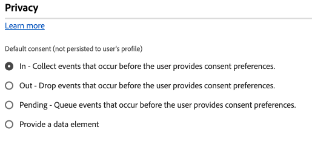
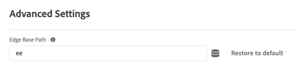

# Konfigurieren der Web SDK-Tag-Erweiterung

Die [!DNL Web SDK] Tag-Erweiterung sendet Daten von Web-Eigenschaften über das Experience Platform-Edge Network an Adobe Experience Cloud.

Mit der Erweiterung können Sie Daten in Platform streamen, Identitäten synchronisieren, Zustimmungssignale von Kunden verarbeiten und automatisch Kontextdaten erfassen.

In diesem Dokument wird beschrieben, wie Sie die Tag-Erweiterung in der Benutzeroberfläche &quot;Tags&quot;konfigurieren.

## Installieren der Web SDK-Tag-Erweiterung {#install}

Die Web SDK-Tag-Erweiterung benötigt eine Eigenschaft, auf der installiert werden soll. Wenn Sie dies noch nicht getan haben, lesen Sie die Dokumentation unter [Erstellen einer Tag-Eigenschaft](https://experienceleague.adobe.com/docs/platform-learn/implement-in-websites/configure-tags/create-a-property.html?lang=de).

Nachdem Sie eine Eigenschaft erstellt haben, öffnen Sie die Eigenschaft und wählen Sie die **[!UICONTROL Erweiterungen]** auf der linken Seitenleiste.

Wählen Sie die **[!UICONTROL Katalog]** Registerkarte. Suchen Sie in der Liste der verfügbaren Erweiterungen nach der [!DNL Web SDK] Erweiterung und wählen Sie **[!UICONTROL Installieren]**.

Nach Auswahl **[!UICONTROL Installieren]** müssen Sie die Web SDK-Tag-Erweiterung konfigurieren und die Konfiguration speichern.

>[!NOTE]
>
>Die Tag-Erweiterung wird erst nach dem Speichern der Konfiguration installiert. In den nächsten Abschnitten erfahren Sie, wie Sie die Tag-Erweiterung konfigurieren.

## Instanzeneinstellungen konfigurieren {#general}

Die Konfigurationsoptionen oben auf der Seite geben Adobe Experience Platform an, wo die Daten weitergeleitet werden und welche Konfigurationen auf dem Server verwendet werden sollen.

* **[!UICONTROL Name]**: Die Adobe Experience Platform Web SDK-Erweiterung unterstützt mehrere Instanzen auf der Seite. Der Name wird verwendet, um Daten mit einer Tag-Konfiguration an mehrere Organisationen zu senden. Der Instanzname wird standardmäßig auf `alloy`. Sie können den Instanznamen jedoch in einen beliebigen gültigen JavaScript-Objektnamen ändern.
* **[!UICONTROL Kennung der IMS-Organisation]**: Die ID der Organisation, an die die Daten bei der Adobe gesendet werden sollen. Meistens verwenden Sie den Standardwert, der automatisch ausgefüllt wird. Wenn sich auf der Seite mehrere Instanzen befinden, geben Sie in dieses Feld den Wert der zweiten Organisation ein, an die Sie Daten senden möchten.
* **[!UICONTROL Edge-Domäne]**: Die Domäne, von der die Erweiterung Daten sendet und empfängt. Adobe empfiehlt die Verwendung einer Erstanbieterdomäne (CNAME) für diese Erweiterung. Die standardmäßige Drittanbieterdomäne funktioniert in Entwicklungsumgebungen, ist jedoch nicht für Produktionsumgebungen geeignet. Anweisungen zum Einrichten eines Erstanbieter-CNAME finden Sie [hier](https://experienceleague.adobe.com/docs/core-services/interface/ec-cookies/cookies-first-party.html?lang=de).

## Konfigurieren von Datenspeichereinstellungen {#datastreams}

In diesem Abschnitt können Sie die Datenspeicher auswählen, die für jede der drei verfügbaren Umgebungen (Produktion, Staging und Entwicklung) verwendet werden sollen.

Wenn eine Anforderung an das Edge Network gesendet wird, wird eine Datastream-ID verwendet, um auf die serverseitige Konfiguration zu verweisen. Sie können die Konfiguration aktualisieren, ohne Codeänderungen auf Ihrer Website vornehmen zu müssen.

Siehe Handbuch unter [datastreams](../../../../datastreams/overview.md) , um zu erfahren, wie Sie einen Datastream konfigurieren.

Sie können entweder einen Datenspeicher aus den verfügbaren Dropdownmenüs auswählen oder **[!UICONTROL Werte eingeben]** und geben Sie eine benutzerdefinierte Datastream-ID für jede Umgebung ein.

## Datenschutzeinstellungen konfigurieren {#privacy}

In diesem Abschnitt können Sie konfigurieren, wie das Web SDK Zustimmungssignale von Benutzern von Ihrer Website verarbeitet. Insbesondere können Sie damit das standardmäßige Zustimmungsniveau auswählen, das von einem Benutzer angenommen wird, wenn keine andere explizite Zustimmungsvoreinstellung angegeben wurde.

Die standardmäßige Zustimmungsstufe wird nicht im Benutzerprofil gespeichert.

| [!UICONTROL Standardeinverständnisebene] | Beschreibung |
| --- | --- |
| [!UICONTROL In] | Erfassen Sie Ereignisse, die auftreten, bevor der Benutzer Zustimmungsvoreinstellungen bereitstellt. |
| [!UICONTROL Out] | Verwerfen Sie Ereignisse, die auftreten, bevor der Benutzer Zustimmungsvoreinstellungen bereitstellt. |
| [!UICONTROL Ausstehend] | Einreihen von Ereignissen in die Warteschlange, die auftreten, bevor der Benutzer Zustimmungsvoreinstellungen bereitstellt. Wenn Zustimmungsvoreinstellungen angegeben werden, werden die Ereignisse abhängig von den bereitgestellten Voreinstellungen erfasst oder verworfen. |
| [!UICONTROL Wird vom Datenelement bereitgestellt] | Die standardmäßige Zustimmungsstufe wird durch ein separates Datenelement bestimmt, das Sie definieren. Bei Verwendung dieser Option müssen Sie das Datenelement über das bereitgestellte Dropdown-Menü angeben. |

>[!TIP]
>
>Verwendung **[!UICONTROL Out]** oder **[!UICONTROL Ausstehend]** , wenn Sie eine ausdrückliche Benutzerzustimmung für Ihre Geschäftsvorgänge benötigen.

## Identitätseinstellungen konfigurieren {#identity}

In diesem Abschnitt können Sie das Verhalten des Web SDK bezüglich der Handhabung der Benutzeridentifizierung definieren.

* **[!UICONTROL Migrieren der ECID aus der VisitorAPI]**: Diese Option ist standardmäßig aktiviert. Wenn diese Funktion aktiviert ist, kann das SDK die `AMCV` und `s_ecid` Cookies und legen Sie die `AMCV` von [!DNL Visitor.js]. Diese Funktion ist bei der Migration zum Web SDK wichtig, da einige Seiten möglicherweise weiterhin verwenden. [!DNL Visitor.js]. Mit dieser Option kann das SDK weiterhin dieselbe [!DNL ECID] sodass Benutzer nicht als zwei getrennte Benutzer identifiziert werden.
* **[!UICONTROL Verwenden von Drittanbieter-Cookies]**: Wenn diese Option aktiviert ist, versucht das Web SDK, eine Benutzer-ID in einem Drittanbieter-Cookie zu speichern. Bei erfolgreicher Ausführung wird der Benutzer als einzelner Benutzer identifiziert, der über mehrere Domänen navigiert, anstatt für jede Domäne als separater Benutzer identifiziert zu werden. Wenn diese Option aktiviert ist, kann das SDK die Benutzer-ID möglicherweise weiterhin nicht in einem Drittanbieter-Cookie speichern, wenn der Browser keine Drittanbieter-Cookies unterstützt oder vom Benutzer so konfiguriert wurde, dass keine Drittanbieter-Cookies zugelassen werden. In diesem Fall speichert das SDK die Kennung nur in der Erstanbieterdomäne.

  >[!IMPORTANT]
  >>Drittanbieter-Cookies sind nicht mit dem [Erstanbieter-Geräte-ID](../../../../web-sdk/identity/first-party-device-ids.md) -Funktion im Web SDK.
Sie können entweder Geräte-IDs von Erstanbietern verwenden oder Sie können Drittanbieter-Cookies verwenden, aber Sie können nicht beide Funktionen gleichzeitig verwenden.
  >
## Personalisierungseinstellungen konfigurieren {#personalization}

In diesem Abschnitt können Sie konfigurieren, wie Sie bestimmte Teile einer Seite ausblenden möchten, während personalisierter Inhalt geladen wird. Dadurch wird sichergestellt, dass Ihre Besucher nur die personalisierte Seite sehen.

* **[!UICONTROL Migrieren von Target von at.js zum Web SDK]**: Verwenden Sie diese Option, um [!DNL Web SDK] zum Lesen und Schreiben der alten `mbox` und `mboxEdgeCluster` von at.js verwendete Cookies `1.x` oder `2.x` -Bibliotheken. Auf diese Weise können Sie das Besucherprofil beim Wechsel von einer Seite, die das Web SDK verwendet, zu einer Seite, die at.js verwendet, beibehalten `1.x` oder `2.x` und umgekehrt.

### Stil vorab ausblenden {#prehiding-style}

Mit dem Stil-Editor für die Vorab-Ausblendung können Sie benutzerdefinierte CSS-Regeln definieren, um bestimmte Bereiche einer Seite auszublenden. Wenn die Seite geladen wird, verwendet das Web SDK diesen Stil, um die zu personalisierenden Abschnitte auszublenden, die Personalisierung abzurufen und dann die personalisierten Seitenabschnitte wieder einzublenden. Auf diese Weise werden Ihren Besuchern die bereits personalisierten Seiten angezeigt, ohne dass der Personalisierungs-Abrufprozess angezeigt wird.

### Vorabausblenden eines Snippets {#prehiding-snippet}

Das Vorabausblendungs-Snippet ist nützlich, wenn die Web SDK-Bibliothek asynchron geladen wird. In diesem Fall wird empfohlen, den Inhalt vor dem Laden der Web SDK-Bibliothek zu verbergen, um Flackern zu vermeiden.

Um den Codeausschnitt zur Vorab-Ausblendung zu verwenden, kopieren Sie ihn und fügen Sie ihn in das `<head>` -Element Ihrer Seite.

>[!IMPORTANT]
>
Bei Verwendung des Codeausschnitts zum Vorab-Ausblenden empfiehlt Adobe die Verwendung desselben [!DNL CSS] -Regel als von der [Pre-hiding-Stil](#prehiding-style).

## Datenerfassungseinstellungen konfigurieren {#data-collection}

* **[!UICONTROL Callback-Funktion]**: Die in der Erweiterung bereitgestellte Rückruffunktion wird auch als [`onBeforeEventSend` function](/help/web-sdk/commands/configure/onbeforeeventsend.md) in der Bibliothek. Mit dieser Funktion können Sie Ereignisse global ändern, bevor sie an das Edge Network gesendet werden.
* **[!UICONTROL Aktivieren der Klickdatenerfassung]**: Das Web SDK kann automatisch Link-Klickinformationen für Sie erfassen. Standardmäßig ist diese Funktion aktiviert, kann jedoch über diese Option deaktiviert werden. Links werden auch als Downloadlinks bezeichnet, wenn sie einen der in der [!UICONTROL Downloadlink-Qualifizierung] Textfeld. Adobe bietet Ihnen einige standardmäßige Downloadlink-Qualifikatoren. Sie können sie nach Bedarf bearbeiten.
* **[!UICONTROL Automatisch erfasste Kontextdaten]**: Standardmäßig erfasst das Web SDK bestimmte Kontextdaten in Bezug auf Gerät, Web, Umgebung und Ortskontext. Wenn diese Daten nicht erfasst werden sollen oder Sie nur bestimmte Datenkategorien erfassen möchten, wählen Sie **[!UICONTROL Spezifische Kontextdaten]** und wählen Sie die Daten aus, die Sie erfassen möchten. Siehe [`context`](/help/web-sdk/commands/configure/context.md) für weitere Informationen.

## Einstellungen für die Medienerfassung konfigurieren {#media-collection}

Mit der Medienerfassungsfunktion können Sie Daten im Zusammenhang mit Mediensitzungen auf Ihrer Website erfassen.

Die erfassten Daten können Informationen zu Medienwiedergaben, Pausen, Beendigungen und anderen damit zusammenhängenden Ereignissen enthalten. Nach der Erfassung können Sie diese Daten an Adobe Experience Platform und/oder Adobe Analytics senden, um Berichte zu erstellen. Diese Funktion bietet eine umfassende Lösung zum Verfolgen und Verstehen des Verhaltens der Mediennutzung auf Ihrer Website.

* **[!UICONTROL Kanal]**: Der Name des Kanals, in dem die Mediensammlung erfolgt. Beispiel: `Video channel`.
* **[!UICONTROL Player-Name]**: Der Name des Medienplayers.
* **[!UICONTROL Anwendungsversion]**: Die Version der Medienplayer-Anwendung.
* **[!UICONTROL Haupt-Ping-Intervall]**: Häufigkeit der Pings für den Hauptinhalt in Sekunden. Der Standardwert lautet `10`. Die Werte können einen Bereich von `10` nach `50` Sekunden.  Wenn kein Wert angegeben ist, wird der Standardwert bei Verwendung von [automatisch verfolgte Sitzungen](../../../../web-sdk/commands/createmediasession.md#automatic).
* **[!UICONTROL Anzeigen-Ping-Intervall]**: Häufigkeit der Pings für Anzeigeninhalte in Sekunden. Der Standardwert lautet `10`. Die Werte können einen Bereich von `1` nach `10` Sekunden. Wenn kein Wert angegeben ist, wird der Standardwert bei Verwendung von [automatisch verfolgte Sitzungen](../../../../web-sdk/commands/createmediasession.md#automatic)

## Konfigurieren von Datenstromüberschreibungen {#datastream-overrides}

Mit Datenstromüberschreibungen können Sie zusätzliche Konfigurationen für Ihre Datenströme definieren, die über das Web SDK an das Edge-Netzwerk übergeben werden.

Dies hilft Ihnen beim Auslösen anderer Datenstromverhaltensweisen als der standardmäßigen, ohne einen neuen Datenstrom zu erstellen oder Ihre vorhandenen Einstellungen zu ändern.

Das Überschreiben der Datenstromkonfiguration besteht aus zwei Schritten:

1. Zunächst müssen Sie Ihre Überschreibungen der Datenstromkonfiguration auf der Seite [Datenstromkonfiguration](/help/datastreams/configure.md) definieren.
2. Anschließend müssen Sie die Überschreibungen entweder über einen Web SDK-Befehl oder mithilfe der Web SDK-Tag-Erweiterung an das Edge Network senden.

Anzeigen des Datenspeichers [Dokumentation zu Konfigurationsüberschreibungen](/help/datastreams/overrides.md) für detaillierte Anweisungen zum Überschreiben von Datenspeicherkonfigurationen.

Als Alternative zum Übergeben der Überschreibungen über einen Web SDK-Befehl können Sie die Überschreibungen im Bildschirm für die Tag-Erweiterung konfigurieren, der unten dargestellt wird.

>[!IMPORTANT]
>
Datastream-Überschreibungen müssen pro Umgebung konfiguriert werden. Die Entwicklungs-, Staging- und Produktionsumgebungen haben alle separate Außerkraftsetzungen. Sie können die Einstellungen zwischen ihnen mithilfe der entsprechenden Optionen kopieren, die im folgenden Bildschirm angezeigt werden.

## Erweiterte Einstellungen konfigurieren

Verwenden Sie die **[!UICONTROL Edge-Basispfad]** -Feld, wenn Sie den Basispfad ändern müssen, der für die Interaktion mit dem Edge Network verwendet wird. Dies sollte keine Aktualisierung erfordern, aber falls Sie an einer Beta- oder Alpha-Phase teilnehmen, kann Adobe Sie bitten, dieses Feld zu ändern.

