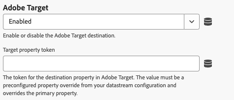

# Konfigurieren der Web SDK-Tag-Erweiterung

Die Tag-Erweiterung &quot;[!DNL Web SDK]&quot; sendet Daten von Web-Eigenschaften über die Edge Network von Experience Platform an Adobe Experience Cloud.

Die Erweiterung ermöglicht es Ihnen, Daten in Experience Platform zu streamen, Identitäten zu synchronisieren, Einverständnissignale von Kunden zu verarbeiten und automatisch Kontextdaten zu erfassen.

In diesem Dokument wird erläutert, wie Sie die Tag-Erweiterung in der Tags-Benutzeroberfläche konfigurieren.

## Installieren der Tag-Erweiterung „Web SDK&quot; {#install}

Die Tag-Erweiterung „Web SDK&quot; benötigt eine -Eigenschaft, auf der installiert werden muss. Wenn Sie dies noch nicht getan haben, lesen Sie die Dokumentation unter [Erstellen einer Tag-Eigenschaft](https://experienceleague.adobe.com/docs/platform-learn/implement-in-websites/configure-tags/create-a-property.html?lang=de).

Nachdem Sie eine Eigenschaft erstellt haben, öffnen Sie die Eigenschaft und wählen Sie in der linken Seitenleiste **[!UICONTROL Erweiterungen]** aus.

Wählen Sie die **[!UICONTROL Katalog]** aus. Suchen Sie in der Liste der verfügbaren Erweiterungen nach der [!DNL Web SDK] Erweiterung und wählen Sie **[!UICONTROL Installieren]** aus.

Nach Auswahl von **[!UICONTROL Installieren]** müssen Sie die Tag-Erweiterung für Web SDK konfigurieren und die Konfiguration speichern.

>[!NOTE]
>
>Die Tag-Erweiterung wird erst nach dem Speichern der Konfiguration installiert. In den nächsten Abschnitten erfahren Sie, wie Sie die Tag-Erweiterung konfigurieren.

## Erstellen eines benutzerdefinierten Web-SDK-Builds {#custom-build}

Die Web SDK-Bibliothek enthält mehrere Module für verschiedene Funktionen wie Personalisierung, Identitätsnachverfolgung, Linktracking und mehr. Je nach Anwendungsfällen benötigen Sie möglicherweise nur bestimmte Funktionen anstelle der gesamten Bibliothek. Wenn Sie einen benutzerdefinierten Web-SDK-Build erstellen, können Sie nur die benötigten Module auswählen, die Bibliotheksgröße reduzieren und die Leistung verbessern.

Wenn Sie einen benutzerdefinierten Web-SDK-Build erstellen, wird der Build von allen Ihren Web-SDK-Instanzen verwendet.

>[!IMPORTANT]
>
>Durch das Deaktivieren von Web SDK-Komponenten kann die bestehende Implementierung beschädigt werden. Jedes Mal, wenn Sie eine Komponente deaktivieren, sollten Sie Ihre Implementierung gründlich testen, um sicherzustellen, dass alle benötigten Funktionen erwartungsgemäß funktionieren.
>>Wenn Sie eine Komponente deaktivieren, können Sie die Einstellungen dieser Komponente nicht mehr bearbeiten.

Gehen Sie wie folgt vor, um einen benutzerdefinierten Web-SDK-Build mithilfe der Tag-Erweiterung „Web SDK&quot; zu erstellen.

1. Erweitern Sie auf der Seite für die Konfiguration von Tag **[!UICONTROL Erweiterungen den Abschnitt]** Benutzerdefinierte Build-Komponenten“.
1. Aktivieren oder deaktivieren Sie die Komponenten je nach Bedarf. Sie können aus den folgenden Komponenten auswählen:
   * **[!UICONTROL Activity Collector]**: Diese Komponente ermöglicht die automatische Link-Erfassung und Activity Map-Verfolgung.
   * **[!UICONTROL Advertising]**: Diese Komponente enthält den gesamten JavaScript-Code, der für Adobe Advertising benötigt wird. Außerdem werden [!UICONTROL Adobe Advertising]-Einstellungen im Abschnitt [!UICONTROL SDK-Instanzen] und eine [!UICONTROL Advertising]-Einstellung in Tag-Regeln hinzugefügt, um zu definieren, wie Werbedaten für die Attributionsmessung verwendet werden.
   * **[!UICONTROL Audiences]**: Diese Komponenten ermöglichen die Integration von Audience Manager, einschließlich URL- und Cookie-basierter Ziele, und ID-Synchronisierungen.
   * **[!UICONTROL Einverständnis]**: Diese Komponente ermöglicht Integrationen von Einverständnissen. Durch Deaktivieren dieser Komponente werden die folgenden Elemente deaktiviert:
      * [Einverständnis festlegen](action-types.md#set-consent) Aktionstyp
   * **[!UICONTROL Kontext]**: Diese Komponente ermöglicht die automatische Erfassung von Kontextdaten.
   * **[!UICONTROL Ereigniszusammenführung]**: _Veraltet_. Durch Deaktivieren dieser Komponente werden die folgenden Elemente deaktiviert:
      * [Ereignis-Zusammenführungskennung](action-types.md#data) Datenelement
      * **[!UICONTROL Ereignis-Zusammenführungs-ID zurücksetzen]** Aktionstyp
   * **[!UICONTROL Media Analytics Bridge]**: Diese Komponente ermöglicht Edge Network Streaming Media mithilfe der Media Analytics-Oberfläche. Durch Deaktivieren dieser Komponente werden die folgenden Elemente deaktiviert:
      * [Abrufen von Media Analytics Tracker](action-types.md#get-media-analytics-tracker) Aktionstyp
   * **[!UICONTROL Personalization]**: Diese Komponente ermöglicht die Integration von Adobe Target und Adobe Journey Optimizer. Durch Deaktivieren dieser Komponente werden die folgenden Elemente deaktiviert:
      * [Aktionstyp „Vorschläge ](action-types.md)&quot;
   * **[!UICONTROL Regel-Engine]**: Diese Komponente aktiviert die Adobe Journey Optimizer-Entscheidungsfindung auf dem Gerät. Durch Deaktivieren dieser Komponente werden die folgenden Elemente deaktiviert:
      * [Regelsätze auswerten](action-types.md#evaluate-rulesets) Aktionstyp
      * [Regelsatzelemente abonnieren](event-types.md#subscribe-ruleset-items) Ereignistyp
   * **[!UICONTROL Streaming-Medien]**: Diese Komponente aktiviert Edge Network Streaming-Medien. Durch Deaktivieren dieser Komponente werden die folgenden Elemente deaktiviert:
      * [Medienereignis senden](action-types.md#send-media-event) Aktionstyp

## Instanzeinstellungen konfigurieren {#general}

Die Konfigurationsoptionen oben auf der Seite geben Adobe Experience Platform an, wohin die Daten weitergeleitet werden sollen und welche Konfigurationen auf dem Server verwendet werden sollen.

* **[!UICONTROL Name]**: Die Adobe Experience Platform Web SDK-Erweiterung unterstützt mehrere Instanzen auf der Seite. Der Name wird verwendet, um Daten an mehrere Organisationen mit einer Tag-Konfiguration zu senden. Der Instanzname ist standardmäßig auf `alloy` festgelegt. Sie können jedoch den Instanznamen in einen beliebigen gültigen JavaScript-Objektnamen ändern.
* **[!UICONTROL IMS-Organisations-ID]**: Die ID der Organisation, an die die Daten mit Adobe gesendet werden sollen. Meistens verwenden Sie den Standardwert, der automatisch ausgefüllt wird. Wenn sich auf der Seite mehrere Instanzen befinden, füllen Sie dieses Feld mit dem Wert der zweiten Organisation, an die Sie Daten senden möchten.
* **[!UICONTROL Edge-Domain]**: Die Domain, von der die Erweiterung Daten sendet und empfängt. Adobe empfiehlt die Verwendung einer Erstanbieter-Domain (CNAME) für diese Erweiterung. Die standardmäßige Drittanbieterdomäne funktioniert in Entwicklungsumgebungen, ist jedoch nicht für Produktionsumgebungen geeignet. Anweisungen zum Einrichten eines Erstanbieter-CNAME finden Sie [hier](https://experienceleague.adobe.com/docs/core-services/interface/ec-cookies/cookies-first-party.html?lang=de).
* **[!UICONTROL Adobe Advertising]**: Verfügbar, wenn die `Advertising` ausgewählt ist. Einstellungen nur für Organisationen mit Adobe Advertising DSP:
   * **[!UICONTROL Adobe Advertising DSP]**: Aktiviert das View-Through-Tracking.
   * **[!UICONTROL Advertisers]**: Verfügbar, wenn [!UICONTROL Adobe Advertising DSP] aktiviert ist. Die Advertiser, für die das View-Through-Tracking aktiviert werden soll.
   * **[!UICONTROL ID5 Partner-ID]**: Optional. Adobe Advertising DSP Verfügbar, wenn  aktiviert ist. Die ID5-Partner-ID Ihres Unternehmens. Mit dieser Einstellung kann Web SDK universelle ID5-IDs erfassen.
   * **[!UICONTROL RampID JavaScript-Pfad]**: Optional. Adobe Advertising DSP Verfügbar, wenn  aktiviert ist. Der Pfad zum [!DNL LiveRamp RampID] JavaScript-Code (`ats.js`) Ihres Unternehmens.  Mit dieser Einstellung kann Web SDK universelle IDs [!DNL RampID].

## Konfigurieren von Datenstromeinstellungen {#datastreams}

In diesem Abschnitt können Sie die Datenströme auswählen, die für jede der drei verfügbaren Umgebungen (Produktion, Staging und Entwicklung) verwendet werden sollen.

Wenn eine Anfrage an die Edge Network gesendet wird, wird eine Datenstrom-ID verwendet, um auf die Server-seitige Konfiguration zu verweisen. Sie können die Konfiguration aktualisieren, ohne Code-Änderungen auf Ihrer Website vornehmen zu müssen.

Informationen zum Konfigurieren eines [ finden ](../../../../datastreams/overview.md) im Handbuch zu Datenströmen .

Sie können entweder einen Datenstrom aus den verfügbaren Dropdown-Menüs auswählen oder **[!UICONTROL Werte eingeben]** auswählen und für jede Umgebung eine benutzerdefinierte Datenstrom-ID eingeben.

## Datenschutzeinstellungen konfigurieren {#privacy}

In diesem Abschnitt können Sie konfigurieren, wie Web SDK Benutzereinverständnissignale von Ihrer Website verarbeitet. Insbesondere können Sie die Standardebene für das Einverständnis auswählen, von der ein Benutzer ausgeht, wenn keine andere explizite Einverständnisvoreinstellung angegeben wurde.

Die standardmäßige Einverständnisebene wird nicht im Benutzerprofil gespeichert.

| [!UICONTROL Standard-Einverständnisstufe] | Beschreibung |
| --- | --- |
| [!UICONTROL IN] | Erfassen Sie Ereignisse, die auftreten, bevor der Benutzer Einverständnisvoreinstellungen bereitstellt. |
| [!UICONTROL out] | Verwerfen Sie Ereignisse, die auftreten, bevor der Benutzer Einverständnisvoreinstellungen gibt. |
| [!UICONTROL Ausstehend] | Ereignisse in die Warteschlange stellen, die eintreten, bevor der Benutzer Einverständnisvoreinstellungen bereitstellt. Wenn Einverständnisvoreinstellungen bereitgestellt werden, werden die Ereignisse je nach den angegebenen Voreinstellungen erfasst oder verworfen. |
| [!UICONTROL Wird durch das Datenelement bereitgestellt] | Die standardmäßige Einverständnisebene wird durch ein separates Datenelement bestimmt, das Sie definieren. Bei Verwendung dieser Option müssen Sie das Datenelement mithilfe des bereitgestellten Dropdown-Menüs angeben. |

>[!TIP]
>
>Verwenden **[!UICONTROL Out]** oder **[!UICONTROL Pending]**, wenn Sie für Ihre Geschäftsvorgänge eine explizite Benutzerzustimmung benötigen.

## Konfigurieren von Identitätseinstellungen {#identity}

In diesem Abschnitt können Sie das Verhalten der Web-SDK bei der Handhabung der Benutzeridentifizierung definieren.

* **[!UICONTROL ECID von VisitorAPI migrieren]**: Diese Option ist standardmäßig aktiviert. Wenn diese Funktion aktiviert ist, kann der SDK die `AMCV` und `s_ecid` Cookies lesen und das von `AMCV` verwendete [!DNL Visitor.js]-Cookie festlegen. Diese Funktion ist bei der Migration auf Web SDK wichtig, da einige Seiten möglicherweise noch [!DNL Visitor.js] verwenden. Diese Option ermöglicht es SDK, dieselbe [!DNL ECID] weiterhin zu verwenden, sodass Benutzende nicht als zwei separate Benutzende identifiziert werden.
* **[!UICONTROL Verwendung von Drittanbieter-Cookies]**: Wenn diese Option aktiviert ist, versucht Web SDK, eine Benutzerkennung in einem Drittanbieter-Cookie zu speichern. Bei erfolgreicher Ausführung wird der Benutzer bei der Navigation durch mehrere Domains als ein einzelner Benutzer identifiziert, anstatt in jeder Domain als separater Benutzer identifiziert zu werden. Wenn diese Option aktiviert ist, kann die SDK die Benutzerkennung möglicherweise immer noch nicht in einem Drittanbieter-Cookie speichern, wenn der Browser keine Drittanbieter-Cookies unterstützt oder vom Benutzer so konfiguriert wurde, dass keine Drittanbieter-Cookies zugelassen werden. In diesem Fall speichert die SDK die Kennung nur in der Erstanbieter-Domain.

  >[!IMPORTANT]
  >>Drittanbieter-Cookies sind nicht mit der Funktion [Erstanbieter-Geräte-ID](../../../../web-sdk/identity/first-party-device-ids.md) in Web SDK kompatibel.
  >>Sie können entweder Erstanbieter-Geräte-IDs verwenden oder Drittanbieter-Cookies verwenden. Sie können jedoch nicht beide Funktionen gleichzeitig verwenden.
  >
## Personalisierungseinstellungen konfigurieren {#personalization}

In diesem Abschnitt können Sie festlegen, wie bestimmte Teile einer Seite beim Laden personalisierter Inhalte ausgeblendet werden sollen. Dadurch wird sichergestellt, dass Ihren Besuchern nur die personalisierte Seite angezeigt wird.

* **[!UICONTROL Migrieren von Target aus at.js in die Web-SDK]**: Verwenden Sie diese Option, um [!DNL Web SDK] das Lesen und Schreiben veralteter `mbox` und `mboxEdgeCluster` Cookies zu ermöglichen, die von at.js-`1.x` oder `2.x`-Bibliotheken verwendet werden. So bleibt das Besucherprofil erhalten, wenn Sie von einer Seite, die Web SDK verwendet, zu einer Seite wechseln, die at.js-`1.x` oder `2.x`-Bibliotheken verwendet, und umgekehrt.

### Vorab-Ausblendstil {#prehiding-style}

Mit dem Stil-Editor zum Vorab-Ausblenden können Sie benutzerdefinierte CSS-Regeln definieren, um bestimmte Abschnitte einer Seite auszublenden. Wenn die Seite geladen wird, verwendet Web SDK diesen Stil, um die Abschnitte auszublenden, die personalisiert werden müssen, die Personalisierung abzurufen und dann die personalisierten Seitenabschnitte wieder aufzuheben. Auf diese Weise können Ihre Besucherinnen und Besucher die bereits personalisierten Seiten sehen, ohne den Personalisierungs-Abrufprozess zu sehen.

### Ausschnitt vorab ausblenden {#prehiding-snippet}

Das Code-Ausschnitt zum Vorab-Ausblenden ist nützlich, wenn die Web SDK-Bibliothek asynchron geladen wird. Um Flimmern zu vermeiden, empfehlen wir in diesem Fall, den Inhalt vor dem Laden der Web SDK-Bibliothek auszublenden.

Um den Code-Ausschnitt zum Vorab-Ausblenden zu verwenden, kopieren Sie ihn und fügen Sie ihn in das `<head>`-Element Ihrer Seite ein.

>[!IMPORTANT]
>
>Bei Verwendung des Ausschnitts zum Vorab-Ausblenden empfiehlt Adobe, dieselbe [!DNL CSS]-Regel zu verwenden wie die vom [Stil zum Vorab-Ausblenden](#prehiding-style) verwendete.

## Einstellungen für die Datenerfassung konfigurieren {#data-collection}

Konfigurationseinstellungen für die Datenerfassung verwalten Ähnliche Einstellungen in der JavaScript-Bibliothek sind mit dem Befehl [`configure`](/help/web-sdk/commands/configure/overview.md) verfügbar.

* **[!UICONTROL Rückruf vor Ereignisversand]**: Eine Rückruffunktion zur Auswertung und Änderung der an Adobe gesendeten Payload. Verwenden Sie die Variable `content` innerhalb der Rückruffunktion, um die Payload zu ändern. Dieser Callback ist das Tag, das der [`onBeforeEventSend`](/help/web-sdk/commands/configure/onbeforeeventsend.md) in der JavaScript-Bibliothek entspricht.
* **[!UICONTROL Interne Link-Klicks erfassen]**: Ein Kontrollkästchen, das die Erfassung von Linktracking-Daten innerhalb Ihrer Site oder Eigenschaft ermöglicht. Wenn Sie dieses Kontrollkästchen aktivieren, werden Optionen für die Ereignisgruppierung angezeigt:
   * **[!UICONTROL Keine Ereignisgruppierung]**: Linktracking-Daten werden in separaten Ereignissen an Adobe gesendet. Link-Klicks, die in separaten Ereignissen gesendet werden, können die vertragliche Nutzung der an Adobe Experience Platform gesendeten Daten erhöhen.
   * **[!UICONTROL Ereignisgruppierung mit Sitzungsspeicher]**: Speichern von Linktracking-Daten im Sitzungsspeicher bis zum nächsten Seitenereignis. Auf der folgenden Seite werden die gespeicherten Linktracking-Daten und Seitenansichtsdaten gleichzeitig an Adobe gesendet. Adobe empfiehlt, diese Einstellung beim Tracking interner Links zu aktivieren.
   * **[!UICONTROL Ereignisgruppierung mit lokalem Objekt]**: Speichern von Linktracking-Daten in einem lokalen Objekt bis zum nächsten Seitenereignis. Wenn ein Besucher zu einer neuen Seite navigiert, gehen Linktracking-Daten verloren. Diese Einstellung ist besonders im Kontext von Einzelseitenanwendungen von Vorteil.

  Wenn Sie eine Ereignisgruppierung mit Sitzungsspeicher oder einem lokalen Objekt auswählen und Daten an Real-Time CDP, Customer Journey Analytics, Adobe Journey Optimizer oder Mix Modeler senden, müssen Sie Ihre Tagging-Regeln aktualisieren. Stellen Sie sicher, dass bei jedem Seitenansichtsereignis sowohl der Seitenname (als Zeichenfolge) als auch der Seitenansichtswert (als Ganzzahl, normalerweise 1) explizit dem XDM-Objekt zugeordnet werden, bevor Sie die Daten an Adobe senden.

  Wenn Sie Daten an Adobe Analytics senden, werden diese Werte automatisch eingeschlossen und es ist keine zusätzliche Konfiguration erforderlich.

* **[!UICONTROL Klicks auf externe Links erfassen]**: Ein Kontrollkästchen, das die Erfassung externer Links aktiviert.
* **[!UICONTROL Klicks auf Download-Links erfassen]**: Ein Kontrollkästchen, das die Erfassung von Download-Links aktiviert.
* **[!UICONTROL Downloadlink-Qualifizierer]**: Ein regulärer Ausdruck, der eine Link-URL als Download-Link qualifiziert.
* **[!UICONTROL Filter-Klickeigenschaften]**: Eine Rückruffunktion, um klickbezogene Eigenschaften vor der Sammlung zu bewerten und zu ändern. Diese Funktion wird vor dem [!UICONTROL Ein vor Rückruf senden] ausgeführt.
* **Kontexteinstellungen**: Erfassen Sie automatisch Besucherinformationen, die bestimmte XDM-Felder für Sie ausfüllen. Sie können zwischen **[!UICONTROL Alle standardmäßigen Kontextinformationen]** oder **[!UICONTROL Spezifische Kontextinformationen]** wählen. Es handelt sich dabei um das Tag-Äquivalent zu [`context`](/help/web-sdk/commands/configure/context.md) in der JavaScript-Bibliothek.
   * **[!UICONTROL Web]**: Sammelt Informationen über die aktuelle Seite.
   * **[!UICONTROL Gerät]**: Sammelt Informationen zum Gerät des Benutzers.
   * **[!UICONTROL Umgebung]**: Sammelt Informationen zum Browser des Benutzers.
   * **[!UICONTROL Ortskontext]**: Sammelt Informationen zum Standort des Benutzers.
   * **[!UICONTROL Benutzeragenten-Hinweise mit hoher Entropie]**: Erfasst detailliertere Informationen über das Gerät des Benutzers.

>[!TIP]
>
>Das Feld **[!UICONTROL Ein Link vor Klick auf Senden]** ist ein veralteter Callback, der nur für Eigenschaften sichtbar ist, für die er bereits konfiguriert wurde. Es handelt sich dabei um das Tag-Äquivalent zu [`onBeforeLinkClickSend`](/help/web-sdk/commands/configure/onbeforelinkclicksend.md) in der JavaScript-Bibliothek. Verwenden Sie den **[!UICONTROL Filter-Klick]** Eigenschaften-Callback, um Klickdaten zu filtern oder anzupassen, oder verwenden Sie das **[!UICONTROL Ein vor Ereignis senden des Callbacks]**, um die gesamte an Adobe gesendete Payload zu filtern oder anzupassen. Wenn sowohl der Callback **[!UICONTROL Eigenschaften filtern]** als auch der Callback **[!UICONTROL Ein vor Link klicken]** senden“ festgelegt sind, wird nur der Callback **[!UICONTROL Eigenschaften filtern klicken]** ausgeführt.

## Einstellungen für Mediensammlung konfigurieren {#media-collection}

Mit der Mediensammlungsfunktion können Sie Daten zu Mediensitzungen auf Ihrer Website erfassen.

Die erfassten Daten können Informationen zu Medienwiedergaben, Pausen, Beendigungen und anderen zugehörigen Ereignissen enthalten. Nach der Erfassung können Sie diese Daten an Adobe Experience Platform und/oder Adobe Analytics senden, um Berichte zu generieren. Diese Funktion bietet eine umfassende Lösung zum Tracking und zum Verständnis des Medienkonsumverhaltens auf Ihrer Website.

* **[!UICONTROL channel]**: Der Name des Kanals, in dem die Mediensammlung stattfindet. Beispiel: `Video channel`.
* **[!UICONTROL Player-]**: Der Name des Medien-Players.
* **[!UICONTROL Anwendungsversion]**: Die Version der Media Player-Anwendung.
* **[!UICONTROL Haupt-Ping-Intervall]**: Häufigkeit der Pings für den Hauptinhalt in Sekunden. Der Standardwert lautet `10`. Die Werte können zwischen `10` und `50` Sekunden liegen.  Wenn kein Wert angegeben ist, wird der Standardwert bei der Verwendung von [automatisch verfolgten Sitzungen](../../../../web-sdk/commands/createmediasession.md#automatic) verwendet.
* **[!UICONTROL Ad-Ping-Intervall]**: Häufigkeit der Pings für den Anzeigeninhalt in Sekunden. Der Standardwert lautet `10`. Die Werte können zwischen `1` und `10` Sekunden liegen. Wenn kein Wert angegeben ist, wird der Standardwert bei der Verwendung von [automatisch verfolgten Sitzungen“ ](../../../../web-sdk/commands/createmediasession.md#automatic)

## Konfigurieren von Datenstromüberschreibungen {#datastream-overrides}

Mit Datenstromüberschreibungen können Sie zusätzliche Konfigurationen für Ihre Datenströme definieren, die über das Web SDK an das Edge-Netzwerk übergeben werden.

Dies hilft Ihnen beim Auslösen anderer Datenstromverhaltensweisen als der standardmäßigen, ohne einen neuen Datenstrom zu erstellen oder Ihre vorhandenen Einstellungen zu ändern.

Das Überschreiben der Datenstromkonfiguration besteht aus zwei Schritten:

1. Zunächst müssen Sie Ihre Überschreibungen der Datenstromkonfiguration auf der Seite [Datenstromkonfiguration](/help/datastreams/configure.md) definieren.
2. Anschließend müssen Sie die Überschreibungen entweder über einen Web-SDK-Befehl oder mithilfe der Tag-Erweiterung „Web SDK&quot; an Edge Network senden.

Detaillierte Anweisungen [ Überschreiben von Datenstromkonfigurationen finden Sie ](/help/datastreams/overrides.md) der Dokumentation zu Datenstromkonfigurationen .

Als Alternative zur Übergabe der Überschreibungen über einen Web SDK-Befehl können Sie die Überschreibungen im Bildschirm „Tag-Erweiterung“ konfigurieren, der unten dargestellt ist.

>[!IMPORTANT]
>
> Datenstrom-Überschreibungen müssen pro Umgebung konfiguriert werden. Die Entwicklungs-, Staging- und Produktionsumgebungen haben jeweils separate Überschreibungen. Sie können die Einstellungen mithilfe der entsprechenden Optionen, die im folgenden Bildschirm angezeigt werden, zwischen ihnen kopieren.

Standardmäßig ist die Überschreibung der Datenstromkonfiguration deaktiviert. Die **[!UICONTROL Konfiguration des Datenstroms abgleichen]** ist standardmäßig ausgewählt.

Um Datenstrom-Überschreibungen in der Tag-Erweiterung zu aktivieren, wählen Sie **[!UICONTROL Aktiviert]** aus dem Dropdown-Menü aus.

Nachdem Sie die Überschreibungen der Datenstromkonfiguration aktiviert haben, können Sie die Überschreibungen für jeden Service konfigurieren, der unten beschrieben wird.

Die folgenden Einstellungen für die Datenstromüberschreibungen setzen alle Server-seitigen Datenstromkonfigurationen und -regeln für die ausgewählte Umgebung außer Kraft.

### Adobe Analytics {#analytics}

Verwenden Sie die Einstellungen in diesem Abschnitt, um das Daten-Routing zum Adobe Analytics-Service zu überschreiben.

* **[!UICONTROL Aktiviert]**/**[!UICONTROL Deaktiviert]**: Verwenden Sie dieses Dropdown-Menü, um das Daten-Routing zum Adobe Analytics-Service zu aktivieren oder zu deaktivieren.
* **[!UICONTROL Report Suites]**: Die IDs für die Ziel-Report Suites in Adobe Analytics. Der Wert muss eine vorkonfigurierte Report Suite (oder eine kommagetrennte Liste von Report Suites) aus Ihrer Datenstromkonfiguration sein. Diese Einstellung überschreibt die primären Report Suites.
* **[!UICONTROL Report Suite hinzufügen]**: Wählen Sie diese Option, um weitere Report Suites hinzuzufügen.

### Adobe Audience Manager {#audience-manager}

Verwenden Sie die Einstellungen in diesem Abschnitt, um das Daten-Routing zum Adobe Audience Manager-Service zu überschreiben.

* **[!UICONTROL Aktiviert]**/**[!UICONTROL Deaktiviert]**: Verwenden Sie dieses Dropdown-Menü, um das Daten-Routing zum Adobe Audience Manager-Service zu aktivieren oder zu deaktivieren.
* **[!UICONTROL Synchronisierungs-Container für Drittanbieter-ID]**: Die ID für den Ziel-Synchronisierungs-Container für Drittanbieter-IDs in Audience Manager. Der Wert muss ein vorkonfigurierter sekundärer Container aus Ihrer Datenstromkonfiguration sein und überschreibt den primären Container.

### Adobe Experience Platform {#experience-platform}

Verwenden Sie die Einstellungen in diesem Abschnitt, um das Daten-Routing zum Adobe Experience Platform-Service zu überschreiben.

* **[!UICONTROL Aktiviert]**/**[!UICONTROL Deaktiviert]**: Verwenden Sie dieses Dropdown-Menü, um das Daten-Routing zum Adobe Experience Platform-Service zu aktivieren oder zu deaktivieren.
* **[!UICONTROL Ereignisdatensatz]**: Die ID für den Zielereignisdatensatz in der Adobe Experience Platform. Der Wert muss ein vorkonfigurierter sekundärer Datensatz aus Ihrer Datenstromkonfiguration sein.
* **[!UICONTROL Offer Decisioning]**: Verwenden Sie dieses Dropdown-Menü, um das Datenrouting an den [!DNL Offer Decisioning]-Service zu aktivieren oder zu deaktivieren.
* **[!UICONTROL Edge-]**: Verwenden Sie dieses Dropdown-Menü, um das Daten-Routing zum [!DNL Edge Segmentation]-Service zu aktivieren oder zu deaktivieren.
* **[!UICONTROL Personalization-Ziele]**: Verwenden Sie dieses Dropdown-Menü, um das Daten-Routing zu Personalisierungszielen zu aktivieren oder zu deaktivieren.
* **[!UICONTROL Adobe Journey Optimizer]**: Verwenden Sie dieses Dropdown-Menü, um das Datenrouting an den [!DNL Adobe Journey Optimizer]-Service zu aktivieren oder zu deaktivieren.

### Serverseitige Ereignisweiterleitung für Adobe {#ssf}

Verwenden Sie die Einstellungen in diesem Abschnitt, um das Daten-Routing zum Server-seitigen Ereignisweiterleitungs-Service von Adobe zu überschreiben.

* **[!UICONTROL Aktiviert]**/**[!UICONTROL Deaktiviert]**: Verwenden Sie dieses Dropdown-Menü, um das Daten-Routing zum Server-seitigen Ereignisweiterleitungs-Service von Adobe zu aktivieren oder zu deaktivieren.

### Adobe Target {#target}

Verwenden Sie die Einstellungen in diesem Abschnitt, um das Daten-Routing zum Adobe Target-Service zu überschreiben.

* **[!UICONTROL Aktiviert]**/**[!UICONTROL Deaktiviert]**: Verwenden Sie dieses Dropdown-Menü, um das Daten-Routing zum Adobe Target-Service zu aktivieren oder zu deaktivieren.

## Konfigurieren der erweiterten Einstellungen

Verwenden Sie das Feld **[!UICONTROL Edge]** Basispfad, wenn Sie den Basispfad ändern müssen, der für die Interaktion mit Edge Network verwendet wird. Dies sollte keine Aktualisierung erfordern, aber für den Fall, dass Sie an einer Beta- oder Alpha-Version teilnehmen, bittet Adobe Sie möglicherweise, dieses Feld zu ändern.

