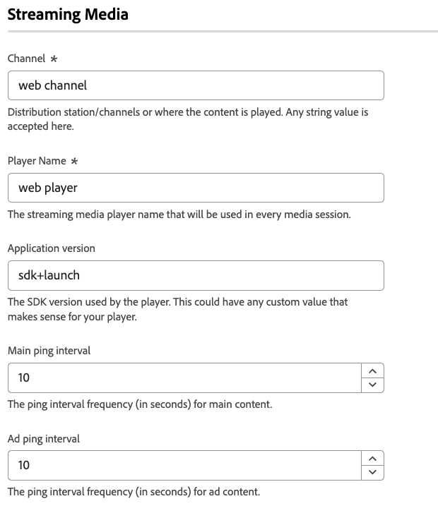

# Konfigurieren der Web SDK-Tag-Erweiterung

Die Tag-Erweiterung [!DNL Web SDK] sendet Daten aus Webeigenschaften über das Experience Platform-Edge Network an Adobe Experience Cloud.

Mit der Erweiterung können Sie Daten in Platform streamen, Identitäten synchronisieren, Zustimmungssignale von Kunden verarbeiten und automatisch Kontextdaten erfassen.

In diesem Dokument wird beschrieben, wie Sie die Tag-Erweiterung in der Benutzeroberfläche &quot;Tags&quot;konfigurieren.

## Installieren der Web SDK-Tag-Erweiterung {#install}

Die Web SDK-Tag-Erweiterung benötigt eine Eigenschaft, auf der installiert werden soll. Wenn Sie dies noch nicht getan haben, lesen Sie die Dokumentation zum Erstellen einer Tag-Eigenschaft ](https://experienceleague.adobe.com/docs/platform-learn/implement-in-websites/configure-tags/create-a-property.html?lang=de).[

Nachdem Sie eine Eigenschaft erstellt haben, öffnen Sie die Eigenschaft und wählen Sie in der linken Seitenleiste die Registerkarte **[!UICONTROL Erweiterungen]** aus.

Wählen Sie die Registerkarte **[!UICONTROL Katalog]** aus. Suchen Sie in der Liste der verfügbaren Erweiterungen die Erweiterung [!DNL Web SDK] und wählen Sie **[!UICONTROL Installieren]** aus.

Nach Auswahl von **[!UICONTROL Installieren]** müssen Sie die Web SDK-Tag-Erweiterung konfigurieren und die Konfiguration speichern.

>[!NOTE]
>
>Die Tag-Erweiterung wird erst nach dem Speichern der Konfiguration installiert. In den nächsten Abschnitten erfahren Sie, wie Sie die Tag-Erweiterung konfigurieren.

## Instanzeneinstellungen konfigurieren {#general}

Die Konfigurationsoptionen oben auf der Seite geben Adobe Experience Platform an, wo die Daten weitergeleitet werden und welche Konfigurationen auf dem Server verwendet werden sollen.

* **[!UICONTROL Name]**: Die Adobe Experience Platform Web SDK-Erweiterung unterstützt mehrere Instanzen auf der Seite. Der Name wird verwendet, um Daten mit einer Tag-Konfiguration an mehrere Organisationen zu senden. Der Instanzname ist standardmäßig auf `alloy` eingestellt. Sie können den Instanznamen jedoch in einen beliebigen gültigen JavaScript-Objektnamen ändern.
* **[!UICONTROL IMS-Organisations-ID]**: Die ID der Organisation, an die die Daten bei der Adobe gesendet werden sollen. Meistens verwenden Sie den Standardwert, der automatisch ausgefüllt wird. Wenn sich auf der Seite mehrere Instanzen befinden, geben Sie in dieses Feld den Wert der zweiten Organisation ein, an die Sie Daten senden möchten.
* **[!UICONTROL Edge-Domäne]**: Die Domäne, von der die Erweiterung Daten sendet und empfängt. Adobe empfiehlt die Verwendung einer Erstanbieterdomäne (CNAME) für diese Erweiterung. Die standardmäßige Drittanbieterdomäne funktioniert in Entwicklungsumgebungen, ist jedoch nicht für Produktionsumgebungen geeignet. Anweisungen zum Einrichten eines Erstanbieter-CNAME finden Sie [hier](https://experienceleague.adobe.com/docs/core-services/interface/ec-cookies/cookies-first-party.html?lang=de).

## Konfigurieren von Datenspeichereinstellungen {#datastreams}

In diesem Abschnitt können Sie die Datenspeicher auswählen, die für jede der drei verfügbaren Umgebungen (Produktion, Staging und Entwicklung) verwendet werden sollen.

Wenn eine Anforderung an das Edge Network gesendet wird, wird eine Datastream-ID verwendet, um auf die serverseitige Konfiguration zu verweisen. Sie können die Konfiguration aktualisieren, ohne Codeänderungen auf Ihrer Website vornehmen zu müssen.

Informationen zum Konfigurieren eines Datenspeichers finden Sie im Handbuch zu [datastreams](../../../../datastreams/overview.md) .

Sie können entweder einen Datastream aus den verfügbaren Dropdownmenüs auswählen oder **[!UICONTROL Werte eingeben]** und eine benutzerdefinierte Datastraam-ID für jede Umgebung eingeben.

## Datenschutzeinstellungen konfigurieren {#privacy}

In diesem Abschnitt können Sie konfigurieren, wie das Web SDK Zustimmungssignale von Benutzern von Ihrer Website verarbeitet. Insbesondere können Sie damit das standardmäßige Zustimmungsniveau auswählen, das von einem Benutzer angenommen wird, wenn keine andere explizite Zustimmungsvoreinstellung angegeben wurde.

Die standardmäßige Zustimmungsstufe wird nicht im Benutzerprofil gespeichert.

| [!UICONTROL Standardmäßige Zustimmungsstufe] | Beschreibung |
| --- | --- |
| [!UICONTROL in] | Erfassen Sie Ereignisse, die auftreten, bevor der Benutzer Zustimmungsvoreinstellungen bereitstellt. |
| [!UICONTROL out] | Verwerfen Sie Ereignisse, die auftreten, bevor der Benutzer Zustimmungsvoreinstellungen bereitstellt. |
| [!UICONTROL Ausstehend] | Einreihen von Ereignissen in die Warteschlange, die auftreten, bevor der Benutzer Zustimmungsvoreinstellungen bereitstellt. Wenn Zustimmungsvoreinstellungen angegeben werden, werden die Ereignisse abhängig von den bereitgestellten Voreinstellungen erfasst oder verworfen. |
| [!UICONTROL Wird vom Datenelement bereitgestellt] | Die standardmäßige Zustimmungsstufe wird durch ein separates Datenelement bestimmt, das Sie definieren. Bei Verwendung dieser Option müssen Sie das Datenelement über das bereitgestellte Dropdown-Menü angeben. |

>[!TIP]
>
>Verwenden Sie **[!UICONTROL Out]** oder **[!UICONTROL Ausstehend]** , wenn Sie eine ausdrückliche Benutzerzustimmung für Ihre Geschäftsvorgänge benötigen.

## Identitätseinstellungen konfigurieren {#identity}

In diesem Abschnitt können Sie das Verhalten des Web SDK bezüglich der Handhabung der Benutzeridentifizierung definieren.

* **[!UICONTROL ECID aus VisitorAPI migrieren]**: Diese Option ist standardmäßig aktiviert. Wenn diese Funktion aktiviert ist, kann das SDK die `AMCV` - und `s_ecid` -Cookies lesen und das von [!DNL Visitor.js] verwendete `AMCV` -Cookie setzen. Diese Funktion ist bei der Migration zum Web SDK wichtig, da einige Seiten möglicherweise weiterhin [!DNL Visitor.js] verwenden. Mit dieser Option kann das SDK weiterhin denselben [!DNL ECID] verwenden, sodass Benutzer nicht als zwei separate Benutzer identifiziert werden.
* **[!UICONTROL Drittanbieter-Cookies verwenden]**: Wenn diese Option aktiviert ist, versucht das Web SDK, eine Benutzer-ID in einem Drittanbieter-Cookie zu speichern. Bei erfolgreicher Ausführung wird der Benutzer als einzelner Benutzer identifiziert, der über mehrere Domänen navigiert, anstatt für jede Domäne als separater Benutzer identifiziert zu werden. Wenn diese Option aktiviert ist, kann das SDK die Benutzer-ID möglicherweise weiterhin nicht in einem Drittanbieter-Cookie speichern, wenn der Browser keine Drittanbieter-Cookies unterstützt oder vom Benutzer so konfiguriert wurde, dass keine Drittanbieter-Cookies zugelassen werden. In diesem Fall speichert das SDK die Kennung nur in der Erstanbieterdomäne.

  >[!IMPORTANT]
  >>Drittanbieter-Cookies sind nicht mit der Funktion [Erstanbieter-Geräte-ID](../../../../web-sdk/identity/first-party-device-ids.md) im Web SDK kompatibel.
Sie können entweder Geräte-IDs von Erstanbietern verwenden oder Sie können Drittanbieter-Cookies verwenden, aber Sie können nicht beide Funktionen gleichzeitig verwenden.
  >
## Personalisierungseinstellungen konfigurieren {#personalization}

In diesem Abschnitt können Sie konfigurieren, wie Sie bestimmte Teile einer Seite ausblenden möchten, während personalisierter Inhalt geladen wird. Dadurch wird sichergestellt, dass Ihre Besucher nur die personalisierte Seite sehen.

* **[!UICONTROL Migrieren von Target von at.js zum Web SDK]**: Mit dieser Option können Sie [!DNL Web SDK] aktivieren, die veralteten `mbox` - und `mboxEdgeCluster` -Cookies zu lesen und zu schreiben, die von at.js `1.x` - oder `2.x` -Bibliotheken verwendet werden. Auf diese Weise können Sie das Besucherprofil beibehalten, während Sie von einer Seite, die das Web SDK verwendet, zu einer Seite wechseln, die at.js `1.x` - oder `2.x` -Bibliotheken verwendet, und umgekehrt.

### Stil vorab ausblenden {#prehiding-style}

Mit dem Stil-Editor für die Vorab-Ausblendung können Sie benutzerdefinierte CSS-Regeln definieren, um bestimmte Bereiche einer Seite auszublenden. Wenn die Seite geladen wird, verwendet das Web SDK diesen Stil, um die zu personalisierenden Abschnitte auszublenden, die Personalisierung abzurufen und dann die personalisierten Seitenabschnitte wieder einzublenden. Auf diese Weise werden Ihren Besuchern die bereits personalisierten Seiten angezeigt, ohne dass der Personalisierungs-Abrufprozess angezeigt wird.

### Vorabausblenden eines Snippets {#prehiding-snippet}

Das Vorabausblendungs-Snippet ist nützlich, wenn die Web SDK-Bibliothek asynchron geladen wird. In diesem Fall wird empfohlen, den Inhalt vor dem Laden der Web SDK-Bibliothek zu verbergen, um Flackern zu vermeiden.

Um den Codeausschnitt zur Vorab-Ausblendung zu verwenden, kopieren Sie ihn und fügen Sie ihn in das Element `<head>` Ihrer Seite ein.

>[!IMPORTANT]
>
Bei Verwendung des Codeausschnitts zum Vorab-Ausblenden empfiehlt Adobe, dieselbe [!DNL CSS] -Regel zu verwenden wie die vom [Vorab-Ausblendestil](#prehiding-style) verwendete Regel.

## Datenerfassungseinstellungen konfigurieren {#data-collection}

Verwalten Sie die Konfigurationseinstellungen für die Datenerfassung. Ähnliche Einstellungen in der JavaScript-Bibliothek sind mit dem Befehl [`configure`](/help/web-sdk/commands/configure/overview.md) verfügbar.

* **[!UICONTROL On before event send callback]**: Eine Callback-Funktion zum Auswerten und Ändern der an Adobe gesendeten Payload. Verwenden Sie die Variable `content` in der Callback-Funktion, um die Payload zu ändern. Dieser Rückruf ist das Tag, das [`onBeforeEventSend`](/help/web-sdk/commands/configure/onbeforeeventsend.md) in der JavaScript-Bibliothek entspricht.
* **[!UICONTROL Interne Link-Klicks erfassen]**: Ein Kontrollkästchen, mit dem die Erfassung von Linktracking-Daten innerhalb Ihrer Site oder Eigenschaft aktiviert wird. Wenn Sie dieses Kontrollkästchen aktivieren, werden die Optionen für die Ereignisgruppierung angezeigt:
   * **[!UICONTROL Keine Ereignisgruppierung]**: Linktracking-Daten werden in separaten Ereignissen an Adobe gesendet. Klicks auf Links, die in separaten Ereignissen gesendet werden, können die vertragliche Nutzung von an Adobe Experience Platform gesendeten Daten erhöhen.
   * **[!UICONTROL Ereignisgruppierung mithilfe der Sitzungsspeicherung]**: Speichern Sie Linktracking-Daten im Sitzungsspeicher bis zum nächsten Seitenereignis. Auf der folgenden Seite werden die gespeicherten Linktracking-Daten und Seitenansichtsdaten gleichzeitig an Adobe gesendet. Adobe empfiehlt, diese Einstellung beim Tracking interner Links zu aktivieren.
   * **[!UICONTROL Ereignisgruppierung mit lokalem Objekt]**: Speichert Linktracking-Daten bis zum nächsten Seitenereignis in einem lokalen Objekt. Wenn ein Besucher zu einer neuen Seite navigiert, gehen die Linktracking-Daten verloren. Diese Einstellung ist im Kontext von Einzelseitenanwendungen am nützlichsten.
* **[!UICONTROL Externe Link-Klicks abrufen]**: Ein Kontrollkästchen, mit dem externe Links erfasst werden können.
* **[!UICONTROL Klicks auf Downloadlink erfassen]**: Ein Kontrollkästchen, mit dem die Sammlung von Downloadlinks aktiviert wird.
* **[!UICONTROL Link-Qualifizierer herunterladen]**: Ein regulärer Ausdruck, der eine Link-URL als Downloadlink qualifiziert.
* **[!UICONTROL Klickeigenschaften filtern]**: Eine Rückruffunktion zum Auswerten und Ändern klickbezogener Eigenschaften vor der Erfassung. Diese Funktion wird vor dem Rückruf [!UICONTROL Ein vor dem Ereignisversand ] ausgeführt.
* **Kontexteinstellungen**: Erfassen Sie automatisch Besucherinformationen, mit denen bestimmte XDM-Felder für Sie gefüllt werden. Sie können **[!UICONTROL Alle standardmäßigen Kontextinformationen]** oder **[!UICONTROL Spezifische Kontextinformationen]** auswählen. Das Tag entspricht [`context`](/help/web-sdk/commands/configure/context.md) in der JavaScript-Bibliothek.
   * **[!UICONTROL Web]**: Erfasst Informationen zur aktuellen Seite.
   * **[!UICONTROL Gerät]**: Erfasst Informationen über das Gerät des Benutzers.
   * **[!UICONTROL Umgebung]**: Erfasst Informationen zum Browser des Benutzers.
   * **[!UICONTROL Kontext platzieren]**: Erfasst Informationen zum Standort des Benutzers.
   * **[!UICONTROL Benutzer-Agent-Hinweise mit hoher Entropie]**: Erfasst detailliertere Informationen über das Gerät des Benutzers.

>[!TIP]
>
Das Feld &quot;**[!UICONTROL Vor dem Link-Klick senden]**&quot; ist ein veralteter Rückruf, der nur für Eigenschaften sichtbar ist, für die er bereits konfiguriert wurde. Das Tag entspricht [`onBeforeLinkClickSend`](/help/web-sdk/commands/configure/onbeforelinkclicksend.md) in der JavaScript-Bibliothek. Verwenden Sie den Rückruf **[!UICONTROL Klickeigenschaften filtern]** , um Klickdaten zu filtern oder anzupassen, oder verwenden Sie den Rückruf **[!UICONTROL Ein vor dem Ereignisversand]** , um die an Adobe gesendete Payload insgesamt zu filtern oder anzupassen. Wenn sowohl der Rückruf **[!UICONTROL Klickeigenschaften filtern]** als auch der Rückruf **[!UICONTROL Ein vor Link-Klick senden]** festgelegt sind, wird nur der Rückruf **[!UICONTROL Klickeigenschaften filtern]** ausgeführt.

## Einstellungen für die Medienerfassung konfigurieren {#media-collection}

Mit der Medienerfassungsfunktion können Sie Daten im Zusammenhang mit Mediensitzungen auf Ihrer Website erfassen.

Die erfassten Daten können Informationen zu Medienwiedergaben, Pausen, Beendigungen und anderen damit zusammenhängenden Ereignissen enthalten. Nach der Erfassung können Sie diese Daten an Adobe Experience Platform und/oder Adobe Analytics senden, um Berichte zu erstellen. Diese Funktion bietet eine umfassende Lösung zum Verfolgen und Verstehen des Verhaltens der Mediennutzung auf Ihrer Website.

* **[!UICONTROL Kanal]**: Der Name des Kanals, in dem die Mediensammlung erfolgt. Beispiel: `Video channel`.
* **[!UICONTROL Player-Name]**: Der Name des Medienplayers.
* **[!UICONTROL Anwendungsversion]**: Die Version der Medienplayer-Anwendung.
* **[!UICONTROL Haupt-Ping-Intervall]**: Häufigkeit der Pings für den Hauptinhalt in Sekunden. Der Standardwert lautet `10`. Die Werte können zwischen `10` und `50` Sekunden liegen.  Wenn kein Wert angegeben ist, wird der Standardwert bei Verwendung von [automatisch verfolgten Sitzungen](../../../../web-sdk/commands/createmediasession.md#automatic) verwendet.
* **[!UICONTROL Anzeigen-Ping-Intervall]**: Häufigkeit der Pings für Anzeigeninhalte in Sekunden. Der Standardwert lautet `10`. Die Werte können zwischen `1` und `10` Sekunden liegen. Wenn kein Wert angegeben ist, wird der Standardwert bei Verwendung von [automatisch verfolgten Sitzungen](../../../../web-sdk/commands/createmediasession.md#automatic) verwendet

## Konfigurieren von Datenstromüberschreibungen {#datastream-overrides}

Mit Datenstromüberschreibungen können Sie zusätzliche Konfigurationen für Ihre Datenströme definieren, die über das Web SDK an das Edge-Netzwerk übergeben werden.

Dies hilft Ihnen beim Auslösen anderer Datenstromverhaltensweisen als der standardmäßigen, ohne einen neuen Datenstrom zu erstellen oder Ihre vorhandenen Einstellungen zu ändern.

Das Überschreiben der Datenstromkonfiguration besteht aus zwei Schritten:

1. Zunächst müssen Sie Ihre Überschreibungen der Datenstromkonfiguration auf der Seite [Datenstromkonfiguration](/help/datastreams/configure.md) definieren.
2. Anschließend müssen Sie die Überschreibungen entweder über einen Web SDK-Befehl oder mithilfe der Web SDK-Tag-Erweiterung an das Edge Network senden.

Detaillierte Anweisungen zum Überschreiben von Datastream-Konfigurationen finden Sie in der Dokumentation zum Außerkraftsetzen der [Konfiguration ](/help/datastreams/overrides.md) .

Als Alternative zum Übergeben der Überschreibungen über einen Web SDK-Befehl können Sie die Überschreibungen im Bildschirm für die Tag-Erweiterung konfigurieren, der unten dargestellt wird.

>[!IMPORTANT]
>
Datastream-Überschreibungen müssen pro Umgebung konfiguriert werden. Die Entwicklungs-, Staging- und Produktionsumgebungen haben alle separate Außerkraftsetzungen. Sie können die Einstellungen zwischen ihnen mithilfe der entsprechenden Optionen kopieren, die im folgenden Bildschirm angezeigt werden.

Standardmäßig ist die Außerkraftsetzung der Datastream-Konfiguration deaktiviert. Die Option **[!UICONTROL Übereinstimmung mit der Datastream-Konfiguration]** ist standardmäßig ausgewählt.

Um das Überschreiben von Datastreams in der Tag-Erweiterung zu aktivieren, wählen Sie **[!UICONTROL Aktiviert]** aus dem Dropdown-Menü aus.

Nachdem Sie die Außerkraftsetzungen der Datastream-Konfiguration aktiviert haben, können Sie die Überschreibungen für jeden unten beschriebenen Dienst konfigurieren.

Die folgenden Einstellungen zum Außerkraftsetzen des Datastreams setzen serverseitige Datenspeicherkonfigurationen und Regeln für die ausgewählte Umgebung außer Kraft.

### Adobe Analytics {#analytics}

Verwenden Sie die Einstellungen in diesem Abschnitt, um das Daten-Routing zum Adobe Analytics-Dienst zu überschreiben.

* **[!UICONTROL Aktiviert]** / **[!UICONTROL Deaktiviert]**: Verwenden Sie dieses Dropdownmenü, um das Daten-Routing zum Adobe Analytics-Dienst zu aktivieren oder zu deaktivieren.
* **[!UICONTROL Report Suites]**: Die IDs für die Ziel-Report Suites in Adobe Analytics. Der Wert muss eine vorkonfigurierte Report Suite (oder eine kommagetrennte Liste von Report Suites) aus Ihrer Datastream-Konfiguration sein. Diese Einstellung setzt die primären Report Suites außer Kraft.
* **[!UICONTROL Report Suite hinzufügen]**: Wählen Sie diese Option, um zusätzliche Report Suites hinzuzufügen.

### Adobe Audience Manager {#audience-manager}

Verwenden Sie die Einstellungen in diesem Abschnitt, um das Daten-Routing zum Adobe Audience Manager-Dienst zu überschreiben.

* **[!UICONTROL Aktiviert]** / **[!UICONTROL Deaktiviert]**: Verwenden Sie dieses Dropdownmenü, um das Daten-Routing zum Adobe Audience Manager-Dienst zu aktivieren oder zu deaktivieren.
* **[!UICONTROL ID-Synchronisierungscontainer von Drittanbietern]**: Die ID für den ID-Synchronisierungscontainer von Drittanbietern in Audience Manager. Der Wert muss ein vorkonfigurierter sekundärer Container aus Ihrer Datastream-Konfiguration sein und überschreibt den primären Container.

### Adobe Experience Platform {#experience-platform}

Verwenden Sie die Einstellungen in diesem Abschnitt, um das Daten-Routing zum Adobe Experience Platform-Dienst zu überschreiben.

* **[!UICONTROL Aktiviert]** / **[!UICONTROL Deaktiviert]**: Verwenden Sie dieses Dropdownmenü, um das Daten-Routing zum Adobe Experience Platform-Dienst zu aktivieren oder zu deaktivieren.
* **[!UICONTROL Ereignis-Datensatz]**: Die ID für den Zielereignis-Datensatz in der Adobe Experience Platform. Der Wert muss ein vorkonfigurierter sekundärer Datensatz aus Ihrer Datastream-Konfiguration sein.
* **[!UICONTROL Offer decisioning]**: Verwenden Sie dieses Dropdown-Menü, um das Daten-Routing zum [!DNL Offer Decisioning]-Dienst zu aktivieren oder zu deaktivieren.
* **[!UICONTROL Edge-Segmentierung]**: Verwenden Sie dieses Dropdown-Menü, um das Daten-Routing zum [!DNL Edge Segmentation]-Dienst zu aktivieren oder zu deaktivieren.
* **[!UICONTROL Personalization-Ziele]**: Verwenden Sie dieses Dropdown-Menü, um das Daten-Routing zu Personalisierungszielen zu aktivieren oder zu deaktivieren.
* **[!UICONTROL Adobe Journey Optimizer]**: Verwenden Sie dieses Dropdownmenü, um das Daten-Routing zum [!DNL Adobe Journey Optimizer]-Dienst zu aktivieren oder zu deaktivieren.

### Adobe Server-seitige Ereignisweiterleitung {#ssf}

Verwenden Sie die Einstellungen in diesem Abschnitt, um das Daten-Routing zum Adobe Server-seitigen Ereignisweiterleitungsdienst zu überschreiben.

* **[!UICONTROL Aktiviert]** / **[!UICONTROL Deaktiviert]**: Verwenden Sie dieses Dropdown-Menü, um das Daten-Routing zum Adobe Server-seitigen Ereignisweiterleitungsdienst zu aktivieren oder zu deaktivieren.

### Adobe Target {#target}

Verwenden Sie die Einstellungen in diesem Abschnitt, um das Daten-Routing zum Adobe Target-Dienst zu überschreiben.

* **[!UICONTROL Aktiviert]** / **[!UICONTROL Deaktiviert]**: Verwenden Sie dieses Dropdownmenü, um das Daten-Routing zum Adobe Target-Dienst zu aktivieren oder zu deaktivieren.

## Erweiterte Einstellungen konfigurieren

Verwenden Sie das Feld **[!UICONTROL Edge-Basispfad]** , wenn Sie den Basispfad ändern müssen, der für die Interaktion mit dem Edge Network verwendet wird. Dies sollte keine Aktualisierung erfordern, aber falls Sie an einer Beta- oder Alpha-Phase teilnehmen, kann Adobe Sie bitten, dieses Feld zu ändern.

