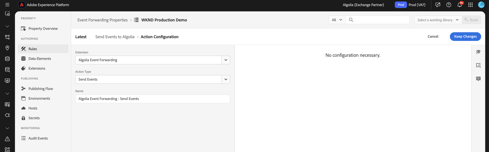
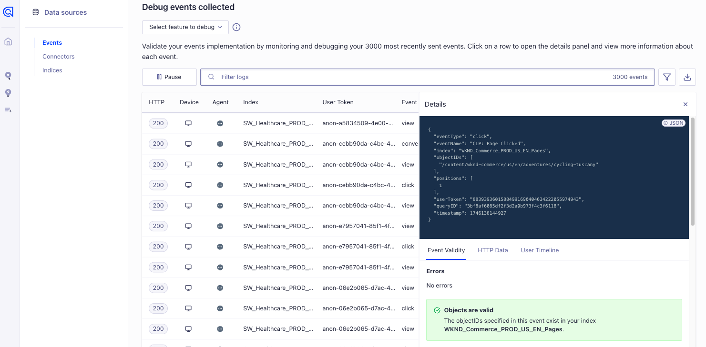

# [!DNL Algolia]-Erweiterung für die Ereignisweiterleitung - Übersicht {#overview}

>[!NOTE]
>
>Adobe Experience Platform Launch ist jetzt Teil der Datenerfassungstechnologien von Adobe Experience Platform. Infolgedessen wurden in der gesamten Produktdokumentation terminologische Aktualisierungen vorgenommen. Eine umfassende Liste dieser Änderungen finden Sie im [Handbuch zu Terminologieaktualisierungen](../../../../tags/term-updates.md).

Verwenden Sie [!DNL Algolia], um schnelle, relevante und personalisierte Sucherlebnisse zu bieten. Mit der KI-gestützten Optimierung können Sie Suchergebnisse und Empfehlungen verbessern, damit Benutzer die benötigten Produkte, Inhalte oder Informationen schnell finden können.

Verwenden Sie die Erweiterung für die [!DNL Algolia] Ereignisweiterleitung , um Benutzerverhaltensereignisse über die [!DNL Insights API] an [!DNL Algolia] zu senden. Diese Verhaltensdaten ermöglichen KI-gestützte Empfehlungen, personalisierte Erlebnisse und intelligente Suchfunktionen.

## Voraussetzungen {#prerequisites}

Stellen Sie vor der Installation der Erweiterung sicher, dass Sie über ein [!DNL Algolia]-Konto mit Zugriff auf die [!DNL Insights API] verfügen. Wenn Sie kein Konto haben, [&#x200B; Sie sich an &#x200B;](https://dashboard.algolia.com/users/sign_up) aktivieren Sie den Zugriff auf die API.

Vergewissern Sie sich auch, dass Sie wissen, wie Sie die [!DNL Algolia] [!DNL Insights API] verwenden. Einen Überblick über das Senden von Ereignissen finden Sie unter [Senden von Ereignissen mit der Insights-API](https://www.algolia.com/doc/guides/sending-events/getting-started/).

Erfassen Sie die folgenden Werte in Ihrem [!DNL Algolia]-Konto-Dashboard:
- **[!UICONTROL Anwendungs-ID]**
- **[!UICONTROL API-Schlüssel suchen]**
- **[!UICONTROL Indexname]**

## Installieren der Erweiterung {#install}

Gehen Sie wie folgt vor, um die [!DNL Algolia]-Erweiterung zu installieren:

Navigieren Sie zu **[!UICONTROL Datenerfassung]** in [!DNL Adobe Experience Platform]. Wählen Sie die **[!UICONTROL Erweiterungen]** aus.

Öffnen Sie **[!UICONTROL Katalog]** suchen Sie die Erweiterung **[!UICONTROL Algolia-Ereignisweiterleitung]** und wählen Sie dann **[!UICONTROL Installieren]** aus.

### Konfigurieren der Erweiterung {#configure-extension}

Um die [!DNL Algolia] Ereignisweiterleitungserweiterung zu konfigurieren, navigieren Sie zur Registerkarte **[!UICONTROL Erweiterungen]** , wählen Sie die Erweiterung **[!UICONTROL Algolia]** aus und klicken Sie dann auf **[!UICONTROL Konfigurieren]**.

| Eigenschaft | Beschreibung |
|----------|-------------|
| **[!UICONTROL Anwendungs-ID]** | Geben Sie die [!UICONTROL Anwendungs-ID] im Algolia-Dashboard unter dem Abschnitt [API-Schlüssel](https://www.algolia.com/account/api-keys/all) ein. |
| **[!UICONTROL API-Schlüssel suchen]** | Geben Sie den [!UICONTROL API-Schlüssel suchen] im Dashboard Algolia im Abschnitt [API-Schlüssel](https://www.algolia.com/account/api-keys/all) ein. |
| **[!UICONTROL Indexname]** | Geben Sie den [!UICONTROL Indexnamen“ ein] der Ihre Produkte oder Inhalte enthält. Dieser Index wird als Standardwert verwendet. |

{style="table-layout:auto"}

## Aktionstypen der Erweiterung für die [!DNL Algolia]-Ereignisweiterleitung {#action-types}

Die Erweiterung für die [!DNL Algolia]-Ereignisweiterleitung bietet einen einzelnen Aktionstyp, der im **[!UICONTROL Dann]**-Abschnitt einer Regel verwendet werden kann:

### Ereignis senden {#send-event}

Konfigurieren Sie die Aktion **[!UICONTROL Ereignis senden]**, um Ereignisse an [!DNL Algolia] weiterzuleiten:

Wählen Sie **[!UICONTROL Regeln]** > **[!UICONTROL Regel hinzufügen]** oder wählen Sie eine vorhandene Regel aus. Fügen Sie im **[!UICONTROL Dann]**-Teil der Regel eine Aktion hinzu und wählen Sie **[!UICONTROL Erweiterung]**: [!DNL Algolia] Ereignisweiterleitung > **[!UICONTROL Aktionstyp]**: **[!UICONTROL Ereignisse senden]**.

## Implementieren der [!DNL Algolia] Ereignisfeldgruppe {#algolia-field-group}

Stellen Sie sicher, dass Sie die Feldergruppe &quot;[!DNL Algolia]&quot; zu Ihrem Schema hinzufügen, bevor Sie die Erweiterung für die [!DNL Algolia] Ereignisweiterleitung verwenden. Sie ist eine der Standardfeldgruppen, die über Experience Platform bereitgestellt werden.

### Hinzufügen der Feldergruppe &quot;[!DNL Algolia]-Ereignis“ zu Ihrem Schema {#add-algolia-field-group}

So fügen Sie die Feldergruppe [!DNL Algolia] ein:

Navigieren Sie zu **[!UICONTROL Schemata]** und wählen Sie **[!UICONTROL Durchsuchen]** aus.

Fügen Sie ein neues Schema hinzu oder aktualisieren Sie ein vorhandenes Schema, das Sie zum Senden von Web-Ereignissen verwenden, und bewegen Sie den Mauszeiger über das Symbol **[!UICONTROL Hinzufügen]**. Geben Sie *[!DNL Algolia]* in das Suchfeld ein, um die Ergebnisse einzugrenzen.

Wählen Sie die Schaltfläche **[!DNL Algolia]Ereignisdetails** Feldergruppe > **[!UICONTROL Feldergruppe hinzufügen]** > **[!UICONTROL Speichern]**.

### Zuordnen und Senden von Daten mit dem Tag [!UICONTROL Datenerfassung]

Die [!DNL Algolia]-Erweiterung für die Ereignisweiterleitung kann zusammen mit dem -**[!DNL Adobe Experience Platform Web SDK]** verwendet werden, um Daten von Ihrer Website an [!DNL Algolia] zu senden. Dazu erstellen Sie eine Tag-Eigenschaft, ordnen Daten dem [!DNL XDM]-Objekt zu und konfigurieren Regeln, um Ereignisse zu senden.

#### Schritt 1: Erstellen einer Tag-Eigenschaft mit der Web-SDK

1. Erstellen Sie eine Tag-Eigenschaft.
2. Installieren Sie die [!DNL Adobe Experience Platform Web SDK].
3. Verwenden Sie diese Erweiterung, um Daten aus HTML der Feldergruppe **[!DNL Algolia]Ereignis** zuzuordnen.

#### Schritt 2: Datenelement für [!DNL XDM] Zuordnung erstellen

1. Erstellen Sie ein [!UICONTROL Datenelement] mithilfe der **[!DNL Adobe Experience Platform Web SDK]**.
2. Wählen Sie **[!UICONTROL XDM]** Objekt als Datenelementtyp aus.
3. Ordnen Sie Ihre Daten den entsprechenden [!DNL XDM] zu, um sicherzustellen, dass [!DNL Algolia] Felder ausgefüllt werden.

#### Schritt 3: Erstellen einer Regel zum Senden von Ereignissen

1. Erstellen Sie eine neue Regel in Ihrer Tag-Eigenschaft.
2. Fügen Sie die erforderlichen Ereignis-Trigger wie Seitenladeereignisse oder Klickereignisse hinzu.
3. Fügen Sie eine Aktion mithilfe von **[!DNL Adobe Experience Platform Web SDK]** hinzu.
4. Wählen Sie **[!UICONTROL Aktionstyp]** Ereignis senden“ aus.
5. Konfigurieren Sie die Aktion für die Verwendung Ihres [!DNL XDM] Datenelements.

#### Schritt 4: Veröffentlichen und Testen

1. Veröffentlichen Sie die Regeln und Erweiterungsänderungen in Ihrer Zielumgebung.
2. Verwenden Sie die [!DNL Adobe Experience Platform Debugger] , um zu überprüfen, ob die Daten an Adobe Experience Platform gesendet und an [!DNL Algolia] weitergeleitet werden.

### Überprüfen von Ereignissen in [!DNL Algolia]

Nachdem Sie die Erweiterung für die [!DNL Algolia]-Ereignisweiterleitung konfiguriert haben, können Sie überprüfen, ob Ereignisse ordnungsgemäß gesendet und empfangen werden, indem Sie die folgenden Schritte ausführen:

Navigieren Sie zu Ihrem [!DNL Algolia]-Dashboard und gehen Sie zu **[!UICONTROL Datenquellen > Ereignisse > Debugger]**.

Wählen Sie das Ereignis aus, das mit dem von der Ereignisweiterleitungserweiterung von [!DNL Algolia] gesendeten Ereignis übereinstimmt, und überprüfen Sie, ob die erwarteten Daten im Ereignis vorhanden sind.

## Allgemeine Implementierungsszenarien

Verwenden Sie die [!DNL Algolia]-Erweiterung für die Ereignisweiterleitung , um Benutzerinteraktionsdaten für verschiedene Anwendungsfälle zu erfassen und zu senden und so die Suchrelevanz und Personalisierung zu verbessern.

### Produkt- oder Inhaltsansichten verfolgen

Verwenden Sie die Erweiterung, um zu verfolgen, wann Benutzer Produkt- oder Inhaltsseiten anzeigen, und helfen [!DNL Algolia] dabei, Benutzerinteressen zu verstehen.

### Konversionsereignisse verfolgen

Verfolgen Sie Ereignisse, Käufe und andere Konversionsereignisse von Add-to-Cart, um die KI-gestützten Empfehlungen von [!DNL Algolia] zu optimieren.

## Fehler beheben

Wenn beim Implementieren der [!DNL Algolia]-Erweiterung für die Ereignisweiterleitung Probleme auftreten, sollten Sie die folgenden Schritte zur Fehlerbehebung in Betracht ziehen:

### Ereignisse werden nicht in [!DNL Algolia] angezeigt

Wenn Ereignisse nicht in [!DNL Algolia] angezeigt werden, überprüfen Sie Folgendes:

- **API-Anmeldeinformationen überprüfen**: Stellen Sie sicher, dass **[!UICONTROL Anwendungs-ID]** und **[!UICONTROL API-Schlüssel]** mit den Werten in Ihrem [!DNL Algolia]-Dashboard übereinstimmen.
- **Ereignisdebugger überprüfen**: Verwenden Sie den [!DNL Algolia] Ereignisdebugger, um zu bestätigen, ob Ereignisse empfangen werden. Andernfalls überprüfen Sie die Konfiguration der Ereignisweiterleitungsregel.
- **XDM-Zuordnung überprüfen**: Stellen Sie sicher, dass alle erforderlichen Felder im [!DNL Algolia]-Schema im [!DNL XDM] korrekt zugeordnet sind.

### Falsche Ereignisdaten

- Stellen Sie sicher, dass Ihr [!DNL XDM]-Objekt-Datenelement dem [!DNL Algolia] Schema mit allen erforderlichen Feldern genau zugeordnet ist.
- Vergewissern Sie sich, dass die Ereignisparameter dem erwarteten Format und der erwarteten Struktur entsprechen, die in der Dokumentation zur Insights-API von [!DNL Algolia] beschrieben sind.

## Nächste Schritte

In diesem Handbuch wurde beschrieben, wie Sie Daten mithilfe der [!DNL Algolia Event Forwarding Extension] an [!DNL Algolia] senden. Weitere Informationen zu den Ereignisweiterleitungsfunktionen in [!DNL Adobe Experience Platform] finden Sie unter [Übersicht über die Ereignisweiterleitung](../../../ui/event-forwarding/overview.md).

Weitere Informationen zum Debuggen Ihrer Implementierung mit dem Experience Platform-Debugger und dem Überwachungs-Tool für die Ereignisweiterleitung finden Sie unter [Adobe Experience Platform Debugger-Übersicht](../../../../debugger/home.md) und [Überwachen von Aktivitäten in der Ereignisweiterleitung](../../../ui/event-forwarding/monitoring.md).

## Zusätzliche Ressourcen

- [[!DNL Algolia] Insights-API-Dokumentation](https://www.algolia.com/doc/rest-api/insights/)
- [[!DNL Algolia] Ereignisdokumentation](https://www.algolia.com/doc/guides/sending-events/getting-started/)
- [[!DNL Adobe Experience Platform] Dokumentation zur Ereignisweiterleitung](https://experienceleague.adobe.com/docs/experience-platform/tags/event-forwarding/overview.html?lang=de)
- [[!DNL Algolia] Übersicht über KI-Funktionen](https://www.algolia.com/products/ai-search/)
