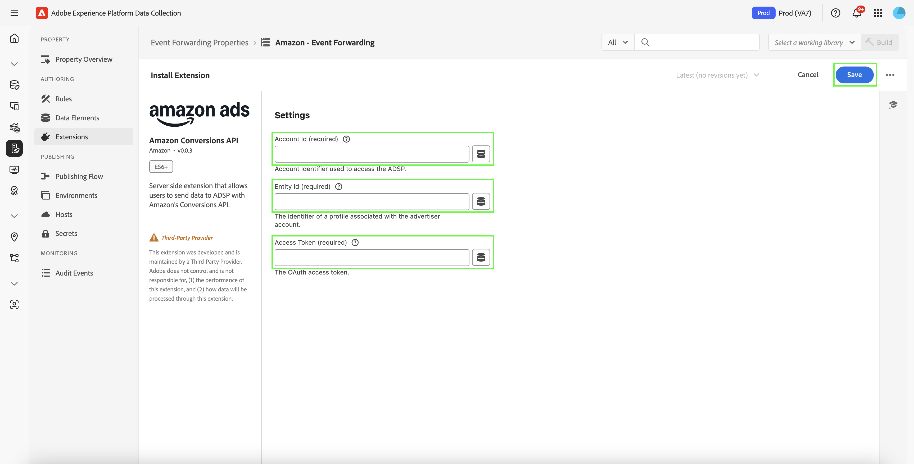

# Übersicht über die [!DNL Amazon] Web Events API-Erweiterung

Die [!DNL Amazon] Conversions-API-Erweiterung erstellt eine direkte Verbindung zwischen Marketing-Daten vom Server eines Werbetreibenden und [!DNL Amazon]. Dadurch können Werbetreibende die Effektivität von Kampagnen unabhängig vom Konversionsort bewerten und Kampagnen entsprechend optimieren. Diese Erweiterung bietet vollständige Attribution, Datenzuverlässigkeit und optimierte Bereitstellung.

## Voraussetzungen für [!DNL Amazon] {#prerequisites}

Führen Sie vor der Installation und Konfiguration der API-Erweiterung für [!DNL Amazon] Conversions die folgenden Schritte aus, um eine ordnungsgemäße Authentifizierung und einen ordnungsgemäßen Datenzugriff sicherzustellen:

### Erstellen von geheimen Daten und Datenelementen {#secret}

Erstellen Sie ein neues [!DNL Amazon][Ereignisweiterleitungsgeheimnis](../../../ui/event-forwarding/secrets.md) und geben Sie ihm einen eindeutigen Namen, der das authentifizierende Mitglied angibt. Dies wird verwendet, um die Verbindung zu Ihrem Konto zu authentifizieren und dabei den Wert sicher zu halten.

Als Nächstes erstellen [ mithilfe ](../../../ui/managing-resources/data-elements.md#create-a-data-element) Erweiterung [!UICONTROL Core] und eines Datenelementtyps [!UICONTROL Secret] ein Datenelement, das auf das soeben erstellte `Amazon` verweist.

### Sammeln erforderlicher Konfigurationsdetails {#configuration-details}

Um Experience Platform mit [!DNL Amazon] zu verbinden, geben Sie die folgenden Details ein:

| Schlüsseltyp | Beschreibung |
| --- | --- |
| Konto-ID | Die eindeutige Kontokennung Ihres [!DNL Amazon] Kontos. |
| Entitäts-ID | Die Kennung eines mit dem Advertiser-Konto verknüpften Profils. Diese finden Sie in der URL des Campaign Manager-Portals mit dem Präfix `entity`. |
| Zugriffs-Token | Das nicht ablaufende Zugriffstoken Ihrer App, das für die Authentifizierung bei der [!DNL Amazon]-API über OAuth verwendet wird. Eine Anleitung finden Sie in der Dokumentation zur Amazon-API ](https://developer.amazon.com/docs/app-porting/device-messaging-fit-obtain-api-key.html) [ unter Authentifizierung. |

## Installieren und Konfigurieren der [!DNL Amazon] {#install-configure}

Führen Sie die folgenden Schritte aus, um die [!DNL Amazon] Conversions-API-Erweiterung zu installieren und zu konfigurieren:

1. Erstellen oder bearbeiten Sie eine Ereignisweiterleitungseigenschaft.
2. Navigieren Sie **linken Navigationsbereich zu** Erweiterungen“ und wählen Sie dann auf der Registerkarte Katalog die Erweiterung [!DNL Amazon] .
3. Wählen Sie **Installieren** aus.

   

4. Konfigurieren Sie die Erweiterung mit den folgenden Details:
   - **Zugriffstoken**: Geheime Daten des Datenelements, das das OAuth 2-Token enthält.

     

   - **Entitäts-ID**: Ihre Entitäts-ID (in der Portal-URL von Campaign Manager mit dem Präfix „Entität“ enthalten).

     

5. Wählen Sie **Speichern** aus, um die Konfiguration abzuschließen.

## Konfigurieren einer Ereignisweiterleitungsregel {#config-rule}

Erstellen Sie nach dem Einrichten aller Datenelemente Regeln für die Ereignisweiterleitung, um zu bestimmen, wann und wie Ihre Ereignisse an [!DNL Amazon] gesendet werden.

1. Navigieren Sie zu **Regeln** und erstellen Sie eine neue Ereignisweiterleitungsregel.
2. Wählen **unter &quot;**&quot; die Option **Amazon Conversions API Extension**.
3. Legen Sie den **Aktionstyp** auf **Konversionsereignisse importieren** fest.

   

### Konfigurieren von Konversionsereignisdaten {#conversion-event-data}

Konversionsereignisdaten sind wichtig, um Benutzerinteraktionen zu verfolgen und die Effektivität Ihrer Kampagnen zu messen. Durch die Weiterleitung dieser Daten an [!DNL Amazon] können Sie Einblicke in das Benutzerverhalten gewinnen, Ihre Kampagnen optimieren und eine genaue Attribution für Konversionen sicherstellen.

In der folgenden Tabelle sind die wichtigsten Eigenschaften aufgeführt, die zum Konfigurieren und Weiterleiten von Konversionsereignisdaten erforderlich sind:

| Eingabe | Beschreibung | Erforderlich | Beispiel |
| --- | --- | --- | --- |
| `name` | Der Name des importierten Ereignisses. | Ja | `My Event Name` |
| `eventType` | Der standardmäßige Amazon-Ereignistyp, der mit dem Ereignis verknüpft ist und für das Reporting verwendet wird. | Ja | `Add to Shopping Cart` |
| `eventActionSource` | Die Plattform, von der das Ereignis stammt. | Ja | `WEBSITE` |
| `clientDedupeId` | Der vom Advertiser angegebene `id` für das Konversionsereignis. Bei Ereignissen mit demselben `clientDedupeId` wird nur das erste Ereignis beibehalten und alle nachfolgenden Ereignisse werden entfernt. | Optional | `3234A398932` |
| `timestamp` | Der gemeldete Zeitstempel, der angibt, wann das Ereignis aufgetreten ist. Der Zeitstempel kann bis zu 7 Tage betragen, bevor Sie ein Ereignis senden. Daten, die älter als 7 Tage sind, werden nicht verarbeitet. | Ja | `2023-05-08T14:04:28Z` |
| `matchKeys` | Array, das die für die Attribution von Traffic-Ereignissen zu verwendenden Typen/Werte der Kunden- und Geräte-IDs darstellt. | Ja | --- |
| `matchKeys > type` | Der für die Attribution verwendete Kennungstyp. | Ja | --- |
| `matchKeys > value` | Der für die Attribution verwendete Kennungswert. | Ja | Liste der SHA-256-Hash-Kennungswerte des Kunden, der das Ereignis ausgeführt hat. |
| `value` | Der Wert des Ereignisses. | Optional | `5` oder `0.99` |
| `currencyCode` | Der Währungscode, der mit der `value` des Ereignisses im ISO-4217-Format verknüpft ist. Gilt nur für Ereignistyp „Von Amazon Käufe“. Wenn nicht angegeben, wird die Währungscodeeinstellung in der Konversionsdefinition verwendet. | Optional | `USD`, `EUR`, `GBP` usw. |
| `unitsSold` | Die Anzahl der gekauften Artikel. Gilt nur für Ereignistyp „Von Amazon Käufe“. Wenn dies nicht beim Konversionsereignis angegeben wird, wird der Standardwert `1` angewendet. | Optional | --- |
| `countryCode` | Dieser Wert basiert auf ISO 3166-1 alpha-2, zweistelligen Ländercodes, die in ISO 3166-1 definiert sind, Teil der ISO 3166-Norm, die von der Internationalen Organisation für Normung (ISO) veröffentlicht wurde, um Länder, abhängige Gebiete und besondere geografische Gebiete zu repräsentieren. | Ja | --- |
| `dataProcessingOptions` | Gibt das Einverständnis des Benutzers zur Verwendung von Werbedaten an. | Optional | LIMITED_DATA_USE |

- Wählen **[!UICONTROL Änderungen beibehalten]**, um die Regel zu speichern.

## Ereignis-Deduplizierung {#deduplication}

Deduplizierung ist wichtig, um präzise Berichte zu gewährleisten und überhöhte Konversionszahlen zu verhindern, wenn sowohl das [!DNL Amazon] Advertising Tag (AAT) als auch die [!DNL Amazon] Conversions-API-Erweiterung zum Nachverfolgen derselben Ereignisse verwendet werden.

### Wann ist eine Deduplizierung erforderlich?

- **Erforderlich**: Wenn dasselbe Ereignis sowohl vom Client (AAT) als auch vom Server (Konversions-API) gesendet wird.
- **Nicht erforderlich**: Wenn vom Client und Server unterschiedliche Ereignistypen gesendet werden, ohne dass sich diese überschneiden.

### Aktivieren der Deduplizierung

Um die Deduplizierung zu aktivieren, fügen Sie das Feld `clientDedupeId` in jedes freigegebene Ereignis ein. Diese eindeutige Kennung ermöglicht es [!DNL Amazon], zwischen Client- und Server-seitigen Ereignissen zu unterscheiden und doppelte Einträge zu verhindern.

Durch eine ordnungsgemäße Konfiguration der Deduplizierung können Sie sicherstellen, dass Ihre Optimierungsdaten präzise bleiben und dass Ihr Reporting nicht beeinträchtigt wird.

Weitere Informationen finden Sie im [Handbuch zur Amazon-Ereignisdeduplizierung](https://advertising.amazon.com/).

## Nächste Schritte {#next-steps}

In diesem Handbuch wurde beschrieben, wie Sie Konversionsereignisse mithilfe der [!DNL Amazon] Conversions-API-Erweiterung konfigurieren und an [!DNL Amazon] senden. Weitere Informationen zu den Funktionen der Ereignisweiterleitung in [!DNL Adobe Experience Platform] finden Sie unter [Übersicht über die Ereignisweiterleitung](../../../ui/event-forwarding/overview.md).

Weitere Informationen zum Debuggen Ihrer Implementierung mit dem Experience Platform-Debugger und dem Überwachungs-Tool für die Ereignisweiterleitung finden Sie unter [Adobe Experience Platform Debugger-Übersicht](/help/debugger/home.md) und [Überwachen von Aktivitäten](../../../ui/event-forwarding/monitoring.md) in der Ereignisweiterleitung.
